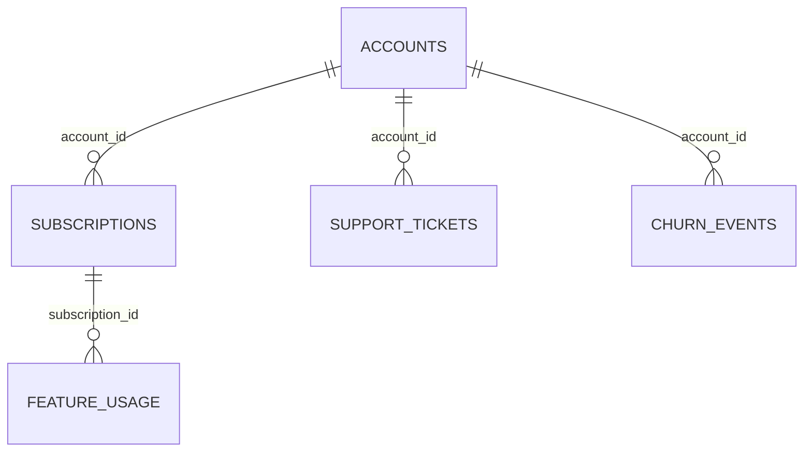

# RavenStack Churn Intelligence

Dashboard analítico local para consolidar dados de clientes SaaS B2B, medir churn e receita, explorar uso do produto e suporte, e priorizar contas em risco com um score heurístico explicável.

## Visão Geral

O projeto resolve o problema de centralizar arquivos CSV operacionais de uma empresa SaaS B2B em uma base SQLite única e disponibilizar uma visão executiva e operacional sobre churn, retenção, receita, suporte, uso do produto e risco de contas.

A solução foi desenvolvida para times de Customer Success, Produto, Receita e liderança executiva que precisam analisar uma base local sem depender de ferramentas externas. O resultado esperado é permitir que uma pessoa clone o projeto, gere ou use o banco `database/ravenstack.db`, execute a aplicação Flask e navegue pelo dashboard em `http://127.0.0.1:5000`.

O dashboard contribui para a análise de churn e retenção ao cruzar contas, assinaturas, eventos de churn, uso de funcionalidades e chamados de suporte. A aplicação calcula KPIs, segmentações, gráficos e uma fila priorizada de contas em risco.

## Principais Funcionalidades

| Funcionalidade | O que faz |
| --- | --- |
| Importação de CSVs | O script `database/import_csv_to_sqlite.py` lê todos os arquivos `.csv` em `database/`, detecta encoding/separador, normaliza nomes de colunas e recria as tabelas no SQLite. |
| Banco SQLite local | O arquivo `database/ravenstack.db` armazena as tabelas `accounts`, `subscriptions`, `feature_usage`, `support_tickets` e `churn_events`. |
| Validação do banco | `app.py` chama `validate_database()` antes de iniciar e exige a existência das cinco tabelas obrigatórias. |
| API JSON | Rotas em `/api` expõem KPIs, filtros, churn, receita, uso, suporte, reativação, contas em risco e detalhes de contas. |
| Dashboard executivo | A rota `/` apresenta KPIs, filtros globais, gráficos e tabela de contas em risco. |
| Exploração de contas | A rota `/accounts` lista contas com busca, filtros rápidos, paginação e ordenação no frontend. |
| Detalhe da conta | A rota `/accounts/<account_id>` mostra resumo, assinaturas, uso, suporte, churn/reativação e linha do tempo da conta. |
| Score de risco | `services/risk_service.py` calcula um score heurístico com sinais de uso, erros, suporte, satisfação, downgrade, trial, cobrança e renovação automática. |
| Exportação CSV | `/api/export/risk-accounts.csv` exporta a lista de contas em risco com os filtros globais aplicados. |
| Filtros interativos | O dashboard aceita período de cadastro, plano, indústria, país, origem, trial, status, cobrança, renovação automática e motivo de churn. |
| Gráficos | `static/js/charts.js` usa Plotly.js via CDN quando disponível e renderização fallback em HTML/CSS quando o CDN falha. |

Não há autenticação, autorização, agendamento automático de cargas, deploy configurado ou modelo de machine learning treinável no repositório.

## Tecnologias Utilizadas

| Camada | Tecnologia |
| --- | --- |
| Linguagem | Python |
| Framework web | Flask |
| Banco de dados | SQLite |
| Dados/ETL | pandas, csv, sqlite3 |
| Templates | Jinja2 via Flask |
| Frontend | HTML, CSS e JavaScript puro |
| Gráficos | Plotly.js 2.35.2 via CDN, com fallback local |
| Testes | `unittest` da biblioteca padrão |
| Dependências | `requirements.txt` com Flask e pandas |

## Arquitetura da Solução

```text
Arquivos CSV em database/
     ↓
database/import_csv_to_sqlite.py
     ↓
Normalização de tabelas e colunas
     ↓
database/ravenstack.db
     ↓
services/database_service.py
     ↓
Consultas SQL e regras em services/
     ↓
routes/api_routes.py e routes/page_routes.py
     ↓
Templates Jinja em templates/
     ↓
JavaScript em static/js/
     ↓
Dashboard web em http://127.0.0.1:5000
```

Os módulos se comunicam da seguinte forma:

| Módulo | Responsabilidade |
| --- | --- |
| `app.py` | Cria a aplicação Flask, registra blueprints, valida o banco ao iniciar e configura handlers de erro. |
| `config.py` | Define `DATABASE_PATH`, tabelas obrigatórias e modo debug por `FLASK_DEBUG`. |
| `routes/page_routes.py` | Renderiza `/`, `/accounts` e `/accounts/<account_id>`. |
| `routes/api_routes.py` | Expõe endpoints JSON e exportação CSV. |
| `services/database_service.py` | Abre conexões SQLite, executa consultas e monta payloads JSON. |
| `services/dashboard_service.py` | Centraliza filtros, base consolidada por conta, KPIs, receita, uso, suporte e reativação. |
| `services/churn_service.py` | Calcula linha do tempo, motivos e segmentações de churn. |
| `services/risk_service.py` | Calcula score de risco, score de valor e prioridade. |
| `services/account_service.py` | Lista contas e monta o detalhe completo de uma conta. |
| `static/js/*.js` | Consome a API, aplica filtros, renderiza gráficos, tabelas, paginação e mensagens. |

O HTML é criado por templates Jinja no backend. Os dados dos gráficos e tabelas chegam ao frontend por `fetch()` para endpoints `/api/*`. A inicialização do banco não é automática no start da aplicação: o app valida se o arquivo e as tabelas existem. Para recriar o banco a partir dos CSVs, execute o script de importação.

## Estrutura de Diretórios

```text
solution/
├── app.py
├── config.py
├── requirements.txt
├── README.md
├── relatorio_diagnostico_churn.md
├── database/
│   ├── import_csv_to_sqlite.py
│   ├── check_database.py
│   ├── ravenstack.db
│   ├── ravenstack_accounts.csv
│   ├── ravenstack_subscriptions.csv
│   ├── ravenstack_feature_usage.csv
│   ├── ravenstack_support_tickets.csv
│   └── ravenstack_churn_events.csv
├── routes/
├── services/
├── static/
│   ├── css/styles.css
│   └── js/
├── templates/
├── tests/
└── docs/
```

| Caminho | Responsabilidade |
| --- | --- |
| `database/` | Fontes CSV, banco SQLite e scripts auxiliares de criação/verificação. |
| `routes/` | Blueprints Flask de páginas e API. |
| `services/` | Regras de negócio, consultas SQL e cálculo de indicadores. |
| `templates/` | Páginas HTML renderizadas pelo Flask. |
| `static/css/` | Estilos da aplicação. |
| `static/js/` | Consumo da API, formatação, gráficos, tabelas e interações. |
| `tests/` | Testes automatizados com `unittest`. |
| `docs/` | Documentação técnica, guia de usuário, banco, arquitetura e troubleshooting. |

## Pré-Requisitos

- Python 3.11 ou superior. O ambiente virtual analisado usa Python 3.14.3.
- Git para clonar o repositório.
- Navegador moderno.
- Acesso à internet apenas para carregar Plotly.js via CDN nos gráficos avançados. Sem internet, os fallbacks locais continuam exibindo gráficos simplificados.
- Permissão de leitura e escrita no diretório do projeto para recriar `database/ravenstack.db`.

## Instalação

```bash
git clone URL_DO_REPOSITORIO
cd NOME_DO_REPOSITORIO/submissions/bruno-milford/solution
```

Windows PowerShell:

```powershell
python -m venv .venv
.\.venv\Scripts\Activate.ps1
python -m pip install --upgrade pip
pip install -r requirements.txt
```

Linux ou macOS:

```bash
python3 -m venv .venv
source .venv/bin/activate
python -m pip install --upgrade pip
pip install -r requirements.txt
```

Caso `python` não seja reconhecido no Windows, instale o Python pelo site oficial ou pela Microsoft Store e marque a opção de adicionar ao PATH.

## Configuração

A aplicação possui uma única variável de ambiente implementada:

| Variável | Obrigatória | Finalidade | Exemplo seguro |
| --- | --- | --- | --- |
| `FLASK_DEBUG` | Não | Ativa modo debug do Flask quando definido como `1`, `true` ou `yes`. | `FLASK_DEBUG=0` |

O banco é sempre lido de `database/ravenstack.db`, conforme `config.py`. A aplicação roda em `127.0.0.1:5000` quando iniciada por `python app.py`. Não há `.env` obrigatório, credenciais, tokens ou configuração de produção no projeto.

Um exemplo está disponível em `.env.example`.

## Preparação dos Dados

Os CSVs esperados ficam em `database/`. O script importa todos os arquivos `.csv` desse diretório, ordenados por nome, e transforma `ravenstack_<nome>.csv` na tabela `<nome>`.

| Arquivo | Finalidade | Chave principal lógica | Relacionamentos |
| --- | --- | --- | --- |
| `ravenstack_accounts.csv` | Cadastro de contas | `account_id` | Assinaturas, suporte e churn |
| `ravenstack_subscriptions.csv` | Assinaturas e receita | `subscription_id` | Conta e uso de funcionalidades |
| `ravenstack_feature_usage.csv` | Uso de produto por assinatura | `usage_id` | Assinatura |
| `ravenstack_support_tickets.csv` | Tickets de suporte por conta | `ticket_id` | Conta |
| `ravenstack_churn_events.csv` | Eventos de churn e reativação | `churn_event_id` | Conta |

Tratamentos implementados no importador:

- tenta os encodings `utf-8-sig`, `utf-8`, `latin-1` e `cp1252`;
- detecta separador entre vírgula, ponto e vírgula, tabulação e pipe;
- normaliza nomes de colunas para minúsculas com `_`;
- evita nomes de colunas duplicados adicionando sufixo numérico;
- recria cada tabela com `if_exists="replace"`;
- usa `chunksize=1000` na carga para o SQLite.

O importador não valida colunas obrigatórias, tipos, duplicidades, chaves estrangeiras ou integridade referencial. Valores ausentes são preservados conforme leitura do pandas e gravação no SQLite.

## Criação do Banco de Dados

Para recriar `database/ravenstack.db` a partir dos CSVs:

```powershell
python database/import_csv_to_sqlite.py
```

O banco:

- é recriado tabela a tabela com base nos CSVs;
- fica em `database/ravenstack.db`;
- é mantido no repositório atual;
- não possui chaves primárias, chaves estrangeiras ou índices explícitos criados pelo script;
- usa relacionamentos lógicos por colunas como `account_id` e `subscription_id`.

Para verificar as tabelas e contagens:

```powershell
python database/check_database.py
```

## Execução do Projeto

Com o ambiente virtual ativo:

```powershell
python app.py
```

URL local:

```text
http://127.0.0.1:5000
```

Ao iniciar corretamente, o terminal deve exibir:

```text
Banco validado com sucesso: database/ravenstack.db
Aplicacao disponivel em http://127.0.0.1:5000
```

Para encerrar o servidor, use `Ctrl+C` no terminal.

## Como Utilizar o Dashboard

1. Acesse `http://127.0.0.1:5000`.
2. Use os filtros globais para refinar todo o dashboard por período de cadastro, plano, indústria, país, origem, trial, status, cobrança, renovação automática e motivo de churn.
3. Consulte os KPIs de base de clientes, receita, experiência e risco.
4. Navegue pelas seções de churn, receita, produto/uso, suporte, reativações e contas em risco.
5. Use a tabela de contas em risco para buscar contas, aplicar filtros rápidos e exportar CSV.
6. Acesse `/accounts` para explorar a base completa.
7. Abra `/accounts/<account_id>` para ver detalhes de uma conta específica.

Indicadores principais:

| Indicador | Definição e lógica | Fonte |
| --- | --- | --- |
| Total de contas | Contagem de contas na base consolidada filtrada. | `accounts` + assinatura corrente |
| Contas ativas | Contas sem churn vigente após considerar evento mais recente e `churn_flag`. | `accounts`, `churn_events` |
| Contas com churn | Contas cujo último evento não é reativação ou que têm `churn_flag=1`. | `accounts`, `churn_events` |
| Taxa de churn | `contas com churn / total de contas * 100`. | Base consolidada |
| MRR ativo | Soma de `mrr_amount` da assinatura considerada para contas ativas. | `subscriptions` |
| ARR ativo | Soma de `arr_amount` da assinatura considerada para contas ativas. | `subscriptions` |
| MRR/ARR perdido | Soma de MRR/ARR da assinatura considerada para contas com churn. | `subscriptions`, `churn_events` |
| Total de tickets | Quantidade de tickets das contas filtradas. | `support_tickets` |
| Satisfação média | Média de `satisfaction_score` dos tickets filtrados. | `support_tickets` |
| Contas reativadas | Contas com evento `is_reactivation=1`. | `churn_events` |
| Alto risco | Contas ativas com `risk_score >= 60`. | Score heurístico |

## Modelo Preditivo de Churn

Não existe modelo preditivo de machine learning implementado. O projeto implementa um score heurístico explicável em `services/risk_service.py`.

O score:

- não é treinado;
- não possui divisão treino/teste;
- não possui métricas como AUC, precisão ou recall;
- não gera uma probabilidade calibrada;
- usa pesos fixos definidos no código;
- deve ser interpretado como priorização operacional de risco, não como causalidade.

Classes de risco:

| Faixa | Classe |
| ---: | --- |
| 0 a 29 | baixo |
| 30 a 59 | medio |
| 60 a 79 | alto |
| 80 a 100 | critico |

Fórmulas:

```text
risk_score = min(soma_dos_pesos_dos_sinais, 100)
value_score = min((mrr / 12000) * 100, 100)
priority_score = risk_score * 0.7 + value_score * 0.3
```

## Regras de Negócio

| Regra | Implementação |
| --- | --- |
| Assinatura considerada | Uma assinatura sem `end_date` tem prioridade. Se não existir, usa a mais recente por `start_date` e `subscription_id`. |
| Conta com churn | Se o último evento de churn for reativação, a conta é ativa. Caso contrário, se houver evento de churn ou `accounts.churn_flag=1`, a conta é churn. |
| Cliente ativo | Conta com `churned_account=0` na base consolidada. |
| Receita ativa | Soma de MRR/ARR da assinatura considerada para contas ativas. |
| Receita perdida | Soma de MRR/ARR da assinatura considerada para contas churn. |
| Churn rate | `SUM(churned_account) / COUNT(*) * 100`. |
| Receita em risco | Não há KPI direto com esse nome. A priorização combina risco e `value_score`; o dashboard também destaca contas ativas de alto valor com risco alto ou crítico. |
| Uso recente | Soma de `usage_count` nos últimos 30 dias em relação à maior `usage_date` da tabela. |
| Uso anterior | Soma de `usage_count` entre 31 e 60 dias antes da maior `usage_date`. |
| Queda de uso | Sinal aplicado quando `usage_recent < usage_previous * 0.65`. |
| Alto risco | `risk_score >= 60`. |
| Crítico | `risk_score >= 80`. |

## Banco de Dados

Visão geral:



O SQLite não possui PKs/FKs físicas declaradas. O diagrama representa os relacionamentos lógicos usados pelo código.

| Tabela | Linhas | Finalidade |
| --- | ---: | --- |
| `accounts` | 500 | Cadastro e atributos de segmentação da conta. |
| `subscriptions` | 5.000 | Assinaturas, planos, MRR, ARR, flags e cobrança. |
| `feature_usage` | 25.000 | Eventos agregados de uso de funcionalidades por assinatura. |
| `support_tickets` | 2.000 | Tickets de suporte por conta. |
| `churn_events` | 600 | Eventos de churn e reativação por conta. |

Mais detalhes estão em `docs/DATABASE.md` e `docs/DATA_DICTIONARY.md`.

## API

URL base local: `http://127.0.0.1:5000/api`.

| Método | Rota | Finalidade |
| --- | --- | --- |
| GET | `/api/health` | Valida disponibilidade do banco. |
| GET | `/api/filters` | Retorna opções de filtros globais. |
| GET | `/api/kpis` | Retorna indicadores executivos. |
| GET | `/api/churn/timeline` | Retorna eventos de churn e MRR perdido por mês. |
| GET | `/api/churn/reasons` | Retorna motivos de churn. |
| GET | `/api/churn/segments` | Retorna churn por plano, indústria e país. |
| GET | `/api/revenue` | Retorna análises de MRR/ARR e faixas de MRR. |
| GET | `/api/usage` | Retorna análises de uso de produto. |
| GET | `/api/support` | Retorna análises de suporte. |
| GET | `/api/reactivation` | Retorna eventos de reativação. |
| GET | `/api/risk-accounts` | Retorna contas com score de risco. |
| GET | `/api/accounts` | Retorna contas consolidadas. |
| GET | `/api/accounts/<account_id>` | Retorna detalhe de uma conta. |
| GET | `/api/export/risk-accounts.csv` | Exporta contas em risco em CSV. |

Filtros aceitos: `plan_tier`, `industry`, `country`, `referral_source`, `is_trial`, `status`, `billing_frequency`, `auto_renew_flag`, `reason_code`, `start_date`, `end_date`.

Exemplo:

```bash
curl "http://127.0.0.1:5000/api/kpis?plan_tier=Pro&status=active"
```

Resposta JSON segue o padrão:

```json
{
  "success": true,
  "data": {},
  "metadata": {
    "generated_at": "2026-07-19T00:00:00+00:00",
    "filters": {}
  }
}
```

Erros tratados:

- `400` para filtros inválidos ou valores booleanos/status inválidos;
- `404` para recurso ou conta inexistente;
- `500` para erro inesperado.

## Testes e Validação

Execute:

```powershell
python -m unittest discover -s tests
```

Os testes existentes validam:

- existência do banco e tabelas obrigatórias;
- leitura de todas as tabelas;
- endpoint `/api/health`;
- KPIs sem valores infinitos;
- limites de `risk_score` e `value_score`;
- erro 404 para conta inexistente;
- erro 400 para filtro inválido.

## Solução de Problemas

Consulte `docs/TROUBLESHOOTING.md` para sintomas, causas e comandos de diagnóstico.

## Limitações Conhecidas

- Protótipo local sem autenticação ou controle de acesso.
- Banco SQLite e CSVs locais, sem ingestão automatizada.
- Script de importação recria tabelas e não faz carga incremental.
- SQLite não possui chaves, constraints ou índices explícitos.
- Não há modelo de machine learning operacional.
- Score de risco é heurístico e precisa de validação histórica antes de uso crítico.
- Plotly.js é carregado por CDN.
- Não há configuração de produção, Docker, CI/CD ou deploy no repositório.
- Há inconsistência analítica entre `accounts.churn_flag` e eventos de churn registrada em `relatorio_diagnostico_churn.md`.

## Próximas Evoluções

Sugestões futuras, não implementadas atualmente:

- automatizar ingestão de dados;
- migrar para PostgreSQL em ambiente multiusuário;
- adicionar autenticação e controle de acesso;
- criar índices e constraints no banco;
- adicionar pipeline de validação de qualidade dos CSVs;
- criar testes de regressão para KPIs;
- implementar modelo preditivo treinável com validação temporal;
- versionar scores e previsões;
- integrar CRM ou ferramenta de CS;
- criar alertas para contas em risco;
- empacotar Plotly localmente para uso offline.

## Contribuição

Fluxo sugerido:

```bash
git checkout -b minha-branch
python -m unittest discover -s tests
git add .
git commit -m "Descricao objetiva da alteracao"
git push origin minha-branch
```

Antes de abrir pull request, atualize a documentação quando a alteração mudar rotas, dados, regras, indicadores ou comandos de execução.

## Licença

Não foi encontrado arquivo de licença no repositório. O projeto ainda não possui uma licença definida.
