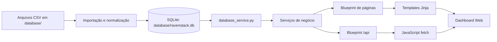
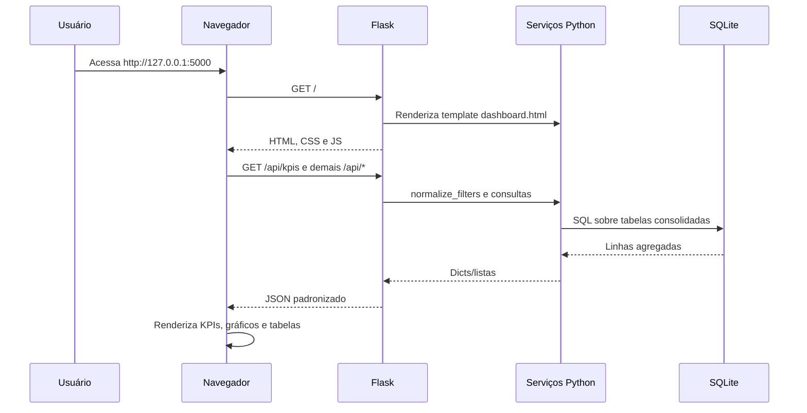
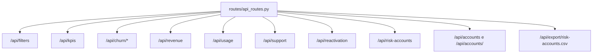

# Arquitetura

## Visão Geral Técnica

O RavenStack Churn Intelligence é uma aplicação Flask local que lê um banco SQLite gerado a partir de CSVs e entrega páginas HTML com um dashboard analítico. A solução concentra regras de negócio em serviços Python, expõe dados por API JSON e renderiza gráficos/tabelas com JavaScript no navegador.



## Componentes

| Componente | Arquivos | Responsabilidade |
| --- | --- | --- |
| Inicialização | `app.py`, `config.py` | Cria o Flask app, registra blueprints, valida banco e define porta/host. |
| Banco | `database/ravenstack.db` | Armazena dados consolidados das cinco fontes CSV. |
| ETL local | `database/import_csv_to_sqlite.py` | Importa CSVs, detecta encoding/separador, normaliza colunas e recria tabelas. |
| Verificação | `database/check_database.py` | Lista tabelas e contagens do SQLite. |
| Dados | `services/database_service.py` | Abstrai conexão SQLite, consultas e payloads JSON. |
| Indicadores | `services/dashboard_service.py`, `services/churn_service.py` | Calcula KPIs, churn, receita, uso, suporte e reativação. |
| Risco | `services/risk_service.py` | Calcula score heurístico, classificação e prioridade de contas. |
| Contas | `services/account_service.py` | Lista contas e compõe detalhe completo por conta. |
| API | `routes/api_routes.py` | Publica endpoints JSON e CSV. |
| Páginas | `routes/page_routes.py`, `templates/` | Renderiza dashboard, lista de contas e detalhe da conta. |
| Frontend | `static/js/`, `static/css/styles.css` | Consome APIs, renderiza gráficos, filtros, tabelas e layout responsivo. |

## Fluxo de Execução



## Backend

O backend é organizado em blueprints:

- `page_bp`: rotas HTML `/`, `/accounts` e `/accounts/<account_id>`.
- `api_bp`: endpoints JSON sob `/api` e exportação CSV.

`app.py` registra handlers para:

- `404`: retorna JSON com `success=false`;
- `ValueError`: retorna `400`, usado em filtros inválidos;
- exceções gerais: retorna `500` e registra log via `app.logger.exception`.

Na execução direta (`python app.py`), o banco é validado antes do servidor subir. A aplicação não cria o banco automaticamente nessa etapa.

## Camada de Dados

`services/database_service.py` centraliza:

- validação da existência do arquivo SQLite;
- checagem das tabelas obrigatórias;
- conexão com `sqlite3.Row`;
- execução de consultas que retornam dicts/listas;
- formato padrão de resposta JSON com metadados.

O banco é referenciado por `DATABASE_PATH = BASE_DIR / "database" / "ravenstack.db"`.

## Camada de Serviços

`dashboard_service.py` define `ACCOUNT_BASE_SQL`, uma CTE reutilizada para consolidar uma linha por conta. Essa base:

- ranqueia assinaturas por conta;
- prioriza assinatura sem `end_date`;
- usa assinatura mais recente quando não há assinatura aberta;
- identifica o último evento de churn por conta;
- calcula `churned_account`.

`churn_service.py` replica a mesma base consolidada para segmentações e séries específicas de churn.

`risk_service.py` combina dados de uso, suporte e assinatura em um score heurístico.

`account_service.py` combina conta, risco, assinaturas, tickets, eventos de churn, uso agregado e linha do tempo.

## Frontend

O frontend é HTML/Jinja, CSS e JavaScript puro:

- `base.html` define shell, navegação lateral, topbar, scripts comuns e CDN do Plotly.
- `dashboard.html` define seções de KPIs, filtros, gráficos e risco.
- `accounts.html` define exploração de contas.
- `account_detail.html` define abas de detalhe.

Os dados chegam aos gráficos por chamadas `fetch()` em `static/js/api.js`. `dashboard.js` carrega múltiplos endpoints com `Promise.allSettled`, renderiza os blocos disponíveis e trata falhas por bloco. `charts.js` usa Plotly quando disponível e fallback local quando não há Plotly.

## API



Todas as respostas JSON de sucesso usam:

```json
{
  "success": true,
  "data": {},
  "metadata": {
    "generated_at": "...",
    "filters": {}
  }
}
```

## Modelo Preditivo

Não há modelo preditivo de machine learning implementado. O componente existente é um score heurístico em `services/risk_service.py`, sem treinamento, validação estatística ou persistência de previsões.

## Decisões Técnicas

| Decisão | Justificativa no projeto atual | O que mudaria em produção |
| --- | --- | --- |
| SQLite local | Simples, versionável e suficiente para protótipo com dados locais. | PostgreSQL ou outro banco gerenciado, migrações, índices e constraints. |
| Flask | Leve, direto e suficiente para servir API e templates. | Pode permanecer, mas exigiria WSGI server, configuração segura e observabilidade. |
| Serviços Python com SQL | Facilita manter regras de negócio perto das consultas. | Separar camada de domínio, repositórios e testes mais granulares. |
| JavaScript puro | Reduz dependências e atende ao dashboard atual. | Framework frontend pode ser avaliado se a UI crescer muito. |
| Plotly via CDN | Entrega gráficos interativos rapidamente. | Empacotar assets localmente ou via pipeline de build. |

## Limitações Arquiteturais

- Sem autenticação.
- Sem API versionada.
- Sem migrações de banco.
- Sem constraints, índices ou chaves físicas no SQLite.
- Sem cache de consultas além de `lru_cache` em opções de filtros.
- Sem pipeline automatizado de ingestão.
- Sem deploy ou configuração de produção.
- Score de risco não é calibrado estatisticamente.
