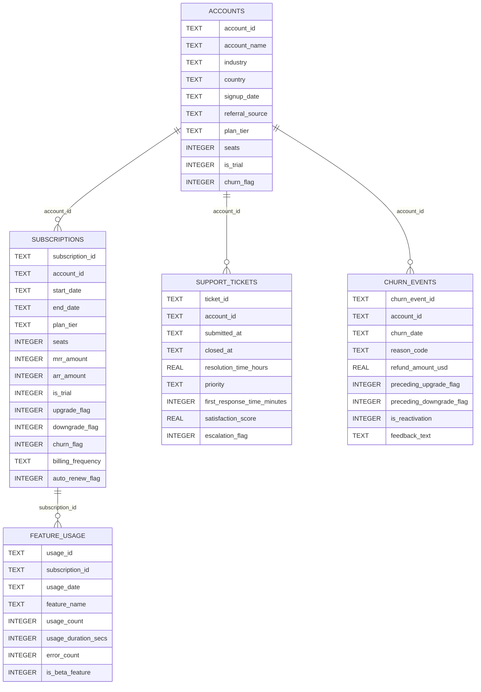

# Banco de Dados

## Visão Geral

O projeto usa SQLite como banco local. O arquivo físico é `database/ravenstack.db` e contém cinco tabelas criadas a partir dos CSVs em `database/`.

O banco atual tem aproximadamente 1,9 MB e foi validado com as tabelas:

| Tabela | Registros |
| --- | ---: |
| `accounts` | 500 |
| `subscriptions` | 5.000 |
| `feature_usage` | 25.000 |
| `support_tickets` | 2.000 |
| `churn_events` | 600 |

## Processo de Criação

Com ambiente Python configurado:

```powershell
python database/import_csv_to_sqlite.py
```

O script:

1. localiza a pasta `database/`;
2. busca todos os arquivos `*.csv`;
3. detecta encoding e separador;
4. normaliza nomes de colunas;
5. cria uma tabela por CSV removendo o prefixo `ravenstack_`;
6. grava com `if_exists="replace"`;
7. confirma a transação.

O processo é destrutivo por tabela: uma nova importação substitui as tabelas existentes pelos dados dos CSVs.

## Atualização e Recriação

Não há carga incremental. Para atualizar os dados:

1. substitua ou edite os CSVs em `database/`;
2. execute `python database/import_csv_to_sqlite.py`;
3. execute `python database/check_database.py`;
4. reinicie a aplicação Flask se ela estiver aberta.

## Diagrama ER



O SQLite atual não declara PKs, FKs, `NOT NULL` ou índices explícitos. As chaves do diagrama são relacionamentos lógicos utilizados nas consultas.

## Tabelas

### `accounts`

Cadastro de contas e segmentações. Chave lógica: `account_id`.

| Coluna | Tipo SQLite | Uso principal |
| --- | --- | --- |
| `account_id` | TEXT | Identificador lógico da conta. |
| `account_name` | TEXT | Nome exibido no dashboard. |
| `industry` | TEXT | Filtro e segmentação. |
| `country` | TEXT | Filtro e segmentação. |
| `signup_date` | TEXT | Filtro de período e linha do tempo. |
| `referral_source` | TEXT | Filtro de origem. |
| `plan_tier` | TEXT | Plano de referência quando assinatura não informa plano. |
| `seats` | INTEGER | Quantidade de assentos de referência. |
| `is_trial` | INTEGER | Flag 0/1 para trial. |
| `churn_flag` | INTEGER | Flag cadastral usada como fallback na regra de churn. |

### `subscriptions`

Histórico de assinaturas, planos e receita. Chave lógica: `subscription_id`.

Relaciona-se com `accounts.account_id` e `feature_usage.subscription_id`.

### `feature_usage`

Eventos agregados de uso de funcionalidades por assinatura. A aplicação usa essa tabela para volume de uso, duração, erros, uso recente e uso anterior.

### `support_tickets`

Tickets de suporte por conta. A aplicação calcula volume, prioridades, satisfação média, tempo de primeira resposta, tempo de resolução e taxa de escalonamento.

### `churn_events`

Eventos de churn e reativação. `is_reactivation=1` representa reativação. `is_reactivation=0` representa evento de churn para análises de motivos e timeline.

## Consultas Importantes

### Base consolidada por conta

A CTE `ACCOUNT_BASE_SQL`, usada em `dashboard_service.py`, escolhe uma assinatura por conta e o último evento de churn:

- assinatura sem `end_date` vem primeiro;
- depois, assinatura mais recente por `start_date`;
- último evento por `churn_date` e `churn_event_id`;
- reativação mais recente torna a conta ativa.

### KPIs

`get_kpis()` calcula:

- total de contas;
- contas ativas;
- contas com churn;
- taxa de churn;
- MRR/ARR ativo;
- MRR/ARR perdido;
- ticket médio mensal;
- total de tickets;
- contas reativadas.

### Score de risco

`get_risk_accounts()` agrega uso por assinatura e tickets por conta. A pontuação final é calculada em Python.

## Regras de Integridade

Não há constraints físicas no SQLite. Integridade depende de:

- nomes de arquivos CSV corretos;
- colunas esperadas;
- IDs consistentes entre tabelas;
- regras nas consultas SQL.

## Backup

Como o banco é um único arquivo SQLite, o backup básico é copiar:

```text
database/ravenstack.db
```

Para reprodutibilidade, preserve também os CSVs originais em `database/`.

## Limitações

- Sem migrações.
- Sem índices explícitos.
- Sem validação de schema antes da carga.
- Sem chaves primárias e estrangeiras físicas.
- Sem controle transacional por arquivo além da conexão geral.
- Não há histórico de versões do banco dentro da aplicação.
