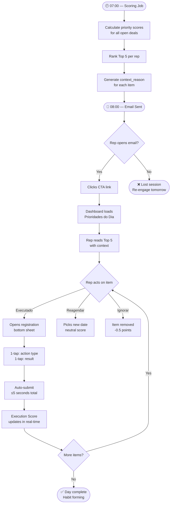
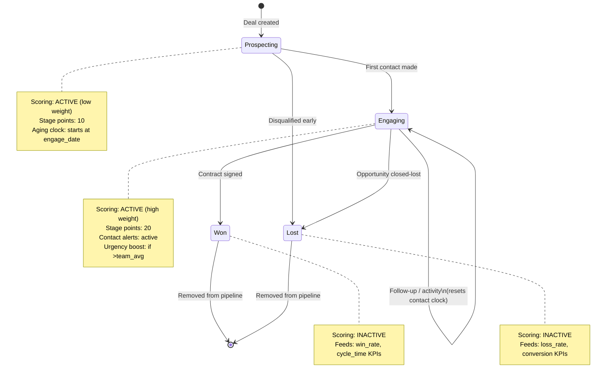
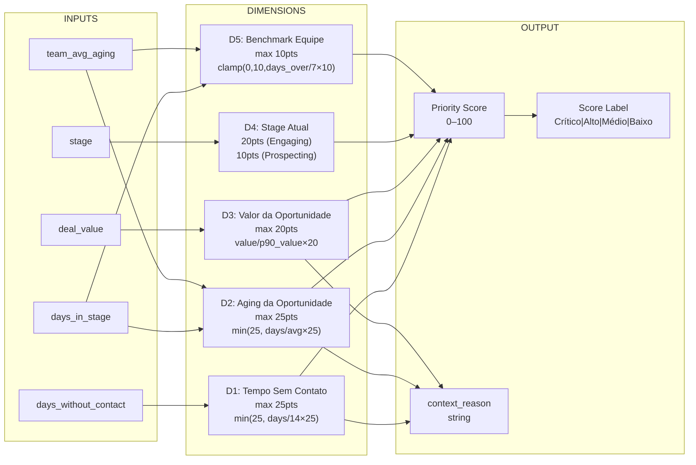
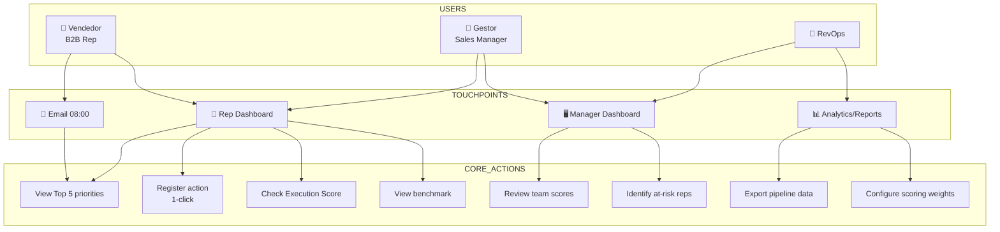
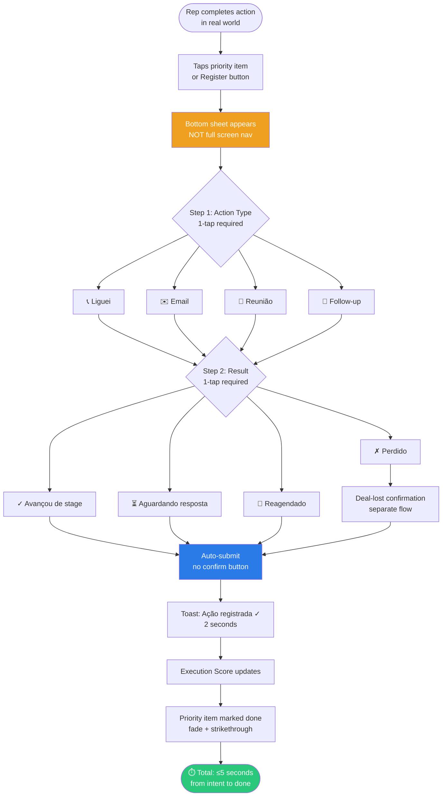
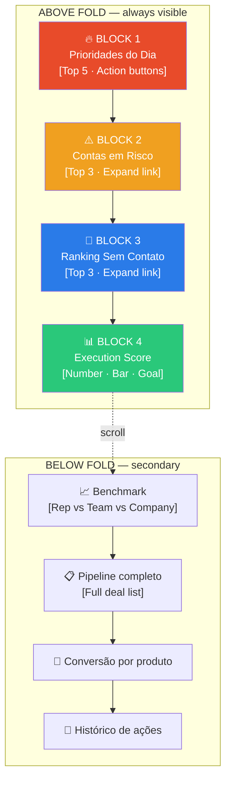
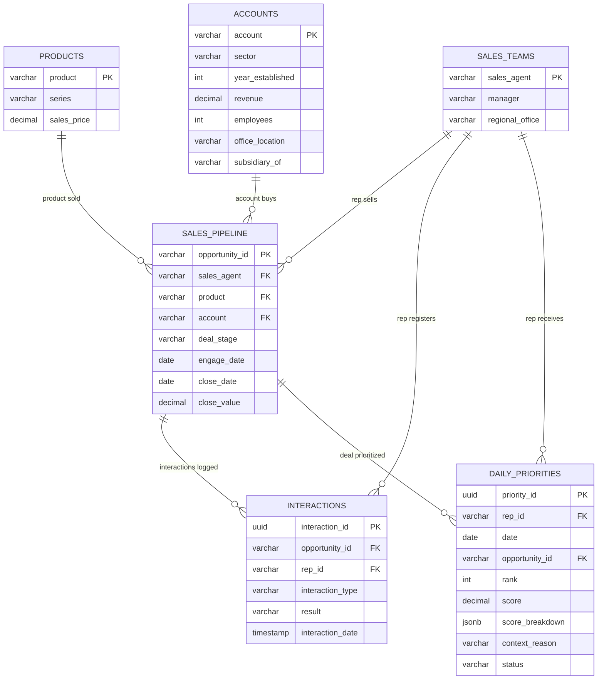
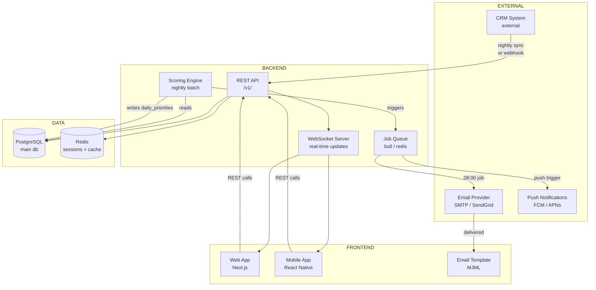
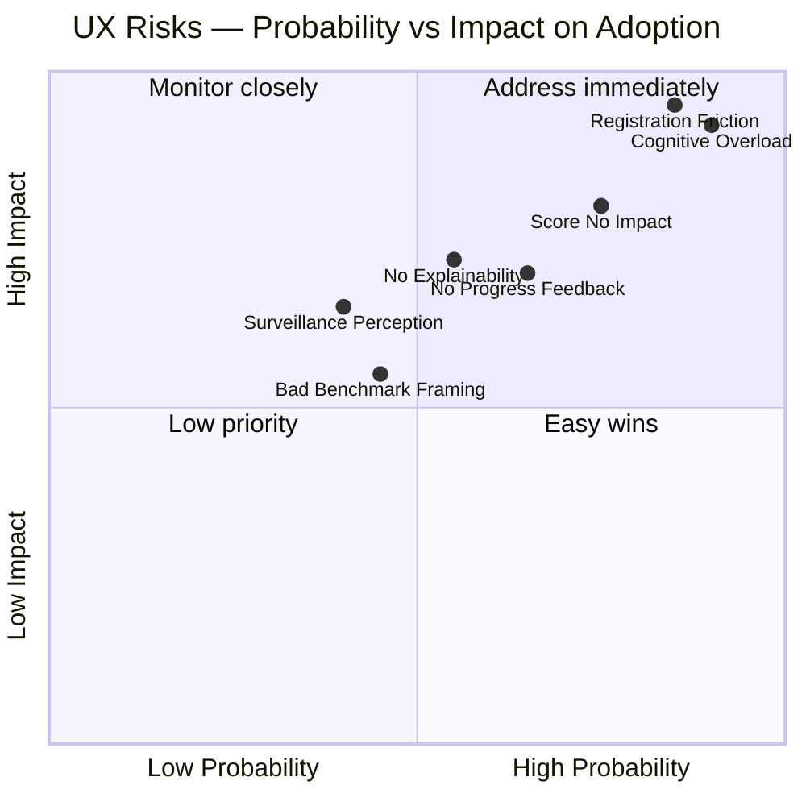
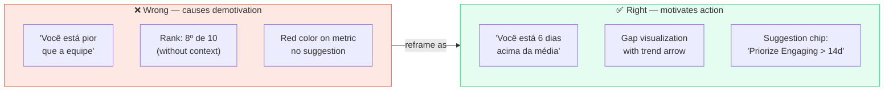

# DIAGRAMS.md — Pipeline Coach AI

## META
All system diagrams in Mermaid format. Reference by ID. Agents should use these when generating documentation, architecture decisions, or explanations.

---

## DIAG-01: Daily Rep Cycle (Happy Path)

---

## DIAG-02: Deal Lifecycle State Machine

---

## DIAG-03: Priority Score Calculation

---

## DIAG-04: User Roles and System Interactions

---

## DIAG-05: Execution Registration Flow (UX Constraint)

---

## DIAG-06: Rep Dashboard Block Hierarchy

---

## DIAG-07: Data Model (Entity Relationship)

---

## DIAG-08: System Architecture (High Level)

---

## DIAG-09: UX Risk Impact Map

---

## DIAG-10: Benchmark Module — Correct vs Incorrect Framing

