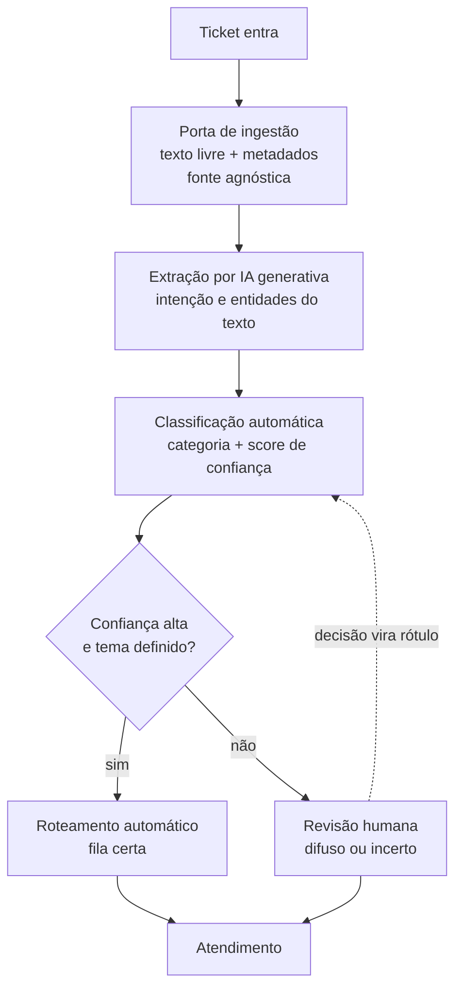

# Proposta de automação

Desenho da automação de suporte ancorado na auditoria (Bloco 1) e no diagnóstico
(Bloco 2). A arquitetura é agnóstica de fonte: recebe qualquer operação de
tickets pela mesma porta, roda de verdade no D2 (dado real de TI interno) e
aponta o D1 como o gap de instrumentação que trava o domínio do cliente. Cada
decisão abaixo se apoia num achado numérico dos dois blocos anteriores.

## O que automatizar e o que não

| Decisão | O quê | Achado que sustenta |
|---------|-------|---------------------|
| Automatizar | Classificação do ticket na entrada e roteamento para a fila correta | 2.2: `Miscellaneous` custa cerca de 353 horas de re-roteamento manual. 1.4: o texto do D2 tem sinal discriminativo por classe. |
| Automatizar com salvaguarda | Detecção do ticket difuso ou de baixa confiança, com desvio para revisão humana | 2.2: `Miscellaneous` é difuso. O termo de topo `change` aparece em 24,6% dos documentos, contra 80,4% de `administrator` em `Purchase`. O balde nasce de forçar rótulo em ticket sem tema. |
| Manter humano | Priorização por SLA e previsão de satisfação no domínio do cliente | 2.3: os atributos do D1 não explicam os desfechos, eta-quadrado no máximo 0,00210. Os carimbos de tempo são negativos em 49,3% dos `Closed`. Não há sinal para treinar. |

A salvaguarda é o núcleo da proposta. Uma automação que roteia o que reconhece e
desvia o que não reconhece ataca a raiz do `Miscellaneous`, que hoje se forma
quando a triagem manual empurra o ticket sem tema para um balde genérico.

## Fluxo ponta a ponta

**Porta de ingestão.** Um contrato único de entrada, texto livre mais metadados.
D1 e D2 plugam na mesma porta apesar de virem de domínios distintos. Plugar ou
desplugar uma fonte não reescreve o pipeline.

**Extração por IA generativa.** A generativa estrutura o texto livre em intenção
e entidades antes da classificação. O critério de entrada é o achado 2.3: os
metadados categóricos do cliente não carregam sinal, então o texto livre é a
fonte rica. A generativa entra onde há texto real a estruturar. Não entra para
recuperar dado sintético, porque o placeholder do D1 (1.2) não contém informação
a extrair.

**Classificação e bifurcação por confiança.** O classificador (Bloco 4) devolve
categoria e score. Confiança alta com tema definido segue para roteamento
automático. Confiança baixa ou ausência de tema definido desvia para revisão
humana. Esta é a camada que decide não decidir.

**Roteamento automático.** O ticket reconhecido chega direto na fila certa. É o
que elimina as 353 horas de re-roteamento manual medidas em 2.2.

**Revisão humana com retroalimentação.** O ticket difuso ou incerto vai para uma
pessoa. A decisão humana vira rótulo e retorna ao classificador como dado de
treino. O sistema fica mais preciso na exata classe onde hoje falha.

## Pré-requisito de instrumentação

A arquitetura roda no D2 porque o D2 é instrumentado: rótulos reais e texto com
sinal. Para estender ao domínio do cliente, a operação precisa capturar o que o
D1 não captura.

| Capturar | Em vez de | Achado |
|----------|-----------|--------|
| Timestamps reais dos eventos: abertura, primeira resposta, resolução | Carimbos sem relação de precedência | 2.3: resolução antes da primeira resposta em 49,3% dos `Closed`. |
| Metadados com semântica de negócio | Categóricos de distribuição uniforme | 1.2: entropia normalizada acima de 0,999. 2.3: eta-quadrado próximo de zero. |
| Texto livre real do cliente | Descrição sintética | 1.2: 100% das descrições com o placeholder `{product_purchased}` cru. |

O D1 é a prova viva do gap. Um sistema de suporte que gera esse tipo de dado não
pode ser otimizado por decisão de desfecho, porque o desfecho não é medido.
Instrumentar a captura é o passo zero antes de automatizar priorização ou
previsão no domínio do cliente. Enquanto isso, a triagem por classificação já
entrega valor sobre qualquer fonte que passe pela porta de ingestão.
