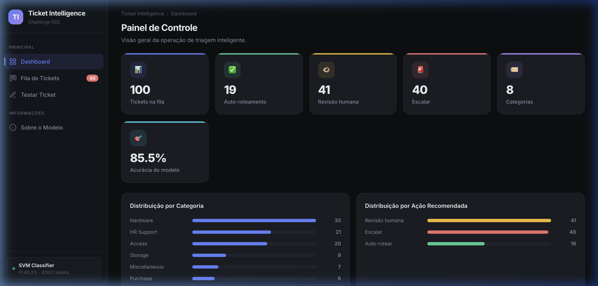
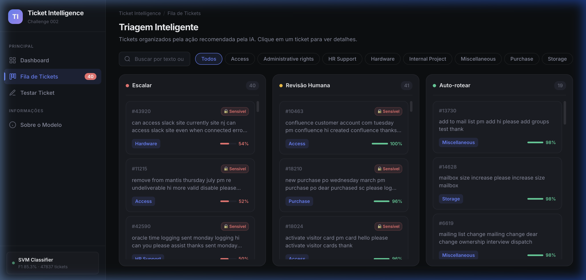
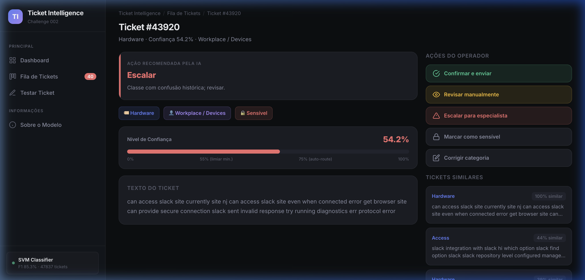
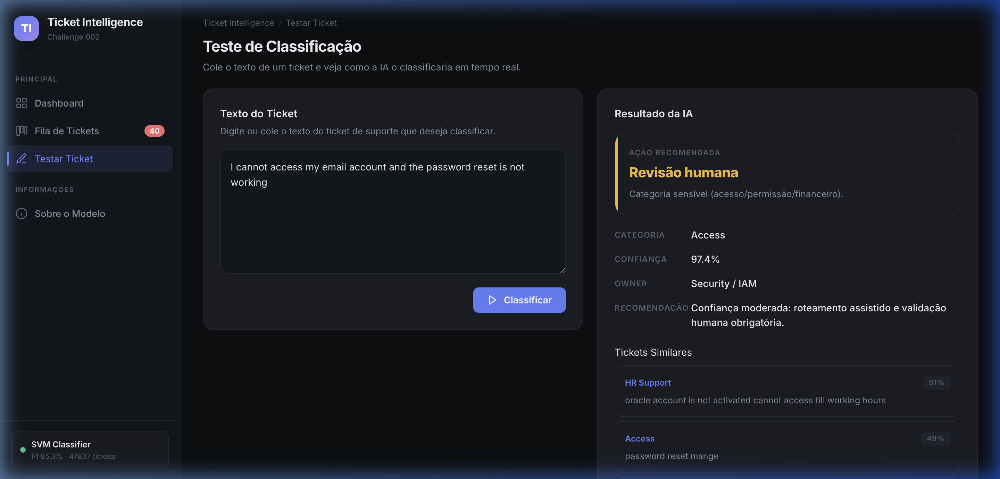

# Process Log Detalhado — Bruno Reis — Challenge 002

Este documento complementa a seção "Process Log" do README.md com detalhes adicionais sobre o workflow, prompts utilizados, e evidências visuais.

---

## 1. Decomposição Inicial do Problema

Antes de abrir qualquer ferramenta de IA, li o challenge completo e separei em 4 entregas:

| # | Entrega | Dataset | Obrigatório? |
|---|---------|---------|--------------|
| 1 | Diagnóstico operacional | Dataset 1 (30K tickets) | Sim |
| 2 | Proposta de automação | Datasets 1 + 2 | Sim |
| 3 | Protótipo funcional | Dataset 2 (48K tickets) | Diferencial |
| 4 | Process log | — | Sim |

Essa decomposição guiou toda a interação com a IA — cada fase tinha um objetivo claro.

---

## 2. Prompts e Iterações (Resumo)

### Fase 1 — Diagnóstico (Dataset 1)

**Prompt inicial:**
> "Analise o dataset de tickets de suporte. Identifique os top gargalos por volume e TTR mediano, cruzando canal × tipo × prioridade. Calcule desperdício comparativo usando benchmark P25."

**Iterações:** 2
- v1: A IA calculou TTR como duração absoluta. Corrigi: são timestamps relativos, usar como proxy comparativa.
- v2: Output final com Spearman e tabela de gargalos segmentada.

### Fase 2 — Modelagem (Dataset 2)

**Prompt inicial:**
> "Treine um classificador de tickets em 8 categorias usando o dataset IT Service Ticket. Use TF-IDF + SVM. Avalie com classification_report e gere matriz de confusão."

**Iterações:** 3
- v1: CountVectorizer → F1 0.82
- v2: TfidfVectorizer sem sublinear_tf → F1 0.84
- v3: TfidfVectorizer com sublinear_tf=True, max_features=50K → F1 0.853 (final)

### Fase 3 — Protótipo (Dashboard)

**Prompt inicial:**
> "Crie um Flask app que carregue o Dataset 2, treine o classificador, e exponha endpoints para listar tickets, detalhar, testar classificação manual."

**Prompt de redesign:**
> "Agora eu quero melhorar este protótipo com um design muito mais moderno... imagine um produto final que a equipe poderia usar hoje mesmo. Use dark theme, glassmorphism, micro-animações."

**Iterações:** 4
- v1: Layout básico funcional (table HTML simples)
- v2: Dark theme aplicado, mas sidebar cobria conteúdo mobile
- v3: Sidebar colapsável + Kanban por ação recomendada
- v4: Contadores animados, badges de sensibilidade, barras de confiança

---

## 3. Decisões Humanas (não geradas por IA)

| Decisão | Justificativa |
|---------|---------------|
| Categorias Access/Admin/Purchase são sensíveis | Risco de segurança/financeiro — erro de classificação pode expor dados ou aprovar pagamentos indevidos |
| Kanban por ação (não por status) | O supervisor precisa ver "o que exige minha atenção" antes de "qual está aberto" |
| Limiares 55%/75% conservadores | Automação agressiva é red flag — começar conservador e calibrar é mais seguro |
| ROI estimado em cenário conservador | Diretor de Operações precisa de números que pode defender, não projeções otimistas |

---

## 4. Estrutura Final de Arquivos

```
submissions/bruno-reis/
├── README.md                          ← Documento principal (template oficial)
├── docs/
│   ├── diagnostic_summary.md          ← Diagnóstico operacional (Dataset 1)
│   ├── ticket_automation_strategy.md  ← Estratégia de automação (Datasets 1+2)
│   └── ticket_classifier_report.md    ← Métricas do classificador (Dataset 2)
├── solution/
│   ├── app.py                         ← Flask backend + API REST
│   ├── ticket_intelligence.py         ← Pipeline ML + similaridade
│   ├── analysis.py                    ← Análise exploratória Dataset 1
│   ├── requirements.txt               ← Dependências Python
│   ├── templates/index.html           ← HTML da SPA
│   ├── static/styles.css              ← CSS dark theme
│   ├── static/app.js                  ← JavaScript SPA
│   └── outputs/                       ← Gráficos gerados (distribuição, confusão)
└── process-log/
    ├── PROCESS_LOG.md                 ← Este documento
    └── screenshots/                   ← Evidências visuais
        ├── dashboard_initial_state_*.png
        ├── kanban_board_*.png
        ├── ticket_detail_page_*.png
        ├── test_classification_result_*.png
        └── ui_verification_*.webp     ← Screen recording
```

---

## 5. Evidências Visuais

### Dashboard — KPIs e distribuições


### Kanban Board — Triagem por ação recomendada


### Detalhe de Ticket — Recomendação da IA + similares


### Teste de Classificação — "I cannot access my email" → Access 97.4%


---

*Bruno Reis — AI Master Challenge — 25/03/2026*
