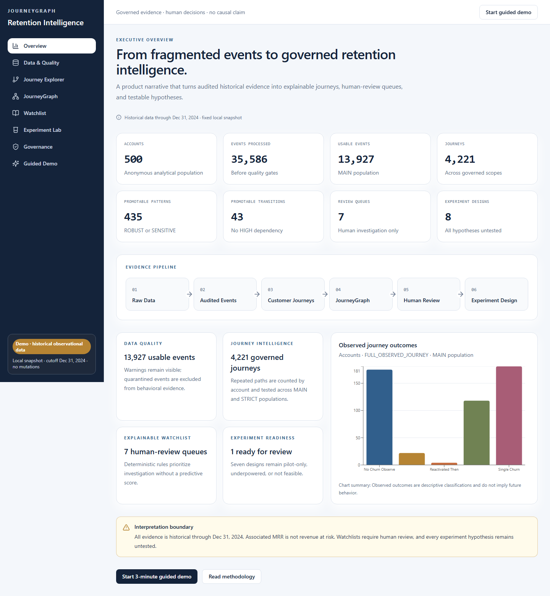
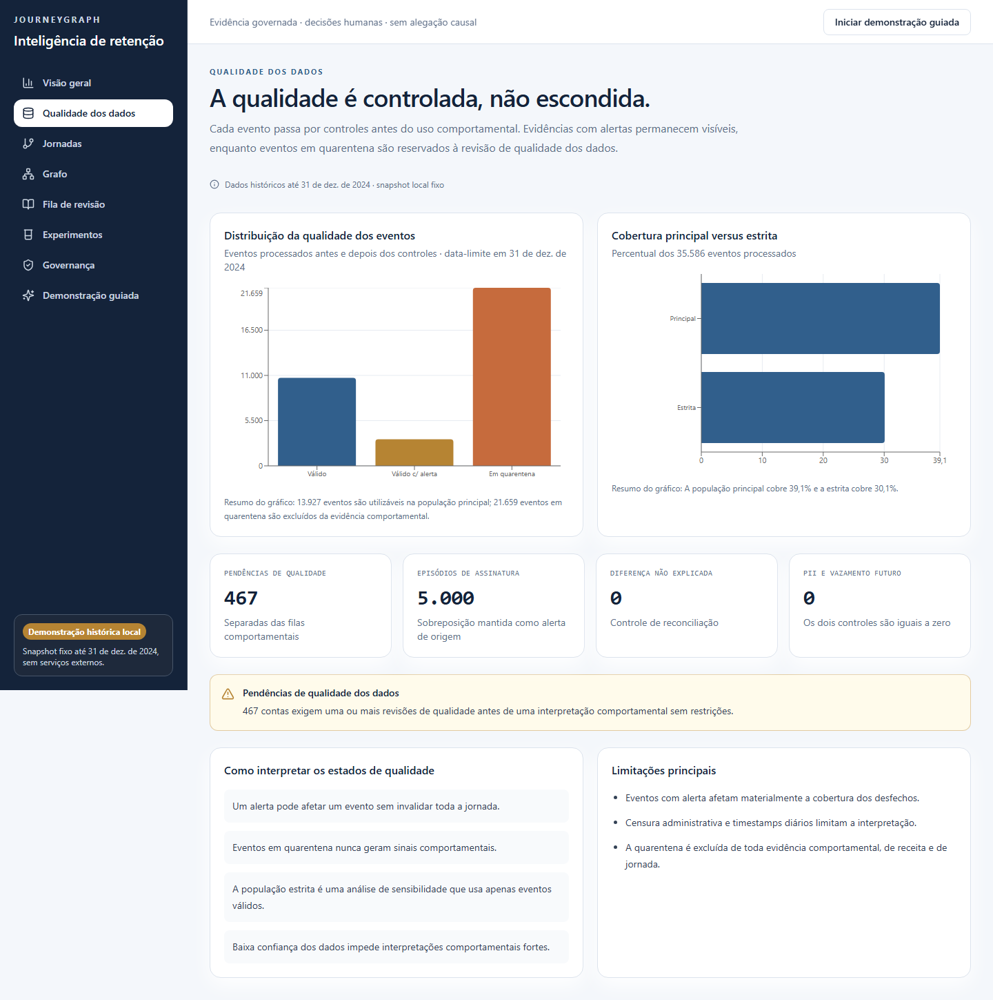
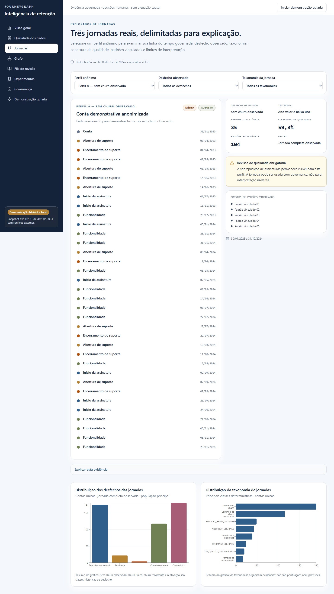
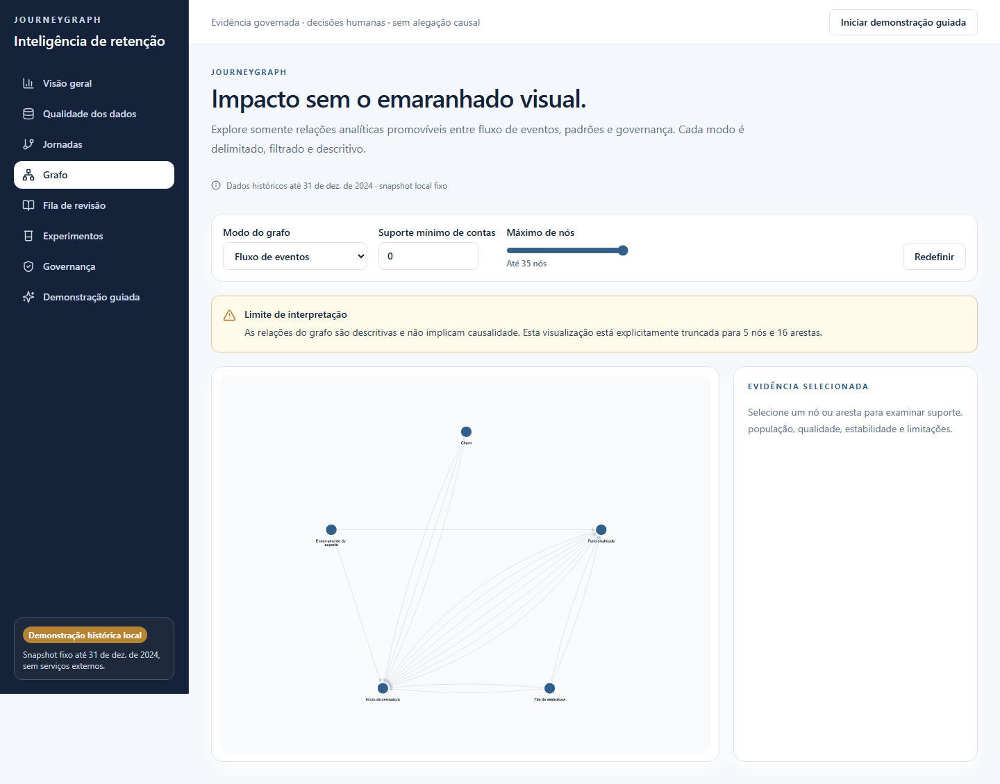
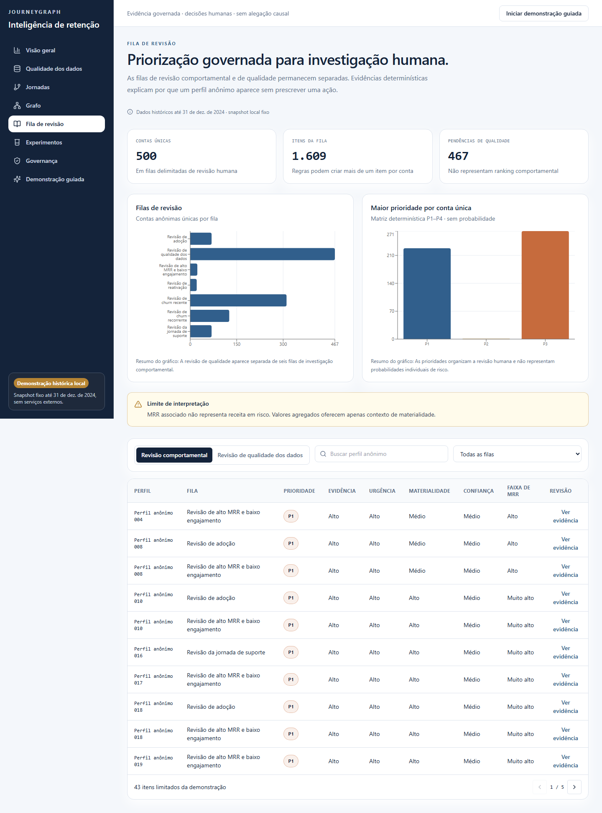
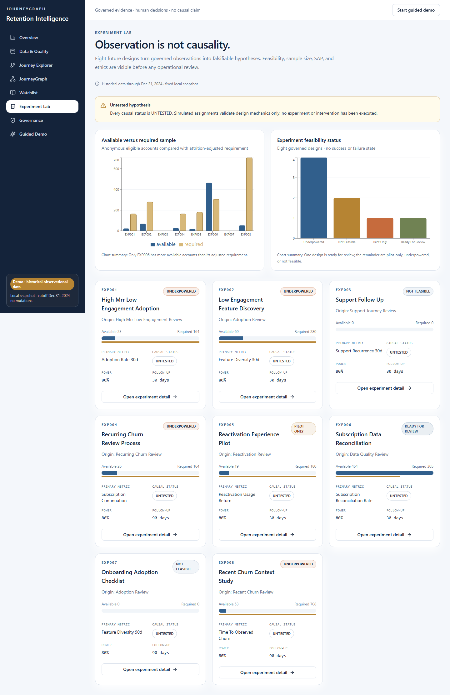
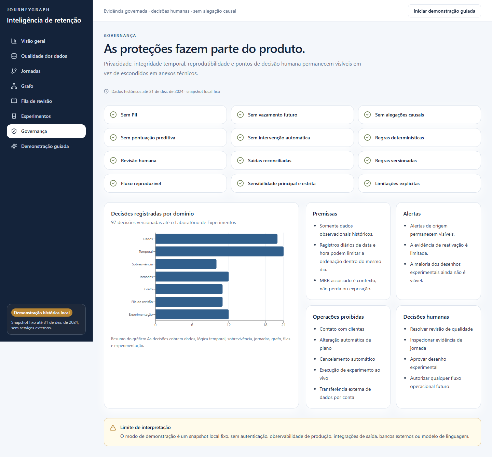
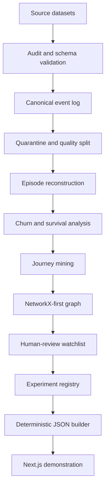

# JourneyGraph

## Governed Retention Intelligence from Temporal Customer Journeys

JourneyGraph reconstructs customer histories from fragmented SaaS data, promotes reliable journey patterns into a knowledge graph, creates explainable human-review queues and converts observations into governed experiment designs.



| Evaluation status | Result |
|---|---|
| Demo | Local validated demonstration. Public deployment pending authorization. |
| Video | Demo video pending final recording. |
| Tests | PASS — Python 130/130, Vitest 19/19, Playwright 36/36, production build with 10 static routes |
| Privacy | Anonymous analytical population; no PII or raw operational account IDs in the interface |
| Causality | Historical and descriptive evidence only; all experiment hypotheses remain untested |
| Language | The dashboard interface is available in Brazilian Portuguese. |

## Executive Summary

- **Retention evidence is fragmented and time-dependent.** SaaS accounts, subscriptions, product usage, support interactions, churn, and reactivation are recorded at different grains. Static churn dashboards can hide chronology, repeated churn, reactivation, data-quality failures, and inflation from unsafe joins, leaving decision-makers with totals that are difficult to trust or act on.

- **JourneyGraph turns governed history into an inspectable decision path.** It audits source data, reconstructs canonical events and customer journeys, separates quarantined records, mines recurring sequences, and promotes only supported evidence into a traceable knowledge graph. That evidence feeds deterministic human-review queues and an Experiment Lab that distinguishes testable designs from underpowered or infeasible ideas.

- **The product supports investigation, not autonomous intervention.** Customer Success can review anonymous histories and evidence packets; Product can formulate measurable hypotheses; leadership can assess data quality and operational readiness; and Data and AI teams can audit transformations and reproducibility. JourneyGraph does not predict individual churn, establish causal effects, label associated MRR as revenue at risk, contact customers, or automate actions. Every queue requires human judgment, and every proposed intervention remains an untested experiment design until separately approved and executed.

## The Problem

SaaS retention data is typically split across accounts, subscriptions, product usage, support, churn, and reactivation. Each source has a different grain and temporal meaning, so a direct join or a single account-level aggregate can create a plausible-looking but incorrect view.

Simple summaries can conceal recurrent churn, reactivation after churn, the sequence between events, timestamp-quality problems, differences between the MAIN and STRICT analytical populations, and row or revenue inflation caused by many-to-many joins. Retention teams therefore need a governed reconstruction of what was observed before they can decide what deserves investigation or testing.

## The Solution

| Stage | Purpose |
|---|---|
| Raw Data | Preserve the five official source datasets as immutable, unversioned inputs. |
| Audited Events | Validate schema, grain, relationships, temporal rules, and privacy before behavioral use. |
| Customer Journeys | Reconstruct ordered, cutoff-safe histories while excluding quarantine from behavioral evidence. |
| Journey Mining | Measure transitions and repeated sequences across governed scopes and quality populations. |
| JourneyGraph | Promote supported ROBUST or SENSITIVE patterns and transitions into traceable graph evidence. |
| Human Review | Organize deterministic evidence packets into seven queues without a predictive score or automatic action. |
| Experiment Design | Convert observations into falsifiable, governed test designs while keeping every causal status `UNTESTED`. |

```text
Raw Data → Audited Events → Customer Journeys → Journey Mining → JourneyGraph → Human Review → Experiment Design
```

## Key Results

All values describe the fixed historical snapshot through December 31, 2024. They are reconciled outputs, not predictions or experimental results.

| Metric | Value | Interpretation | Limitation |
|---|---:|---|---|
| Accounts | 500 | Anonymous analytical population | Not a live or generalizable customer population |
| Processed events | 35,586 | Event opportunities evaluated before quality gates | Includes records that cannot support behavioral analysis |
| Usable events | 13,927 | MAIN population used for governed behavioral evidence | Includes `VALID_WITH_WARNING`; STRICT results can differ |
| Quarantined records | 21,659 | Quality backlog preserved for audit | Excluded from behavior, journeys, and business metrics |
| Customer journeys | 4,221 | Governed histories reconstructed across defined scopes | Outcomes are descriptive classifications |
| Promoted journey patterns | 435 | ROBUST or SENSITIVE patterns admitted to graph evidence | Recurrence does not imply cause or future behavior |
| Promoted transitions | 43 | Transitions that passed support and dependency gates | Technical temporal direction is not causal direction |
| Review queues | 7 | Distinct categories for human investigation | Queues do not authorize customer action |
| Review items | 1,609 | Rule-level evidence items across the queues | Accounts can appear under multiple rules and queues |
| Unique accounts in review | 500 | Deduplicated accounts represented in at least one queue | Inclusion is not an individual churn prediction |
| Experiment designs | 8 | Governed hypotheses with eligibility, metrics, and safeguards | All causal statuses remain `UNTESTED` |
| Ready for review | 1 | Design has sufficient planning support to enter review | Review is not approval or execution |
| Pilot only | 1 | Design is limited to feasibility learning | Cannot support an effectiveness claim |
| Underpowered | 4 | Available sample is below the adjusted requirement | More evidence or a redesigned test is required |
| Not feasible | 2 | Required design units or operating conditions are absent | No experiment can begin under the current snapshot |

## What Makes JourneyGraph Different

| Decision surface | Traditional churn dashboard | JourneyGraph |
|---|---|---|
| Unit of evidence | Static aggregates | Temporally reconstructed customer journeys |
| Data trust | Quality often hidden behind totals | Audit, quarantine, denominators, and warnings remain visible |
| Prioritization | Isolated or opaque risk score | Deterministic review rules with evidence packets |
| Traceability | Limited path back to sequence and source | Promoted patterns and graph relationships retain provenance |
| Uncertainty | Often implicit | MAIN/STRICT sensitivity, support, stability, and limitations are explicit |
| Action | Recommendations may precede validation | Human review and experiment design precede any intervention |
| Causality | Association can be easy to overread | Observations remain descriptive; hypotheses stay `UNTESTED` |

## Product Walkthrough

### 1. Executive Overview


The landing page shows the scale of the governed pipeline and separates usable evidence, quality backlog, journey intelligence, review queues, and experiment readiness. It keeps the fixed historical cutoff and interpretation boundary visible at the point of decision.

**Question answered:** How far has fragmented source data progressed toward reviewable retention evidence?
**Primary limitation:** The page summarizes a fixed historical snapshot and does not forecast churn.

### 2. Data Quality



This view reconciles 35,586 processed events into 13,927 usable events and 21,659 quarantined records. Warnings remain visible so an evaluator can see how much evidence is available and what was excluded.

**Question answered:** Which records can support behavioral analysis, and why are others restricted?
**Primary limitation:** Quarantine identifies data-quality constraints; it is not a behavioral signal.

### 3. Journey Explorer



Three controlled anonymous profiles demonstrate ordered events, outcomes, scope, and quality context without exposing operational identifiers. Filters change only the bounded evidence already present in the local snapshot.

**Question answered:** What did a representative anonymous customer journey look like over time?
**Primary limitation:** The three profiles are demonstration examples, not an operational account search or ranking.

### 4. JourneyGraph



The graph exposes promoted event flows, patterns, and governance context through bounded, filtered views. It connects structure back to support, population, stability, and limitations while avoiding a dense all-node visualization.

**Question answered:** Which reliable sequence relationships connect the governed journey evidence?
**Primary limitation:** The visible graph is reduced and descriptive; centrality and direction do not establish causality.

### 5. Review Queue



Seven queues organize 1,609 rule-level items for human investigation, with evidence, discrete priority components, and prohibited interpretations. Associated MRR is shown only as deduplicated context inside a queue.

**Question answered:** Which histories deserve structured review, and what evidence explains their inclusion?
**Primary limitation:** Queue membership is neither a probability nor authorization for contact or intervention.

### 6. Experiment Lab



Eight designs make eligibility, required sample, metrics, safeguards, and feasibility visible before any test is run. The status distribution—one ready for review, one pilot only, four underpowered, and two not feasible—prevents observations from being presented as outcomes.

**Question answered:** Which hypotheses can advance toward a governed test under current constraints?
**Primary limitation:** Every design remains `UNTESTED`; the Lab contains no uplift, effect, or causal result.

### 7. Governance



The governance surface consolidates privacy, temporal, causal, operational, and language controls alongside known limitations. It makes the product boundary auditable rather than leaving it in implementation notes.

**Question answered:** What prevents historical evidence from becoming an unsafe automated decision?
**Primary limitation:** These controls validate the local demonstration; they are not a live enforcement or authorization service.

## Who Uses It

| User | How JourneyGraph supports the role |
|---|---|
| Customer Success | Review anonymous customer histories, prioritize investigation, and document human judgment without automatic action. |
| Product | Identify recurring journey patterns, formulate product hypotheses, and propose measurable experiments. |
| Leadership | Understand data quality, assess operational readiness, and distinguish observed evidence from assumptions. |
| Data and AI teams | Audit transformations, validate reproducibility and semantic controls, and evolve the architecture without weakening governance. |

## Governed by Design

| Principle | Implementation |
|---|---|
| No PII | The dashboard excludes names, email, free text, raw account IDs, and other directly identifying fields. |
| No future leakage | Features and evidence are bounded by explicit as-of cutoffs and temporal rules. |
| No causal claims | Graph paths, comparisons, and findings are described as historical associations. |
| No predictive churn score | Prioritization uses transparent rule components and a discrete review matrix, not a probability. |
| No automated outbound action | The system has no contact, messaging, discount, cancellation, or intervention integration. |
| No synthetic outcome | Planning simulations do not create customer outcomes, uplift, or effect estimates. |
| Human review required | Every queue and potential next step is investigation-only until a person reviews it. |
| Deterministic demo | Local inputs, bounded interactions, fixed hashes, and versioned JSON snapshots reproduce the same surface. |
| Fixed historical cutoff | All application evidence is bounded at `2024-12-31T19:00:00`. |
| Explicit limitations | Quality, support, stability, graph bounds, and interpretation limits appear beside the evidence. |
| Promotable evidence only | The analytical graph admits ROBUST or SENSITIVE evidence and excludes HIGH same-day dependency. |
| Experiment status remains untested | All eight designs use causal status `UNTESTED`; readiness labels describe planning feasibility only. |

“Associated MRR” is deduplicated business context only. It is not revenue at risk, saved revenue, recognized revenue, or attributed impact.

## Architecture



The analytical layer is implemented in Python. NetworkX is the reference graph runtime; Neo4j is an optional export and is not required by the product. The application reads 15 deterministic local JSON snapshots and has no runtime dependency on external APIs, an external LLM, a database, or a live backend.

See [Architecture](docs/architecture.md) for component responsibilities, data grains, gates, and runtime boundaries.

## Quick Start

### Requirements

- Python 3.11 or newer
- Node.js 20.9 or newer
- npm 10 or newer
- Windows, Linux, or macOS; no credentials or external service required

If the local Python environment does not already exist, create it from the repository root. On Linux or macOS, activate the equivalent `.venv/bin/python` environment before installing the same requirements.

```powershell
cd submissions/carlos-henrique/solution
python -m venv .venv
.venv\Scripts\python.exe -m pip install -r requirements.txt
```

Start the application from the repository root:

```bash
cd submissions/carlos-henrique/solution/app
npm ci
npm run build:data
npm run dev
```

Open [http://localhost:3000](http://localhost:3000). `npm run build:data` uses a dependency-free Node.js wrapper to locate Python 3 and the governed builder without relying on bash, the caller's working directory, or hardcoded path separators. It verifies 25 governed input hashes and rebuilds exactly 15 local JSON snapshots before the interface starts.

### Troubleshooting

The wrapper first checks `solution/.venv`, then the standard Python launchers for the current platform. If no valid Python 3 executable is available, or if the builder fails, the command prints a clear requirement or failure message and returns a non-zero exit code; it never retries the builder with another interpreter.

For a production-mode local check:

```bash
npm run build
npm run start
```

## Validation

Run the application gates from `submissions/carlos-henrique/solution/app`:

```bash
npm run lint
npm run typecheck
npm run test
npm run build
npm run test:smoke
npm audit --omit=dev
```

Run the analytical code gates from `submissions/carlos-henrique/solution`:

```powershell
.venv\Scripts\python.exe -m compileall -q src scripts
.venv\Scripts\python.exe -m pytest -q
```

The final validated baseline passed Python tests (130/130), Vitest (18/18), responsive Playwright smoke tests (36/36), dependency audit with zero production vulnerabilities, and a deterministic 15-file data rebuild with zero differences.

## Human Judgment and AI Collaboration

JourneyGraph used an AI coding assistant to help decompose phases, draft bounded implementation changes, propose tests, review documentation, and surface technical alternatives. Carlos Henrique retained responsibility for every methodological gate, product boundary, correction, validation acceptance, and commit. The process rejected unsafe or unsupported paths—including a row-multiplying mega-join, a churn probability shortcut, unstable graph evidence, automatic customer action, generic lexical translation, and a platform-specific Quick Start. Outputs became accepted evidence only after human review, deterministic checks, correction, and revalidation.

The audit trail distinguishes suggestions from decisions and implementation defects from source-data conditions. It also records what remains uncertain: transient interactions were not all preserved, historical associations are not causal effects, and future operational use requires new approval. Evaluators can inspect [human decisions](process-log/HUMAN_JUDGMENT.md), [AI trace](process-log/AI_TRACE.md), [errors and corrections](process-log/AI_ERRORS_AND_CORRECTIONS.md), [rejected hypotheses](process-log/REJECTED_HYPOTHESES.md), [trade-offs](process-log/TRADE_OFFS.md), [intervention timeline](process-log/HUMAN_INTERVENTION_TIMELINE.md), and the [evidence map](process-log/EVIDENCE_MAP.md).

## Evidence and Documentation

| Evaluation need | Primary evidence |
|---|---|
| Architecture and boundaries | [Architecture](docs/architecture.md) · [Dashboard data contract](solution/reports/dashboard-data-contract.md) |
| Source schema and data quality | [Data contract](docs/data-contract.md) · [Data audit](solution/reports/data-audit.md) · [Event-log validation](solution/reports/event-log-validation.md) |
| Churn and revenue interpretation | [Executive diagnostic](solution/reports/executive-diagnostic.md) · [Revenue diagnostic](solution/reports/revenue-diagnostic.md) |
| Temporal risk methods | [Survival analysis](solution/reports/survival-analysis.md) · [Survival methodology](solution/reports/survival-methodology.md) |
| Journey evidence | [Journey mining](solution/reports/journey-mining.md) · [Journey methodology](solution/reports/journey-methodology.md) |
| Graph evidence | [JourneyGraph report](solution/reports/journeygraph.md) · [Graph methodology](solution/reports/graph-methodology.md) · [Graph validation](solution/reports/graph-validation.md) |
| Human review | [Intervention watchlist](solution/reports/intervention-watchlist.md) · [Watchlist methodology](solution/reports/watchlist-methodology.md) |
| Experiment readiness | [Experiment Lab](solution/reports/experiment-lab.md) · [Experiment methodology](solution/reports/experiment-methodology.md) · [Experiment validation](solution/reports/experiment-validation.md) |
| Product and localization QA | [Dashboard validation](solution/reports/dashboard-validation.md) · [Localization validation](solution/reports/localization-validation.md) · [Application guide](solution/app/README.md) |

## Resumo em português

O JourneyGraph transforma eventos históricos fragmentados em jornadas auditáveis, evidência de grafo, filas explicáveis para revisão humana e desenhos de experimentos governados. A demonstração permanece local, anônima e descritiva: não prevê churn individual, não atribui causalidade, não classifica MRR como receita em risco e não executa intervenções.
