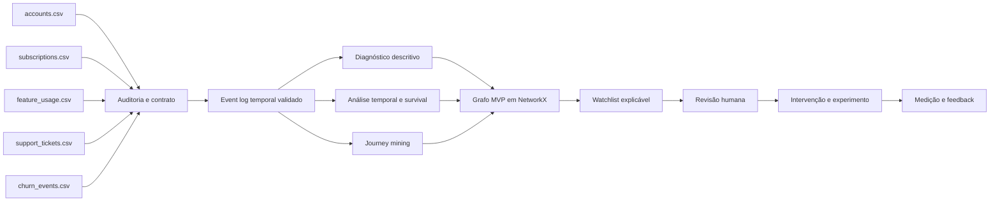

# Arquitetura planejada do JourneyGraph

> **Status na Fase 2:** auditoria, event log, qualidade temporal, quarentena e episódios de assinatura implementados. Camadas analíticas e de produto permanecem não implementadas.

## Estado de implementação

| Componente | Estado | Evidência |
|---|---|---|
| Data audit | `IMPLEMENTED` | perfis, schemas, relações e relatórios da Fase 1 |
| Event log | `IMPLEMENTED_WITH_WARNINGS` | `data/processed/event_log.parquet` |
| Temporal quality | `IMPLEMENTED` | flags, statuses e `temporal_quality_summary.json` |
| Quarantine | `IMPLEMENTED` | `data/processed/quarantined_events.parquet` |
| Subscription episodes | `IMPLEMENTED_WITH_WARNINGS` | `data/processed/subscription_episodes.parquet` |
| Diagnóstico, survival e journey mining | `NOT_IMPLEMENTED` | fora do escopo da Fase 2 |
| Graph | `NOT_IMPLEMENTED` | depende do gate temporal |
| Watchlist e app | `NOT_IMPLEMENTED` | dependem de análise e validação posteriores |

## Objetivo do produto

JourneyGraph deverá transformar cinco fontes operacionais da RavenStack em evidências temporais rastreáveis para diagnosticar retenção, priorizar receita em risco e apoiar intervenções mensuráveis. O produto deverá preservar a distinção entre sinais associados, hipóteses explicativas e efeitos causalmente demonstrados.

## Arquitetura em camadas

1. **Fontes brutas:** cinco CSVs oficiais, imutáveis e não versionados.
2. **Auditoria e contrato:** perfil dos dados, chaves, tipos, granularidade, qualidade, privacidade e reconciliação.
3. **Integração temporal:** event log canônico com identidade, evento, tempo, origem e linhagem validados.
4. **Inteligência analítica:** diagnóstico descritivo, análise temporal, survival analysis e journey mining.
5. **Grafo operacional:** projeção NetworkX criada somente após a validação do modelo relacional e do event log.
6. **Decisão:** scoring ou regras validadas, priorização de receita em risco e watchlist explicável.
7. **Experiência:** interface para exploração e ação, com revisão humana e registro de intervenções.
8. **Experimentação e governança:** testes controlados, monitoramento, auditoria, segurança e feedback.

## Fluxo planejado das cinco fontes

Os nomes exibidos no diagrama são rótulos conceituais abreviados; os nomes oficiais esperados e o status de validação constam em `data-contract.md`.

## Event-log-first

O event log é um gate arquitetural agora implementado com qualidade por evento, provenance, quarentena e reconciliação zero. Identidade substituta de uso, granularidade, timestamps, timezone, duplicidade, ordem temporal, churn recorrente, reativação e integridade foram formalizados. O grafo continua proibido de corrigir ou ocultar inconsistências do modelo relacional e não foi construído nesta fase.

## Modelo conceitual do grafo

O desenho preliminar considera entidades conceituais como conta, assinatura, evento de uso, interação de suporte e desfecho de retenção. Arestas poderão representar vínculos relacionais ou sucessões temporais. Tipos de nós, arestas, propriedades e projeção permanecem **NÃO IMPLEMENTADOS**; a Fase 2 entrega somente a camada temporal que poderá sustentá-los posteriormente.

O MVP deverá usar NetworkX. Neo4j somente poderá ser avaliado depois de comprovados o modelo relacional, a necessidade operacional e o valor incremental do grafo.

## Separação analítica

- **Descritiva:** o que ocorreu e como se distribui entre segmentos, sem alegação causal.
- **Temporal:** quando eventos ocorreram, em que ordem e com quais associações antes dos desfechos.
- **Prescritiva:** quais intervenções merecem teste, sob restrições operacionais e econômicas.

Uma associação temporal não será apresentada como causa. Recomendações prescritivas deverão explicitar evidências, limitações, custo, responsável, guardrails e método de avaliação.

## Human-in-the-loop

A watchlist deverá explicar os sinais que sustentam cada prioridade. Pessoas responsáveis por Customer Success deverão confirmar contexto, escolher ou recusar intervenções e registrar justificativas. Decisões de alto impacto não serão executadas autonomamente sem controles definidos.

## Experimentação

Intervenções deverão ser tratadas como hipóteses testáveis. Quando aplicável, a solução deverá prever grupos comparáveis, métricas primárias e guardrails, janela de observação, critérios de parada e registro de exposição. Inferência causal dependerá de desenho experimental ou estratégia de identificação válida.

## Stack planejada

- Python 3.11+;
- pandas, NumPy, SciPy e PyArrow para processamento;
- statsmodels, scikit-learn e lifelines para métodos estatísticos futuros;
- NetworkX para o grafo MVP;
- Plotly e Streamlit para visualização e interface futuras;
- Pydantic para contratos de aplicação;
- pytest para validação automatizada.

Versões serão fixadas depois da validação do ambiente. APIs pagas não serão dependência do núcleo.

## Componentes opcionais

- armazenamento persistente para artefatos validados;
- orquestração agendada se o caso de uso operacional exigir;
- registro de experimentos e monitoramento;
- banco de grafos somente após evidência de necessidade;
- assistência por LLM somente em funções com grounding, avaliação e fallback, sem controlar os cálculos centrais.

Componentes opcionais exigirão justificativa de valor, custo, segurança e manutenção antes de adoção.

## Fora de escopo nesta fase

- diagnóstico de causas de churn, receita em risco e findings executivos;
- survival analysis, journey mining, grafo, watchlist e modelo preditivo;
- dashboard, app, API, automação, cloud ou CI/CD;
- Neo4j, GNNs, embeddings e agentes autônomos;
- qualquer alegação causal, business case ou estimativa de impacto.

## Riscos arquiteturais

- chaves ou granularidades divergirem da documentação pública;
- joins muitos-para-muitos inflarem contagens ou receita;
- timestamps incompletos, inconsistentes ou sem timezone;
- leakage ao usar informação posterior ao desfecho;
- churn recorrente e reativação serem modelados incorretamente;
- sinais de contas com maior volume dominarem a análise;
- correlação ser comunicada como causalidade;
- texto de feedback conter dados pessoais ou sensíveis;
- complexidade de grafo ou infraestrutura não gerar valor incremental;
- decisões automatizadas reduzirem supervisão e auditabilidade.

## Decisões dependentes da auditoria

Foram resolvidos nas Fases 1 e 2: schemas, chaves candidatas, cardinalidades, timezone `NAIVE_SOURCE_TIME`, modelo canônico do event log, identidade determinística, política de duplicatas, quarentena, churn recorrente, reativação explícita, atribuição conservadora a assinatura, episódios e política de texto livre.

Permanecem pendentes para fases autorizadas posteriores:

- definição analítica de coortes, janela de observação e censura;
- regras de receita em risco, disponibilidade as-of de atributos mutáveis e projeção do grafo.

---

## Atualização de implementação — Fase 3

> **Status:** diagnóstico executivo implementado com ressalvas de cobertura e sensibilidade. Nenhum modelo temporal avançado ou produto operacional foi construído.

| Componente | Estado na Fase 3 | Evidência |
|---|---|---|
| Diagnostic feature layer | `IMPLEMENTED_WITH_WARNINGS` | `account_diagnostic_features.parquet` e `subscription_diagnostic_features.parquet` |
| Data health | `IMPLEMENTED` | `diagnostic_summary.json` e `data-health.md` |
| Churn diagnostics | `IMPLEMENTED_WITH_WARNINGS` | `churn_diagnostics.json`; resultados centrais são sensíveis a warnings |
| Reactivation diagnostics | `IMPLEMENTED_WITH_WARNINGS` | reativação explícita, separada e recalculada na população estrita |
| Revenue diagnostics | `IMPLEMENTED_WITH_WARNINGS` | MRR associado, sem linguagem de perda ou recuperação comprovada |
| Cohort diagnostics | `IMPLEMENTED` | seis critérios de coorte com `SMALL_SAMPLE` abaixo de 20 contas |
| Descriptive journey analytics | `IMPLEMENTED_WITH_WARNINGS` | sequências reduzidas, agregadas e limitadas; sem mineração formal |
| Survival analysis | `NOT_IMPLEMENTED` | reservado à Fase 4 |
| Sequence mining | `NOT_IMPLEMENTED` | PrefixSpan, Markov e equivalentes fora do escopo |
| Graph | `NOT_IMPLEMENTED` | nenhuma projeção ou banco de grafos criado |
| Individual watchlist | `NOT_IMPLEMENTED` | segmentos são apenas agregados, sem IDs |
| App/dashboard | `NOT_IMPLEMENTED` | interface fora do escopo |

### Fluxo implementado

O event log ativo alimenta agregações independentes nos grãos de conta, episódio e evento. A conta usa cutoff no primeiro churn utilizável ou em `observation_end`; episódios abertos permanecem censurados; quarentena alimenta somente Data Health. Os agregados geram diagnósticos, análise de sensibilidade, findings com gate e no máximo cinco situações de atenção agregadas.

### Caminho de maior retorno e menor esforço

Antes de operacionalizar retenção individual, o maior retorno está em corrigir cronologias upstream e validar a semântica de assinaturas simultâneas. Isso reduz incerteza em churn, uso e MRR sem adicionar infraestrutura, modelo ou interface prematuramente.

---

## Atualiza??o de implementa??o ? Fase 4

> **Status:** survival analysis de conta implementada com ressalvas; nenhuma previs?o, a??o operacional ou infer?ncia causal foi constru?da.

| Componente | Estado na Fase 4 | Evid?ncia |
|---|---|---|
| Survival dataset de conta | `IMPLEMENTED` | `account_survival_dataset.parquet`; uma linha por conta |
| Camada de censura | `IMPLEMENTED_WITH_LIMITATIONS` | censura administrativa ? direita em `2024-12-31T19:00:00` |
| Kaplan?Meier | `IMPLEMENTED_WITH_WARNINGS` | curvas principal, estrita e grupos com IC, at-risk e suporte |
| Nelson?Aalen | `IMPLEMENTED_WITH_WARNINGS` | risco acumulado descritivo com intervalos |
| Landmark analysis | `IMPLEMENTED` | datasets e curvas em 30, 60 e 90 dias, sem features futuras |
| Sensitivity analysis | `IMPLEMENTED_WITH_WARNINGS` | popula??o, origem, overlap e cobertura de qualidade |
| Log-rank e BH | `IMPLEMENTED_WITH_WARNINGS` | somente grupos com n e eventos m?nimos |
| RMST | `IMPLEMENTED_WITH_WARNINGS` | horizontes de 90, 180 e 365 dias |
| Cox PH | `CONDITIONAL_NOT_EXECUTED` | endpoints sens?veis a warnings e proporcionalidade n?o testada |
| Sequence mining | `NOT_IMPLEMENTED` | reservado ? Fase 5 |
| Graph | `NOT_IMPLEMENTED` | nenhuma proje??o criada |
| Intervention engine | `NOT_IMPLEMENTED` | fora do escopo |
| App/dashboard | `NOT_IMPLEMENTED` | fora do escopo |

### Fluxo temporal implementado

O event log ativo ? filtrado em popula??es principal e estrita. A primeira assinatura utiliz?vel abre a exposi??o; o primeiro churn utiliz?vel em ou ap?s a origem encerra o tempo com evento; na aus?ncia dele, `observation_end` encerra a observa??o como censura ? direita. Kaplan?Meier e Nelson?Aalen recebem somente contas eleg?veis. Vari?veis de uso e suporte entram exclusivamente em janelas landmark fixas, ap?s exclus?o de churns anteriores ou no marco.

### Decis?o de baixo custo e alto retorno

A an?lise permanece n?o operacional. O maior retorno antes de qualquer score est? em corrigir cronologias com warning e validar a sem?ntica de assinaturas simult?neas. Isso reduz a diverg?ncia entre 325 eventos na popula??o principal e 46 na estrita sem adicionar modelo, banco de grafo ou dashboard.

### Limite por assinatura

Curvas por assinatura n?o foram executadas. Sobreposi??o em 99,84% dos epis?dios, correla??o intracliente e aus?ncia de equival?ncia entre encerramento e churn invalidam a hip?tese simples de epis?dios independentes.

---

## Atualiza??o de implementa??o ? Fase 5

> **Status:** journey mining implementado com ressalvas de warnings, exposi??o e ordena??o t?cnica; nenhum grafo ou mecanismo de interven??o foi criado.

| Componente | Estado na Fase 5 | Evid?ncia |
|---|---|---|
| Sequence layer | `IMPLEMENTED_WITH_WARNINGS` | `account_journeys.parquet`; escopos e representa??es governados |
| Transition analytics | `IMPLEMENTED_WITH_WARNINGS` | `transition_matrix.json`; suporte por conta e lift protegido |
| N-gram mining | `IMPLEMENTED_WITH_WARNINGS` | 2- a 5-grams colapsados e bigram raw de sensibilidade |
| Sequential pattern mining | `IMPLEMENTED_WITH_WARNINGS` | subsequ?ncias frequentes, gaps expl?citos e padr?es fechados |
| Journey taxonomy | `IMPLEMENTED_WITH_WARNINGS` | `account_journey_taxonomy.parquet`; regras determin?sticas |
| Stability analysis | `IMPLEMENTED` | reconcilia??o principal versus estrita |
| Graph | `NOT_IMPLEMENTED` | reservado ? Fase 6; nenhuma aresta ou proje??o criada |
| Centrality / communities | `NOT_IMPLEMENTED` | fora do escopo desta fase |
| Intervention engine | `NOT_IMPLEMENTED` | nenhum score ou a??o individual |
| App/dashboard | `NOT_IMPLEMENTED` | fora do escopo |

### Fluxo implementado

O event log ativo ? filtrado em popula??es principal e estrita, ordenado de modo determin?stico e projetado em escopos temporais expl?citos. Transi??es e n-grams precedem a minera??o de subsequ?ncias. Somente agregados estabilizados, com denominador e controle de exposi??o, chegam ao gate de findings.

### Limite arquitetural

Os padr?es s?o descri??es de recorr?ncia observada. Uma futura proje??o em grafo dever? preservar escopo, dire??o temporal t?cnica, suporte por conta, exposi??o, estabilidade e depend?ncia intradi?ria; n?o poder? converter associa??o em causalidade.

---

## Atualiza??o de implementa??o ? Fase 6

> **Status:** JourneyGraph governado implementado com ressalvas; nenhuma previs?o, recomenda??o autom?tica ou interven??o foi constru?da.

| Componente | Estado na Fase 6 | Evid?ncia |
|---|---|---|
| Instance graph | `IMPLEMENTED` | `journey_instance_graph.graphml`; contas, jornadas e eventos rastre?veis |
| Analytical graph | `IMPLEMENTED_WITH_WARNINGS` | `journey_analytical_graph.graphml`; somente ROBUST/SENSITIVE promovidos |
| Pattern graph | `IMPLEMENTED_WITH_WARNINGS` | Pattern como entidade com escopo, outcome, suporte e estabilidade |
| Outcome graph | `IMPLEMENTED` | seis outcomes controlados e rela??es descritivas |
| Taxonomy graph | `IMPLEMENTED` | dez classes da Fase 5 projetadas sem ranking individual |
| Quality layer | `IMPLEMENTED` | QualityProfile expl?cito e reutiliz?vel |
| Graph validation | `IMPLEMENTED` | schema, privacidade, temporalidade, reconcilia??o e sem?ntica |
| Neo4j export | `IMPLEMENTED_NOT_EXTERNALLY_EXECUTED` | CSV/Cypher port?teis; servidor n?o integra o gate |
| Prediction / GNN | `NOT_IMPLEMENTED` | fora do escopo autorizado |
| Link prediction | `NOT_IMPLEMENTED` | fora do escopo autorizado |
| Automated recommendation | `NOT_IMPLEMENTED` | investiga??es exigem revis?o humana |
| Intervention engine | `NOT_IMPLEMENTED` | reservado a fase posterior governada |
| App/dashboard | `NOT_IMPLEMENTED` | fora do escopo |

### Fluxo arquitetural

NetworkX ? a implementa??o de refer?ncia local. O `INSTANCE_GRAPH` preserva rastreabilidade por chaves an?nimas, limites de jornada e ocorr?ncias espec?ficas por escopo. O `ANALYTICAL_GRAPH` promove padr?es e transi??es somente ap?s gates de suporte, denominador, estabilidade, amostra e depend?ncia intradi?ria. Seis subgrafos controlam usos futuros: `ROBUST_GRAPH`, `PROMOTABLE_GRAPH`, `CHURN_GRAPH`, `REACTIVATION_GRAPH`, `QUALITY_REVIEW_GRAPH` e `HIGH_MRR_GRAPH`.

### Limite arquitetural

Centralidade ? propriedade estrutural apenas de EventType; Pattern recebe ranking agregado por suporte ou MRR associado. Account nunca recebe centralidade. Nenhuma aresta ou propriedade comunica causalidade, perda ou economia. A exporta??o Neo4j ? derivada e opcional; GraphML mant?m os grafos completos e o CSV de EventInstance usa amostra determin?stica.
