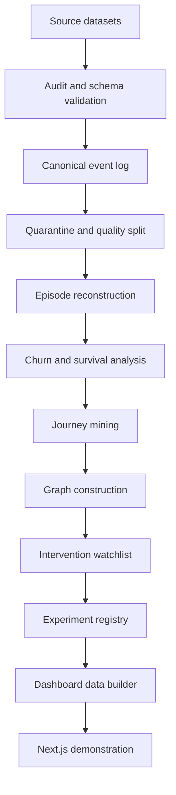
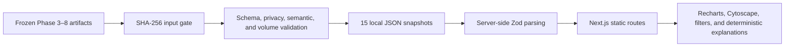

# JourneyGraph Architecture

## Current State

JourneyGraph is a reproducible local analytical system and demonstration interface built on a fixed historical snapshot through `2024-12-31T19:00:00`. The implemented path runs from source audit to a deterministic Next.js product surface. It does not depend on a live backend, external API, external LLM, graph server, or cloud service at runtime.

The system is designed for governed retention investigation: observations can become reviewable evidence and experiment designs, but they do not become individual predictions, causal conclusions, or automated interventions.

## End-to-End Flow

Quarantine is a controlled exclusion path, not a source of behavioral evidence. The canonical log records a quality status for every event opportunity; quarantined rows are preserved for data-health reporting, while active events continue into episode reconstruction and downstream analysis.

## Component Map

| Stage | Reference implementation | Primary output | Governing boundary |
|---|---|---|---|
| Source datasets | Five immutable CSV inputs under `solution/data/raw/` | Local raw snapshot | Raw CSVs are not versioned or modified |
| Audit and schema validation | `solution/scripts/inspect_data.py`; `solution/src/data_audit.py` | Profiles, schema map, relationship matrix, reconciliation evidence | Grain and cardinality are established before joins |
| Canonical event log | `solution/scripts/build_event_log.py`; `solution/src/event_log.py`; `solution/src/event_rules.py` | `event_log.parquet`, event dictionary, manifest | Deterministic event identity, provenance, and temporal ordering |
| Quarantine and episodes | `solution/src/temporal_quality.py` plus event-log builder | `quarantined_events.parquet`, `subscription_episodes.parquet` | Quarantine is excluded from behavior; ambiguous episode attribution stays visible |
| Churn diagnostics | `solution/scripts/run_diagnostics.py` | Account/subscription features and descriptive diagnostic artifacts | Associations are descriptive; MRR is contextual |
| Survival analysis | `solution/scripts/run_survival_analysis.py` | Survival datasets, curves, comparisons, and sensitivity artifacts | Right censoring, as-of features, support gates, and no individual prediction |
| Journey mining | `solution/scripts/run_journey_mining.py` | Account journeys, transitions, sequential patterns, and taxonomy | MAIN/STRICT sensitivity, account support, exposure, and stability |
| Graph construction | `solution/scripts/run_journey_graph.py` | Instance and analytical GraphML plus graph evidence | NetworkX-first; only promotable evidence enters the analytical graph |
| Intervention watchlist | `solution/scripts/run_intervention_watchlist.py` | Rule-level watchlist, account summaries, evidence packets | Transparent P1–P4 review matrix; no score or automatic action |
| Experiment registry | `solution/scripts/run_experiment_lab.py` | Eight specifications, registry, power and governance artifacts | Planning and simulation only; every causal status is `UNTESTED` |
| Dashboard data builder | `solution/scripts/build_dashboard_data.py` | 15 deterministic JSON files in `solution/app/public/data/` | Frozen input hashes, schema, privacy, semantic, and volume gates |
| Demonstration interface | `solution/app/` | Ten statically built Next.js routes including not-found | Local, read-only interaction with bounded historical evidence |

## Analytical Layer

### 1. Source audit and relational safety

The audit layer profiles the five official datasets independently and records schema, grain, candidate keys, missingness, temporal fields, and relationship cardinality. Source-specific processing avoids a many-to-many mega-join: the audited relationship matrix shows that a naive cross-source join would inflate rows and could also inflate financial context.

Raw files remain immutable and unversioned. Versioned manifests, profiles, reports, and tests provide the reproducible evidence path without embedding the raw datasets in Git.

### 2. Canonical temporal model

The event-log layer converts source records into controlled event types with deterministic identifiers, source lineage, event time, same-day technical ordering, quality status, and explicit temporal flags. It writes:

- an active event log for `VALID` and `VALID_WITH_WARNING` evidence;
- a quarantine dataset for records that cannot support behavioral analysis;
- subscription episodes for temporal exposure and censoring;
- manifests and dictionaries for reconciliation and audit.

The same-day order is a technical tie-breaker, not proof of causal precedence. Events after an applicable as-of cutoff are prohibited from feature construction.

### 3. Diagnostics and temporal risk

Descriptive churn, reactivation, usage, support, cohort, journey, and MRR views are built at explicit account or episode grains. Survival analysis uses right censoring and fixed landmark windows; it keeps MAIN and STRICT populations separate and preserves small-sample and warning gates.

The layer reports observed historical differences. It does not produce an individual churn probability, a generalized enterprise rate, or a causal treatment effect.

### 4. Journey intelligence

Journey mining orders active events deterministically and creates governed customer histories across declared scopes. Transition, n-gram, pre-churn, recurring-churn, reactivation, and sequential-pattern artifacts retain their denominator, account support, exposure, outcome context, population, and stability status.

Patterns labeled `UNSTABLE`, based on small groups, or carrying prohibited dependency do not become promoted product evidence.

## Knowledge Graph

NetworkX is the reference graph implementation. Two projections serve different purposes:

- `journey_instance_graph.graphml` preserves anonymous accounts, governed journeys, event instances, event types, outcomes, taxonomy, and quality profiles for traceability;
- `journey_analytical_graph.graphml` contains promoted aggregate patterns and transitions suitable for bounded analytical exploration.

The analytical graph admits ROBUST or SENSITIVE evidence and excludes HIGH same-day dependency, unsupported samples, and unstable patterns. Direction, centrality, paths, and associated MRR remain structural or descriptive properties; none has causal semantics.

A derived Neo4j package is available under `solution/graph/neo4j/` for optional portability. Neo4j is not required, no external graph server participates in validation, and the Next.js app does not query it.

## Human-Review Watchlist

The watchlist uses cutoff-safe features, 16 versioned deterministic rules, quality gates, four interpretable priority components, and a discrete P1–P4 matrix. Its logical grain is account × cutoff × rule. Evidence packets retain observations, denominators, source paths, graph context, quality flags, limitations, authorized investigation, and prohibited interpretations.

Seven queues contain 1,609 rule-level items covering 500 unique anonymous accounts. Accounts can overlap between rules and queues. Queue inclusion is not a risk probability, and the system contains no outbound action or customer-contact integration.

## Experiment Registry

The Experiment Lab converts governed observations into eight future test specifications. Each specification records a falsifiable hypothesis, eligibility, available and required sample, primary metric, analysis plan, guardrails, ethics, stopping rules, and feasibility status.

Randomization artifacts are simulation-only checks of the proposed design. They do not assign a live treatment or create a synthetic outcome. The registry contains one design ready for review, one pilot-only design, four underpowered designs, and two designs that are not feasible; all remain `UNTESTED`.

## Dashboard Data and Runtime

`build_dashboard_data.py` is the only authorized producer for application data. The cross-platform `solution/app/scripts/build-data.mjs` wrapper resolves the builder from `import.meta.url`, selects the project virtual environment or a controlled Python 3 fallback, uses `shell: false`, and propagates the builder exit code. The builder verifies 25 governed input hashes and fails closed on drift, PII-like fields, raw operational IDs, prohibited causal or revenue language, scores, probabilities, automated actions, executed experiments, invalid priorities, non-finite values, or graph-bound violations.

The Next.js application reads versioned JSON snapshots from `public/data/`. Server-side Zod schemas validate the payload boundary. Client components only filter, select, visualize, and explain existing evidence; they do not recalculate analytical findings or call external services.

The interface is fully localized in Brazilian Portuguese and statically prerenders the executive overview, data quality, journeys, graph, watchlist, experiments, governance, guided demo, methodology, and not-found routes.

## Data Grains and Contracts

| Layer | Governing grain | Key contract |
|---|---|---|
| Raw source | Source-defined row | Immutable local input |
| Canonical event log | Event opportunity | Deterministic event key, source lineage, time, quality status |
| Subscription episodes | Subscription episode | Start/end, censoring, overlap, conservative event attribution |
| Diagnostic features | Account or subscription episode | Explicit cutoff and no post-outcome feature leakage |
| Survival | One eligible account per analysis origin | Duration, observed/censored endpoint, population and assumptions |
| Journey | Account × scope × governed endpoint | Ordered events, outcome, population, quality, exposure |
| Graph pattern/transition | Pattern or directed transition × scope | Support, denominator, stability, dependency, provenance |
| Watchlist | Account × cutoff × rule | Evidence packet, discrete priority components, human-review state |
| Experiment | Experiment design | Eligibility, sample planning, metric, safeguards, `UNTESTED` status |
| Dashboard snapshot | Contracted JSON resource | Fixed cutoff, controlled vocabulary, bounded records, no PII |

## Cross-Cutting Governance

- **Privacy:** the application excludes names, email, free text, raw account identifiers, and other PII-like fields. Anonymous keys support local joins but are not rendered.
- **Temporal integrity:** all product evidence is bounded by `2024-12-31T19:00:00`; post-cutoff information is not used as a historical feature.
- **Quality separation:** 21,659 quarantined records remain visible only as a quality backlog and do not enter behavioral metrics.
- **Promotion:** only supported, non-unstable evidence passes from mining to the analytical graph and explanations.
- **Human authority:** review queues organize investigation but cannot contact customers, change plans, issue discounts, or trigger interventions.
- **Causal discipline:** associated patterns and MRR do not represent causes, revenue at risk, savings, or attributed impact.
- **Experiment discipline:** readiness describes design feasibility, not success; no experiment was executed.
- **Reproducibility:** fixed input hashes, deterministic scripts, versioned derived artifacts, and automated tests guard the evidence path.

## Runtime and Deployment Boundaries

The validated runtime is local and read-only with respect to business operations. It requires Python for the deterministic data builder and Node.js for the interface. It does not require:

- a live database or API;
- a Neo4j server;
- an external LLM;
- authentication or authorization services;
- production telemetry;
- a scheduler or message queue;
- an outbound integration;
- experiment execution infrastructure.

These components are not silently simulated. Adding any of them would require a separate architecture, privacy, security, operational, and validation review.

## Verification Evidence

- [Data contract](data-contract.md)
- [Event-log validation](../solution/reports/event-log-validation.md)
- [Survival methodology](../solution/reports/survival-methodology.md)
- [Journey methodology](../solution/reports/journey-methodology.md)
- [Graph methodology](../solution/reports/graph-methodology.md)
- [Watchlist methodology](../solution/reports/watchlist-methodology.md)
- [Experiment methodology](../solution/reports/experiment-methodology.md)
- [Dashboard data contract](../solution/reports/dashboard-data-contract.md)
- [Dashboard validation](../solution/reports/dashboard-validation.md)
- [Localization validation](../solution/reports/localization-validation.md)
