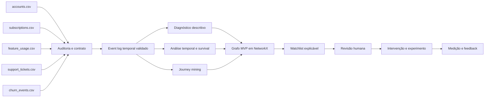

# Arquitetura planejada do JourneyGraph

> **Status: arquitetura planejada, ainda não implementada.**

## Objetivo do produto

JourneyGraph deverá transformar cinco fontes operacionais da RavenStack em evidências temporais rastreáveis para diagnosticar retenção, priorizar receita em risco e apoiar intervenções mensuráveis. O produto deverá preservar a distinção entre sinais associados, hipóteses explicativas e efeitos causalmente demonstrados.

## Arquitetura em camadas

1. **Fontes brutas:** cinco CSVs oficiais, imutáveis e não versionados.
2. **Auditoria e contrato:** perfil dos dados, chaves, tipos, granularidade, qualidade, privacidade e reconciliação.
3. **Integração temporal:** event log canônico com identidade, evento, tempo, origem e linhagem validados.
4. **Inteligência analítica:** diagnóstico descritivo, análise temporal, survival analysis e journey mining.
5. **Grafo operacional:** projeção NetworkX criada somente após a validação do modelo relacional e do event log.
6. **Decisão:** scoring ou regras validadas, priorização de receita em risco e watchlist explicável.
7. **Experiência:** interface para exploração e ação, com revisão humana e registro de intervenções.
8. **Experimentação e governança:** testes controlados, monitoramento, auditoria, segurança e feedback.

## Fluxo planejado das cinco fontes

Os nomes exibidos no diagrama são rótulos conceituais abreviados; os nomes oficiais esperados e o status de validação constam em `data-contract.md`.

## Event-log-first

O event log é um gate arquitetural. Antes do grafo, deverão ser confirmados identidade, granularidade, timestamps, timezone, duplicidade, ordem temporal, recorrência de churn, reativação e integridade entre fontes. O grafo não poderá corrigir ou ocultar inconsistências do modelo relacional.

## Modelo conceitual do grafo

O desenho preliminar considera entidades conceituais como conta, assinatura, evento de uso, interação de suporte e desfecho de retenção. Arestas poderão representar vínculos relacionais ou sucessões temporais. Tipos de nós, arestas, identificadores, propriedades, direção e janelas temporais permanecem **A CONFIRMAR NA FASE 1** e nas fases subsequentes de event log.

O MVP deverá usar NetworkX. Neo4j somente poderá ser avaliado depois de comprovados o modelo relacional, a necessidade operacional e o valor incremental do grafo.

## Separação analítica

- **Descritiva:** o que ocorreu e como se distribui entre segmentos, sem alegação causal.
- **Temporal:** quando eventos ocorreram, em que ordem e com quais associações antes dos desfechos.
- **Prescritiva:** quais intervenções merecem teste, sob restrições operacionais e econômicas.

Uma associação temporal não será apresentada como causa. Recomendações prescritivas deverão explicitar evidências, limitações, custo, responsável, guardrails e método de avaliação.

## Human-in-the-loop

A watchlist deverá explicar os sinais que sustentam cada prioridade. Pessoas responsáveis por Customer Success deverão confirmar contexto, escolher ou recusar intervenções e registrar justificativas. Decisões de alto impacto não serão executadas autonomamente sem controles definidos.

## Experimentação

Intervenções deverão ser tratadas como hipóteses testáveis. Quando aplicável, a solução deverá prever grupos comparáveis, métricas primárias e guardrails, janela de observação, critérios de parada e registro de exposição. Inferência causal dependerá de desenho experimental ou estratégia de identificação válida.

## Stack planejada

- Python 3.11+;
- pandas, NumPy, SciPy e PyArrow para processamento;
- statsmodels, scikit-learn e lifelines para métodos estatísticos futuros;
- NetworkX para o grafo MVP;
- Plotly e Streamlit para visualização e interface futuras;
- Pydantic para contratos de aplicação;
- pytest para validação automatizada.

Versões serão fixadas depois da validação do ambiente. APIs pagas não serão dependência do núcleo.

## Componentes opcionais

- armazenamento persistente para artefatos validados;
- orquestração agendada se o caso de uso operacional exigir;
- registro de experimentos e monitoramento;
- banco de grafos somente após evidência de necessidade;
- assistência por LLM somente em funções com grounding, avaliação e fallback, sem controlar os cálculos centrais.

Componentes opcionais exigirão justificativa de valor, custo, segurança e manutenção antes de adoção.

## Fora de escopo nesta fase

- ingestão ou download dos datasets;
- implementação de pipelines, análises, modelos ou grafos;
- dashboard, API, automação, cloud ou CI/CD;
- Neo4j, GNNs, embeddings e agentes autônomos;
- qualquer resultado analítico ou estimativa de impacto.

## Riscos arquiteturais

- chaves ou granularidades divergirem da documentação pública;
- joins muitos-para-muitos inflarem contagens ou receita;
- timestamps incompletos, inconsistentes ou sem timezone;
- leakage ao usar informação posterior ao desfecho;
- churn recorrente e reativação serem modelados incorretamente;
- sinais de contas com maior volume dominarem a análise;
- correlação ser comunicada como causalidade;
- texto de feedback conter dados pessoais ou sensíveis;
- complexidade de grafo ou infraestrutura não gerar valor incremental;
- decisões automatizadas reduzirem supervisão e auditabilidade.

## Decisões dependentes da auditoria

Permanecem pendentes até a inspeção dos cinco arquivos: schemas reais, chaves e cardinalidades; unidade temporal e timezone; janela de observação; definição operacional de conta ativa, churn e reativação; regras de receita em risco; tratamento de múltiplas assinaturas; estratégia de censura; política de texto livre; modelo do event log; projeção do grafo; e limites de escala do MVP.
