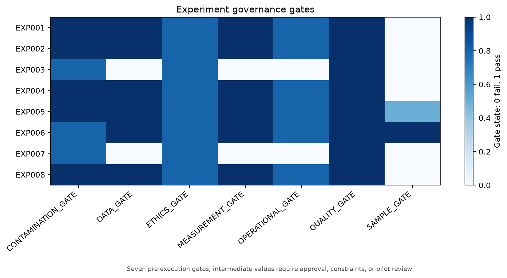

# Experiment Governance

## Approval and ethics

Every candidate requires approval, consent review, fairness review, reversibility, and data minimization. MRR may support stratification but cannot determine service denial.

## Contamination and operational boundaries

High contamination requires cluster, stepped-wedge, switchback, or quality-study controls. Missing operational keys fail the relevant gate.

## Guardrails and stopping

There are 24 guardrail specifications and 48 stopping-rule specifications. Monitoring and intervention delivery remain unimplemented.

## Prohibited operations

No contact, discount, plan change, cancellation, product modification, treatment assignment, or automated recommendation is authorized.
