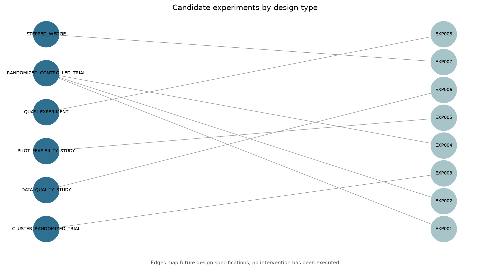
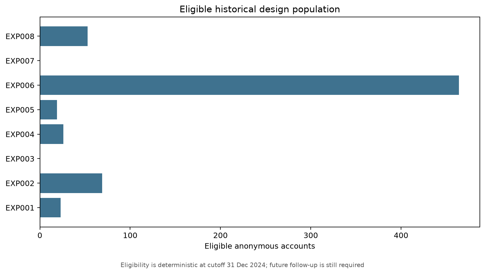
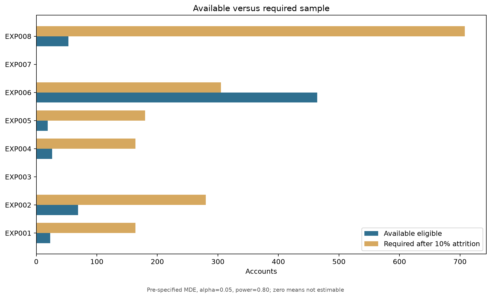
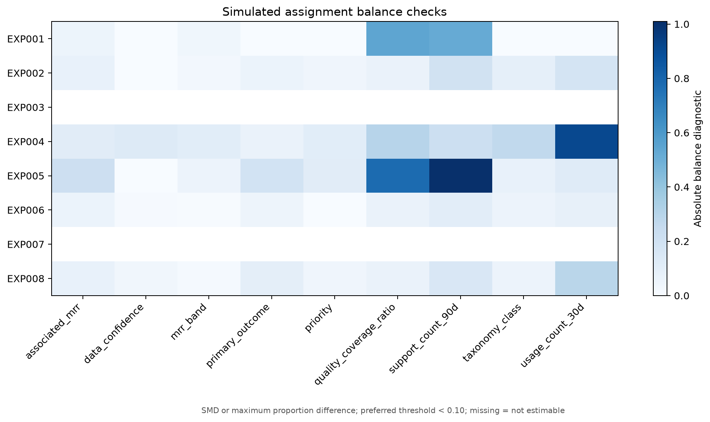
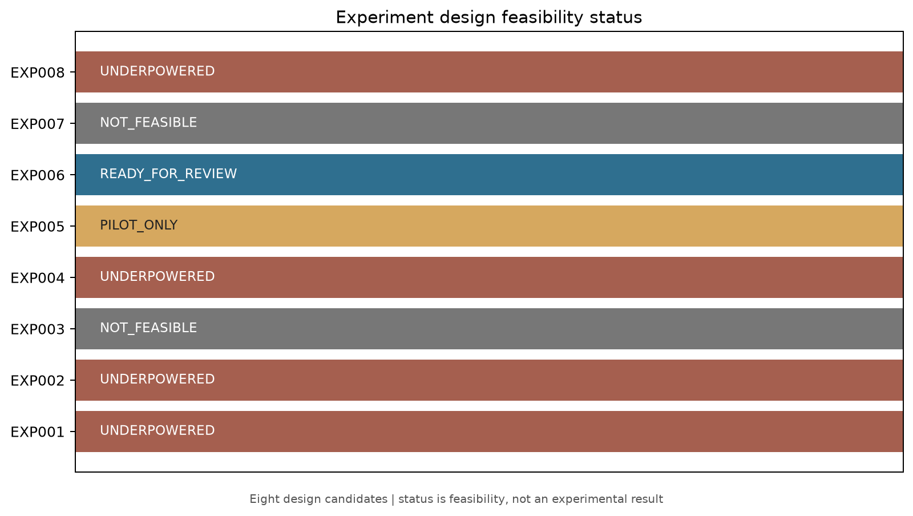

# Governed Experiment Lab

## 1. Technical summary

Eight future design candidates were specified at the 31 December 2024 cutoff: 1 ready for methodological review, 1 pilot-only, 4 underpowered, and 2 not feasible with current design inputs. No intervention, outcome, uplift, or causal result exists.

## 2. Objective

The lab converts governed watchlist evidence into reproducible experiment specifications, not execution instructions or conclusions.

## 3. Observation is not causality

Historical observations motivate hypotheses. Only a future approved design with valid assignment, exposure, follow-up, analysis, and guardrails could support a causal conclusion.

## 4. Source watchlists

Six behavioral queues and one data-quality queue supply anonymous candidate populations. Data-quality review never creates a commercial intervention.

## 5. Hypotheses remain untested

All eight hypotheses have `causal_status=UNTESTED`; nulls, alternatives, mechanisms, and limitations are pre-specified without expected effects.

## 6. Candidate interventions

Ten versioned catalog entries describe possible future capabilities, approvals, risks, and prohibited uses. None is implemented.

## 7. Designs reflect interference and measurement constraints

RCT is preferred when account isolation is plausible; support requires agent clusters, onboarding requires rollout cohorts, reactivation is a pilot, and data reconciliation is a quality study.

## 8. Eligibility is deterministic

Eligibility excludes low confidence, insufficient coverage, missing design units, and metric-specific blockers. Historical eligibility does not guarantee future enrollment.

## 9. One primary metric per experiment

Primary metrics are selected for the intervention mechanism and decision cadence; churn is long-term or observational where the population cannot support it as a sole near-term endpoint.

## 10. Baselines are descriptive only

Historical baseline values size the design. They are not randomized controls and cannot establish an effect.

## 11. Sample size precedes promotion

Required sample uses alpha 0.05, power 0.80, equal allocation, the pre-specified MDE, and 10% attrition. Underpowered designs retain their label.

## 12. Randomization is simulated only

Seeded blocked assignment validates mechanics with anonymous keys and `simulation_only=true`; it creates no operational treatment list.

## 13. Balance is diagnostic, not a result

Absolute SMD and proportion differences are compared with the preferred 0.10 threshold. Failures require design review, never manual account manipulation.

## 14. Statistical analysis is pre-specified

ITT is primary, per-protocol is secondary, estimands are explicit, missing data cannot be imputed favorably, and multiple testing uses one primary metric plus Holm-controlled confirmatory secondaries.

## 15. Guardrails can stop a future study

Guardrails cover completeness, delivery failure, consent, operational capacity, and adverse conditions; this phase implements no monitoring.

## 16. Ethics constrains every candidate

MRR cannot deny service or silently exclude beneficial treatment. Consent, equity, reversibility, minimization, and human approval are mandatory.

## 17. Feasibility is mixed by design

The portfolio deliberately preserves underpowered, pilot-only, and not-feasible candidates instead of weakening MDE or inventing operational identifiers.

## 18. Findings identify preparation work

Seven findings prioritize methodological review, additional recruitment, support-agent instrumentation, rollout cohorts, and controlled quality-study execution.

## 19. Limitations

The dataset is historical, follow-up is not future-observed, exposure logs do not exist, cluster/cohort keys are incomplete, and no result can be interpreted causally.

## 20. Preparation for application integration

The application may display designs, gates, sample gaps, and specifications. It must not provide launch controls, treatment lists, causal results, or outbound actions.
