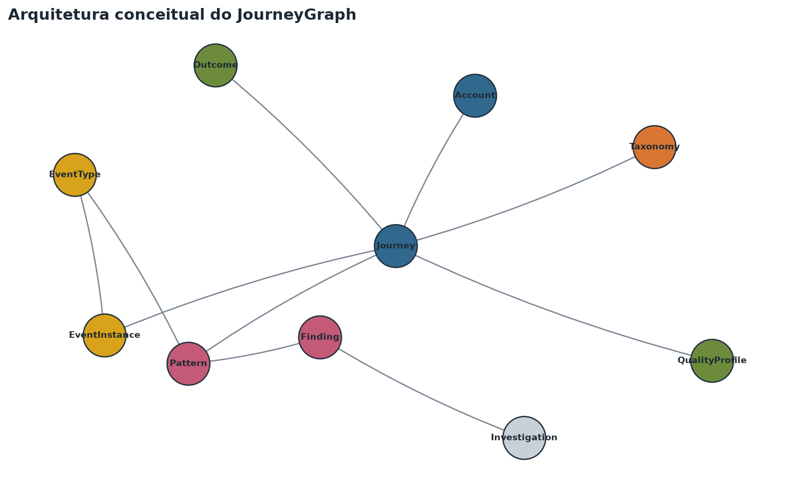
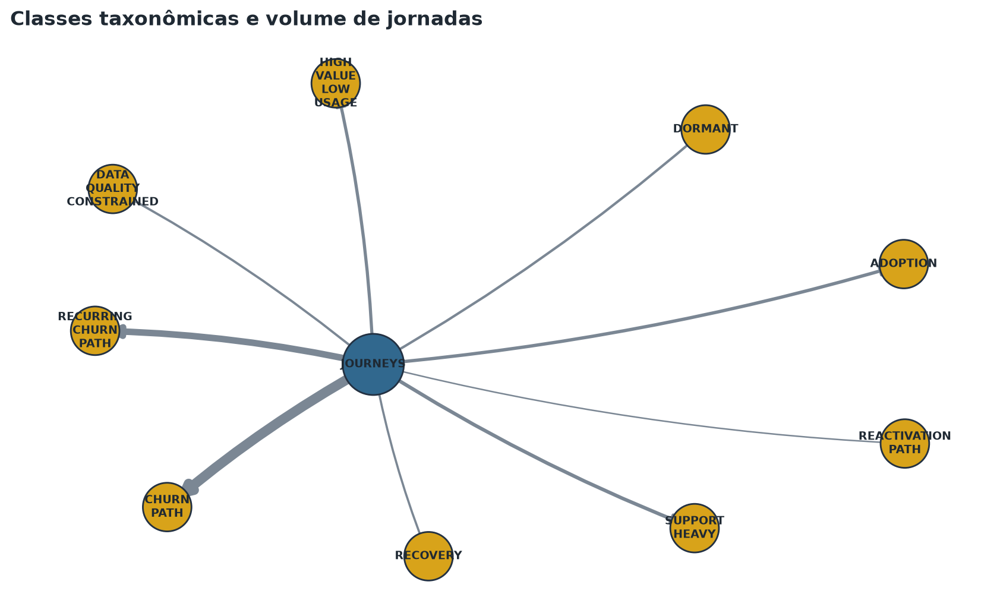
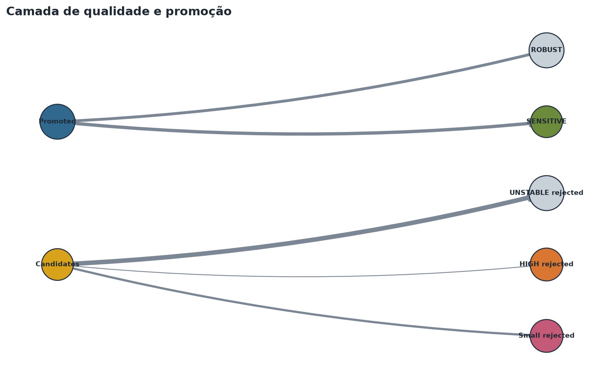
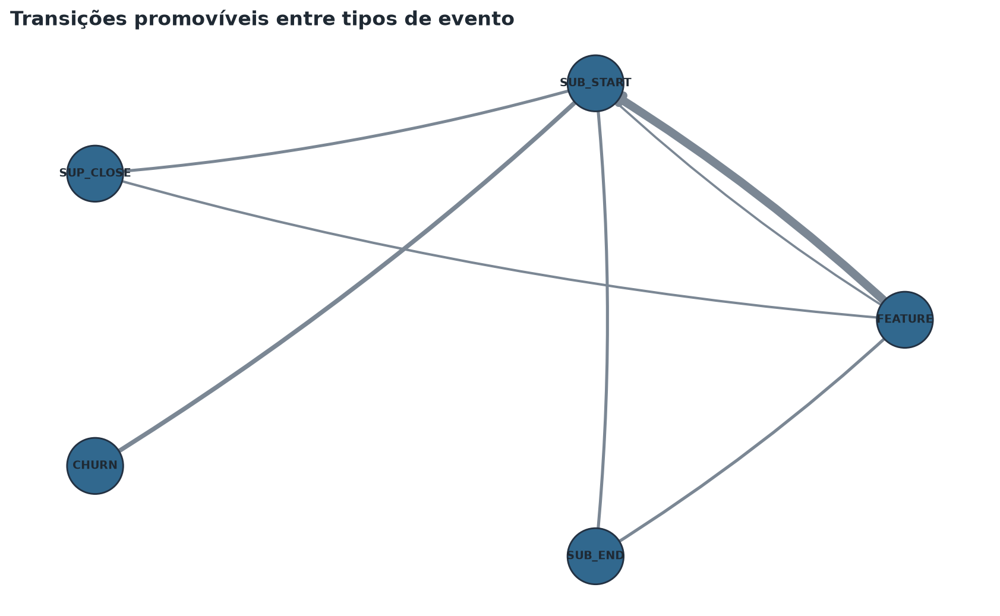
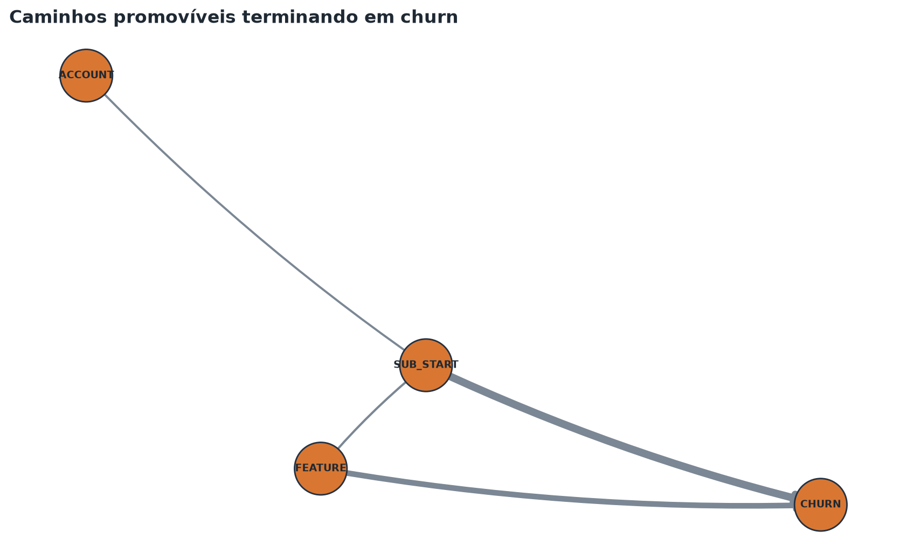
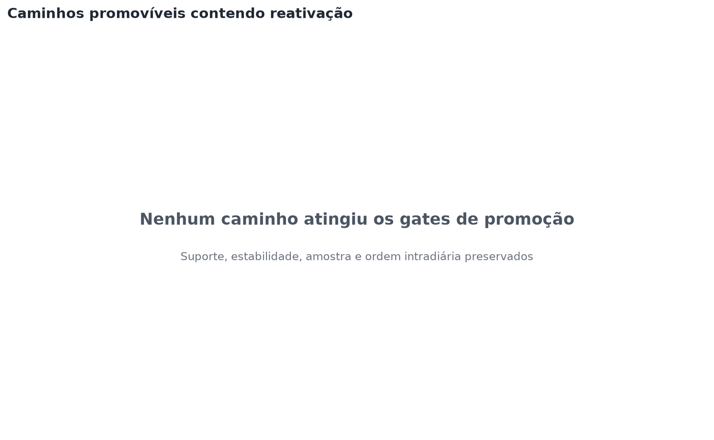

# JourneyGraph governado

## 1. Executive Summary

- **O grafo está reconciliado para uso analítico com ressalvas.** O instance graph conecta 500 contas anônimas, 4,221 jornadas e 43,398 ocorrências, enquanto o analytical graph promove somente evidências ROBUST/SENSITIVE.
- **A camada analítica preserva o gate da Fase 5.** Há 435 padrões promovidos e 43 transições; UNSTABLE, HIGH e grupos pequenos permanecem fora.
- **Neo4j é uma opção de portabilidade, não uma dependência.** Dois GraphML completos sustentam o gate local; CSVs e Cypher derivados permitem demonstração externa sem servidor obrigatório.
- **O uso continua não causal e não operacional.** Centralidade descreve estrutura; MRR é associado; investigações exigem revisão humana.

## 2. Motivação

O JourneyGraph organiza estrutura, temporalidade, evidência e governança em uma camada de conhecimento rastreável. Ele não converte associação em causalidade nem cria ranking individual.

## 3. Modelo conceitual

Dez tipos de nó separam conta, jornada, ocorrência, vocabulário, padrão, outcome, taxonomia, qualidade, finding e investigação humana.

## 4. Modelo lógico

Relações tipadas preservam direção temporal e contexto. `TRANSITIONS_TO` carrega escopo, outcome, suporte, denominador, estabilidade, qualidade e MRR associado.

## 5. Instance graph

O grafo de rastreabilidade possui 48,593 nós e 217,715 relações. EventInstance inclui `journey_key`, impedindo reutilização silenciosa da mesma ocorrência em escopos distintos.

## 6. Analytical graph

O grafo promovido possui 488 nós e 1,821 relações. Candidatos UNSTABLE podem ser contabilizados, mas não entram na projeção promovível.

## 7. Nós

Contagens por tipo no instance graph: {"Account": 500, "EventInstance": 43398, "EventType": 8, "Journey": 4221, "Outcome": 6, "Pattern": 435, "QualityProfile": 15, "Taxonomy": 10}. As chaves públicas são SHA-256 truncadas com namespace local documentado; nenhum mapeamento reversível é versionado.

## 8. Relações

Contagens por tipo no instance graph: {"ASSOCIATED_WITH_OUTCOME": 4221, "CLASSIFIED_AS": 4221, "HAS_EVENT": 43398, "HAS_JOURNEY": 4221, "HAS_QUALITY_PROFILE": 4221, "MATCHES_PATTERN": 74858, "NEXT_EVENT": 39177, "OF_TYPE": 43398}. Nenhuma relação usa semântica causal.

## 9. Temporalidade

`NEXT_EVENT` é único por posição, não retrocede no tempo e permanece dentro dos limites da jornada. A ordenação intradiária é técnica e explicitamente qualificada.

## 10. Padrões

Padrões textualmente iguais em escopos diferentes conservam nós distintos e compartilham apenas `pattern_family_key`. A promoção exige suporte, denominador, estabilidade e ordem não HIGH.

## 11. Outcomes

Seis outcomes controlados recebem associações descritivas. `OBSERVED_BEFORE` e `ASSOCIATED_WITH` não significam efeito ou determinação.

## 12. Taxonomia

As dez classes da Fase 5 são nós de conhecimento; classificações permanecem determinísticas e descritivas.

## 13. Qualidade

QualityProfile materializa população, estabilidade, dependência intradiária, amostra, warnings, cobertura e confiança. Relações rejeitadas continuam auditáveis nos artefatos de qualidade.

## 14. Métricas estruturais

Densidade, grau, componentes, PageRank e betweenness são propriedades estruturais. Nenhuma centralidade foi calculada para Account e nenhum ranking individual foi produzido.

## 15. Caminhos

Foram limitados a seis eventos e suporte mínimo explícito. O grafo separa caminhos de churn, recorrência e reativação sem linguagem causal.

## 16. Consultas

Dez consultas NetworkX possuem equivalentes Cypher, filtros, denominadores, interpretação e limitação. Elas cobrem suporte, sensibilidade, reativação, qualidade, centralidade, taxonomia e MRR associado.

## 17. MRR associado

MRR é agregado por contas que correspondem a padrões ou transições. Os termos perda, economia e receita evitável são proibidos.

## 18. Findings

- **Transição ROBUST com suporte elevado** — Uma transição promovível reúne suporte de 161 em 181 contas no escopo FULL_OBSERVED_JOURNEY.
- **Transição ROBUST com suporte elevado** — Uma transição promovível reúne suporte de 156 em 175 contas no escopo FULL_OBSERVED_JOURNEY.
- **Caminho promovível observado antes de churn** — O caminho agregado de maior suporte termina em CHURN e cobre 169/325 contas no contexto definido.
- **Centralidade estrutural estável entre pesos** — SUBSCRIPTION_START ocupa a primeira posição de PageRank com peso por suporte e o top-3 preserva sobreposição material entre pesos.
- **Caminho com maior MRR associado** — O caminho agregado lidera MRR associado entre candidatos com pelo menos 10 contas (500 contas).

## 19. Limitações

Warnings reduzem estabilidade; a população estrita é limitada para reativação; ordem no mesmo dia não é causal; o CSV de EventInstance é uma amostra determinística; Neo4j não foi executado externamente.

## 20. Preparação para a Fase 7

Somente PROMOTABLE_GRAPH e subgrafos governados podem alimentar uma watchlist futura. Score, previsão, recomendação automática, contato e intervenção permanecem proibidos.
