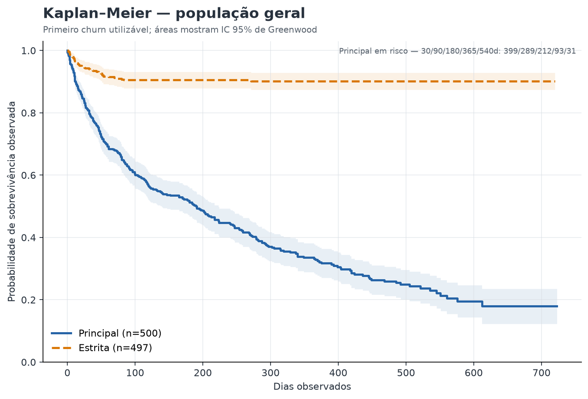
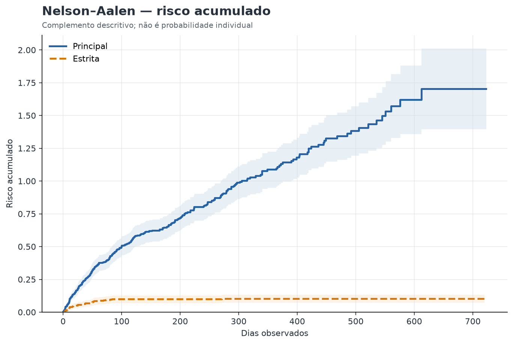
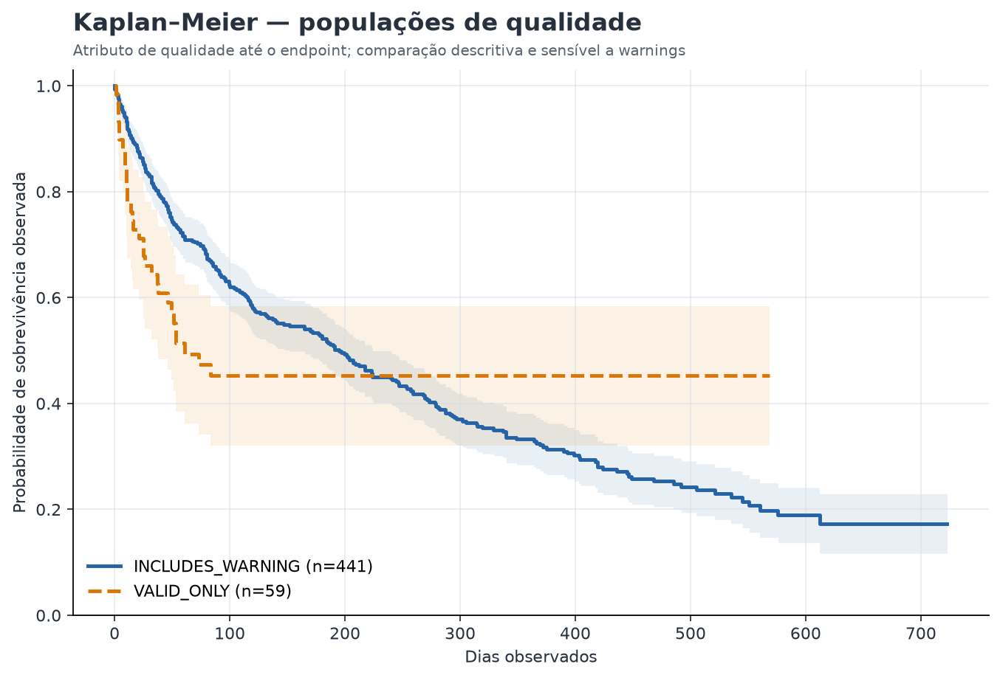
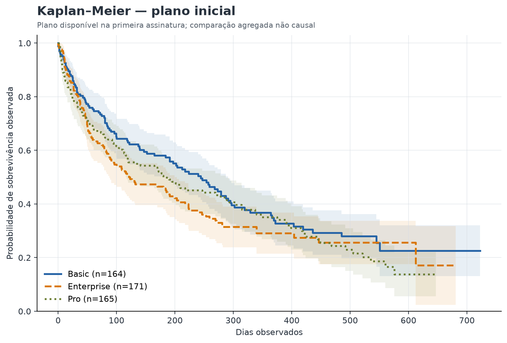
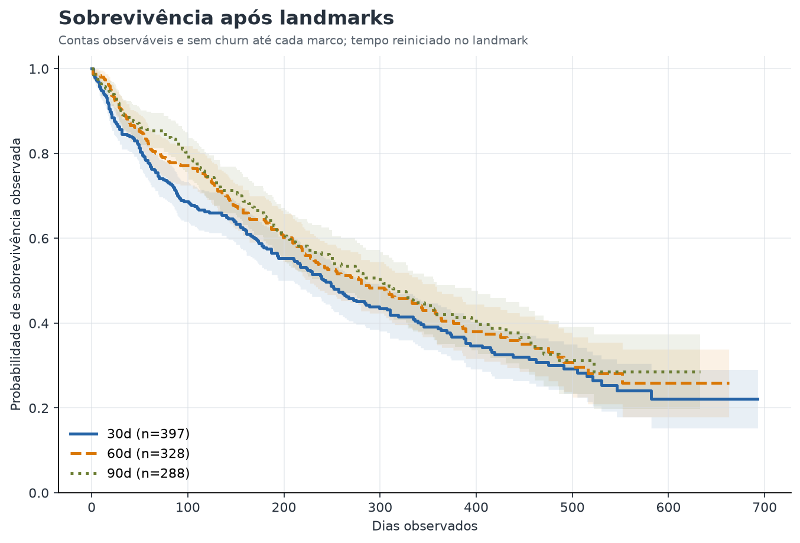
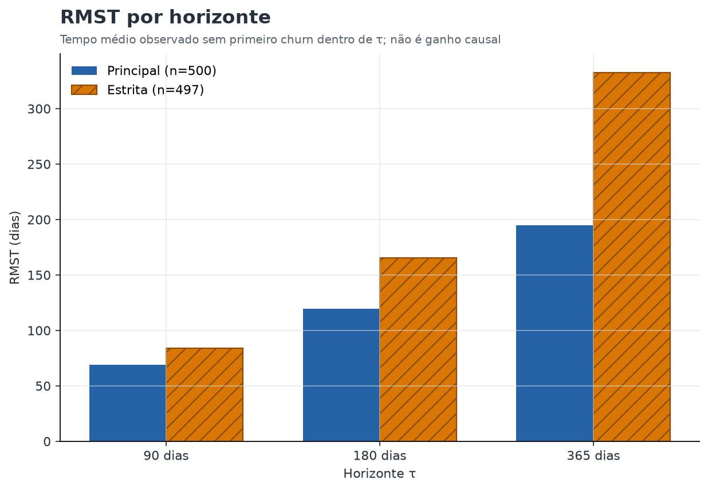

# Análise de sobrevivência e risco temporal — RavenStack

> **Gate:** `PASS_WITH_WARNINGS`. Análise descritiva agregada; não é previsão individual, inferência causal ou taxa empresarial generalizável.

## 1. Objetivo

Estimar o tempo observado sem primeiro churn utilizável, explicitar censura administrativa e comparar curvas somente onde há suporte temporal e amostral.

## 2. População

A população principal usa `VALID + VALID_WITH_WARNING`; a estrita usa somente `VALID`; ambas excluem quarentena. Foram elegíveis 500 de 500 contas na origem principal; 0 foram excluídas com motivo controlado.

## 3. Origem temporal

Origem principal: primeira `SUBSCRIPTION_STARTED` utilizável. `ACCOUNT_CREATED` é usada apenas na sensibilidade. Features comportamentais são reservadas a landmarks de janela fixa.

## 4. Endpoint

`FIRST_VALID_CHURN`: primeiro `CHURN_RECORDED` utilizável em ou após a exposição. Churn recorrente não substitui o primeiro endpoint; churn pré-exposição é ignorado e contabilizado.

## 5. Censura

Censura à direita em `2024-12-31T19:00:00`. Na principal há 175 censurados (35.00%) e 325 eventos. Censura administrativa não prova retenção e a hipótese de censura não informativa permanece limitada.

## 6. Kaplan–Meier

| Horizonte | Estimativa | IC 95% | Em risco | Eventos | Censurados | Suporte |
|---:|---:|---:|---:|---:|---:|---|
| 30d | 0.8088 | [0.7742; 0.8434] | 399 | 95 | 8 | `SUPPORTED` |
| 60d | 0.6928 | [0.6520; 0.7337] | 328 | 151 | 21 | `SUPPORTED` |
| 90d | 0.6261 | [0.5830; 0.6693] | 289 | 182 | 30 | `SUPPORTED` |
| 180d | 0.5129 | [0.4675; 0.5583] | 212 | 232 | 58 | `SUPPORTED` |
| 365d | 0.3318 | [0.2853; 0.3783] | 93 | 297 | 110 | `SUPPORTED` |
| 540d | 0.2293 | [0.1808; 0.2778] | 31 | 320 | 149 | `SUPPORTED` |

Mediana principal: `191.0` dias. População estrita: n=497, eventos=46, censura=90.74%, mediana=`NOT_REACHED`. Horizontes com menos de 20 contas recebem `LOW_AT_RISK`; não há extrapolação além do suporte observado.

## 7. Nelson–Aalen

| Horizonte | Estimativa | IC 95% | Em risco | Eventos | Censurados | Suporte |
|---:|---:|---:|---:|---:|---:|---|
| 30d | 0.2113 | [0.1687; 0.2539] | 399 | 95 | 8 | `SUPPORTED` |
| 60d | 0.3655 | [0.3068; 0.4242] | 328 | 151 | 21 | `SUPPORTED` |
| 90d | 0.4663 | [0.3977; 0.5349] | 289 | 182 | 30 | `SUPPORTED` |
| 180d | 0.6652 | [0.5770; 0.7534] | 212 | 232 | 58 | `SUPPORTED` |
| 365d | 1.0985 | [0.9590; 1.2379] | 93 | 297 | 110 | `SUPPORTED` |
| 540d | 1.4644 | [1.2544; 1.6744] | 31 | 320 | 149 | `SUPPORTED` |

O risco acumulado é complemento descritivo da Kaplan–Meier e não representa probabilidade futura individual.

## 8. Comparações

Foram executadas 10 comparações elegíveis, com Benjamini–Hochberg; 0 permaneceram abaixo de 0,05 após correção. Tamanho, eventos, diferenças em 90/180/365 dias e RMST acompanham cada teste. P-value isolado não sustenta decisão.

## 9. Landmarks

- **30 dias:** 397 contas; 95 churns anteriores/no landmark excluídos; 230 eventos posteriores.
- **60 dias:** 328 contas; 151 churns anteriores/no landmark excluídos; 174 eventos posteriores.
- **90 dias:** 288 contas; 182 churns anteriores/no landmark excluídos; 143 eventos posteriores.

Features foram calculadas somente entre exposição e landmark; contas com churn antes ou no marco foram excluídas. As curvas começam depois do marco e não reutilizam futuro.

## 10. RMST

RMST foi estimado em 90, 180 e 365 dias quando suportado. Diferenças significam tempo médio **observado** sem primeiro churn dentro do horizonte, nunca ganho causal.

## 11. Cox

`NOT_EXECUTED`. Warning-sensitive endpoints and untested proportional hazards prevent a stable, leakage-controlled descriptive model in this phase. Nenhum coeficiente, hazard ratio ou score individual foi produzido.

## 12. Sensibilidade

- `A_MAIN`: n=500, eventos=325, censura=35.00%, mediana=191.0.
- `B_STRICT`: n=497, eventos=46, censura=90.74%, mediana=NOT_REACHED.
- `C_SIGNUP_ORIGIN`: n=500, eventos=325, censura=35.00%, mediana=215.0.
- `D_SUBSCRIPTION_ORIGIN`: n=500, eventos=325, censura=35.00%, mediana=191.0.
- `E_NO_BASELINE_OVERLAP`: n=486, eventos=314, censura=35.39%, mediana=197.0.
- `F_QUALITY_GE_050`: n=126, eventos=89, censura=29.37%, mediana=305.0.

Há 8 comparações métricas classificadas como `UNSTABLE`; elas não foram promovidas a findings.

## 13. Pressupostos

- `ACCOUNT_LEVEL_APPROXIMATE_INDEPENDENCE` — **ACCEPTABLE**: A unidade principal contém uma linha por conta; episódios correlacionados não são tratados como unidades independentes.
- `NON_INFORMATIVE_CENSORING` — **LIMITED**: A censura é administrativa e explícita, mas o mecanismo de saída da observação não pode ser testado com as fontes disponíveis.
- `PROPORTIONAL_HAZARDS` — **NOT_TESTED**: Cox não foi executado; nenhuma suposição de proporcionalidade foi promovida.
- `SAMPLE_SIZE` — **ACCEPTABLE**: População principal n=500 e 325 primeiros churns observados.
- `TAIL_SUPPORT` — **ACCEPTABLE**: Em 540 dias permanecem 31 contas em risco; mínimo configurado=20.
- `COLLINEARITY` — **NOT_TESTED**: Nenhum modelo multivariado foi ajustado.
- `SMALL_GROUPS` — **LIMITED**: Comparações exigem n≥20 e ao menos 5 eventos por grupo; demais grupos são registrados e omitidos dos testes.
- `MISSINGNESS` — **LIMITED**: Satisfação e resolução de suporte são esparsas; ausências permanecem nulas e não são imputadas.
- `SUBSCRIPTION_OVERLAP` — **VIOLATED**: 99,84% dos episódios se sobrepõem; curvas por assinatura não foram executadas.
- `WARNING_INFLUENCE` — **VIOLATED**: Sobrevivência em 180 dias entre principal e estrita foi classificada como UNSTABLE.

## 14. Findings

- **SF002 — Curvas por assinatura não são defensáveis.** A sobreposição observada em 99,84% dos episódios e a dependência intracliente impedem uma estimativa independente limpa por assinatura. Sensibilidade `ROBUST`; pressupostos `VIOLATED`; confiança `HIGH`. Limitação: Término de assinatura não equivale necessariamente a churn e contas repetem episódios.
- **SF003 — Landmark de 30 dias preserva temporalidade.** Após excluir churns até o marco e contas sem observação suficiente, 397 contas sustentam a análise condicional de 30 dias. Sensibilidade `ROBUST`; pressupostos `LIMITED`; confiança `MEDIUM`. Limitação: A população é condicional à sobrevivência e observabilidade até 30 dias.

## 15. Limitações

- warnings alteram materialmente a cobertura de churn;
- timestamps diários não autorizam precedência intradiária ou causalidade;
- censura administrativa pode ser informativa e não foi resolvida;
- sobreposição em 99,84% dos episódios impede uma curva independente limpa por assinatura;
- comparações são exploratórias e não devem orientar intervenção automatizada.

## 16. Próximos passos

Preservar populações, censura, at-risk, landmarks e sensibilidade em eventual mineração de jornadas. Antes de qualquer uso operacional, validar cronologia upstream, semântica de assinaturas simultâneas e mecanismo de censura.
