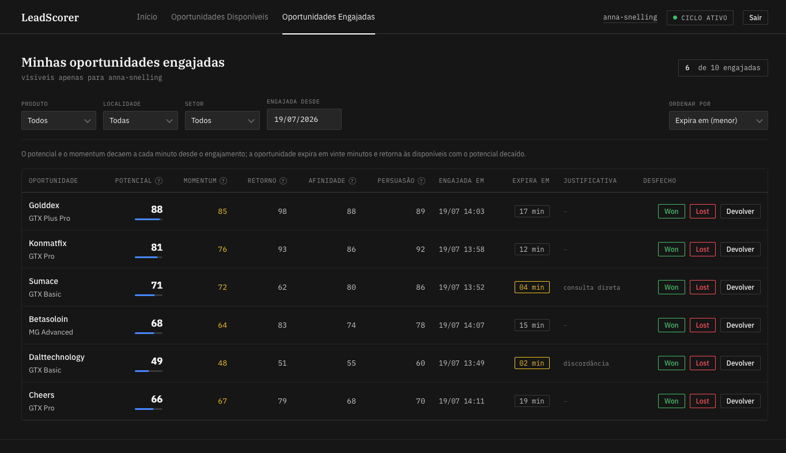
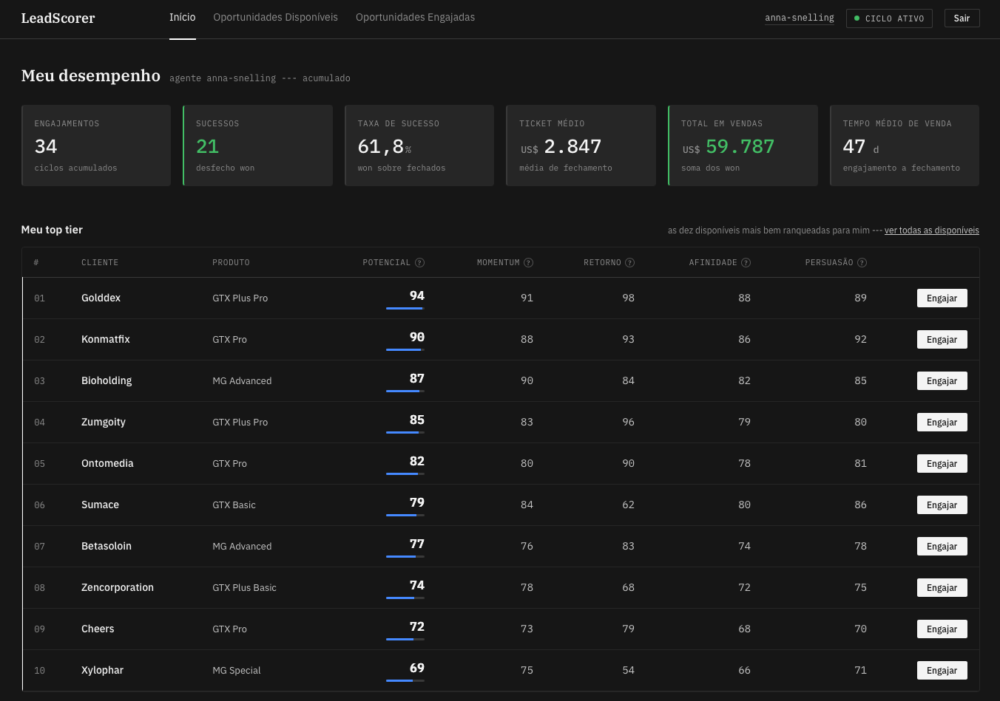

# LeadScorer

LeadScorer é um MVP que classifica e prioriza oportunidades de venda por meio de um indicador
composto de potencial, personalizado por agente comercial, e as apresenta em uma aplicação web
que gerencia o ciclo de engajamento de cada oportunidade. O objetivo é apoiar a decisão do
agente sobre onde investir o próximo esforço de venda, com uma leitura autoexplicativa do
porquê de cada oportunidade estar no topo.


# Execução em um passo

- Pré-requisitos: Docker ou Podman com o respectivo plugin de compose. O dataset acompanha o
  repositório (fonte normalizada versionada, ADR V9K3), de modo que nenhuma credencial externa é
  necessária.

- A partir do clone, na raiz do projeto, execute:

```bash
./scripts/quickstart
```

- O script prepara o ambiente na primeira execução (gera a senha do banco e escolhe uma porta de
  host livre, sem intervenção do usuário), provisiona o banco (migração e seed idempotentes) e
  sobe as duas aplicações web. A imagem é compilada apenas na primeira execução e reutilizada
  nas seguintes; para recompilar após alterar o código, use './scripts/quickstart --build'.
  Encerre com Ctrl-C. As aplicações ficam disponíveis em:

  - Aplicação do agente: http://127.0.0.1:8081/login
  - Aplicação do gerente: http://127.0.0.1:8082/login

- O login é sem senha nesta versão de demonstração: a tela apresenta a lista de usuários
  semeados; basta selecionar um agente (aplicação do agente) ou um gerente (aplicação do
  gerente).

- O script detecta e usa 'podman compose' quando o Docker não está presente; o 'compose.yaml' é
  único e compatível com ambos os runtimes (ADR D4M3). A alternativa manual equivalente é
  'cp .env.example .env' (definindo PGPASSWORD) seguido de 'docker compose up'.


# O que o LeadScorer faz

O sistema pontua a tripla produto-empresa-agente e expõe duas listas de decisão:

- Potenciais: pares conta-produto conhecidos e ainda não engajados, visíveis a todos os agentes,
  ordenados pelo indicador de potencial personalizado por agente, com um filtro de corte na
  interface;
- Iniciadas: as oportunidades que o agente engajou, ordenadas pelo decaimento do potencial
  restante, até expirarem por idade ou serem marcadas como Won ou Lost.

O ranqueamento é personalizado por agente pela dimensão de especialização do agente, de modo que
a mesma oportunidade sobe para quem tem capacidade de venda demonstrada naquele produto e desce
para quem não a tem. Não há, portanto, um modelo separado de distribuição de leads: a capacidade
do agente está incorporada ao próprio indicador (ver ADR B7Q3).

São servidas duas aplicações: a do agente, para trabalhar as suas listas e conduzir o ciclo de
engajamento; e a do gerente, para acompanhar o desempenho. O ciclo de engajamento cobre o mínimo
necessário ao ranqueamento: iniciar uma oportunidade, devolvê-la sem desfecho ou fechá-la como
Won ou Lost.


# Visualização

A classificação é apresentada de forma autoexplicativa: cada oportunidade traz o seu indicador
de potencial e a decomposição das dimensões em uma visualização em teia, para que o agente leia
o porquê da posição e refine a sua escolha.






# Como o modelo funciona

O indicador é um substituto transparente do valor esperado (probabilidade de ganho vezes o valor
da transação). Como a análise exploratória mostrou que a probabilidade de ganho não é aprendível
a partir dos atributos observáveis, ela é deliberadamente substituída pelo momentum (timing) e
pela especialização do agente (capacidade demonstrada). O composto prioriza por valor, timing e
capacidade, omitindo conscientemente a propensão.

As dimensões correspondem ao modelo Recency-Frequency-Monetary (RFM), canônico na mensuração de
valor de cliente, estendido pelo eixo do agente. Quatro dimensões estão ativas neste MVP e são
exibidas na visualização em teia, cada uma normalizada de 0 a 100:

1. Retorno: a magnitude econômica do negócio, ancorada no ticket médio do par cliente-produto
   (ADR R4T9);
2. Afinidade ou consumo: o volume histórico do par empresa-produto;
3. Momentum: o eixo de peso alto, aplicado multiplicativamente, com duas faces conforme a lista
   (maturidade de recompra nas potenciais, decaimento pós-engajamento nas iniciadas);
4. Especialização do agente: a capacidade de venda demonstrada do agente no produto, uma
   dimensão suave e jamais um portão.

As dimensões de diligência e de atividade do cliente são carregadas por completude metodológica,
com peso nulo nesta base, e são ativáveis em produção.

A agregação combina um portão de elegibilidade não compensatório com uma média geométrica
ponderada das quatro dimensões, que penaliza o desequilíbrio: um momentum baixo arrasta o índice
independentemente das demais dimensões. Os pesos são arbitrados e documentados, e residem na
configuração da implementação; a escolha de arbitrar em vez de aprender os pesos é deliberada,
pois a EDA mostra a conversão praticamente plana, sem alvo discriminativo do qual aprendê-los.

A formalização completa, com as cautelas de literatura e a validação de robustez, está na base
de conhecimento.


# Arquitetura e stack

- ANSI Common Lisp em SBCL como linguagem de desenvolvimento, com sistema definido em ASDF e
  dependências fixadas por qlot;
- PostgreSQL como camada de persistência, com migração e seed idempotentes;
- Interface web em HTML com HTMX, sobre o sistema de design próprio (IBM Carbon / IBM Plex);
- Empacotamento em container único, compatível com Docker e Podman compose (ADR D4M3);
- Segurança desde a concepção: segregação entre dados expostos e sensíveis, segredos fora da
  base de código, mecanismos deny-by-default e fail-closed.


# Base de conhecimento

- A análise exploratória dos dados brutos, com os achados e as suas implicações para a modelagem
  de scoring, está em 'docs/analise-exploratoria.md'; as consultas reprodutíveis que a produzem
  residem em 'scripts/eda.sql';
- A metodologia do modelo de scoring, com a formalização do indicador composto e as cautelas de
  literatura, está em 'docs/metodologia-scoring.md';
- A validação de robustez do scoring está em 'docs/validacao-scoring.md';
- A revisão crítica da mecânica de cálculo das dimensões do scoring está em
  'docs/revisao-dimensoes-scoring.md';
- O procedimento de aquisição e verificação do dataset está em 'docs/dataset.md';
- A concepção da aplicação web, com o ciclo de engajamento, as estórias de usuário, o painel de
  indicadores e o modelo relacional, está em 'docs/concepcao-inicial.md';
- A revisão de qualidade e aderência das fases 1 a 6 da interface web está em
  'docs/revisao-8w2n-fases-1-6.md';
- A camada de persistência em PostgreSQL, com o provisionamento, o schema, o seed e a
  verificação, está em 'docs/persistencia.md';
- A retrospectiva do projeto, com a síntese do modelo, das escolhas de stack e método e do
  esforço, está em 'docs/retrospectiva.md'.


# Estrutura do repositório

- 'src/': código-fonte Common Lisp da aplicação, incluindo a camada web;
- 'config/': configuração do modelo (pesos, limiares e curvas) em forma Lisp;
- 'db/': migrações do banco;
- 'data/': dataset CRM (fonte normalizada versionada e features derivadas; brutos ignorados);
- 'scripts/': provisão, execução e consultas de EDA e modelagem;
- 'tests/': testes Parachute (Lisp) e bats-core (Bash);
- 'docs/': base de conhecimento e documentação de apoio;
- '.claude/': artefatos do fluxo de trabalho assistido por LLM (backlog, worklog, sessions,
  decisions, rules).


# Escopo e limitações

- Este é um projeto MVP. A complexidade limita-se ao essencial para demonstrar, de forma
  funcional e verificável, o ranqueamento e a priorização de oportunidades personalizados por
  agente;
- O projeto cobre o ranqueamento e a priorização de leads, e apenas o mínimo do ciclo de vida de
  vendas necessário ao ciclo de classificação. Histórico de interações, gestão de funis,
  ligações, mensagens e demais partes de um CRM estão fora do escopo;
- A distribuição de leads como alocação explícita a agentes (casamento um-a-um, equilíbrio de
  carga) está fora do escopo; a capacidade do agente é incorporada ao indicador (ADR B7Q3);
- O dataset é insuficiente em largura e profundidade e traz marcas de dado sintético, o que
  desencoraja a modelagem preditiva e sustenta o enquadramento de demonstração do método. O
  propósito é demonstrar o método e apoiar a decisão do agente, não a acurácia preditiva sobre
  esta base;
- O modelo é estático por escolha de MVP; em produção, um laço de realimentação capturaria os
  desfechos realizados para recalibrar pesos e curvas.


# Contexto

Este projeto foi desenvolvido como submissão ao AI Master Challenge (Challenge 003 - Lead
Scorer). As orientações do desafio e o dataset de modelagem estão em:

- Orientações gerais:
  https://github.com/Gestao-Quatro-Ponto-Zero/ai-master-challenge/tree/main
- Orientações específicas:
  https://github.com/Gestao-Quatro-Ponto-Zero/ai-master-challenge/tree/main/challenges/build-003-lead-scorer
- Dataset:
  https://www.kaggle.com/datasets/agungpambudi/crm-sales-predictive-analytics
