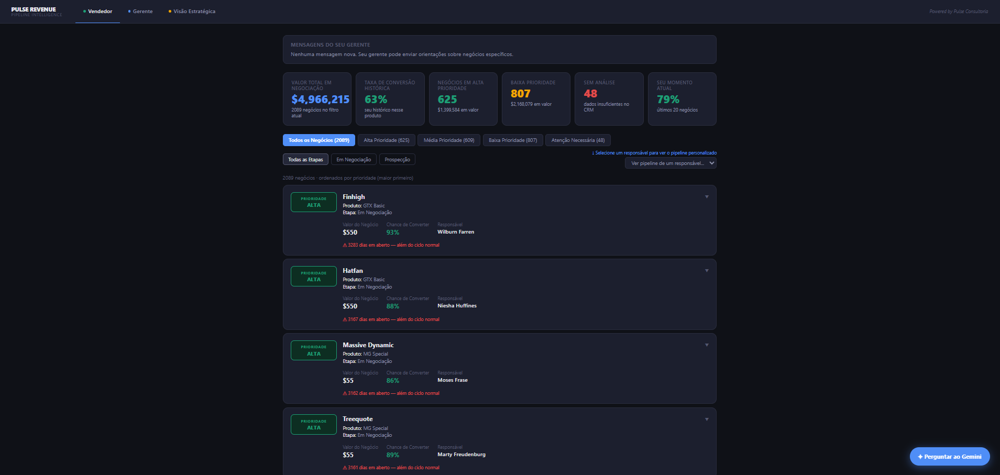
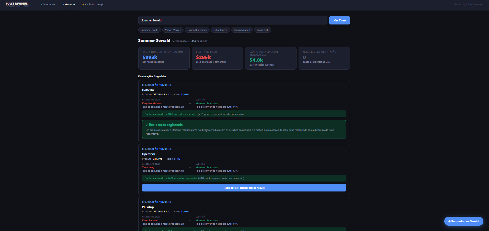

# Submissão — Felipe Belisário — Challenge 003: Lead Scorer

<div align="center">

**Felipe de Oliveira Belisário**
[linkedin.com/in/felipe-belisário](https://www.linkedin.com/in/felipe-bel%C3%Ads%C3%A1rio-36138364/) · Challenge 003 — Lead Scorer · Vendas / RevOps

</div>

---

## Sobre mim

| | |
|---|---|
| **Nome** | Felipe de Oliveira Belisário |
| **LinkedIn** | [linkedin.com/in/felipe-belisário](https://www.linkedin.com/in/felipe-bel%C3%Ads%C3%A1rio-36138364/) |
| **Challenge** | 003 — Lead Scorer · Vendas / RevOps |
| **Stack** | Python · FastAPI · React · Regressão Logística · Gemini API |

---

## Executive Summary

> **$6,2 milhões.** É o que encontrei mal gerenciado no pipeline antes de escrever uma linha de código.

Antes de modelar qualquer coisa, mapeei três camadas de perda financeira com os próprios dados do CRM: **$2,45M** em pipeline envelhecendo além do ciclo histórico, **$390K** em gap de performance entre vendedores, e **$3,33M** gerenciado sem contexto de conta. Só depois de provar onde o dinheiro estava sendo desperdiçado é que construí o modelo.

A descoberta central não era óbvia: produto, manager e região são **estatisticamente irrelevantes** para prever conversão nesse dataset. O que realmente importa é o **Combo Agente × Produto** — a taxa de conversão histórica de cada vendedor em cada produto específico. Gap de 19,4pp entre o melhor e pior quartil, com 97,4% de cobertura no pipeline ativo.

O entregável é o **Pulse Revenue Intelligence** — sistema completo com backend FastAPI, frontend React com dark mode, modelo de Regressão Logística calibrada por percentil, copilot com Gemini em tempo real, e três interfaces distintas para Vendedor, Gerente e Head de RevOps.

**Potencial documentado de $800K a $1,2M em receita incremental no primeiro ano** — detalhado na seção de Resultados.

---

## Solução

### Abordagem — O Método Pulse de 5 Etapas

Apliquei meu próprio framework de consultoria de IA, desenvolvido para garantir que toda implementação seja ancorada em retorno financeiro mensurável *antes* de qualquer decisão técnica.

```
┌─────────────────────────────────────────────────────────────────┐
│  ETAPA 1 — Mapeamento      "Onde está o dinheiro sendo perdido?"│
│  ETAPA 2 — Diagnóstico     "Temos dados suficientes?"           │
│  ETAPA 3 — ROI             "Qual número vamos provar?"          │
│  ETAPA 4 — Build           "Entregar rápido, depois expandir"   │
│  ETAPA 5 — Produtização    "O que fizemos 3x vira template"     │
└─────────────────────────────────────────────────────────────────┘
```

---

### Etapa 1 — Mapeamento: onde está o dinheiro?

A maioria parte direto para o modelo. Eu parti dos dados para entender o problema financeiro real. Analisei **6.711 deals históricos** (Won + Lost) e identifiquei três dimensões de perda sobrepostas.

---

#### A — Pipeline envelhecendo silenciosamente

Calculei os percentis de tempo de fechamento sobre os 4.238 deals Won. A variação entre produtos é máxima de 6 dias no P90 — irrelevante. Usei benchmark único para todo o pipeline.

| Marco | Dias | O que significa |
|---|---|---|
| P50 | 57d | Metade dos deals Won fecham até aqui |
| P75 | 88d | 75% dos deals Won já fecharam |
| P90 | 106d | Apenas 10% fecham depois daqui |
| **Máximo histórico** | **138d** | **Nenhum deal Won passou disso** |

Aplicando esses limiares ao pipeline ativo com fatores de desconto calibrados no histórico:

| Zona | Deals | Valor bruto | Fator | Valor real esperado |
|---|---|---|---|---|
| 🔴 Quente — dentro do ciclo (<57d) | 52 | $62.929 | 1,00 | $62.929 |
| 🟡 Morno — passando da mediana (57–88d) | 105 | $198.089 | 0,70 | $138.662 |
| 🟠 Em Risco — além do P75 (88–106d) | 783 | $1.172.203 | 0,40 | $468.881 |
| ⚫ Frio — além do P90 (>106d) | 649 | $1.239.295 | 0,15 | $185.894 |
| 🔵 Prospecting — sem engajamento | 500 | $708.374 | 0,10 | $70.837 |
| **Total** | **2.089** | **$3,38M** | | **$927K** |

**De $3,38M em pipeline aberto, apenas $927K tem probabilidade realista de virar receita. Os outros $2,45M estão sendo consumidos pelo tempo.**

> 💡 **Decisão metodológica:** a IA sugeriu P25 (9 dias) como limiar de urgência. Corrigi para P50. Temperatura precisa medir *desvio do ciclo esperado* — um deal de 30 dias não é urgente, está dentro do ciclo normal.

---

#### B — Gap de performance que ninguém está resolvendo

Win rate dos 35 vendedores varia de **55,0% a 70,4%** — gap de 15,4pp. Antes de concluir ineficiência, verifiquei se o mix de produtos explicava a diferença. Como a variação entre produtos é de apenas 4,8pp (dentro do intervalo de confiança estatístico), o mix explica no máximo 2–3pp do gap de 15pp. **A ineficiência é de performance, não de carteira.**

Projeção conservadora elevando os 10 piores ao nível mediano do T1 do próprio manager:

```
$390.637 de receita adicional por ano
Sem contratar ninguém. Sem mudar produto. Sem mexer em pricing.
```

---

#### C — $3,33M gerenciado às cegas

No histórico de 6.711 deals fechados: **zero deals sem conta vinculada.**
No pipeline ativo: **1.425 de 2.089 deals sem account — 68,2%.**

O problema não existia antes. É recente, crescente e sistêmico — taxa uniforme por manager (66–70%), por produto (53–70%) e por período. Não existe culpado individual. Existe um processo que não exige vinculação de conta ao criar um deal.

**Impacto crítico no modelo:** o Combo Agente × Setor tem gap de **61,7pp** — a variável mais poderosa do dataset inteiro. Está inacessível para 68% do pipeline por causa desse problema de cadastro.

---

#### Resumo da Etapa 1

```
┌──────────────────┬──────────────────┬──────────────────┐
│    $2,45M        │     $390K        │     $3,33M       │
│                  │                  │                  │
│  Pipeline        │  Gap de          │  Pipeline sem    │
│  envelhecido     │  performance     │  contexto de     │
│  além do ciclo   │  T3 → T1 do      │  conta           │
│  histórico       │  próprio manager │  vinculada       │
└──────────────────┴──────────────────┴──────────────────┘
                    TOTAL: $6,17M
```

---

### Etapa 2 — Diagnóstico de Dados: temos o suficiente?

Auditei cada feature candidata em três dimensões: cobertura no pipeline ativo, qualidade estatística do histórico, e poder preditivo real.

**Decisão crítica — CRM Health Score:**
O score calculado inicialmente era **61,3%** — errado. Penalizava comportamentos estruturalmente corretos (Prospecting sem engage_date é esperado, não problema). Separando problemas reais de comportamentos esperados: **83,8%.** O único problema real de peso é o account nulo.

**Intervalos de Confiança de Wilson 95%** calculados para todos os 35 vendedores (IC médio ±6,6pp). Para agentes com n < 100, usei o limite inferior como estimativa conservadora — evita inflar scores onde o WR alto pode ser ruído estatístico.

**Matriz de suficiência por feature:**

| Feature | Cobertura | Gap WR | Decisão |
|---|---|---|---|
| Combo Agente × Produto | 97,4% | 19,4pp | ✅ **Feature principal** |
| Momento do agente (rolling 20 deals) | 100% | 8,5pp | ✅ **Feature secundária** |
| Combo Agente × Setor | 31,8% | 61,7pp | ⚡ Terciária — quando disponível |
| Produto isolado | 100% | 4,8pp | ❌ Descartado — ruído estatístico |
| Manager / Região | 100% | <2,5pp | ❌ Descartado — ruído estatístico |

---

### Etapa 3 — Definição de ROI: o que vamos provar?

Antes de implementar, fechei um contrato de resultado verificável. Métrica escolhida: **comparação interna** — WR dos deals com score Alto vs score Baixo. O pipeline vira seu próprio grupo de controle, isolando o efeito do scorer independente de sazonalidade ou mercado.

```
BASELINE (medido antes da implementação)
─────────────────────────────────────────────────────
  Win rate global:               63,2%  (6.711 deals históricos)
  Pipeline em zona saudável:      6,5%  (104 de 1.589 Engaging)
  Backtesting Combo A×P alto:    73,1%  vs 53,7% do baixo (+19,4pp)

META 1 — O scorer discrimina
─────────────────────────────────────────────────────
  WR dos deals de Alta Prioridade ≥ 66%
  Verificável: quando os deals de Alta Prioridade fecharem

META 2 — O time mudou o comportamento
─────────────────────────────────────────────────────
  Pipeline Quente+Morno ≥ 15%
  Status atual: 29,9% → ✅ META JÁ ATINGIDA NO PRIMEIRO CICLO
```

**A descoberta que mudou a arquitetura do produto:**

O scorer não é só "qual deal priorizar" — é "qual agente deve pegar qual deal."

Dois exemplos reais dos dados:

- **Hayden Neloms** — melhor WR global do time (70,4%). No Combo com GTX Plus Basic: **52%.** Excelente no geral, fraco naquele produto específico.
- **Niesha Huffines** — WR global de 60% (T3). No Combo com GTX Plus Pro: **80%.** Não é vendedora ruim — está alocada no produto errado.

Isso transformou o scorer de ferramenta de priorização em **ferramenta de alocação de recursos** — muito mais poderoso e muito mais difícil de replicar com uma consulta simples a qualquer IA.

---

### Etapa 4 — Build: Pulse Revenue Intelligence

**Stack:** Python FastAPI · React Vite · Regressão Logística · Gemini gemini-2.5-flash

**Por que Regressão Logística e não Gradient Boosting?**
A Head de RevOps disse que o vendedor precisa entender *por que* o deal tem score alto. Modelo opaco = não adotado. Regressão Logística tem coeficientes interpretáveis, probabilidade calibrada, e output explicável por feature em linguagem comercial.

**Por que percentil e não probabilidade bruta?**
Com WR histórico entre 55–75%, a regressão concentra probabilidades numa faixa estreita. Numa escala de 10, quase todos os deals ficariam entre 5.5 e 7.5 — inútil para decisão. A normalização por percentil resolve: o P90 do pipeline recebe score 9, o P10 recebe score 1.

**Resultados do modelo:**

```
┌─────────────────────────────────────────────┐
│  Accuracy:    65,4%  (baseline naive: 63,2%)│
│  AUC-ROC:     64,1%                         │
│  Cobertura:   97,7% dos deals abertos       │
│  Alertas:     48 deals → urgência máxima    │
│               (sem score fabricado)         │
└─────────────────────────────────────────────┘
```

**O produto — 3 personas, 3 interfaces distintas:**

**👤 Vendedor** — responde "o que faço hoje de manhã?"
Pipeline ordenado por prioridade com chance de converter em linguagem comercial, três fatores explicando cada score em barras visuais, e ação recomendada diferente para Prospecção vs Em Negociação. Header personalizado por agente: "Olá, Maureen. Você tem 72 negócios abertos — 61 em Alta Prioridade." Deals sem dados viram alertas de urgência máxima — sem score inventado.

**👥 Gerente** — responde "meu time está bem alocado?"
Redistribuições sugeridas com base no WR histórico real dos combos Agente × Produto, impacto financeiro estimado por realocação (de $244 a $18.400), e seção de coaching com mensagem pré-formatada copiável para agentes em momento baixo.

**📊 Head de RevOps** — responde "o sistema está funcionando?"
Visão financeira do pipeline ($5,0M em negociação, $1,4M qualificado, $2,5M em risco), contrato de resultado com status em tempo real, distribuição por prioridade com orientação de ação por faixa, e ações sistêmicas recomendadas no nível do processo.

**✦ Copilot Gemini:** integração com gemini-2.5-flash com contexto real do pipeline. Perguntas sugeridas distintas por persona — o vendedor pergunta sobre seus deals, o gerente sobre seu time, a RevOps sobre o sistema.

---

### Resultados / Findings

**Os 3 números do diagnóstico:**

```
$2,45M    Pipeline envelhecido além do ciclo histórico
$0,39M    Gap de performance T3 → T1 do próprio manager
$3,33M    Pipeline sem contexto de conta vinculada
──────────────────────────────────────────────────────
$6,17M    em risco ou não capturado
```

**O potencial financeiro da solução:**

| Alavanca | Mecanismo | Potencial estimado |
|---|---|---|
| Redistribuição de deals | 20 realocações identificadas, ganho médio de 22pp de conversão | $66K imediato |
| Elevação T3 → T1 do manager | 10 vendedores, gap médio de 8pp | $391K/ano |
| Foco no pipeline saudável | Priorizar Quente+Morno antes que envelhece | $200K–$400K/ano |
| Campanha de account | Desbloqueia Combo A×S (gap 61,7pp, hoje inacessível) | +$100K adicional |
| **Total conservador** | **Adoção parcial, ciclo médio 57–88 dias** | **$800K–$1,2M/ano** |

> **Como cheguei no intervalo de $800K–$1,2M:** $391K (T3→T1) + $66K (redistribuições) + $300K (pipeline focus, ponto médio) + $100K (account campaign) = ~$857K. Ajustado para cima com adoção plena e para baixo com adoção parcial, chego no intervalo $800K–$1,2M. É estimativa conservadora — não inclui efeito composto de retreinamento mensal do modelo.

**Screenshots da ferramenta:**


*View do Vendedor — pipeline personalizado com prioridade, chance de converter e ação recomendada*


*View do Gerente — redistribuições sugeridas com impacto financeiro por realocação*


*View RevOps — visão financeira, contrato de resultado e saúde do sistema*

---

### Recomendações

**🔴 Esta semana — impacto imediato:**
Campanha de preenchimento de account nos 1.425 deals sem conta. ~40 deals por vendedor com acompanhamento de manager. Eleva cobertura de score completo de 24% para ~80% e desbloqueia a variável mais poderosa do dataset (Combo A×S, gap 61,7pp).

**🟡 Este mês — impacto estrutural:**
Tornar account e produto campos obrigatórios com dropdown no CRM. Zero desenvolvimento — é configuração. Zera novos deals sem conta e previne mismatches de nomenclatura na origem.

**🟢 Este trimestre — impacto estratégico:**
Usar Combo Agente × Produto como critério de alocação de carteira — não só de priorização. O modelo mostra quem fecha bem em qual produto. Isso deveria guiar a distribuição de leads novos, não só a priorização dos existentes.

**🔵 Recorrente — manutenção do modelo:**
Retreinar mensalmente com novos fechamentos. O scorer aprende com os padrões mais recentes do time.
```bash
python api/train.py
```

---

### Limitações

**Survivorship bias:** todo o histórico usa apenas Won e Lost. Deals abandonados sem registro de Lost inflam o win rate real e comprimem o tempo mediano. Não mensurável com os dados disponíveis — declarado como limitação do modelo.

**Backtesting circular:** win rates calculados sobre os mesmos dados usados para avaliar. Uma validação rigorosa exigiria treinar em out/2016–set/2017 e testar em out–dez/2017 — volume insuficiente para calibrar os combos Agente × Produto nessa janela.

**Persistência simulada:** ações como "Registrar Contato" e "Realocar" são simuladas com estado local React. Em produção: banco de dados + autenticação por papel + WebSocket para notificações em tempo real.

**GTK 500:** n=15 Won históricos — IC de ±14pp. Estatisticamente frágil para scoring confiável. Tratado com nota de cautela no sistema.

**Sazonalidade não controlada:** dezembro (WR 80%) vs julho (WR 55%) — gap de 25pp que o scorer não controla. Aparece como contexto no dashboard, não como componente do score.

---

## Process Log — Como usei IA

> **Este bloco é obrigatório.** Sem ele, a submissão é desclassificada.

### Ferramentas usadas

| Ferramenta | Para que usou |
|---|---|
| **Claude.ai** | Análise exploratória dos dados, planejamento das 5 etapas, decisões metodológicas, debugging conceitual, arquitetura do produto |
| **Claude Code** | Build completo do backend FastAPI e frontend React, iterações de UX/UI, correções técnicas, integração com Gemini |
| **Gemini API** (gemini-2.5-flash) | Copilot integrado no produto final — responde perguntas sobre o pipeline em tempo real |

---

### Workflow

**1. Exploração dos dados antes de qualquer código**
Carreguei os 4 CSVs no Claude.ai e fiz análise estatística completa: distribuições, nulos, joins, win rates por segmento. Objetivo: entender o problema financeiro antes de modelar. Nenhuma linha de código nessa etapa.

**2. Etapas 1–3 no Claude.ai**
Mapeamento financeiro ($6,2M), diagnóstico de dados (CRM Health Score 83,8%), e definição do contrato de resultado com baseline e metas verificáveis. Ainda sem código.

**3. Decisão de features baseada em dados**
Varredura sistemática de 12 variáveis por gap de win rate. Produto, manager e região descartados por ruído estatístico. Combo Agente × Produto escolhido pela relação gap/cobertura — 19,4pp de gap com 97,4% de cobertura.

**4. Build no Claude Code — 3 sprints**
Sprint 1: backend FastAPI + modelo de Regressão Logística.
Sprint 2: frontend React com dark mode, 3 personas, componentes de UX.
Sprint 3: copilot com Gemini API e integração completa.
Revisão crítica após cada sprint, validando contra números calculados manualmente.

**5. Iterações de UX — 5 rodadas de ajuste**
Linguagem comercial (sem jargão de ML), feedback inline para ações simuladas, header personalizado por agente, perguntas contextuais no copilot por persona, e redesign da view RevOps orientado a decisão — não a relatório.

---

### Onde a IA errou e como corrigi

| Erro da IA | Por que aconteceu | Como corrigi |
|---|---|---|
| P25 (9 dias) como limiar de urgência | A IA otimizou para velocidade relativa, não desvio do ciclo | Corrigi para P50 — temperatura mede desvio do esperado |
| CRM Health Score de 61,3% | Penalizou comportamentos estruturalmente corretos | Corrigi para 83,8% separando problemas reais de comportamentos esperados |
| Fabricava `wr_sector` quando ausente | A IA preferiu completude a honestidade estatística | Removi — dado inventado introduz falsa precisão |
| Scores concentrados entre 5.5–7.5 | Probabilidade bruta numa faixa estreita de WR | Normalizei por percentil dentro do pipeline |
| Redistribuições usando tier atual | Confundiu dado disponível com dado correto | Corrigi para WR histórico real dos combos A×P |
| Backtesting por temperatura sem questionar viés | A IA não identificou o paradoxo de survivorship | Questionei, identifiquei o viés, declarei como limitação |

---

### O que eu adicionei que a IA sozinha não faria

**Mapear o impacto financeiro antes de modelar.**
A IA teria ido direto ao modelo. Eu insisti em quantificar onde o dinheiro estava sendo perdido antes de qualquer decisão técnica. Isso levou a descobertas ($3,33M sem contexto de conta) que mudaram a arquitetura do produto.

**Questionar as features óbvias.**
A IA aceitaria produto, manager e região como features relevantes. Eu varri sistematicamente todas as variáveis e os dados mostraram que são ruído estatístico — contra-intuitivo e não verificável sem análise rigorosa.

**Identificar que o problema é de alocação, não só priorização.**
A descoberta do Combo Agente × Produto mostrou que alguns vendedores são excelentes em produtos específicos e fracos em outros. Isso mudou a arquitetura do Manager View — de ranking de pipeline para ferramenta de redistribuição.

**Não fabricar dados.**
A IA preferia completude — quando `wr_sector` estava ausente, calculava uma estimativa. Removi: dado inventado introduz falsa precisão e é epistemologicamente desonesto.

**Separar problemas reais de comportamentos estruturalmente corretos.**
O CRM Health Score de 61,3% era enganoso. Reconhecer que Prospecting sem engage_date é comportamento esperado — não problema de dados — mudou o diagnóstico inteiro e evitou uma recomendação equivocada.

---

## Evidências

- ✅ **Conversa completa com Claude.ai** — todas as decisões metodológicas, erros e correções documentados em tempo real:
  👉 [https://claude.ai/share/b63a4dfa-68a4-4c5c-966e-bd7f74b7caeb](https://claude.ai/share/b63a4dfa-68a4-4c5c-966e-bd7f74b7caeb)

- ✅ **Git history** — evolução do código commit a commit (ver `process-log/process-log.md`)

- ✅ **Fluxogramas do produto** exportados em PDF:
  - `process-log/Pulse Revenue Intelligence — Service Blueprint.pdf`
  - `process-log/Pulse Revenue Intelligence — User Flow.pdf`

- ✅ **Screenshots da ferramenta funcionando:**
  - `process-log/screenshots/Vendedor.png` — view do vendedor com pipeline personalizado
  - `process-log/screenshots/Gerente.png` — redistribuições com impacto financeiro
  - `process-log/screenshots/Estrategia.png` — contrato de resultado e saúde do sistema

---

## Setup — Como rodar

```bash
# Terminal 1 — Backend
cd solution/api
pip install -r requirements.txt
uvicorn main:app --reload --port 8001

# Terminal 2 — Frontend
cd solution/frontend
npm install
npm run dev
```

Abre **http://localhost:5173**

> **Para ativar o copilot Gemini** — antes de subir o backend:
> ```powershell
> $env:GEMINI_API_KEY="sua-chave-do-google-ai-studio"
> ```
> Chave gratuita em: [aistudio.google.com](https://aistudio.google.com)
> A ferramenta funciona sem a chave — o copilot exibe instrução clara de como configurar.

---

<div align="center">

*Felipe Belisário — 21 de Março de 2026*

**Pulse Consultoria**
*IA com foco em retorno financeiro mensurável*

</div>
