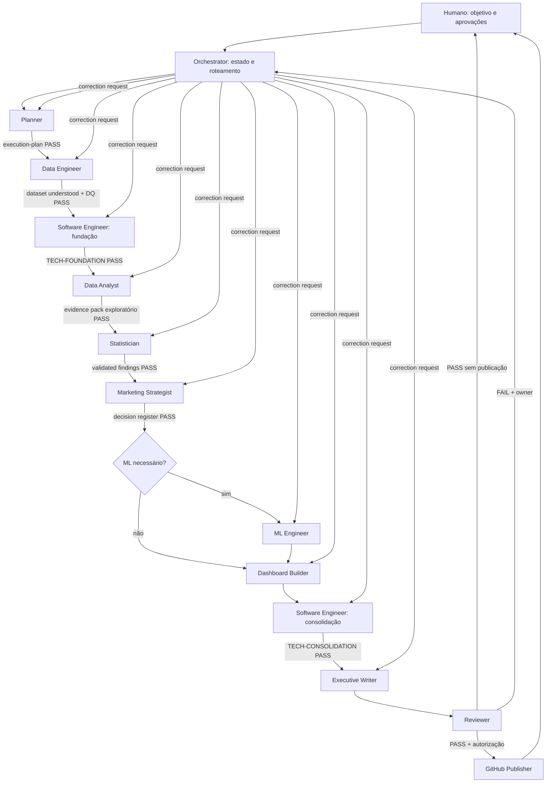

# Arquitetura multiagente

## Princípios

Arquitetura hub-and-spoke, com estado explícito e handoffs por artefatos. O Orchestrator é o único roteador; especialistas não conversam diretamente nem ampliam o próprio escopo. Isso reduz acoplamento, evita “telefone sem fio” e torna cada conclusão auditável.

Os agentes são subagentes de projeto do Claude Code, exceto o Orchestrator, que deve iniciar como agente principal. Essa escolha respeita a limitação de que subagentes não delegam outros subagentes e mantém o histórico volumoso fora do contexto central.

## Catálogo e matriz operacional

| Agente | Responsabilidade | Entrada mínima | Saída canônica | Dependências | Executar quando | Não executar quando | Limitação decisiva |
|---|---|---|---|---|---|---|---|
| Orchestrator | Estado, gates, contexto, delegação | brief, manifest, status | dispatch, gate log, final status | todas as saídas | sempre, como agente principal | como subagente analítico | nunca analisa nem implementa |
| Planner | Decompor problema e critérios | brief, inventário | `docs/execution-plan.md` | nenhuma | no início ou mudança de escopo | para explorar dados profundamente | não produz findings |
| Data Engineer | Ingestão, contrato e qualidade | plano, dados brutos | dados processados, quality report, lineage | Planner | dados disponíveis e gate de plano | se schema/fonte não estão autorizados | não interpreta performance |
| Software Engineer — fundação | Scaffolding, dependências, comandos, contratos técnicos, testes-base e qualidade | escopo técnico, estrutura, contratos, requisitos e limitações | projeto executável, toolchain, testes-base e documentação inicial | Planner, Data Engineer | dataset compreendido e DQ aprovado | escopo/schema ainda indefinido ou pedido analítico | não interpreta dados, escolhe testes/KPIs ou conclusões |
| Data Analyst | EDA e evidências descritivas | dados validados, contrato | evidence pack, tabelas e gráficos exploratórios | Data Engineer | quality gate aprovado | dados sem validação | não faz causalidade nem estratégia |
| Statistician | Inferência e robustez | evidence pack + dataset analítico | validated findings, model diagnostics | Data Analyst | hipóteses/testes definidos | dados brutos ou pergunta puramente descritiva | não recomenda negócio |
| Marketing Strategist | Traduz evidência em decisões | findings validados + restrições | decision register, estratégia priorizada | Statistician | evidência validada | recebe DataFrame ou evidência inconclusiva | não recalcula estatística |
| ML Engineer | Diferencial preditivo | objetivo, features aprovadas, contrato | modelo, card, avaliação | DE, Statistician, Planner | decisão recorrente melhora com previsão e há baseline | só por “ter ML”, poucos dados ou alvo inválido | não converte previsão em causalidade |
| Dashboard Builder | Produto de monitoramento | métricas aprovadas, wireframe, evidence IDs | dashboard e QA de reconciliação | DA, Strategist | após estratégia e métricas congeladas | métricas/decisões ainda mudam | não interpreta nem cria KPI |
| Software Engineer — consolidação | Integração, testes end-to-end, CI, execução completa e documentação técnica | componentes e contratos congelados, comandos e limitações | pipeline integrado, CI, testes e handoff técnico | especialistas aplicáveis | análise, estatística, ML/dashboard concluídos | componentes ainda mudam ou correção é analítica | não altera conclusões nem publica |
| Executive Writer | Comunicação executiva | findings e decisões aprovados | relatório executivo | Strategist e opcionais | todas as conclusões congeladas | análise ainda muda | não altera conclusões |
| Reviewer | Auditoria adversarial e gate final | pacote completo + critérios | `reports/review-verdict.md` | todos aplicáveis | antes de qualquer entrega | para produzir/corrigir conteúdo | read-only; não autoaprova |
| GitHub Publisher | Publicação controlada do pacote aprovado | verdict PASS, autorização, branch/remote e arquivos aprovados | commit, push e PR rastreáveis | Reviewer, humano | publicação foi explicitamente autorizada | antes do PASS ou sem autorização | não altera conteúdo nem faz análise |

## Ordem e gates

1. **Planner — Gate P0:** fixa perguntas, métricas, entregáveis, riscos e plano de validação antes de contato analítico extensivo. Evita análise oportunista.
2. **Data Engineer — Gate DQ:** cria uma base confiável e documentada. Separar engenharia de interpretação impede que limpeza seja guiada pelo resultado desejado.
3. **Software Engineer — Gate TECH-FOUNDATION:** cria scaffolding, dependências, comandos, contratos técnicos, testes-base e documentação inicial depois que o dataset foi compreendido. A análise começa sobre uma fundação reproduzível.
4. **Data Analyst — Gate EDA:** caracteriza distribuição e segmentos, descobre padrões e cria IDs de evidência; não confunde descoberta com confirmação.
5. **Statistician — Gate INF:** testa robustez e confundimento. A estratégia só recebe findings que sobreviveram a validações proporcionais ao risco.
6. **Marketing Strategist — Gate STR:** converte findings aprovados em decisões, thresholds e experimentos, mantendo vínculo explícito com evidência.
7. **ML Engineer — Gate ML (condicional):** entra depois que problema, target e valor decisório existem; evita modelo decorativo e leakage.
8. **Dashboard Builder — Gate UI:** constrói somente KPIs congelados; assim apresentação não redefine análise.
9. **Software Engineer — Gate TECH-CONSOLIDATION:** integra componentes congelados, adiciona testes end-to-end, CI, valida execução limpa e prepara o handoff técnico sem tocar no significado dos resultados.
10. **Executive Writer — Gate DOC:** condensa, sem reinterpretar ou selecionar apenas resultados favoráveis.
11. **Reviewer — Gate FINAL:** revisa de modo independente e devolve cada falha ao proprietário correto.
12. **GitHub Publisher — Gate PUBLISH (condicional):** publica somente o pacote que recebeu `PASS`, após autorização humana explícita; publicação nunca é consequência automática do review.

ML é condicional; quando autorizado, precede o dashboard para que o produto possa incorporar sua saída aprovada. A consolidação aguarda o dashboard e o modelo, se aplicável; o Writer aguarda a consolidação. Retorno por falha vai ao agente proprietário e repete apenas os gates impactados.

## Estado e critério de conclusão

O Orchestrator mantém `outputs/manifests/run-manifest.yaml` com `run_id`, versão do dado, etapa, artefatos, evidence IDs, status (`PENDING`, `RUNNING`, `PASS`, `CONDITIONAL_PASS`, `FAIL`, `BLOCKED`), owner, pendências e timestamp. Uma etapa termina somente quando:

- saída canônica existe e abre;
- checklist do agente está preenchido;
- testes/reconciliações aplicáveis passaram;
- limitações e falhas estão registradas;
- próximo agente pode trabalhar sem histórico de chat nem dados extras.

## Automação segura

| Automação | Por que é segura | Guardrail obrigatório |
|---|---|---|
| validação de schema/tipos/ranges | regras determinísticas e repetíveis | falhar fechado; relatório de violações |
| deduplicação candidata | chaves e hashes tornam candidatos auditáveis | não excluir ambíguos sem humano |
| parsing, normalização e feature engineering | transformação versionada é reproduzível | testes de invariantes e lineage |
| perfis de missingness e qualidade | mede, não interpreta | estratificar por segmento/período |
| estatísticas descritivas | fórmulas estáveis | `n`, denominador e distribuição |
| execução de testes estatísticos | implementação reproduzível | hipótese e família pré-definidas; diagnóstico humano |
| geração de gráficos | código garante consistência | template, QA e evidence ID |
| treino, tuning e avaliação | pipeline pode prevenir leakage | split bloqueado, baseline e limites de busca |
| build e atualização de dashboard | métricas congeladas são reconciliáveis | teste contra tabela fonte |
| montagem de relatório | templates reduzem omissões | conteúdo só de registros aprovados |
| testes, lint e manifest | checagens mecânicas | logs imutáveis e status não autoaprovado |

## Não automatizar sem validação humana

| Atividade | Risco |
|---|---|
| definição da pergunta e métrica de sucesso | otimizar proxy errado ou objetivo antiético |
| conclusão estratégica | restrições comerciais e contexto ausentes nos dados |
| recomendação de investimento/patrocínio | custo real, margem, brand safety e orçamento podem faltar |
| interpretação estatística | significância pode não ser relevância; pressupostos exigem julgamento |
| decisão de usar ML/target/features | leakage, discriminação e complexidade sem valor |
| causalidade | confundidores não medidos e desenho inadequado |
| exclusão de outliers/duplicatas ambíguas | apagar casos legítimos ou enviesar resultado |
| escolha final de storytelling | cherry-picking, exagero e perda de nuances |
| publicação e mudança operacional | impacto externo requer accountability |

Automação pode preparar alternativas e checks; o humano aprova decisões com impacto de negócio. A aprovação registra nome, data, objeto e justificativa.

## Armadilhas e detecção

| Risco | Como detectar | Resposta mínima |
|---|---|---|
| correlação ≠ causalidade | revisar desenho, temporalidade e DAG/confundidores | linguagem associativa; propor experimento |
| viés de sobrevivência | procurar posts zerados/removidos e cobertura da fonte | quantificar ausência; limitar população |
| data leakage | auditoria de timestamp/features e split por creator/tempo | remover feature; refazer pipeline |
| overfitting | gap treino-validação, curva de aprendizagem, teste holdout | simplificar, regularizar, validação aninhada |
| paradoxo de Simpson | comparar efeito agregado e estratificado | reportar heterogeneidade/ajuste |
| outliers | quantis, boxplots, influência/Cook e regra de domínio | análise robusta e sensibilidade, sem exclusão silenciosa |
| confundidores | DAG, conhecimento de domínio, mudança do efeito ajustado | ajustar e declarar não medidos |
| múltiplas comparações | inventário de testes e taxa esperada de falsos positivos | FDR/FWER e separar descoberta/confirmação |
| viés de seleção | comparar incluídos vs. excluídos e mecanismo de coleta | pesos/sensibilidade e população limitada |
| baixa qualidade | schema, ranges, consistência, cobertura e reconciliação | bloquear gate DQ |
| dados faltantes | mapa por variável/segmento/tempo e MCAR/MAR/MNAR plausível | imputação justificada + indicador/sensibilidade |
| duplicidades | chaves naturais, hash e conflitos entre registros | quarentena e regra documentada |
| dependência por creator | repetição por ID e autocorrelação intra-grupo | cluster errors/split por grupo |
| drift temporal | métricas por janela e PSI/testes de distribuição | janela recente e monitoramento |
| denominador enganoso | reconciliar fórmula e casos views=0 | definir política e mostrar cobertura |
| suporte insuficiente | contagens por célula e overlap/propensity | não extrapolar; agrupar ou marcar inconclusivo |

## Escalabilidade

Novos agentes só são aceitos se tiverem domínio exclusivo, entrada/saída canônica e gate próprio. Conhecimento reutilizável deve migrar para skills/rules, não inflar o `CLAUDE.md`. Paralelize apenas tarefas independentes, com arquivos de saída distintos. Se workers precisarem conversar diretamente ou contestar hipóteses em ciclos longos, considere Agent Teams; para este pipeline, o roteamento central é mais barato e auditável.

## Referências de implementação

O formato e as decisões de isolamento seguem a documentação oficial: [custom subagents](https://code.claude.com/docs/en/sub-agents), [visão geral de extensões](https://code.claude.com/docs/en/features-overview) e [diagnóstico de configuração](https://code.claude.com/docs/en/debug-your-config).
