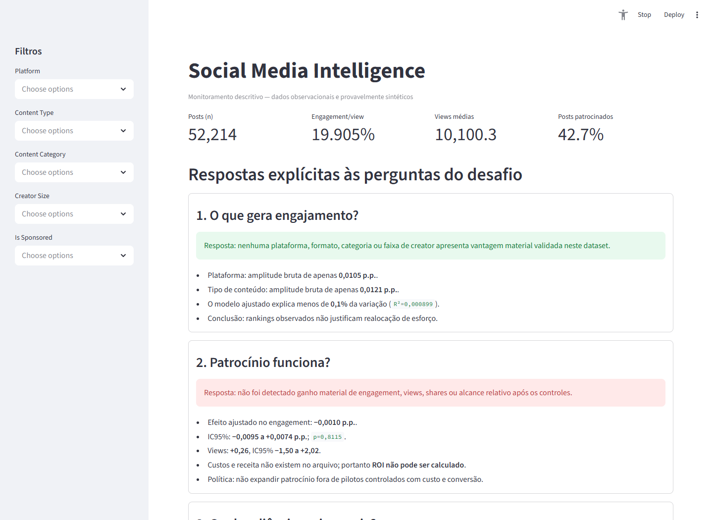
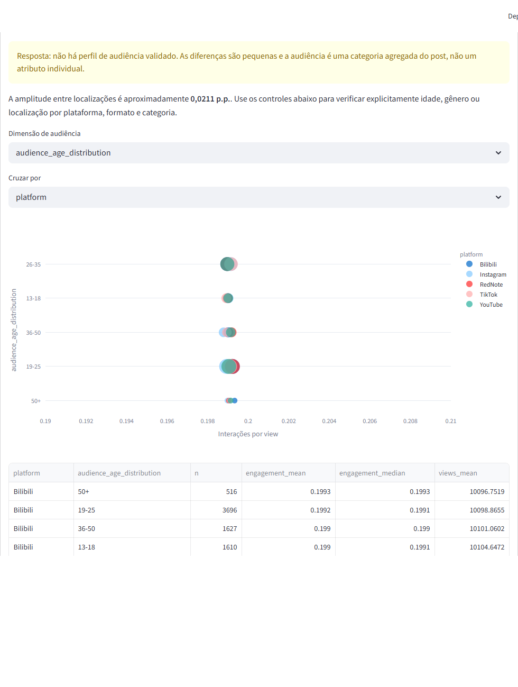
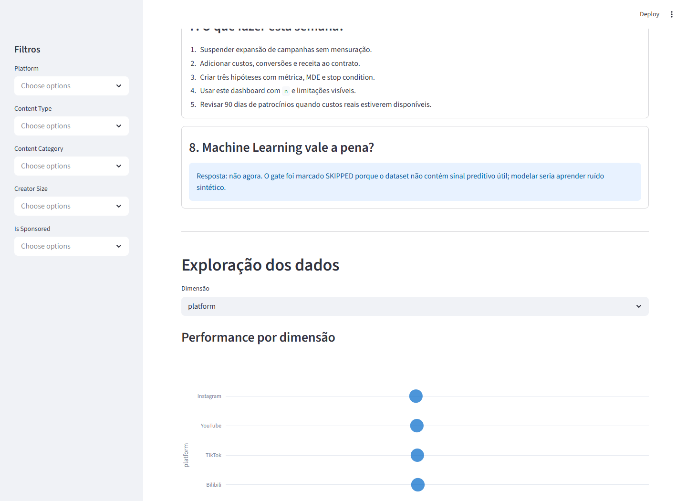

# Estratégia Social Media baseada em dados

## Resumo executivo

O dataset não mostra “vencedores” acionáveis. Entre 52.214 posts, engagement médio é 19,905%, mas as diferenças entre plataformas e formatos são de apenas 0,0105 e 0,0121 ponto percentual. Após controlar plataforma, conteúdo, seguidores, tempo, idioma e audiência, patrocínio apresenta efeito de −0,0010 p.p. (IC95% −0,0095 a +0,0074; `p=0,8115`) e nenhum ganho detectável de views. A recomendação é suspender expansão de patrocínio não experimental, instrumentar custos/conversões e testar conteúdo/cadência com desenho controlado antes de realocar orçamento.

## O que gera engagement?

Não há fator disponível que gere separação relevante:

- plataforma: RedNote 19,9098% versus Instagram 19,8993%, diferença de 0,0105 p.p.;
- formato: text 19,9151% versus video 19,9030%, diferença de 0,0121 p.p.;
- creator size, categoria, idioma e audiência também têm médias próximas;
- o modelo ajustado explica menos de 0,1% da variação (`R²=0,000899`).

Portanto, “vídeo vence imagem” ou “TikTok é melhor” não são conclusões suportadas. Células granulares que aparecem no topo têm amostras menores e múltiplas comparações; não foram promovidas a recomendação.

## Patrocínio funciona?

Neste arquivo, não:

| Métrica | Efeito ajustado patrocinado | IC95% | Resultado |
|---|---:|---:|---|
| engagement/view | −0,0010 p.p. | −0,0095 a +0,0074 p.p. | sem ganho detectável |
| views | +0,26 | −1,50 a +2,02 | sem ganho detectável |
| share rate | −0,00137 p.p. | −0,00438 a +0,00164 p.p. | sem ganho detectável |
| views/follower | +0,00061 | −0,00381 a +0,00503 | sem ganho detectável |

Há bom suporte comum observável e nenhuma interação plataforma×patrocínio sobrevive ao ajuste FDR. O dataset não possui custo, receita ou conversões: ROI é impossível de calcular.

## Qual audiência mais engaja?

Não há perfil validado. A amplitude bruta entre localizações é aproximadamente 0,0211 p.p.; idade e gênero são igualmente próximos. Além disso, audiência é uma categoria agregada do post, não dado individual. Usá-la diretamente para targeting causaria risco de falácia ecológica.

O dashboard permite auditar explicitamente idade, gênero e localização cruzados por plataforma, tipo de conteúdo e categoria. Esses cruzamentos mantêm `n`, média, mediana e views visíveis; diferenças permanecem descritivas, não causais.

## O que não funciona

- patrocínio indiscriminado;
- escolher plataforma ou formato por ranking de média;
- contratar creator pelo número de seguidores ou engagement isolado;
- definir frequência de postagem a partir deste dataset;
- tratar top performers como prova causal;
- chamar engagement/alcance de ROI;
- inferir comportamento individual a partir da audiência agregada.

## Recomendações

### Esta semana

1. Suspender expansão de campanhas sem custo, outcome e comparador definidos.
2. Adicionar `campaign_id`, fee, mídia, produção, reach único, cliques, conversões, receita/margem e janela de atribuição.
3. Criar três hipóteses controladas de conteúdo, com métrica, MDE, tamanho amostral e stop condition.
4. Usar o dashboard apenas para monitoramento descritivo, sempre com `n` e limitações.
5. Revisar os últimos 90 dias de patrocínio quando custos reais estiverem disponíveis.

### Próximos 90 dias

- 0–14: instrumentação e metric registry aprovado;
- 15–45: pilotos randomizados ou rollout escalonado;
- 46–75: replicação e análise de segmentos pré-especificados;
- 76–90: política de escala baseada em break-even financeiro.

Não existe threshold de seguidores defensável hoje. O threshold correto é econômico: escalar apenas quando o limite inferior do efeito incremental superar o break-even aprovado.

## Ferramenta recorrente

O dashboard Streamlit oferece filtros, KPIs reconciliados, contraste patrocinado/orgânico e tamanho amostral:

```powershell
.\.venv\Scripts\python.exe -m streamlit run dashboard\app.py
```

Ele não calcula ROI nem recomenda winners. O smoke test respondeu HTTP 200.

### Capturas do dashboard

O painel coloca as respostas do desafio ao lado dos KPIs reconciliados:



O cruzamento de audiência explicita as diferenças por plataforma e também permite selecionar tipo de conteúdo ou categoria:



A exploração mantém a escala controlada e exibe o tamanho das células:



## Abordagem e qualidade

- raw preservado e dataset analítico versionado por hash;
- EDA separada de inferência;
- regressão ajustada com erros clusterizados por 5.000 creators;
- diagnóstico de propensity/overlap, interações com FDR e outcomes alternativos;
- pipeline end-to-end, ambiente limpo, lock, CI, 19 testes, lint e dashboard smoke test.

## Limitações

O dataset apresenta fortes sinais de geração sintética: métricas excessivamente concentradas, nenhum post zerado e todas as 5.000 IDs de creator associadas a múltiplos nomes. Isso limita generalização, análise de sobrevivência e recomendações operacionais. Não há custo, receita, conversão, timezone, exposição individual ou frequência planejada. O desenho é observacional e não permite causalidade. Métrica primária, MDE, break-even e guardrails precisam de aprovação humana.

## Rastreabilidade

- Qualidade: `docs/data-quality-report.md`.
- EDA: `docs/eda-report.md` e `outputs/tables/EDA-*.csv`.
- Estatística: `docs/statistical-methods-report.md`, evidence `INF-SPON-001`.
- Estratégia completa: `reports/strategy-register.md`.
- Consolidação: `docs/technical-consolidation-report.md`.
