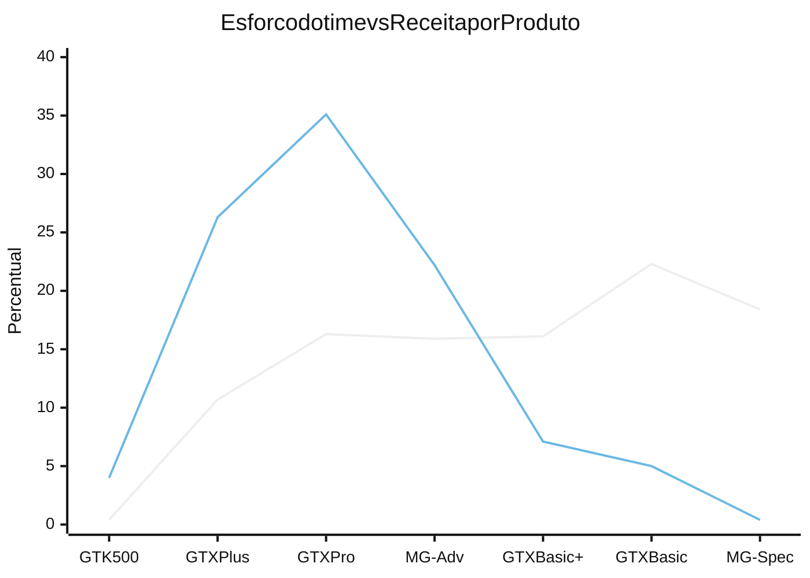
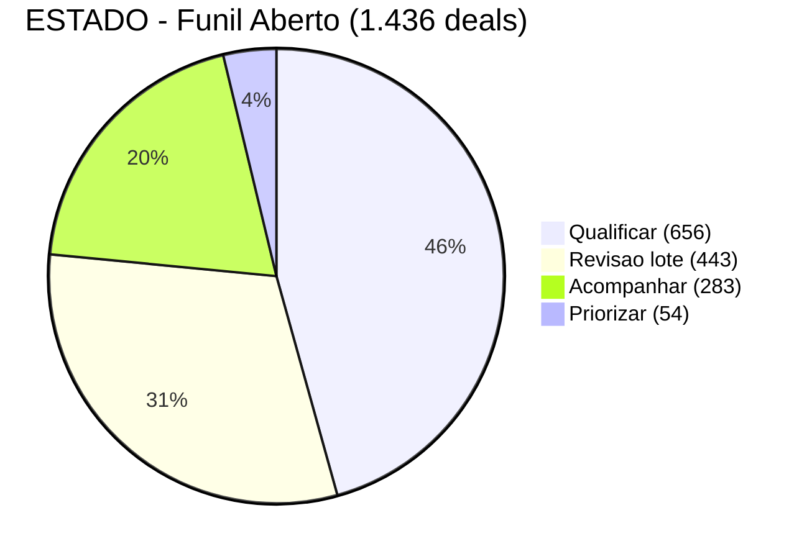

# Submissão — Gabriel Moreira — Challenge 003 (Lead Scorer)

## Sobre mim

- **Nome:** Gabriel Moreira
- **E-mail:** gmoreira1santos@gmail.com
- **Challenge escolhido:** 003 — Lead Scorer (Vendas / RevOps)

---

## Executive Summary

35 vendedores, 8.800 oportunidades, nenhuma lógica de priorização — cada um adivinha. A análise dos 6.711 negócios fechados mostrou que **nenhum atributo de cadastro prevê ganho ou perda** (AUC ≈ 0,50, testes de permutação com p entre 0,26 e 0,97), mas **o produto sozinho explica ~98% do valor do negócio** (de US$ 55 a US$ 26.768, 487×). Por isso a ferramenta não classifica probabilidade de conversão — ela ordena o funil por **valor em risco**: `SCORE = percentil(p̂ × VALOR × URGÊNCIA)`, acompanhado de `CONFIANÇA` (quanto o número está apoiado em dado real) e `ESTADO` (a ação recomendada). Entreguei uma API FastAPI + frontend React rodando de ponta a ponta, validados por um backtest reprodutível (`make validate`) que também documenta três tentativas de refinar o modelo que **pioraram** a previsão e foram descartadas. O achado com maior impacto de negócio: **39,6% do esforço do time gera 5,4% da receita** — ver [§Resultados](#resultados--findings) abaixo.

---

## Solução

### Abordagem

Comecei pela pergunta que a maioria dos guias de lead scoring pula: **os dados sustentam um score de probabilidade de conversão?** Rodei testes estatísticos (qui-quadrado, Mann-Whitney, AUC de modelos preditivos com holdout temporal, testes de permutação) sobre os 6.711 negócios fechados antes de desenhar qualquer fórmula — a resposta foi não, para todo atributo firmográfico testado. Só depois de matar esse caminho é que desenhei a alternativa que os dados de fato sustentam: um score de **valor em risco**, calibrado com encolhimento hierárquico (empirical Bayes) e curvas de aging isotônicas.

O trabalho seguiu em ciclos de decisão → implementação → validação → correção, não um design único congelado no início:
1. Análise exploratória completa, documentada em [docs/analise-lead-scoring.md](./docs/analise-lead-scoring.md)
2. Sessão de "grilling" (32+33 perguntas em duas rodadas) para forçar cada decisão de design a ser justificada contra os dados, não por convenção de mercado — registrado em [docs/decisions-log.md](./docs/decisions-log.md)
3. Implementação via OpenSpec (proposta → specs → tasks → código), garantindo que a fórmula exposta na UI é a mesma calculada e a mesma validada
4. Dois redesenhos posteriores movidos por evidência nova: remoção do controle de acesso (não agregava ao objetivo do challenge) e redesenho de CONFIANÇA/ESTADO (a versão original forçava "desistir" para 61,8% do funil)
5. Saneamento de dados (reclassificação de 653 negócios parados ≥200 dias) e análise de carga/fit por vendedor, movidos pela própria recomendação da análise exploratória

### Resultados / Findings

**A fórmula final:**

```
PRIORIDADE = p̂(produto, idade) × VALOR(produto, porte) × URGÊNCIA(idade)   [dólares, auditável]
SCORE      = percentil(PRIORIDADE vs. os 4.238 negócios historicamente ganhos) × 100
CONFIANÇA  = min(completude, suporte)                                      [0-100]
ESTADO     = árvore(sem_precedente, SCORE≥95, CONFIANÇA<50)
```

Derivação completa de cada termo, passo a passo, em [docs/analise-lead-scoring.md](./docs/analise-lead-scoring.md). Como cada peça se conecta (API, frontend, validação) em [docs/architecture.md](./docs/architecture.md). Saída real do backtest em [solution/report.md](./solution/report.md).

**Onde está a receita, contra onde está o esforço do time** — a distorção mais cara encontrada na análise:



MG Special + GTX Basic somam **39,6% dos negócios e 40,6% do esforço do time, para 5,4% da receita** — e MG Special tem a *maior* taxa de conversão da carteira (65%), a armadilha exata que um score de probabilidade de conversão premiaria. Detalhe em [docs/analise-lead-scoring.md §2.3](./docs/analise-lead-scoring.md#23-o-que-varia-de-verdade-o-valor).

**Como o funil aberto atual (1.436 oportunidades) se distribui pela recomendação de ação:**



`Revisão em lote` (sem precedente histórico de fechamento) fica fora da fila ordenada de trabalho — não é "negócio perdido", é passivo de higiene de dados a resolver em lote com o gestor. A fila trabalhável tem 993 oportunidades.

**Validação:** `make validate` reproduz 9 achados estruturais (ausência de sinal firmográfico, colapso do encolhimento hierárquico, monotonicidade das curvas de aging, concentração de valor no topo da fila) e testa por validação cruzada três hipóteses de tornar o modelo mais granular — as três pioraram a previsão fora da amostra e foram descartadas, não escondidas. Saída completa comentada em [solution/report.md](./solution/report.md).

### Recomendações

1. **Rodar o saneamento do funil parado** — já feito nesta submissão (653 negócios ≥200 dias reclassificados), mas precisa virar rotina, não um evento único.
2. **Realocar capacidade de MG Special/GTX Basic** para autosserviço ou um time de menor custo — libera ~14 vendedores-equivalentes para produtos que rendem de 10× a 400× mais por dia de esforço.
3. **Parar de ranquear vendedor por taxa de conversão** — a variação entre eles é indistinguível de acaso (dp observado 0,0366 vs. 0,0339 esperado por sorte). Ranquear por receita gerada e mix de produto trabalhado.
4. **Instrumentar dado comportamental** (timestamp de mudança de etapa, speed-to-lead, motivo de perda estruturado) — é a lacuna que explica a AUC de 0,50 e o próximo passo de maior retorno. Lista priorizada em [docs/analise-lead-scoring.md §6](./docs/analise-lead-scoring.md#6-a-lacuna-que-precisa-ser-fechada).
5. Roadmap completo, com esforço e impacto estimados por item, em [roadmap.md](./roadmap.md) — inclui um job de monitoramento de notícias de conta como próximo passo de sinal externo.

### Limitações

- **Sem autenticação** — decisão consciente para um dataset público de demonstração; produção exigiria SSO/OIDC real com escopo por papel.
- **`p̂` varia só entre 0,60 e 0,75** — a ferramenta não prevê quem vai fechar, prioriza por valor e urgência. Isso é o achado central, não um bug a corrigir.
- **Sem persistência** — tudo em memória, recarregado a cada execução; CSV exportado é o artefato durável hoje.
- **Sem sinal comportamental** — nenhum dos 5 CSVs de origem carrega e-mail aberto, ligação atendida, ou visita ao site.

Lista completa e caminho de evolução em [docs/architecture.md §Limitações conhecidas](./docs/architecture.md) e [roadmap.md](./roadmap.md).

---

## Process Log — Como usei IA

> **Este bloco é obrigatório.** Sem ele, a submissão é desclassificada.

Ver narrativa completa e cronológica em [process-log/narrative.md](./process-log/narrative.md).

### Ferramentas usadas

| Ferramenta | Para que usou |
|------------|--------------|
| Claude Code | Análise exploratória dos dados (AUC, permutação, encolhimento hierárquico), sessões de "grilling" para stress-testar decisões de design, geração de proposta/specs via OpenSpec, implementação completa (backend, frontend, validação), redesenho de CONFIANÇA/ESTADO, saneamento de dados e análise de carga/fit por vendedor |

### Workflow

1. Análise exploratória sobre os CSVs brutos, corrigindo qualidade de dados antes de qualquer modelo (typos de setor, produto duplicado)
2. Sessão de perguntas estruturadas (32 perguntas, depois 33 numa segunda rodada) para forçar cada decisão de design contra evidência medida, não contra convenção — cada resposta validada com um script rodado nos dados reais, não estimada
3. Especificação formal via OpenSpec (proposta → design → specs testáveis → tasks) antes de qualquer código de produção
4. Implementação seguindo as tasks, com testes unitários e de contrato de API escritos junto
5. Verificação manual no navegador (não só testes automatizados) — dois bugs reais de UI foram achados dessa forma, não pelos testes
6. Dois ciclos de redesenho movidos por feedback de uso real (remoção de RBAC, redesenho de CONFIANÇA/ESTADO) e um ciclo de saneamento de dados movido pela própria recomendação da análise exploratória

Passo a passo detalhado, com data e o que foi decidido por mim vs. executado pela IA, em [process-log/narrative.md](./process-log/narrative.md).

### Onde a IA errou e como corrigi

- A primeira versão do redesenho de ESTADO fazia ESTADO derivar quase só de CONFIANÇA — eu apontei que eram dois eixos diferentes (quanto sei vs. o que fazer), e a IA corrigiu para uma árvore de decisão cruzando os dois.
- `constants.classificar_porte` só checava `employees is None`, mas o merge preenche ausência com `NaN` — `NaN < limiar` é sempre `False` em Python, então toda oportunidade sem conta caía silenciosamente em "Enterprise". Achado durante a implementação, não previsto no design; corrigido e a distribuição de ESTADO foi recalculada.
- `K_PRODUTO = 4` foi mantido como constante congelada numa calibração em que a recomputação estrita já mostrava colapso — a IA sinalizou a tensão em vez de esconder ou decidir sozinha; a decisão final (manter, depois remover quando os dados mudaram em 2026-08-21) foi minha, registrada em [docs/decisions-log.md](./docs/decisions-log.md).

### O que eu adicionei que a IA sozinha não faria

- A pergunta inicial de matar a hipótese de probabilidade de conversão antes de aceitar a fórmula pronta — sem isso, o projeto teria implementado um classificador com AUC 0,50 sem perceber.
- Insistir em validar cada resposta de design contra um script rodando nos dados reais, não em aceitar a resposta mais plausível.
- Pedir a segunda rodada de "grilling" depois de ver o sistema em uso real — os problemas de UX (CONFIANÇA forçando "desistir" para 61,8% do funil) só ficaram óbvios rodando a ferramenta, não lendo a spec.
- A decisão de negócio de implementar `mult_setor` mesmo com o resultado de validação cruzada negativo — julgamento de produto, não um resultado que os dados sozinhos indicavam.

---

## Evidências

- [x] Chat exports → `process-log/chat-exports/`
- [x] Git history (branch `submission/gabriel-moreira`)
- [x] Narrativa escrita → [process-log/narrative.md](./process-log/narrative.md)
- [ ] Screenshots das conversas com IA → `process-log/screenshots/`
- [ ] Screen recording do workflow

---

_Submissão iniciada em: 2026-08-18_
_Submissão atualizada em: 2026-08-21_
