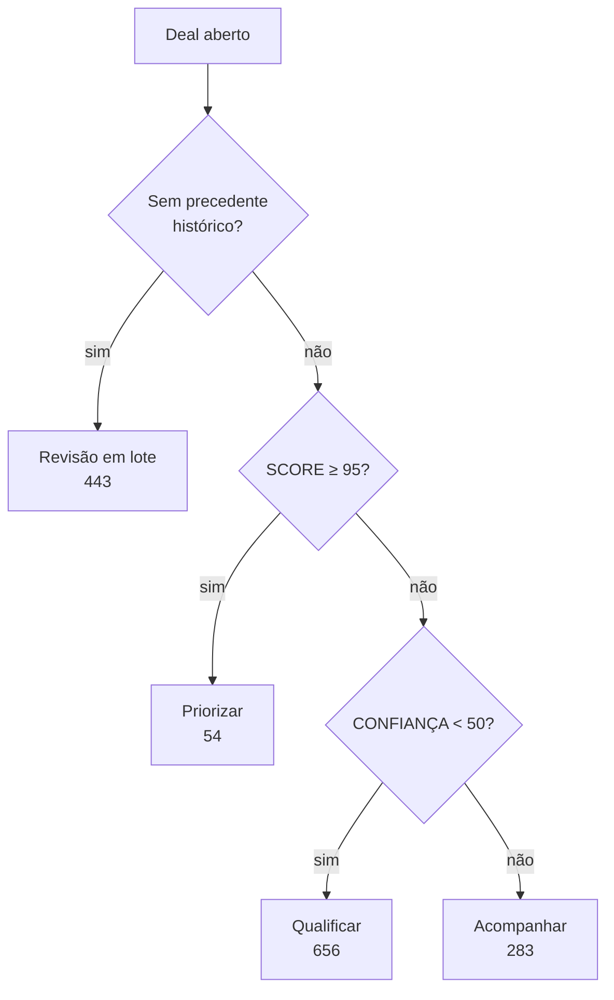
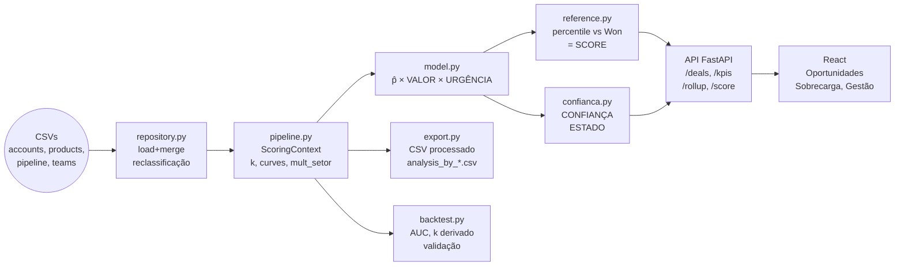

# Arquitetura da Solução

Blueprint técnico da implementação: como cada peça funciona e como é validada. Para a lógica das decisões que levaram a este desenho, ver [decisions-log.md](./decisions-log.md); para a derivação estatística por trás da fórmula, ver [analise-lead-scoring.md](./analise-lead-scoring.md).

---

## Visão geral

Ferramenta de triagem de pipeline por **valor em risco**, não por probabilidade de conversão categórica. A evidência: em negócios fechados (out/2016–dez/2017), conta, setor, gerente e escritório não preveem ganho/perda — AUC ≈ 0,47-0,51, testes de permutação com p entre 0,12 e 0,94. Vendedor é a exceção mensurada na calibração de 2026-08-21 (p=0,000, ver [docs/report.md](./report.md) §2 e §12) — um sinal fraco, que nunca entra em `p̂`, mas sustenta o mecanismo separado de fit por vendedor (sugestão de redistribuição de sobrecarga). A calibração hierárquica confirma a ausência de sinal de conta e setor de outra forma: os níveis conta×produto e produto×setor têm variância em excesso zero e colapsam para peso zero automaticamente.

O que diferencia uma oportunidade da outra é, sobretudo, **valor** (produtos de US$ 55 a US$ 26.768, 487×) e **tempo até a resolução** — não para quem se vende ou em que setor.

**A fórmula:**

```
PRIORIDADE = P̂ganho(produto, idade) × VALOR(produto, porte) × URGÊNCIA(idade)   [dólares, valor auditável]
SCORE      = percentil(PRIORIDADE contra os 4.238 negócios historicamente ganhos) × 100

CONFIANÇA  = min(completude, suporte)                                            [0-100]
  completude = % dos 5 campos de cadastro observados (engajamento, conta, funcionários, setor, time)
  suporte    = 0,75 × precedente_na_idade + 0,25 × volume_do_produto, cada termo saturando em n/50
```

**SCORE é o único número de prioridade exposto** — não PRIORIDADE em dólares, que permanece calculada e exportada no CSV como valor intermediário auditável, mas não aparece na tela nem ordena a fila (ver §Redesenho 2026-08-20 abaixo para o porquê). CONFIANÇA e SCORE nunca se combinam num único número: CONFIANÇA mede quanto do necessário para pontuar está de fato observado; SCORE mede quanto a oportunidade vale agora. Um **ESTADO** deriva de uma árvore de decisão sobre os dois e vira a etiqueta de ação que o vendedor vê: **Priorizar, Acompanhar, Qualificar, Revisão em lote**.

**Toda oportunidade aberta recebe PRIORIDADE — inclusive as 987 sem conta e as 500 em Prospecting.** A ausência de conta custa no máximo 8% de VALOR (prior neutro de porte), nunca a viabilidade do score.

---

## Stack técnica

**Backend:**
- Python 3.10+
- FastAPI (REST API aberta — sem autenticação; listagem paginada, detalhe de oportunidade, rollup, `/score` para oportunidade avulsa)
- Pandas (ETL + data layer)

**Frontend:**
- React 18+
- TypeScript
- Recharts (visualizações)
- Tailwind CSS

**Data:**
- CSV loader (in-memory pandas), atrás de um módulo repositório
- 8.800 linhas × 4 tabelas (accounts, products, sales_pipeline, sales_teams)
- Exportação: CSV consolidado com o dataset processado + scores, regravado a cada carga

**Deployment:**
- Docker Compose (API + React bundled)
- Python deps pinned em requirements.txt
- React build output servido pelo mesmo container

**Validação:**
- Script Python standalone (importa `scoring/`) que roda:
  - Backtest out-of-time nos 6.711 negócios fechados (AUC por atributo firmográfico)
  - Permutation tests sobre agent/product/sector/account
  - Reprodução do cálculo de `k` hierárquico e do colapso de conta×produto/produto×setor
  - Verificação de monotonicidade de `risco(t)` e da fronteira de 138 dias
  - Concentração de PRIORIDADE (top 10%/30%) vs. ranking por preço puro

**Testes:**
- Unitários: motor de scoring (encolhimento, curvas, censura, confiança, estado, plano de ação em passos)
- API: contrato dos endpoints sem autenticação, paginação (união de páginas sem repetição/lacuna, ordenação sobre o recorte inteiro, desempate estável), detalhe de oportunidade, opções de filtro, exportação de identificadores filtrados

---

## Dados

### Carregamento

```
accounts (85 linhas)
  + country / sector / employees / revenue / year_established

sales_pipeline (8.800 linhas)
  + opportunity_id / deal_stage / engage_date / close_date / close_value

products (7 itens)
  + product / sales_price

sales_teams (35 linhas)
  + sales_agent / manager / regional_office
  → hierarquia real: 35 agentes → 6 managers → 3 escritórios (Central/East/West)

MERGE:
  sales_pipeline
    LEFT JOIN accounts ON account
    LEFT JOIN products ON product
    LEFT JOIN sales_teams ON sales_agent
```

### Tratamentos de qualidade

| Problema | Correção |
|---|---|
| `technolgy` typo em sector | → `technology` |
| `GTXPro` vs `GTX Pro` | → normalizar para `GTX Pro` (1.147 negócios) |
| 987 deals abertos sem `account` (1.425 antes da reclassificação de 200 dias) | pontuáveis normalmente — VALOR usa prior neutro de porte (mult=1,00), completude de CONFIANÇA cai (faltam conta/funcionários/setor) |
| 500 Prospecting sem `engage_date` | pontuáveis normalmente — `p̂` = `p̂_produto` sem ajuste de idade, URGÊNCIA fixa em 0,47 |
| bimodal cycle (picos 0–19d e 60–90d) | motivou a leitura das curvas de aging como função em degraus, não decaimento contínuo |

---

## Lógica de scoring

### PRIORIDADE

```
p̂_produto = (n_produto × taxa_produto + k × 0,5755) / (n_produto + k)   ← encolhimento hierárquico, k derivado em tempo de carga para cada nível

  se Prospecting:      p̂(idade) = p̂_produto (sem ajuste de idade)
  se idade > 138:       p̂(idade) = 0,5755                                ← censura: reverte ao prior dos negócios orgânicos
  senão:                p̂(idade) = p̂_produto × p_ganho(min(idade,120)) / 0,5755

p̂ = p̂(idade) × mult_setor(produto, setor)                               ← ajuste de desempenho produto×setor, ±15%, neutro (1,0) sem setor conhecido

VALOR = preço_tabela(produto) × mult_porte(porte, default 1,00)

  se Prospecting:      URGÊNCIA = 0,47
  se idade > 138:       URGÊNCIA = 0,15
  senão:                URGÊNCIA = risco_isotônico(min(idade,120))

PRIORIDADE = p̂ × VALOR × URGÊNCIA                                  ← em dólares, valor auditável
SCORE      = percentil(PRIORIDADE) × 100                           ← contra os 4.238 negócios historicamente ganhos
```

**SCORE não é relativo ao funil aberto corrente** — é o percentil de PRIORIDADE contra a distribuição de PRIORIDADE calculada sobre os 4.238 negócios historicamente **ganhos** (usando a idade real de cada um no fechamento). Essa referência é histórica e fixa; só muda no ciclo trimestral de recalibração.

`k` é derivado em tempo de carga: `k = variância_esperada_por_acaso / variância_em_excesso`, para os **quatro** níveis da hierarquia (conta×produto, produto×setor, produto, global). Nos dados atuais, conta×produto e produto×setor têm variância em excesso ≤ 0 e colapsam (`k = ∞`); o nível de produto tem `k ≈ 0,70` (finito).

**Achado que inverte a intuição comum de lead scoring:** `p_ganho(t)` **sobe** com a idade (0,632 aos 0 dias → 0,751 aos 120 dias) — não desce. O que a idade consome é a **janela**: em 57 dias, metade das vitórias históricas já aconteceu; em 88 dias, restam 25%. Por isso URGÊNCIA usa `risco(t)`, a probabilidade real de resolução em 30 dias (suavizada por regressão isotônica), não um proxy de "quão velho é ruim".

#### Cálculo detalhado de p̂

A probabilidade de ganho é calculada em **três casos**, de forma determinística:

**1. Prospecting (sem `engage_date`):**
```
p̂ = p̂_produto
```
Usa apenas a taxa de vitória do produto, com encolhimento hierárquico aplicado. Sem ajuste de idade porque não há idade a medir — o lead ainda nem entrou no funil de venda estruturado.

**2. Engaging, idade > 138 dias (censura):**
```
p̂ = 0,632  (constante — o prior global)
```
Nenhum dos 6.711 negócios fechados históricos levou mais de 138 dias. Acima disso, revertemos ao prior em vez de extrapolar a curva — evita premiar abandono, que teria `p̂ = 0,751` se forward-fillássemos.

**3. Engaging, idade ≤ 138 dias (dentro da janela observada):**
```
p̂ = p̂_produto × p_ganho(min(idade, 120)) / 0,632
```
Ajusta a taxa do produto pela curva de ganho empírica. Dividi-se por 0,632 para renormalizar — `p_ganho(t)` é calibrada em absoluto, não como multiplicador.

**Exemplo:**
- GTX Pro: 64,8% taxa de vitória histórica (p̂_produto = 0,648)
- Oportunidade em Engaging, 57 dias de idade
- p_ganho(57) = 0,684 (regressão isotônica nos dados)
- p̂ = 0,648 × 0,684 / 0,632 = 0,702

#### Cálculo detalhado de URGÊNCIA

URGÊNCIA mede `P(o negócio se resolve nos próximos 30 dias | ainda aberto)` — é a probabilidade real de fechamento próximo, não um decaimento inventado. Também em **três casos**:

**1. Prospecting:**
```
URGÊNCIA = 0,47  (constante observada)
```
Representa a velocidade média de resolução para leads que entram no funil sem uma oportunidade formalizada. Calibrada empiricamente na população histórica.

**2. Engaging, idade > 138 dias (censura):**
```
URGÊNCIA = 0,15  (baixa — praticamente sem precedente)
```
Negocios com mais de 138 dias já perderam a janela normal de fechamento. A urgência cai drasticamente porque estadisticamente já não deveria estar aberto.

**3. Engaging, idade ≤ 138 dias:**
```
URGÊNCIA = risco(idade)
```
Leitura em degraus (step function) da curva isotônica calibrada:

| Idade (dias) | risco(t) | Interpretação |
|---|---:|---|
| 0–44 | 0,219 | Recém-aberto; apenas 21,9% resolvem nos próximos 30 dias |
| 45–56 | 0,322 | Começou a acelerar |
| 57–87 | 0,489 | Metade do ciclo; ~49% resolvem em 30 dias |
| 88–109 | 0,832 | Bem avançado; 83% dos negócios resolvem em 30 dias |
| ≥110 | 1,000 | Última reta; praticamente certo que resolve ou fecha |

**Exemplo:** mesma GTX Pro com 57 dias:
```
risco(57) = 0,489
```
Significa que, entre negócios em Engaging com 57 dias de idade, 48,9% resolvem (ganham ou perdem) nos próximos 30 dias — a urgência de ação é moderada, não baixa nem crítica.

### Censura acima de 138 dias

Nenhum dos 6.711 negócios fechados levou mais de 138 dias. Acima disso, o sistema **não extrapola** a curva — reverte ao prior (`p̂` = 0,632, URGÊNCIA = 0,15) em vez de aplicar forward-fill, que premiaria o abandono (daria `p̂` = 0,751 a um negócio de 377 dias, o mais alto da curva, exatamente ao mais parado do funil).

### `mult_setor` — ajuste de desempenho produto×setor sobre p̂ (adicionado 2026-08-21)

```
taxa_bruta_célula = vitórias_célula / total_célula
taxa_encolhida    = (n_célula × taxa_bruta_célula + K_SETOR × p̂_produto) / (n_célula + K_SETOR)   ← encolhe em direção a p̂_produto, NÃO à taxa global
mult_setor        = clip(taxa_encolhida / p̂_produto, 0,85, 1,15)                                    ← K_SETOR = 25 (reaproveitado de K_FIT), teto ±15%

setor desconhecido ou célula sem negócio fechado -> mult_setor = 1,0   ← neutro, nunca inventado
```

**Fluxo de dados:** `pipeline.build_scoring_context` monta `p_hat_by_product` (com `k` derivado do nível de produto) e passa para `setor.build_context(fechados_calibracao, p_hat_by_product)`, que agrupa por (produto, setor) e guarda no `ScoringContext.setor_ctx`. Esse mesmo `ScoringContext` é compartilhado por `pipeline.score_open_pipeline` (funil aberto) e `reference.build_reference_distribution` (negócios Won) — `model.p_hat()` chama `ctx.mult_setor(product, sector)` como última etapa, depois do ajuste de idade, em ambos os casos. `confianca.suporte` lê a mesma célula via `ctx.s_celula(product, sector)` para o terceiro termo de suporte. `explicacao.fatores_score` lê `ctx.mult_setor`/`ctx.n_celula` para a frase de explicação, só quando o setor é conhecido.

**Medido sobre o funil real** (1.436 oportunidades abertas, 4.238 negócios Won): SCORE desloca mediana 0,30pp / máximo 4,40pp; CONFIANÇA desloca mediana 0,00 / máximo 12,60. Zero cruzamentos dos cortes SCORE≥95 e CONFIANÇA<50; distribuição de ESTADO idêntica. Efeito colateral aceito: a mediana de PRIORIDADE da população de referência sobe 6,75% (351,52 → 375,26) — efeito estrutural (células de taxa mais alta contribuem mais linhas Won à própria referência), não uma mudança de mercado; não corrigido porque PRIORIDADE em dólares não é exibida e o efeito sobre SCORE já é desprezível (ver `docs/decisions-log.md`, entrada 2026-08-21).

### CONFIANÇA — quanto se sabe sobre a oportunidade

CONFIANÇA responde: "**quanto do que este score afirma está apoiado em dado observado e em precedente histórico?**" — uma escala numérica 0-100, `min(completude, suporte)`. Idade não entra em CONFIANÇA diretamente, apenas no termo de suporte via densidade de precedente histórico.

#### completude — os cinco campos de cadastro

```
completude = 100 × (campos observados) / 5
campos: engage_date (estágio Engaging) · conta vinculada · funcionários da conta · setor · time atribuído
```

#### suporte — quanto histórico sustenta os números usados

```
s_idade   = min(1, negócios_ganhos_na_janela_de_±15_dias / 50)
s_produto = min(1, negócios_fechados_do_produto / 50)
s_célula  = min(1, negócios_fechados_de_calibração_na_célula_produto×setor / 50)   ← adicionado 2026-08-21, junto com mult_setor

suporte = 100 × Σ(peso_i × termo_i, termos presentes) / Σ(peso_i, termos presentes)
pesos: idade 0,65 · produto 0,20 · célula 0,15
```

Cada termo condicional (`s_idade` sem idade conhecida — Prospecting; `s_célula` sem setor conhecido) é OMITIDO, nunca zerado, e os pesos dos termos restantes são renormalizados. Com os três termos presentes, a fórmula geral se reduz a `100 × (0,65×s_idade + 0,20×s_produto + 0,15×s_célula)`; com só `s_produto` presente (Prospecting sem conta), reduz a `100 × s_produto`.

`min`, não média: saber todos os campos de uma oportunidade sem precedente histórico não a torna confiável — a metade mais fraca governa. Omitir (não zerar) um termo ausente evita cobrar a mesma ausência duas vezes (já cobrada em completude) — sem essa correção, as 500 oportunidades em Prospecting, as mais novas do funil, caíam no mesmo tratamento das mais abandonadas, e o mesmo valeria para as 987 sem setor conhecido.

**Marcador de ausência de precedente:** `sem_precedente = (s_idade == 0 com idade conhecida)` — nenhum negócio ganho fechou na faixa de idade desta oportunidade. É esse marcador, não um corte sobre CONFIANÇA, que decide o roteamento de ESTADO — porque oportunidades novas sem cadastro e oportunidades antigas sem precedente se aglomeram em valores adjacentes de CONFIANÇA (20 e 25), em ordem invertida: nenhum corte único separa as duas populações.

### ESTADO — árvore de decisão sobre SCORE e CONFIANÇA

```
1. sem precedente histórico   -> Revisão em lote
2. SCORE >= 95                -> Priorizar
3. CONFIANÇA < 50             -> Qualificar
4. caso contrário             -> Acompanhar
```



CONFIANÇA e ESTADO não são a mesma coisa: **CONFIANÇA é o quanto acreditar no score**; **ESTADO é a ação recomendada**. A tabela 4×2 original (A-D × SCORE≥50) deu lugar a uma árvore, porque CONFIANÇA contínua em 0-100 não tem quebras naturais para uma tabela cruzada, e a ordem explícita da árvore corrige o defeito real da versão anterior: "CONFIANÇA D → Desistir" era uma regra de mão única escondida numa célula, aplicada a 61,8% do funil.

O corte de SCORE (95) é o percentil 95 da própria distribuição de referência — acompanha a recalibração trimestral sem constante própria. O corte de CONFIANÇA (50) significa "menos da metade do que este score afirma está apoiado em dado observado e precedente" — ambos ancorados, não ajustados por tentativa e erro.

`Qualificar` absorve o antigo `Engajar` — os dois estados convergiam para o mesmo plano de ação ("mantenha follow-up"/"busque informação"), e a distinção que os separaria (falta informação vs. falta maturidade) é exatamente o que a metade de completude já mede como número exposto, não precisa ser um estado à parte.

| Estado | Ação |
|---|---|
| **Priorizar** | Contato esta semana — SCORE no percentil 95+ da distribuição histórica de vitórias |
| **Acompanhar** | Follow-up regular — nada falta saber e o valor ainda não justifica agir com urgência agora |
| **Qualificar** | Obter a informação específica que falta (nomeada pela razão de CONFIANÇA) antes de tratar como tarefa priorizada |
| **Revisão em lote** | Passivo de higiene de dados — sem precedente histórico de fechamento. Fora da fila ordenada de trabalho, tratado em lote com o gestor |

Distribuição sobre o funil atual (1.436 oportunidades abertas):

```
Priorizar         54
Acompanhar       283
Qualificar       656
Revisão em lote  443
Fila trabalhável 993
```

`Revisão em lote` contém oportunidades sem precedente histórico de fechamento (idade 154–199 dias, acima de 138 observados mas abaixo de 200 de política). Nenhuma oportunidade em Prospecting cai nela, pois idade desconhecida nunca é lida como "sem precedente".

### Explicabilidade e plano de ação

Cada oportunidade expõe:

```
Priorizar · GTX Plus Pro · confiança 100 (completude e suporte equivalentes)
p̂ 0,691 · Valor US$ 5.865,74 · Urgência 1,00 → PRIORIDADE ≈ US$ 4.051,66 (auditável; SCORE é o número de prioridade — valor recalculado em 2026-08-21, p̂_produto agora vem de `fechados_calibracao`)
"98,8% das vitórias históricas já ocorreram nesta idade — priorize contato esta semana."
```

Texto gerado por template determinístico a partir dos componentes — nunca por um modelo não determinístico ou serviço externo, para preservar auditabilidade. A razão de CONFIANÇA nomeia qual metade (completude ou suporte) governou o mínimo e, quando é completude, quais campos especificamente faltam — nunca apenas repete o número.

**PRIORIDADE é calculada mas não exibida.** O número de prioridade mostrado ao vendedor é **SCORE** (0-100), não PRIORIDADE em dólares. A razão: a decomposição da variância de `log(PRIORIDADE)` atribui 87,3% a VALOR e 0,1% a `p̂`. SCORE normaliza essa distribuição contra a população histórica, evitando que o sorting seja dominado por preço de tabela.


---

## Postura de segurança — sem autenticação

A API não exige identificação: todo endpoint de dados é aberto e opera sobre o funil completo, sem cabeçalho `Authorization`. Vendedor, gerente e escritório regional (a hierarquia real de `sales_teams.csv` — 35 agentes → 6 managers → 3 escritórios) são **filtros ordinários** sobre o funil inteiro, iguais a produto e confiança — nenhum deles restringe o que um cliente pode alcançar.

Essa é uma decisão consciente para um dataset público de demonstração, sem informação real de cliente, e está documentada como limitação assumida — não omitida (ver `decisions-log.md`). Produção exigiria SSO/OIDC real e escopo por papel aplicado no servidor, ambos hoje inexistentes. O que a API garante é apenas postura de segurança básica: CORS com origens enumeradas (nunca `*`), respostas de erro sem stack trace nem caminho de arquivo, e nenhum endpoint aceitando caminho de arquivo como parâmetro.

Rollup de gestão e download do dataset processado completo estão disponíveis a qualquer cliente, sem restrição de papel.

---

## Interface

A aplicação abre direto no pipeline — sem tela de identificação — na aba Oportunidades. Por padrão exibe a **fila trabalhável**: os três estados `Priorizar`/`Acompanhar`/`Qualificar` (993 oportunidades). `Revisão em lote` não intercala com a fila padrão — é alcançada por uma visão própria, com um link "N oportunidades em revisão em lote — ver →" e contagem sempre visível.

### Tiles de indicadores (refletem o recorte filtrado)

```
[total] negócios · receita ganha [histórico] · valor esperado em aberto (soma de PRIORIDADE) · [n] em Revisão em lote [ALERTA] · maior deal [histórico]

intervalo de datas | idade da oportunidade mais antiga do recorte | descrição dos filtros ativos
```

Os dois tiles históricos (receita ganha, maior negócio fechado) respondem só a filtros de organização e produto — nunca a estado, confiança ou idade, que só existem para o funil aberto — e são rotulados como tal. O tile de Revisão em lote é o único elemento em cor de alerta (#AF4332) — reservada exclusivamente a ele, ao estado Revisão em lote e a ações destrutivas; o texto nomeia ausência de precedente histórico, nunca "perdido" ou "desistir" — não é a mesma coisa que um negócio perdido.

### Filtros

Persistidos em URL params: vendedor, gerente, escritório, produto, faixa de CONFIANÇA (0-100, não mais letra), estado (multi-seleção, restrito aos três trabalháveis), faixa de idade (régua de dois cursores), página, ordenação e a oportunidade aberta no painel de detalhe. Vendedor/gerente/escritório são filtros comuns sobre o funil inteiro — nenhum é restrito por sessão. As opções vêm de `/filter-options`, não da página corrente da listagem.

### Três abas (terceira — Sobrecarga — adicionada 2026-08-21)

1. **Oportunidades** (inicial) — os três estados trabalháveis como filtro de chips (com contagem), listagem paginada no servidor (100 por página, ordenável por SCORE/CONFIANÇA/idade — PRIORIDADE em dólares não é opção de ordenação nem coluna), painel lateral de detalhe ao abrir uma linha (VALOR e a decomposição completa continuam visíveis ali; PRIORIDADE aparece como valor auditável, não como número de prioridade), visão própria de Revisão em lote com exportação do recorte inteiro, exportação de identificadores do recorte filtrado (não só da página carregada), sinalizador de sobrecarga (dourado, sem vendedor sugerido) e filtro correspondente
2. **Sobrecarga** — oportunidades de pares (vendedor, ESTADO) sobrecarregados, agrupadas por vendedor, com fit do vendedor atual e do candidato sugerido lado a lado; estado vazio explícito quando a distribuição está equilibrada. Ver "Carga e fit por vendedor" abaixo.
3. **Gestão** — disponível a qualquer cliente; rollup por vendedor/gerente/escritório (contagem pelos quatro estados + CONFIANÇA mediana do grupo, rotulada como qualidade de cadastro, não desempenho) + distribuição de esforço por produto; download do dataset processado completo

### Tema

Paleta [G4 Business](https://g4business.com/):

```css
--navy-primary: #001F35
--gold-accent: #B9915B
--light-bg: #FAFBFC
--border: #E5E7EB
--text-main: #001F35
--text-muted: #64748B
--alert: #AF4332          /* exclusivo de Revisão em lote e ações destrutivas */

Font: Manrope (body, headings)
Radii: 8, 12, 16, 20, 24px
```

Priorizar usa o acento dourado (positivo/urgente), não a cor de alerta (reservada a Revisão em lote).

---

## Como rodar

### Pré-requisitos

```
Python 3.10+
Node.js 18+ (para React)
Docker + Docker Compose (para deployment)
```

### Via Docker (comando único)

```bash
cd solution
docker compose up --build
```

Sobe `api` (porta 8000) e `web` (porta 8080, nginx servindo o build do React e
fazendo proxy de `/api/*` para o serviço `api`). Abra `http://localhost:8080`.

### Desenvolvimento local (sem Docker)

```bash
cd solution
make install   # cria os três venvs Python + npm install do web
make dev-api   # terminal 1 — uvicorn --reload, porta 8000
make dev-web   # terminal 2 — vite dev server, porta 5173, proxy /api -> :8000
```

### Validação / backtest

```bash
cd solution
make validate
# equivalente a: cd validation && .venv/bin/python backtest.py --data-dir ../../data
```

### Testes

```bash
cd solution
make test
# roda, em sequência: pytest em scoring/, pytest em api/ (unitário + e2e),
# pytest em validation/ (determinismo + consistência), tsc -b em web/
```

---

## Como os componentes se falam



`scoring/` é o único lugar onde a fórmula existe — API, exportação e validação a importam via `pip install -e`, nunca reimplementam. Estrutura de pastas efetivamente implementada (substitui a estrutura prevista da versão anterior deste documento):

```
scoring/
  pyproject.toml           # pacote "scoring", instalado em modo editável por api/ e validation/
  scoring/
    __init__.py
    constants.py            # taxa global, k, breakpoints das curvas, preços, mult_porte — cada um com a origem citada
    repository.py           # load_dataset(): carga dos 4 CSVs, merge, correções de origem
    shrinkage.py             # compute_k(), level_stats(), p_hat_produto() — encolhimento hierárquico
    curves.py                 # p_ganho(t), risco(t) — leitura em degraus dos breakpoints calibrados
    model.py                   # p_hat(), valor(), urgencia(), prioridade() — a fórmula
    reference.py                 # distribuição de referência (PRIORIDADE dos negócios Won) e percentil -> SCORE
    setor.py                       # mult_setor(produto, setor) — ajuste ±15%, K_SETOR=25 (adicionado 2026-08-21)
    confianca.py                  # CONFIANÇA = min(completude, suporte), 0-100
    estado.py                      # árvore de decisão -> Priorizar/Acompanhar/Qualificar/Revisão em lote
    explicacao.py                   # decomposição + texto de plano de ação (determinístico)
    export.py                        # CSV consolidado do dataset processado
    pipeline.py                       # load_and_score(): orquestra tudo acima
  tests/                              # unitário — 59 testes, inclui os exemplos de referência dos specs

api/
  requirements.txt          # -e ../scoring + fastapi/uvicorn/pydantic/pandas, tudo pinned
  main.py                     # monta a app, CORS, handlers de erro, inclui as rotas
  config.py                    # variáveis de ambiente com padrões seguros
  state.py                      # AppState: dataset+ctx+ref carregados uma vez na inicialização
  query.py                        # módulo de consulta compartilhado: filtros, ordenação com desempate por
                                   # opportunity_id, paginação — usado por /deals, /kpis, /rollup e /export/deal-ids
  routes/
    deals.py         # GET /deals (paginado/ordenado) · GET /deals/{id} (detalhe) · GET /filter-options
    kpis.py             # GET /kpis — filtros de organização/produto sempre; estado/confiança/idade só no funil aberto
    management.py         # GET /rollup — sempre os três níveis (vendedor/gerente/escritório)
    scoring.py               # POST /score (avulsa)
    export.py                   # GET /export/csv (dataset completo) · GET /export/deal-ids (identificadores filtrados)
  schemas.py, deps.py, errors.py, serialize.py
  tests/                          # contrato, paginação, detalhe, opções de filtro, indicadores — sem token/escopo

web/
  vite.config.ts        # proxy /api -> localhost:8000 em dev
  tailwind.config.js       # tokens de tema (navy/gold/bg/border/alert, radii 8/12/16/20/24)
  src/
    api.ts                     # cliente HTTP, sem cabeçalho de autenticação
    types.ts
    format.ts                     # formatUsd/formatPct/formatIdade/formatData — única fonte de formatação
    estadoColors.ts                  # mapa único de cor por ESTADO, usado em toda superfície
    hooks/                              # useUrlState (aba/filtros/estados/página/ordenação/deal na URL), useAsync
    components/                            # ViewTabs, EstadoChips, AgeRangeSlider, Tooltip, ConfidenceBadge,
                                            # FilterBar, KpiTiles, DealTable, DealDetailPanel, PaginationControls,
                                            # ManagementView
    App.tsx                                   # monta direto no pipeline; busca /deals paginado por filtro/página/ordenação

validation/
  requirements.txt          # -e ../scoring + pandas/scikit-learn (lightgbm trocado por
                             # HistGradientBoostingClassifier — ver nota abaixo)
  backtest.py                  # comando único, relatório de texto completo em stdout
  model_training.py               # split cronológico + AUC isolada/combinada
  permutation_tests.py               # testes de permutação, semente fixa
  shrinkage_check.py                    # reproduz k por nível, honesto sobre o achado do nível "produto"
  isotonic_check.py                        # recalcula p_ganho(t)/risco(t), verifica monotonicidade e 138 dias
  concentration.py                            # top 10%/30% de PRIORIDADE vs preço bruto
  sector_conditioning_check.py                   # CV 5-fold: p̂ por produto×setor é pior que o prior global
  mult_setor_check.py                               # reprodução de mult_setor (teto, célula ínfima) + consistência funil/referência
  aging_by_product_check.py                         # CV 5-fold: curva de aging por produto é pior que a global
  cycle_duration_permutation.py                        # permutação: produto não explica duração de ciclo
  confianca_distribution.py                               # percentis de CONFIANÇA/completude/suporte
  tests/                                                     # determinismo + consistência artefato/CSV/API
```

**O crítico:** `scoring/` é uma dependência limpa, sem FastAPI ou React. API, exportação CSV e validação a importam via `pip install -e` — o número exibido, o número exportado e o número validado são sempre o mesmo cálculo (ver testes de consistência em `api/tests/test_e2e.py` e `validation/tests/test_validation.py`).

---

## Limitações conhecidas

### Não faz

- **Autenticação.** Nenhum endpoint exige identificação — qualquer cliente lê o funil inteiro; vendedor/gerente/escritório são filtros, não escopo. Aceitável só porque o dataset é público e de demonstração. Produção exigiria SSO/OIDC real e escopo por papel aplicado no servidor.
- **Persistência.** Tudo em memória. Banco gerenciado (Supabase ou equivalente) necessário acima de ~100 MB de dados ou múltiplos usuários simultâneos escrevendo.
- **Previsão categórica de win/loss.** `p̂` varia só entre 0,60 e 0,75 — a diferenciação real é de valor e urgência, não de probabilidade. Instrumentar dados comportamentais primeiro (ver `analise-lead-scoring.md` §6).
- **Rebalanceamento automático de portfólio.** "39,6% de esforço em 5,4% de receita" é um insight na aba Gestão; a prescrição é decisão de RevOps, fora do sistema.
- **Write-back para CRM.** A visão de Revisão em lote exporta CSV; sem connector de CRM.

### Evoluções óbvias (MVP → produção)

1. **Database:** Supabase + schema de deals, com trigger de auto-score e regeneração do CSV processado
2. **Auth real:** SSO/OIDC + escopo por papel aplicado no servidor sobre vendedor/gerente/escritório, hoje simples filtros sem restrição
3. **Sinal comportamental:** webhook do CRM + log de atividade (email, call, mudança de estágio). Recalibrar `p̂` com speed-to-lead
4. **A/B testing:** metade dos vendedores prioriza pelo score, metade não; medir receita/trimestre
5. **Mobile:** React Native para fieldwork

---

## Validação

`solution/validation/backtest.py` reproduz, em 13 seções (seções 10-13 adicionadas 2026-08-21):

1. AUC ≈ 0,47-0,51 por atributo firmográfico isolado, em holdout temporal
2. Testes de permutação: p entre 0,12 e 0,94 para produto/setor/conta (compatível com ruído); `sales_agent` é a exceção, p=0,000 na calibração de 2026-08-21 (sinal fraco, não usado em `p̂`, base do fit por vendedor — ver seção 12 do backtest)
3. Colapso de `k` para conta×produto e produto×setor (variância em excesso ≤ 0 nos dois). O nível de **produto** deixou de colapsar após a reclassificação de 200 dias — `k≈0,70` (finito), dominado por `GTK 500`. `K_PRODUTO` foi removido em 2026-08-21: o nível de produto agora chama `shrinkage.level_stats` em tempo de carga, como conta×produto e produto×setor, e usa o `k` derivado diretamente, sem constante congelada nem comparação (ver decisions-log.md, 2026-08-21)
4. Monotonicidade de `risco(t)` e fronteira de 138 dias confirmada nos dados carregados — sobre `fechados_organicos`, nunca sobre reclassificados
5. Concentração de PRIORIDADE: top 10% da fila concentra ~45% do valor em risco total (vs. ~28% ordenando só por preço de tabela puro) — comparado lado a lado, rotulado como concentração, não como validação preditiva
6. **Condicionar `p̂` por produto×setor** (CV 5-fold):
7. **Curvas de aging por produto** (CV 5-fold), sobre `fechados_organicos`
8. **URGÊNCIA por produto** (permutação), sobre `fechados_organicos`: produtos mais parecidos entre si do que o acaso produziria
9. Distribuição de CONFIANÇA e das duas metades (completude/suporte), para que uma recalibração que torne a janela de idade ou a saturação de suporte inadequadas fique visível
10. **Antes/depois da reclassificação de 200 dias:** 653 reclassificados, funil 2.089→1.436, base rate 63,15%→57,55%, taxa por produto antes/depois com `GTK 500` marcado como amostra pequena (n=35)
11. **Auditoria de circularidade:** idade máxima orgânica (138d) contra idade mínima reclassificada (200d) — populações não se sobrepõem; falha se algum reclassificado entrar na calibração das curvas
12. **Fit por vendedor** — permutação (rótulos de vendedor embaralhados, produto/setor fixos) e derivação de `k_fit`: vendedor×setor indistinguível de acaso (p≈0,20), vendedor×produto limítrofe (p≈0,047, sem correção para múltiplas comparações) — `K_FIT=25` permanece congelado por política, mais conservador que qualquer `k` derivado; reporta também as células com suporte insuficiente (<10 negócios fechados)
13. **Auditoria de denominador** dos artefatos `analysis_by_product_detailed.csv`/`analysis_by_sector_detailed.csv`: falha se alguma linha publicar taxa cujo denominador inclua oportunidade em aberto

Conclusão: **justifica ordenar por valor em risco (SCORE), não por um classificador de probabilidade, nem por hierarquias de condicionamento adicionais (setor, aging por produto).** As oportunidades sem precedente histórico (`Revisão em lote`, 443 de 1.436) ficam roteadas para revisão em lote, fora da fila ordenada — não zeradas, não misturadas com a fila trabalhável.

---

## Carga e fit por vendedor

Ver `openspec/changes/add-analise-carga-fit/` para a proposta/design completos. Resumo técnico:

**`scoring/carga.py`** — para cada par (vendedor, ESTADO), com `revisao_lote` excluído, compara a contagem do vendedor com a média do próprio escritório regional (`Central`/`East`/`West`) naquele ESTADO — a média é calculada sobre todos os vendedores do escritório com ao menos uma oportunidade aberta em qualquer ESTADO, incluindo os que têm zero no ESTADO avaliado. Sobrecarga = `contagem ≥ 1,5× a média` **e** `contagem ≥ 5` (piso absoluto). Sobre o funil atual: 12 pares, 8 vendedores, 227 oportunidades.

**`scoring/fit.py`** — taxa de vitória do vendedor por produto e por setor, sobre `fechados_calibracao` (nunca sobre oportunidades abertas), encolhida em dois níveis (vendedor → escritório → global, `k_fit=25` congelado por política). Também ranqueia candidatos à redistribuição (`rank = 0,5×folga + 0,5×fit_normalizado`, produto pesando 0,6 e setor 0,4), restrito ao mesmo escritório, excluindo os 5 vendedores de `sales_teams` sem nenhuma oportunidade registrada e qualquer vendedor sobrecarregado no ESTADO.

**API (`api/routes/carga.py`)** — `GET /carga` (carga por escritório/ESTADO, filtros opcionais, aceita `as_of`) e `GET /deals/sobrecarregados` (paginado, cada item com fit do vendedor atual e do candidato sugerido). `GET /deals` ganha o campo `sobrecarregado` (booleano, nunca o vendedor sugerido) e o filtro `sobrecarga`. `GET /deals/{id}` ganha `fit_produto`/`fit_setor` do vendedor atual e, quando sobrecarregado, `sugestao` com o candidato.

**Fronteira de exibição, normativa:** o vendedor sugerido aparece **apenas** na aba Sobrecarga e no painel de detalhe — nunca na listagem geral de Oportunidades (que recebe só o booleano). Fit nunca vira coluna de listagem, nunca entra em `p̂`, VALOR, URGÊNCIA, PRIORIDADE, SCORE, CONFIANÇA ou ESTADO, e é sempre exibido com a ressalva de que a diferença entre vendedores não é estatisticamente distinguível de acaso nesta base (`validation/backtest.py` seção 12). Cor: sobrecarga usa o dourado `#B9915B`; `#AF4332` continua exclusivo de `revisao_lote`.

**Exportação:** a mesma carga que grava `processed_pipeline.csv` também grava `analysis_by_product_detailed.csv` e `analysis_by_sector_detailed.csv` (`scoring/export.py::build_analysis_table`, consumindo `FitContext.vendor_product`/`vendor_sector`) — substituindo os artefatos anteriores, que calculavam `Taxa Vitória % = Won / Total` com `Total` incluindo oportunidades abertas (159 de 179 e 219 de 292 linhas incorretas). Denominador travado por teste (`validation/denominator_check.py`).

---

## Referências

- [analise-lead-scoring.md](./analise-lead-scoring.md) — processo analítico completo: como a fórmula e CONFIANÇA foram derivadas, passo a passo
- [decisions-log.md](./decisions-log.md) — decisões e por quês, passo a passo
- [../solution/report.md](../solution/report.md) — saída do backtest de validação, comentada
- [openspec/changes/add-lead-scorer/](../../../openspec/changes/add-lead-scorer/) — proposta, design e specs formais
