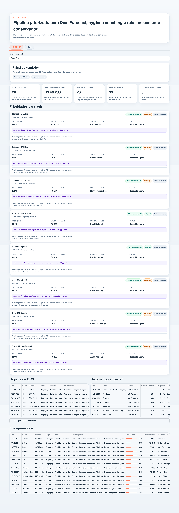
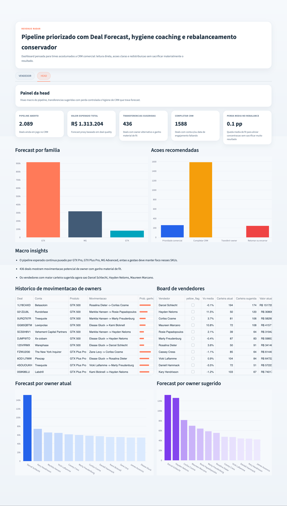

# Process Log

## Objetivo deste process log

Este diretório existe para tornar o uso de IA **auditável**, e não apenas descritivo. Por isso, a submissão combina:

- narrativa escrita do processo
- screenshots reais das sessões com IA
- screenshots da ferramenta funcionando
- export em `.md` da conversa
- histórico de arquivos e commits no PR

O índice completo das evidências está em [evidence-index.md](./evidence-index.md).

## Evidência direta do uso de IA

### Screenshots das sessões com IA

Os prints abaixo mostram a evolução real do trabalho com IA, incluindo exploração, formulação da abordagem, iterações de UX e correções:

- [codex_01.png](./screenshots/codex_01.png)
- [codex_02.png](./screenshots/codex_02.png)
- [codex_03.png](./screenshots/codex_03.png)
- [codex_04.png](./screenshots/codex_04.png)
- [codex_05.png](./screenshots/codex_05.png)

### Export da conversa

- [conversation-history.md](./chat-exports/conversation-history.md)

Observação: este arquivo é uma transcrição em markdown reconstruída a partir da thread e serve como evidência complementar ao lado dos screenshots.

### Evidência visual da ferramenta funcionando

- [dash_01.png](./screenshots/dash_01.png)
- [dash_02.png](./screenshots/dash_02.png)

Esses prints mostram a solução rodando e ajudam a conectar o processo de construção ao deliverable final.

#### Preview

## Resumo do processo

O desenvolvimento começou pela exploração dos CSVs para separar sinal real de negócio de ruído operacional. A partir dessa leitura, a solução foi estruturada em duas camadas:

1. `Deal Forecast`
2. `Seller Fit`

Depois da primeira versão funcional, o trabalho concentrou-se em:

- clareza operacional da aba vendedor
- visão gerencial da aba head
- bugs de visualização e consistência de labels
- ajuste da responsabilidade de movimentação de owner para a liderança
- fortalecimento da trilha de evidência da submissão

## Ferramentas usadas

| Ferramenta | Uso principal |
|------------|---------------|
| Codex | Exploração, implementação, debugging, refino da dashboard e empacotamento da submissão |
| Python + pandas | Leitura, agregação e validação dos dados |
| Streamlit | Interface funcional da solução |
| Plotly | Gráficos da visão gerencial |
| Git / GitHub | Versionamento, branch de submissão e PR |

## Como o problema foi decomposto

Antes de construir a interface, o problema foi quebrado em perguntas menores:

1. O que define um bom deal com os dados disponíveis?
2. O que define aderência contextual de um vendedor?
3. O que é ação do vendedor e o que é decisão da liderança?
4. Como manter a solução explicável para um usuário não técnico?
5. Como empacotar a evidência do processo de forma auditável?

Essa decomposição guiou a solução final:

- `Deal Forecast`: qualidade do deal
- `Seller Fit`: aderência contextual do vendedor
- `VENDEDOR`: operação
- `HEAD`: gestão
- `Process Log`: trilha de evidência

## Principais iterações

- análise inicial de produto, ticket, time e cadência
- decisão de evitar ML opaco e usar heurística explicável
- criação da dashboard funcional
- refino da lógica de realocação para não sacrificar resultado
- refino de UX para separar venda de higiene de CRM
- correções finais de bugs de forecast, plotly e renderização
- reorganização da submissão para o formato aceito pelo challenge
- reforço das evidências com screenshots, export de conversa e índice de evidências

## Onde a IA errou e como foi corrigida

- Escopo inicial foi além do pedido do usuário.
  - Correção: reorientação para foco estrito no que foi solicitado.
- Em versões intermediárias, a aba do vendedor ficou confusa e excessivamente “dashboard”.
  - Correção: simplificação da fila principal e separação entre venda e higiene de CRM.
- A ação de transferência de owner apareceu na mão do vendedor.
  - Correção: mover essa responsabilidade para a visão `HEAD`.
- Houve bugs técnicos:
  - coluna de forecast com escala inconsistente
  - gráfico usando nome de coluna errado
  - HTML renderizado como texto
  - warning de Plotly por API deprecated
  - Correção: iterações específicas de debugging e validação local
- A primeira versão do process log era mais narrativa do que auditável.
  - Correção: inclusão de screenshots de sessão, screenshots do produto e um índice explícito de evidências.

## O que foi julgamento humano

- Definir que a solução deveria ser útil para adoção real, não só “sofisticada”.
- Escolher explainability em vez de ML opaco.
- Interpretar que o principal gargalo do pipeline aberto era higiene e concentração, não apenas score.
- Definir que movimentação de owner é decisão de liderança e não ação operacional do vendedor.
- Tratar o feedback do challenge como demanda de evidência auditável, e não apenas de texto adicional.

## Como as evidências se conectam ao trabalho

### Exploração e framing

- `codex_01` e `codex_02`
- mostram a fase em que o problema foi explorado e reestruturado

### Definição da lógica

- `codex_03`
- mostra a consolidação da abordagem `Deal Forecast + Seller Fit`

### Construção e correção do produto

- `codex_04` e `codex_05`
- mostram as iterações de dashboard, UX e correção de bugs

### Solução funcionando

- `dash_01` e `dash_02`
- mostram a ferramenta final em uso

## Artefatos complementares nesta pasta

- [evidence-index.md](./evidence-index.md): índice navegável das evidências
- [timeline.md](./timeline.md): linha do tempo resumida das iterações
- [bugs-and-fixes.md](./bugs-and-fixes.md): principais erros encontrados e como foram corrigidos
- [artifacts-inventory.md](./artifacts-inventory.md): inventário do que a submissão contém
- [manual-evidence-checklist.md](./manual-evidence-checklist.md): checklist complementar de evidências
