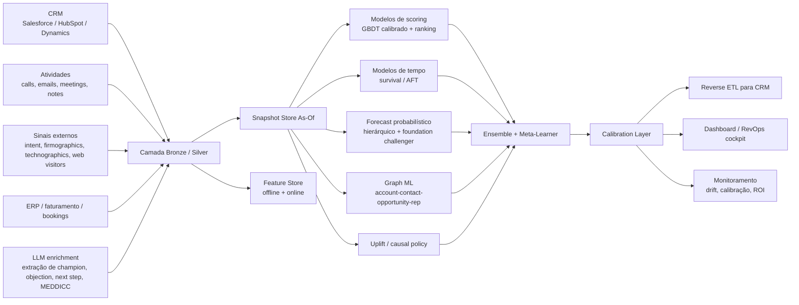
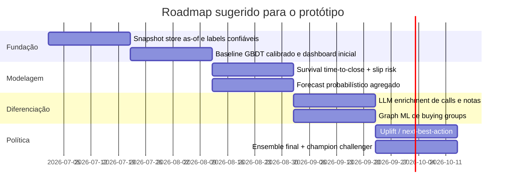
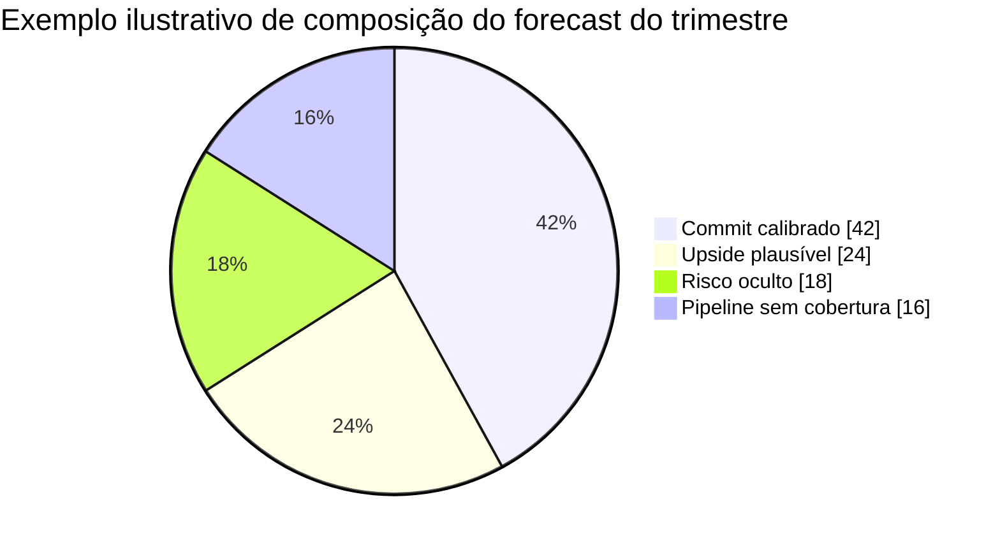

# Forecast em Pipeline de Vendas e Scoring Preditivo Não Convencional

## Resumo executivo

As melhores práticas atuais para **forecast de pipeline** e **scoring comercial** convergem para uma ideia central: tratar o problema não como um único modelo, mas como um **sistema de decisão em múltiplas camadas**. Na prática, isso significa separar pelo menos quatro tarefas: **priorização/ranking** de leads e contas, **probabilidade de fechamento** de oportunidades, **tempo até o fechamento** e **forecast probabilístico agregado de receita**. Esse desenho é consistente com a direção dos CRMs líderes — que já embutem lead/deal/opportunity scoring e predictive forecasting — e com a literatura recente em survival analysis, probabilistic forecasting e tabular ML. citeturn1search8turn27search0turn1search9turn6search0

O ponto mais importante para um sistema “fora da caixa” é que **o estado da arte não é um único algoritmo hypado**. Nos benchmarks mais recentes de tabular ML e forecasting, a mensagem é mais sutil: **GBDTs continuam fortíssimos como baseline**, modelos deep/foundation estão avançando rápido, e **ensembles heterogêneos** seguem dominando quando o orçamento computacional e a disciplina de validação aumentam. O benchmark vivo **TabArena** mostra que GBDTs ainda são contenders muito fortes em dados tabulares práticos; métodos deep learning “alcançaram” os melhores sob maiores budgets; foundation models se destacam em conjuntos menores; e ensembles entre famílias de modelos empurram o estado da arte. Em séries temporais, **Chronos**, **TimesFM** e **Moirai** empurraram a fronteira de **zero-shot forecasting** e transfer learning. citeturn15search8turn5search0turn5search1turn13search1turn15search5

Para um time de vendas B2B, a recomendação técnica mais robusta hoje é construir um **ensemble de cinco blocos**: **GBDT calibrado** para win propensity, **ranking model** para priorização de carteira, **survival model** para time-to-close, **forecast probabilístico hierárquico** para receita agregada e **camada relacional/graph ML** para capturar buying groups, relações entre contatos, reps e contas. Sobre isso, faz sentido adicionar duas alavancas não convencionais: **LLMs para enriquecimento semântico** de calls, e-mails e notas de CRM; e **uplift/causal models** para priorizar não apenas “quem converte”, mas “quem mais melhora se eu intervir agora”. Essa combinação é coerente com a literatura recente de sales lead scoring com LLMs, scoring dinâmico de contas e usuários em B2B, graph forecasting e causal ML. citeturn28search10turn4search8turn6search5turn7search0turn7search1

No mercado, os fornecedores líderes estão se reorganizando em duas categorias. A primeira é a de **plataformas de revenue orchestration / CRM nativo** — como Salesforce, HubSpot, Dynamics, Clari e Gong — que combinam pipeline, forecast, scoring e atividade comercial. A segunda é a de **signal-led GTM platforms** — como 6sense, Demandbase, MadKudu, Common Room, Warmly, Clay e Unify — focadas em buyer intent, account/lead scoring, enrichments e automação da próxima ação. O movimento mais “hypado” em 2025–2026 é justamente esse: **pontuar usando qualquer sinal relevante**, inclusive tráfego anônimo, intent third-party, product usage, job changes, dark-funnel chatter e contexto conversacional, em vez de depender apenas de campos estáticos do CRM. citeturn2search12turn17search15turn16search1turn16search10turn16search18turn16search8

A principal recomendação de governança é simples e decisiva: **nenhum benchmark público substitui backtesting temporal rigoroso em snapshots “as-of” do seu CRM**. Benchmarks públicos são excelentes para escolher classes de modelos, mas forecasting e scoring de pipeline sofrem com leakage temporal, labels atrasados, intervenção humana, mudanças de processo comercial e métricas instáveis. O trabalho sobre a avaliação do M5 mostra que métricas hierárquicas e price-weighted podem se tornar menos estáveis; a literatura de calibration mostra que acurácia sem calibração é insuficiente; e o NIST AI RMF reforça a necessidade de medir, governar e monitorar risco operacional e vieses. citeturn14search14turn11search9turn11search13turn10search0turn25search1

Em termos práticos, se eu tivesse de resumir o estudo em uma frase, seria esta: **para um sistema preditivo de vendas realmente diferenciado em 2026, use CRM + sinais externos + semântica de conversas + relações em grafo + forecast probabilístico + validação temporal séria, e trate foundation models como challengers fortes, não como substitutos automáticos dos bons baselines tabulares**. Essa é a combinação mais alinhada ao que o mercado enterprise está comprando e ao que os benchmarks e papers mais recentes realmente sustentam. citeturn15search8turn5search0turn5search1turn13search1turn28search10turn4search8

## Panorama de mercado, benchmarks e fornecedores

No domínio específico de pipeline B2B, ainda há pouca padronização pública comparável ao que existe em tabular ML e forecasting geral. Por isso, a prática mais sólida é combinar **benchmarks públicos adjacentes** com **backtests internos em snapshots CRM**. A literatura recente de lead scoring continua fortemente baseada em revisões, estudos de caso proprietários e alguns datasets públicos genéricos, como o **X Education dataset**, enquanto trabalhos mais ambiciosos e recentes, como o **HPRO**, usam bases proprietárias e online A/B tests. citeturn12search2turn12search1turn28search4turn28search10

### Benchmarks internacionais prioritários

| Benchmark | O que ele mede | Técnica / lição transferível para vendas | Dados necessários | Pontos fortes | Limitações para pipeline de vendas | Link |
|---|---|---|---|---|---|---|
| **M5 Accuracy / Uncertainty** | Forecast hierárquico de vendas e forecast probabilístico por quantis | Excelente referência para **forecast agregado de receita**, reconciliação hierárquica e losses por quantil | Séries temporais de receita/unidades + calendário + promoções + preço | Contexto de vendas real, multi-séries, com variáveis exógenas e avaliação probabilística | Não captura entidades CRM, buying groups ou ações comerciais; setup de avaliação do M5 tem instabilidades conhecidas sob agregação e price-weighting | citeturn14search17turn14search9turn14search14 |
| **Monash Time Series Forecasting Archive** | Repositório amplo com datasets e baselines de forecasting | Útil para comparar classes de modelos em forecasting before/after fine-tuning | Séries temporais históricas por segmento, rep, produto ou território | 25 datasets, múltiplas frequências e baselines publicados | Não é benchmark de CRM nem de lead/opportunity scoring | citeturn0search6turn0search2turn0search18 |
| **LOTSA / Moirai** | Benchmark de transferência e zero-shot em forecasting foundation models | Relevante para testar foundation models como **challengers** para forecast de pipeline/receita | Grandes corpora de séries temporais; para uso prático, histórico agregado por corte/segmento | 27B observações em 9 domínios; zero-shot competitivo ou superior a modelos full-shot em vários cenários | Não é específico para vendas; requer cuidado para não “overtrust” em domínio novo | citeturn13search1turn13search9 |
| **TabArena** | Benchmark vivo para tabular ML | Excelente guia para escolher entre GBDT, deep tabular e foundation models em **lead/account/opportunity scoring** | Dados estruturados tabulares com labels e splits reproduzíveis | Benchmark “living”; mostra que ensembles avançam SOTA e foundation models brilham em datasets menores | Não é benchmark de pipeline comercial; não modela relações CRM nem tempo até evento | citeturn15search8turn15search5 |
| **OpenML benchmark suites** | Reprodutibilidade em tarefas tabulares | Útil para baseline engineering, tracking e benchmarking de scorers tabulares | Tabelas rotuladas e suites reproduzíveis | Estrutura reprodutível de tarefas, runs e pipelines | Sem foco em CRM, forecast temporal ou uplift | citeturn15search2turn13search10 |
| **OGB** | Benchmarks realistas em graph ML | Melhor referência pública para desenvolvimento de **graph ML** aplicado a contas, contatos, oportunidades e reps | Grafo heterogêneo com nós/arestas e labels | Grande escala, tarefas diversas e avaliação padronizada | Não é benchmark comercial/B2B sales | citeturn15search0turn15search3 |
| **Criteo Uplift Dataset** | Benchmark clássico de uplift modeling | Bom proxy para **próxima melhor ação** e priorização por incrementalidade | Dados com tratamento, outcome e features | Muito usado para benchmarking de uplift; útil para pensar em causal prioritization | Estrutura B2C/adtech; distante do funil B2B enterprise | citeturn13search0turn13search8 |

### Principais fornecedores SaaS para forecast e scoring

| Fornecedor / plataforma | Foco principal | Técnica / proposta | Dados necessários | Pontos fortes | Limitações | Custo estimado | Link |
|---|---|---|---|---|---|---|---|
| **Salesforce Sales Cloud + Revenue Intelligence + Einstein** | CRM nativo, forecast, scoring e analytics | Opportunity scoring com drivers explicáveis; Revenue Intelligence e forecasting embutidos | Leads, contas, oportunidades, atividades, forecast categories, dados CRM e integrações | Forte integração nativa; scoring explicável; amplo ecossistema API; Revenue Intelligence add-on | Custo sobe rápido com add-ons e planos enterprise | **US$ 25–550 por usuário/mês** em Sales Cloud; Revenue Intelligence a partir de **US$ 220/usuário/mês** | citeturn27search0turn27search3turn0search9turn20view0 |
| **HubSpot Sales Hub** | CRM SMB–midmarket com scoring previsivo e agentes | Predictive lead scoring fecha em até 90 dias; deal scores com fatores de impacto; agentes de prospecção/dados | Contatos, empresas, negócios, interações, propriedades CRM | Setup rápido, boa usabilidade, scoring nativo e custos mais transparentes | Menor profundidade analítica enterprise do que stacks especializados de RevOps | **US$ 7–150 por seat/mês**; onboarding em tiers maiores | citeturn1search8turn27search2turn19view3turn17search9 |
| **Microsoft Dynamics 365 Sales** | CRM enterprise com predictive forecasting e opportunity scoring | Forecasting baseado em IA sobre histórico + pipeline; scoring preditivo de lead e oportunidade | Oportunidades, status, histórico CRM, Sales Insights | Forte integração Microsoft, Copilot e pricing enterprise relativamente claro | Menos “hype GTM” que players signal-led; parte do valor depende de Sales Insights e Copilot | **US$ 65–150 por usuário/mês** nos planos base | citeturn1search9turn27search1turn27search4turn18view2 |
| **Clari Forecast / Revenue Orchestration** | Forecast, pipeline inspection, revenue orchestration | Forecasting com IA, deal scoring e Revenue Database com integrações e AI agents | CRM, ERP, e-mail, sinais de deals e execução | Forte em RevOps, inspeção de pipeline e previsibilidade | Geralmente exige operação madura e compra enterprise | **Sob cotação**; pricing “tailored” e sem taxa extra de plataforma para integrações/suporte contínuo | citeturn0search5turn21search8turn23view0 |
| **Gong Forecast / Revenue AI OS** | Forecast com sinais conversacionais e revenue graph | Forecasting guiado por IA, insights sobre calls/e-mails e **connected revenue graph** | CRM + calls + e-mails + execuções de deal | Muito forte para enriquecer forecast com semântica de conversas e risco cedo | Modelo de preço enterprise; dependência de captação robusta de comunicações | **Sob cotação**; licenças por usuário + platform fee | citeturn2search4turn2search12turn22view2 |
| **6sense Sales Intelligence / Revenue Marketing** | Intent, buying journey, predictive AI e buyer groups | Modelos preditivos explicáveis por cliente; score de conta e lead; buyer signals e buying committee | 1st-party + 3rd-party intent + visitors + dados GTM | Muito forte em account scoring e in-market detection; vem empurrando AI copilots e RevvyAI | Menos adequado se o problema central for forecast “board-grade” detalhado por commit/upside | **Free entry + enterprise/add-ons/credits** | citeturn17search15turn1search10turn18view3turn17search7 |
| **Demandbase One** | ABM, account scoring, buying groups e sales/marketing alignment | Scoring e priorização de contas com intent e AI para GTM | Conta, buying group, sinais de intenção, web, campanhas, CRM | Forte em account-based motions e alinhamento Sales+Marketing | Menos orientado a forecast de receita “boardroom” do que Clari/Gong | **Platform fee + flat fee per user** | citeturn1search7turn1search11turn23view2 |
| **MadKudu** | Predictive scoring e intelligence para revenue teams | Scoring combinando fit, product usage, intent, engagement, sinais diversos; integração com copilots via MCP | Product usage, CRM, e-mail, intent, demografia, tecnografia | Muito bom para motions PLG/PQL e scoring explicável orientado a SDR/AE | Preço pouco transparente; menos “suite” de forecast agregado | **Sob cotação** | citeturn2search2turn2search6turn21search18turn21search2 |

### Startups e plataformas “hypadas” de sinais e enriquecimento

| Startup / plataforma | Tese central | Onde brilha | Limitação principal | Link |
|---|---|---|---|---|
| **Common Room** | Scorear leads e contas usando “todos os sinais” — first-, second- e third-party, inclusive dark funnel | Signal-led prioritization, account scoring contextual, automação do burn-down | Menos forte em forecast agregado e governança de previsão | citeturn16search1turn16search13 |
| **Warmly** | Monitorar TAM inteiro por sinais de compra e transformar intent em pipeline | Web visitors, intent, job changes, account scoring explicável | Mais orientado a geração de pipeline do que forecast corporativo | citeturn16search2turn16search10 |
| **Clay** | Enriquecimento multi-provider + scoring custom + execução imediata | ICP scoring, inbound enrichment, personalização | Requer mais arquitetura/composição para virar “sistema” de forecast | citeturn16search7turn16search14turn16search18 |
| **Unify** | Intent signals + AI agents + outbound orchestration em um “system of action” | Outbound signal-led e automação | Menos histórico como plataforma de forecast/RevOps | citeturn16search8turn16search0 |

### Open-source e stack técnico mais útil

Em open source, a combinação mais prática hoje não é uma única plataforma monolítica, mas um stack modular. Para **forecast probabilístico**, **GluonTS** e **sktime** continuam relevantes; para **foundation forecasting**, **Chronos** e **Moirai** têm code/models públicos, enquanto **TimeGPT** opera mais como fundação comercial via API. Para **graph ML**, **PyTorch Geometric** e **DGL** são o padrão de fato; para **feature store**, **Feast**; e para **experimentos, registry, deployment e observabilidade**, **MLflow**. Em tabular scoring, **LightGBM**, **CatBoost**, **XGBoost AFT**, **TabPFN** e challengers deep/tabular compõem a caixa de ferramentas mais útil atualmente. citeturn3search1turn3search4turn5search16turn13search5turn3search2turn24search0turn24search1turn9search1turn24search3turn26search0turn26search3turn7search2turn5search11

## Técnicas, features e engenharia de dados

A forma mais madura de pensar o problema é dividir o sistema em **quatro horizontes de decisão**: **quem merece atenção agora**, **quem deve fechar**, **quando deve fechar** e **quanto de receita o funil realmente suporta**. Isso evita o erro comum de pedir a um único classificador que resolva ranking, cronograma e forecast agregado ao mesmo tempo. CRMs líderes separam explicitamente scoring e forecasting, enquanto a literatura recente em survival e probabilistic forecasting mostra por que tempo até evento e distribuição futura precisam de tratamento próprio. citeturn27search0turn1search9turn6search0turn5search0

### Técnicas avançadas que mais fazem sentido em pipeline de vendas

| Técnica | Onde usar | Por que importa | Ferramentas / referências |
|---|---|---|---|
| **GBDT calibrado** | Win propensity, lead scoring, account scoring | Continua sendo o baseline mais forte para dados tabulares heterogêneos; CatBoost e LightGBM lidam bem com categóricas e ranking | citeturn26search0turn26search3turn7search3turn15search8 |
| **Learning-to-rank** | Priorização de carteira e sequência de atuação | Melhor do que classificação simples quando o problema real é ordenar quem o vendedor deve atacar primeiro | citeturn7search3turn26search5turn28search10 |
| **Survival analysis** | Time-to-close, tempo em estágio, risco de slip | Modela censura e tempo até evento; muito melhor do que regressão ingênua de datas | citeturn6search0turn7search2turn3search7 |
| **Probabilistic forecasting** | Forecast de receita por semana/mês/trimestre | Permite intervalos, quantis, cobertura e decisão sob incerteza, em vez de ponto único | citeturn5search0turn3search1turn14search9turn11search9 |
| **Graph ML heterogêneo** | Buying groups, relacionamento conta-contato-oportunidade-rep | Captura efeitos de rede e múltiplos decisores melhor que tabelas planas | citeturn24search2turn4search8turn15search0 |
| **Causal inference / uplift** | Próxima melhor ação, priorização de intervenções | Distingue “quem ia converter de qualquer jeito” de “quem melhora se eu agir agora” | citeturn7search0turn7search1turn6search2 |
| **Transfer learning / foundation models** | Forecast como challenger zero-shot; tabular com pouco dado | Ajuda quando o histórico interno é curto ou quando se quer acelerar experimentação | citeturn5search0turn5search1turn13search1turn5search11 |
| **Self-supervised tabular** | Pré-treino com muito dado sem label | Útil quando o volume de interações é alto, mas labels de win/loss são escassos ou atrasados | citeturn8search1turn6search7 |
| **LLMs sobre CRM não estruturado** | Enriquecimento semântico, extração de champion/objection/next step/MEDDICC | Traz para o modelo sinais que hoje ficam presos em calls, e-mails e notas | citeturn28search10turn8search0turn2search20 |

A leitura correta dos benchmarks recentes é que **foundation models e LLMs fazem mais sentido como camadas de enriquecimento, pré-treino ou challengers**, não como substitutos automáticos dos bons modelos tabulares. O próprio TabArena mostra que GBDT segue muito competitivo em tabular prático, enquanto foundation models se destacam mais em cenários menores e ensembles entre famílias seguem à frente. Para vendas, isso sugere uma arquitetura em que **LLM e foundation model aumentam o sistema**, mas o coração operacional continua sendo um mix de ranking + GBDT calibrado + survival + probabilístico. citeturn15search8turn5search11turn15search5turn28search10

### Features e engenharia de dados específicas de pipeline

| Entidade | Features recomendadas |
|---|---|
| **Lead / contato** | Canal de origem, senioridade, cargo, domínio de e-mail, resposta a outreach, latência até primeira resposta, visita a pricing/demo, sequência de páginas, eventos de intenção, engajamento em campanhas, uso de trial/produto, fit ICP |
| **Conta** | Firmographics, technographics, crescimento de headcount, vagas abertas, sinais de buying intent, web visitors identificados, completude do buying committee, número de stakeholders ativos, relação histórica com carteira, centralidade no grafo |
| **Oportunidade** | ACV/ARR, produto/mix, estágio, idade, dwell time por estágio, número de regressões de estágio, slips de close date, mudanças de forecast category, frequência de next-step updates, risco competitivo, sponsor/champion detectado |
| **Atividade / conversa** | Calls, e-mails, meetings, resposta do prospect, turn-taking, temas, objeções, pedido de segurança/procurement, menção a concorrentes, presença de champion, clareza de próximos passos, atraso entre atividade e avanço |
| **Rep / gestor / território** | Win rate ajustado por mix, velocidade de follow-up, carga de carteira, tenure, quota pressure, histórico de forecast bias, variação entre commit e actual, sazonalidade por território |
| **Exógenas / mercado** | Calendário, fiscal quarter, feriados, campanhas, pricing/promos, macro proxies relevantes, eventos de produto, mudanças de concorrência |

A maioria dessas features já existe, em bruto, nos principais CRMs e plataformas GTM. Salesforce, HubSpot e Dynamics expõem objetos de leads, deals, companies, opportunities e atividades por API; HubSpot modela explicitamente associações entre contatos, empresas e deals; e vendors como Gong, 6sense, Demandbase, MadKudu e Common Room acrescentam sinais conversacionais, intent, buying groups e contexto relacional. Isso torna viável construir uma **camada de feature engineering “as-of”** sem pedir ao time comercial que preencha mais campos manualmente. citeturn9search18turn9search3turn9search7turn2search12turn17search15turn23view2turn2search2turn16search1

Um ponto especialmente promissor é levar a sério a estrutura **contato–conta–oportunidade–rep–produto** como um **grafo heterogêneo**. A própria documentação do HubSpot mostra que múltiplos contatos podem ser associados a uma empresa e a um deal; o PyG trata diretamente grafos heterogêneos; e a pesquisa em B2B advertising sobre **joint dynamic scoring of accounts and users** mostra que a decisão de compra em B2B é coletiva e dinâmica, não individual. Em outras palavras: flattening total do CRM para uma tabela única joga fora informação demais para problemas enterprise. citeturn9search7turn24search2turn4search8

### Métricas de avaliação que realmente importam

| Camada | Métricas recomendadas | Observação |
|---|---|---|
| **Lead / account scoring** | ROC-AUC, **PR-AUC**, precision@k, recall@k, lift por decil, revenue-weighted precision@k | Em classes raras, PR-AUC é mais informativa do que olhar só ROC-AUC |
| **Probabilidade de fechamento** | **Brier score**, reliability diagrams, calibration slope/intercept, smECE / proper calibration error | Probabilidade “boa” precisa ser calibrada, não só discriminante |
| **Forecast probabilístico** | Pinball loss / quantile loss, cobertura de intervalos, sharpness, CRPS ou métricas análogas, erro agregado de receita | Forecast de board deve vir com intervalo e cobertura, não só ponto |
| **Tempo até fechamento** | C-index, integrated Brier score, erro absoluto mediano de time-to-close | Fundamental para saber “quando”, não só “se” |
| **Negócio** | Revenue-weighted Brier, upside capture, avoided slippage, pipeline created, ROI incremental, attainment forecast error | Métricas de negócio devem coexistir com métricas estatísticas |

A combinação correta é: **discriminação + calibração + valor de negócio**. Para classificação rara, a documentação do scikit-learn reforça que **Precision-Recall** é particularmente útil sob desbalanceamento. Para probabilidades, a literatura recente insiste que **calibration** e **sharpness** são propriedades distintas; maximizar uma sem controlar a outra degrada a utilidade operacional do score. Para forecast probabilístico, o M5 consolidou a prática de avaliar por quantis, e a literatura sobre proper calibration errors ajuda a evitar indicadores de calibração mal estimados. citeturn11search3turn11search9turn14search9turn11search13turn11search6

Para o seu caso, eu recomendo criar ao menos duas métricas customizadas internas. A primeira é um **Revenue-weighted Brier**:

\[
\text{rwBrier}=\frac{\sum_i ARR_i (p_i-y_i)^2}{\sum_i ARR_i}
\]

A segunda é um **Recall@k ponderado por ARR**, medindo quanto da receita potencial total está capturada entre as top oportunidades priorizadas. Essas métricas não substituem Brier e PR-AUC padrão; elas os complementam, alinhando o sistema ao custo real do erro comercial. O cuidado é que o trabalho sobre o setup do M5 mostrou que weighting e agregação podem reduzir estabilidade do ranking entre modelos, então o ideal é reportar **versões weighted e unweighted lado a lado**. citeturn14search14

### Validação temporal e backtesting

A regra de ouro é construir **snapshots “as-of” imutáveis**. Todo exemplo de treino deve refletir o que era conhecido em uma data passada específica. Isso é crucial porque campos como estágio, forecast category, champion detected, next step ou close date costumam ser editados depois do fato, criando leakage devastador se você treina com a visão “final” do CRM. O `TimeSeriesSplit` do scikit-learn existe justamente porque dividir dados temporais como se fossem IID é inadequado; e frameworks de forecasting como sktime, skforecast e GluonTS já incorporam rolling/expanding backtests. citeturn25search1turn25search20turn25search2turn25search4

A melhor prática para pipeline comercial é usar **backtests por coorte temporal e horizonte**. Exemplo: treinar até 31 de março, pontuar o que existia em 1º de abril, avaliar fechamento em 30/60/90 dias; depois avançar a janela. Faça isso por quarter, segmento, território, rep tenure e stage bucket. Some a isso um **gap temporal** para absorver atraso de logging/atualização do CRM, e mantenha sempre um baseline simples: stage-weighted heuristic, forecast do gerente e um GBDT padrão calibrado. Sem esses controles, é fácil “ganhar” offline e perder credibilidade na operação. citeturn25search1turn25search20turn0search5turn27search4

## Papers e whitepapers prioritários

A tabela abaixo prioriza trabalhos dos últimos cinco anos que são, do ponto de vista prático, mais úteis para um sistema preditivo de vendas não convencional.

| Paper / relatório | Ano | Por que priorizar | Como aplicar |
|---|---:|---|---|
| **Rethinking Sales Lead Scoring with LLM-based Hierarchical Preference Ranking** | 2026 | Um dos trabalhos mais diretamente relevantes para lead scoring moderno com CRM estruturado + texto; reporta AUC 0,8161, ganho de precisão no topo do ranking e A/B test online com uplift de vendas | Base para um scorer híbrido com LLM + ranking funnel-aware | citeturn28search10 |
| **The relevance of lead prioritization: a B2B lead scoring model based on machine learning** | 2025 | Caso B2B explícito de lead prioritization em software B2B | Útil para framing operacional e governança de um lead scoring ML em B2B | citeturn12search1 |
| **Effective Implementation of Predictive Sales Analytics** | 2024 | Mostra implementação real de analytics preditivo em vendas B2B, inclusive com field experiment e causal forests | Referência para rollout e adoção comercial, não só métrica offline | citeturn12search0turn12search11 |
| **Chronos: Learning the Language of Time Series** | 2024 | Foundation model probabilístico forte em benchmark amplo; ótimo challenger para forecast agregado | Usar como zero-shot / few-shot challenger no forecast de receita | citeturn5search0turn5search16 |
| **A decoder-only foundation model for time-series forecasting** | 2024 | Paper do **TimesFM**; mostra foundation model prático com bom zero-shot | Challenger barato para séries agregadas por região/rep/produto | citeturn5search1turn5search13 |
| **Unified Training of Universal Time Series Forecasting Transformers** | 2024 | **Moirai + LOTSA**; reforça a tese de universal forecasting em grande escala | Bom para challengers e transfer learning sobre cortes de forecast | citeturn13search1 |
| **Accurate predictions on small data with a tabular foundation model** | 2024 | Nature; consolida o **TabPFN** como foundation model tabular forte em small/medium data | Ideal para challengers em segmentos com poucos exemplos históricos | citeturn5search11 |
| **Drift-Resilient TabPFN** | 2024 | Relevante porque pipeline comercial sofre temporal drift o tempo todo | Bom paper para pensar challengers tabulares sob mudança de regime | citeturn10search6turn10search2 |
| **TabArena: A Living Benchmark for Machine Learning on Tabular Data** | 2025 | Benchmark mais atual para decidir entre GBDT, DL e foundation models em tabular | Deve orientar a régua de benchmarks internos para scoring | citeturn15search8 |
| **B2B Advertising: Joint Dynamic Scoring of Account and Users** | 2022 | Tese muito forte para B2B: compra é decisão coletiva, dinâmica e multiusuário | Inspira account graph + user graph + temporal scoring | citeturn4search8 |
| **Probabilistic Demand Forecasting with Graph Neural Networks** | 2024 | Mostra que relações entre entidades podem melhorar forecasting probabilístico | Base conceitual para forecast com grafo conta-produto-time | citeturn6search5 |
| **Deep Learning for Survival Analysis: A Review** | 2023 | Revisão abrangente de time-to-event em DL | Guia para decidir entre Cox, AFT, RSF, DeepSurv-like e variações | citeturn6search0 |
| **Better Uncertainty Calibration via Proper Scores for Classification and Regression** | 2022 | Relevante para quem quer probability outputs confiáveis | Base teórica para avaliação/calibração séria dos scores | citeturn11search13 |
| **Smooth ECE: Principled Reliability Diagrams via Kernel Smoothing** | 2024 | Melhora visualização e mensuração de calibração | Excelente para dashboards de score calibration | citeturn11search6 |

## Pipeline técnico sugerido para protótipo

A arquitetura recomendada abaixo é propositalmente **não convencional**, mas pragmática: ela combina forecast, scoring, ranking, grafos, LLM enrichment e causal prioritization em uma pilha coerente. O desenho está alinhado ao que os CRMs expõem por API, ao que plataformas GTM vêm monetizando via sinais adicionais e ao que ferramentas open-source maduras já suportam em feature serving, registry e graph learning. citeturn9search18turn9search3turn9search7turn17search15turn2search12turn9search1turn24search3turn24search2

### Arquitetura recomendada

| Módulo | Modelo sugerido | Saída | Frequência |
|---|---|---|---|
| **Lead / account prioritization** | LightGBMRanker ou CatBoost ranking + calibrador | Lista ordenada por propensão e prioridade operacional | Intradiário |
| **Win propensity de oportunidade** | GBDT calibrado com features “as-of” + explicabilidade | Probabilidade de close-won em 30/60/90 dias | Diário |
| **Time-to-close / slip risk** | XGBoost AFT ou survival bayesiano em PyMC | Mediana e intervalo de fechamento esperado | Diário |
| **Forecast agregado de receita** | Modelo probabilístico hierárquico + challenger Chronos/TimesFM/Moirai | Distribuição de receita por semana/mês/trimestre | Semanal |
| **Camada relacional** | Hetero GNN em PyG | Embeddings de conta, oportunidade, rep e buying group | Diário / semanal |
| **Policy / next-best-action** | Uplift com EconML / CausalML | Prioridade de ação incremental por play | Semanal |
| **LLM enrichment** | Extração estruturada + scoring auxiliar por texto | Campos semânticos estruturados e alertas | Intradiário |

### Desenho de features e modelos

A pilha deveria começar com um **baseline deliberadamente forte**: `CatBoost` ou `LightGBM` para lead/opportunity scoring, porque essas bibliotecas têm suporte sólido para categóricas, ranking e alta eficiência. CatBoost recomenda evitar one-hot prévio em muitos cenários; LightGBM faz tratamento eficiente de categóricas; e `LGBMRanker` / objetivos de ranking permitem modelar diretamente a ordenação que o time de vendas quer usar no dia a dia. citeturn26search0turn26search7turn7search3

Sobre esse baseline, eu sugiro três extensões não convencionais. A primeira é um **survival head**, porque o vendedor e o gestor raramente querem só saber “ganha ou perde”; eles querem saber **se fecha neste quarter**. O tutorial oficial do XGBoost para AFT e a revisão recente de survival em deep learning deixam claro por que censura temporal e time-to-event merecem um modelo separado. citeturn7search2turn6search0

A segunda extensão é uma **camada em grafo**. Em CRM, as relações importam: múltiplos contatos ligados à mesma conta; múltiplas oportunidades por conta; reps, gestores, produtos e atividades se influenciando mutuamente. HubSpot documenta explicitamente associações entre records; PyG oferece suporte nativo a heterogeneidade; e o paper sobre scoring dinâmico conjunto de contas e usuários em B2B é uma justificativa fortíssima para não reduzir tudo a uma linha por oportunidade. citeturn9search7turn24search2turn4search8

A terceira extensão é usar **LLMs como extratores, não como oráculos mágicos**. O trabalho HPRO e o TabLLM sugerem que LLMs agregam valor quando transformam texto e tabelas em representações comparáveis e quando entram em arquiteturas discriminativas/ranking-aware. Em vendas, isso significa extrair de calls/e-mails/notas campos como champion presence, procurement risk, competitor mention, clarity of next step, MEDDICC completeness e momentum de compra. Esses artefatos então alimentam os modelos tabulares, survival e de ranking. citeturn28search10turn8search0

### Validação, deploy e monitoramento

O deploy ideal é **batch + event-driven**. Forecast agregado pode ser semanal; scoring de oportunidade e lead pode ser diário; e sinais críticos — como visita a pricing, call com champion, job change no buying group ou atividade de procurement — podem disparar re-score intradiário. O `Feast` ajuda a manter paridade entre treino e serving em offline/online store; o `MLflow` cobre tracking, registry e observabilidade; e as APIs/objetos de Salesforce e HubSpot permitem reverse ETL dos scores para campos visíveis no CRM. citeturn9search1turn9search21turn24search3turn9search0turn9search18turn9search3

No monitoramento, eu recomendo separar cinco trilhas. **Dados**: missingness, freshness, cardinalidade, atraso de integração. **Modelo**: drift de features, drift de predições, estabilidade do ranking, latência. **Probabilidade**: Brier, calibration slope, smECE e confiabilidade por decil. **Negócio**: ARR capturado nas top prioridades, slippage evitado, attainment forecast error, win-rate incremental. **Governança**: análise por segmento, território, porte e fonte de lead para checar enviesamentos e degradation. O NIST AI RMF é uma boa referência de governança; e a literatura recente sobre calibration e temporal shift mostra que drift e miscalibration devem ser tratados como citizens de primeira classe. citeturn10search0turn10search4turn11search13turn10search6

## Roadmap de experimentos e prioridades

O melhor roadmap para esse tipo de sistema é **crescer em camadas**, começando com um baseline extremamente confiável e só depois adicionando componentes “hypados”. O erro mais comum é tentar provar graph ML, LLM enrichment e uplift antes de ter snapshots, labels e calibração sob controle. A literatura e os benchmarks recentes sugerem exatamente o contrário: primeiro forte baseline tabular + backtesting; depois probabilístico/survival; só então componentes relacionais e causais. citeturn15search8turn6search0turn28search10turn7search0

### Prioridades de experimento

| Prioridade | Experimento | Hipótese | Métrica de sucesso |
|---|---|---|---|
| **P0** | Snapshot store + baseline GBDT calibrado | Só corrigir leakage e calibrar bem já melhora muito versus score heurístico/manual | Brier, PR-AUC, calibration slope, top-10% ARR capture |
| **P0** | Baseline de ranking por carteira | Ordenação direta supera classificação em uso operacional | Precision@k, recall@k ponderado por ARR |
| **P1** | Survival / AFT para time-to-close | Separar “quando fecha” melhora commit/upside e reduz slippage | C-index, erro de data de fechamento, slippage hit-rate |
| **P1** | Forecast probabilístico hierárquico | Intervalos e quantis melhoram gestão de risco do quarter | Cobertura, sharpness, pinball loss, attainment error |
| **P2** | LLM enrichment de calls, e-mails e notas | Sinais semânticos elevam ranking de topo e detecção de risco | Lift no topo, ganho de Brier, estudos qualitativos com gestores |
| **P2** | Graph ML sobre conta-contato-oportunidade-rep | Relações e buying groups melhoram account scoring e early warning | PR-AUC account-level, top-k ARR capture |
| **P3** | Uplift / causal prioritization | Selecionar “quem reage à intervenção” supera propensity pura | Incremental pipeline, Qini/uplift gain, A/B holdout |
| **P3** | Foundation challengers (Chronos / TimesFM / TabPFN) | Zero-shot ou few-shot acelera novos segmentos/países/produtos | Ganhos em cold-start, robustez em segmentos pequenos |
| **P4** | Ensemble heterogêneo final | Misturar especialistas por tarefa supera qualquer modelo único | Champion-challenger backtest + piloto controlado |

O gate entre uma fase e outra deve ser duro: **nenhuma fase seguinte entra em produção se a anterior não mostrar ganho consistente em ao menos três janelas temporais independentes**. Em vendas, “ganhou no último quarter” não basta; o sistema precisa sobreviver a mudança de mix, trimestre fiscal, sazonalidade, alteração de pricing, mudança de playbook e turnover comercial. Esse tipo de rigor é mais importante do que perseguir o paper mais recente. citeturn25search1turn10search6turn14search14

## Riscos, vieses, dashboard e monitoramento

### Riscos e vieses mais relevantes

| Risco | Como aparece | Mitigação recomendada |
|---|---|---|
| **Leakage temporal** | Uso de campos editados após o corte, close dates atualizadas, notas retrospectivas | Snapshot “as-of”, janelas com gap, auditoria de colunas e lineage |
| **Viés de label** | “Closed lost” por falta de seguimento ou políticas de roteamento, e não por qualidade do lead | Separar propensão de conversão de probabilidade observada; considerar uplift / policy learning |
| **Viés de intervenção humana** | Bons reps recebem melhores contas; score aprende alocação passada, não mérito intrínseco | Usar features de assignment, efeitos fixos de rep/time e, quando possível, causal ML |
| **Drift de mercado** | Mudança de ICP, pricing, canal, concorrência, quarter-end behavior | Monitoramento contínuo, champion-challenger, re-treino por regime e por coorte |
| **Desbalanceamento extremo** | Poucos wins, especialmente em enterprise | PR-AUC, ranking losses, sampling criterioso, métricas por top-k |
| **Injustiça por segmento / região / fonte** | O modelo prioriza canais ou geografias historicamente sobre-representados | Slices obrigatórios por coorte; fairness review; thresholds e routing diferenciados quando necessário |
| **Black-box mistrust** | Vendedor ignora o score por falta de racional | Exibir top fatores, reason codes, score history e contexto operacional |
| **Risco de LLM** | Hallucinação, extração incorreta, vazamento de dados sensíveis, viés social em classificação tabular | Guardrails, human review amostral, red teaming, versionamento de prompts e avaliações específicas |
| **Otimizar a métrica errada** | Melhor AUC e pior forecast de receita ou pior produtividade de SDR | Combinar métrica estatística com outcome econômico e adoção operacional |

Esses riscos não são teóricos. O NIST AI RMF reforça governança baseada em **medir, mapear e gerenciar** risco; a literatura recente em lead scoring mostra que a área ainda está amadurecendo; MadKudu explicita, no próprio posicionamento comercial, que sem explicabilidade o vendedor não confia no score; e papers recentes sobre fairness em LLMs para tabular mostram que viés social continua sendo uma preocupação real quando LLMs entram em tarefas estruturadas. citeturn10search0turn12search2turn2search2turn10search14

### Visualizações e métricas que devem entrar no dashboard

| Visualização | O que mostrar | Métricas principais |
|---|---|---|
| **Curva de confiabilidade do score** | Probabilidade prevista vs. frequência observada por decil | Brier, calibration slope, smECE |
| **PR curve e lift chart por coorte** | Ganho de ranking em classes raras por segmento/fonte/território | PR-AUC, lift@10%, precision@k |
| **Forecast fan chart por quarter** | Distribuição da receita prevista com intervalos e quantis | Cobertura, sharpness, pinball loss |
| **Bridge de pipeline** | Pipeline inicial → criação → slippage → wins → perdas | Coverage, attainment error, slip rate |
| **Survival curve por estágio** | Tempo esperado até close por estágio/segmento/rep | C-index, mediana de time-to-close |
| **Heatmap de risco oculto** | Oportunidades com alta probabilidade mas baixa higiene operacional, ou o oposto | Risk index, next-step freshness, forecast delta |
| **Top contas por incrementalidade** | Quem deve receber intervenção agora | Uplift/Qini, expected incremental ARR |
| **Mapa relacional do buying group** | Champion, economic buyer, approvers, lacunas de cobertura da conta | Buying-group completeness, graph centrality |
| **Drift panel** | Mudanças na distribuição de features, scores e cohorts | PSI/KS, predição média, calibração por tempo |

O painel abaixo representa uma visualização ilustrativa do que um CRO/RevOps poderia ver como decomposição do forecast do trimestre. Ele é apenas um exemplo de composição visual, não um dado real.

A peça mais importante do dashboard, contudo, não é a pizza nem o ranking das top deals. É a camada de **calibração por horizonte**. Um time comercial perdoa um modelo que “não acerta tudo”; ele não perdoa um modelo que promete 80% e entrega 35%. Por isso, reliability plots, Brier por coorte, score history e cobertura de intervalos deveriam ser tratados como gráficos de primeira linha — não como apêndice estatístico. A literatura recente sobre proper calibration errors e sharpness justifica exatamente essa prioridade. citeturn11search13turn11search9turn11search6

Em resumo operacional, o dashboard ideal deve responder diariamente a quatro perguntas: **em que acreditar**, **onde agir**, **quando fechar** e **quanto do número do quarter está realmente sustentado**. Todo gráfico, alerta e score deveria existir para reduzir a distância entre essas quatro perguntas e a ação do time de vendas. citeturn0search5turn2search4turn17search15turn27search4