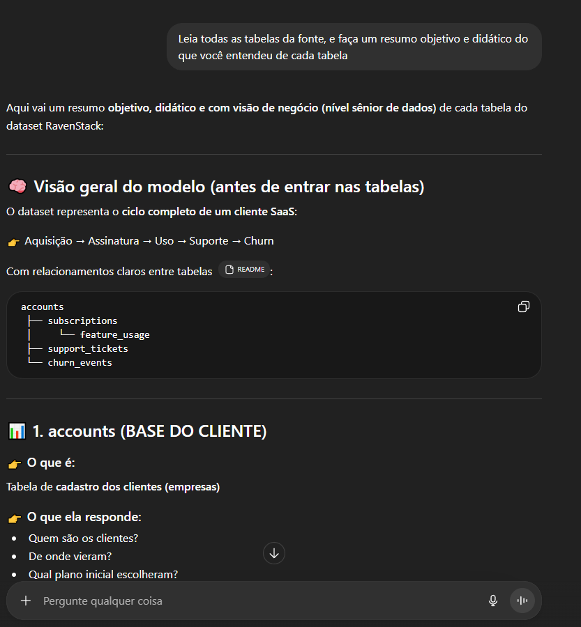
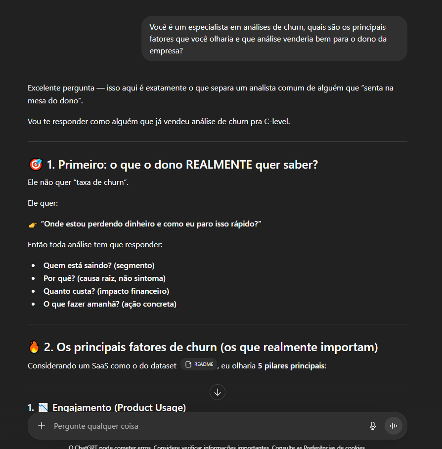
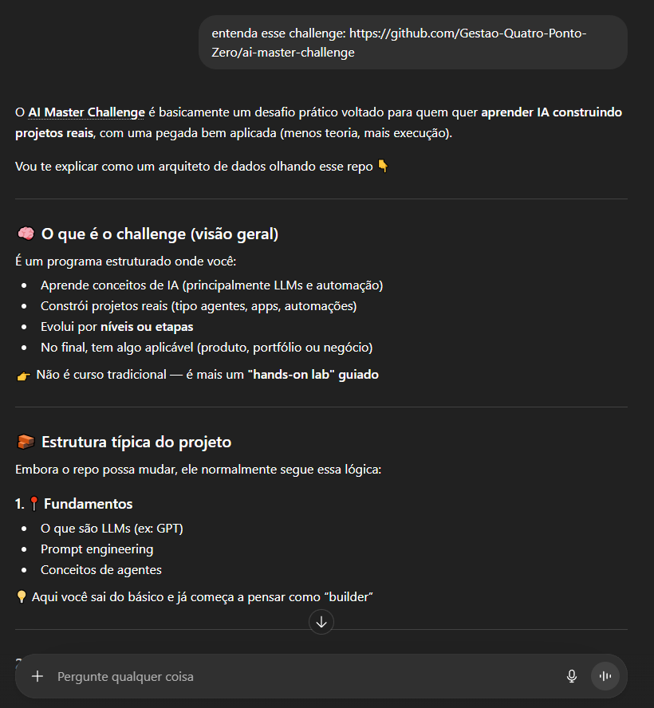
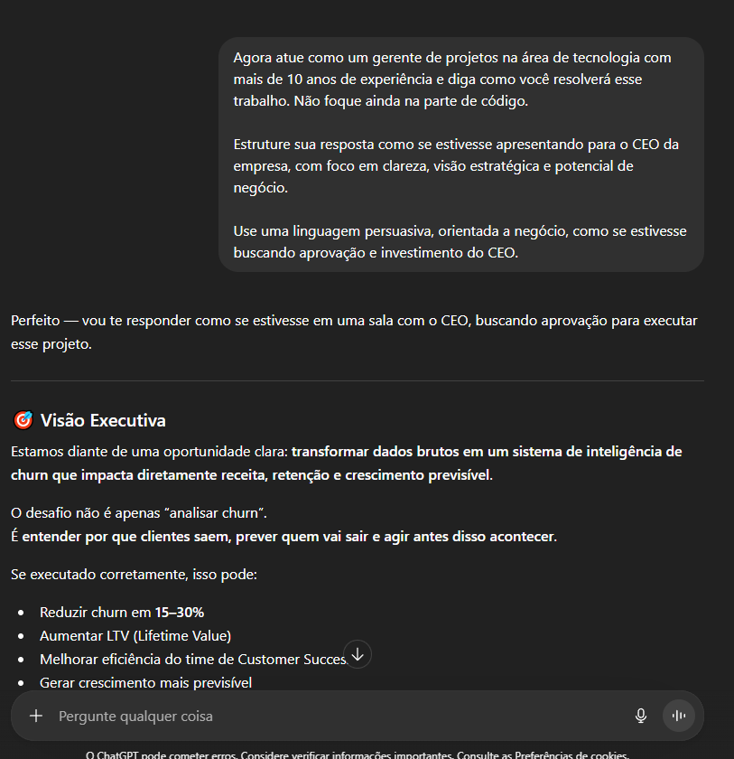
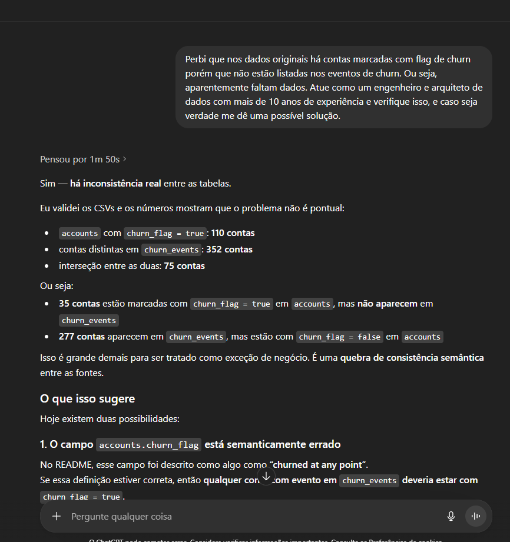
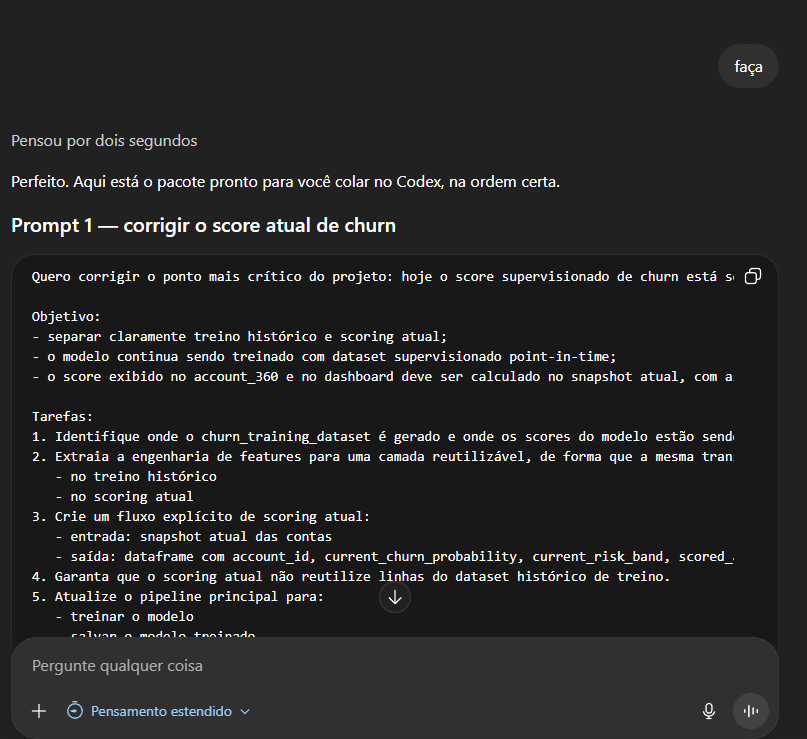
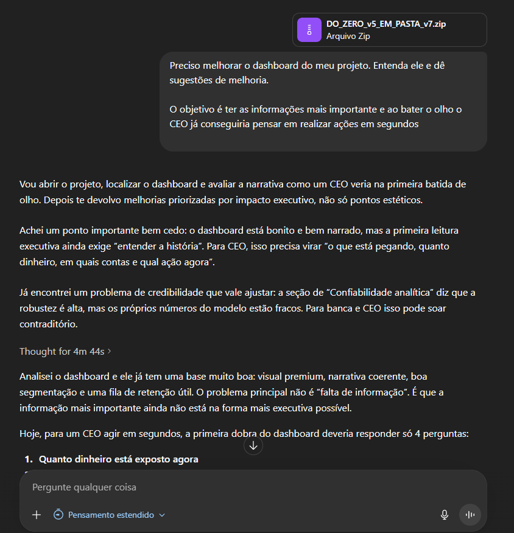
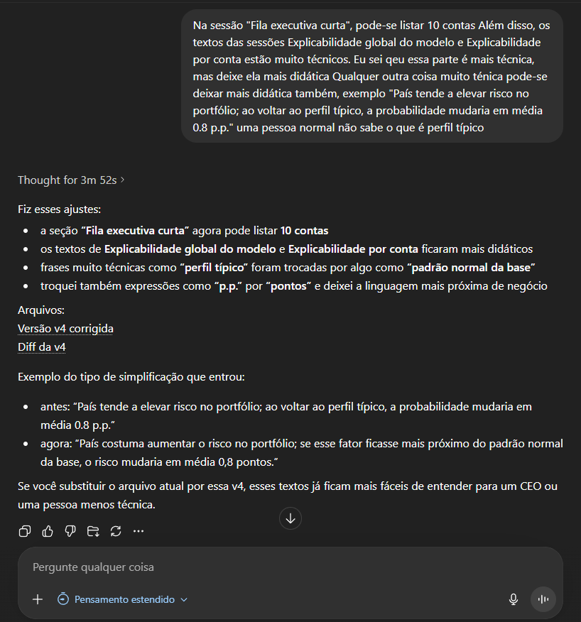
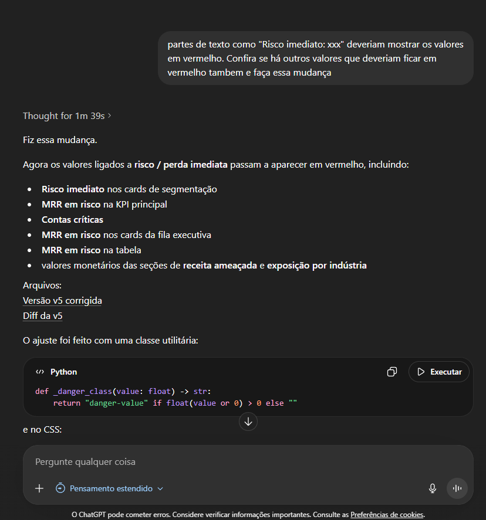
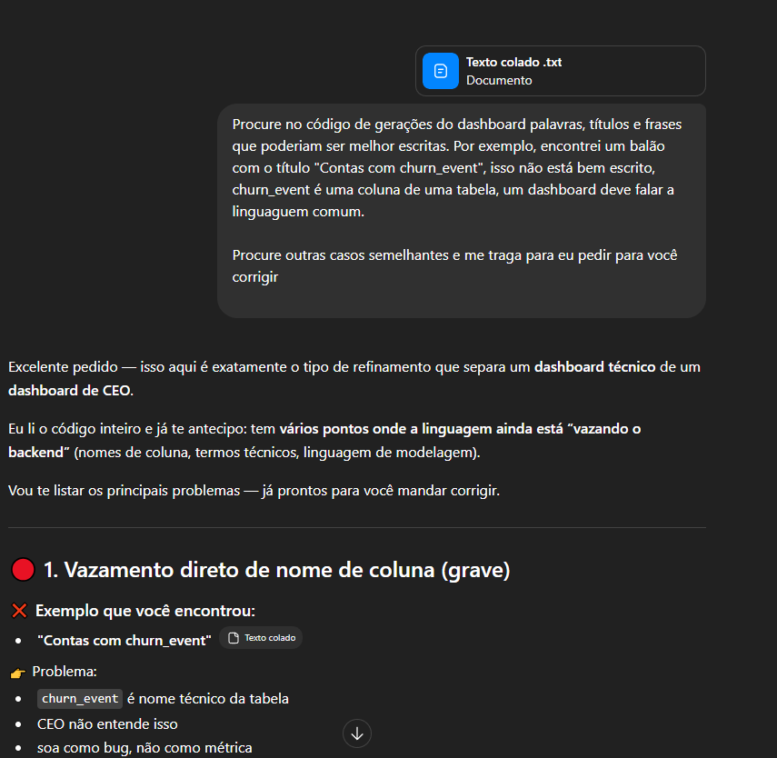

# Process Log — João Paulo Borges — Challenge 001

## Objetivo

Documentar como a IA foi utilizada ao longo da construção da solução, quais foram as etapas do trabalho, onde houve iteração humana e como os resultados finais foram refinados.

## Visão geral do processo

Ao longo do desenvolvimento, utilizei IA como uma ferramenta de aceleração para:

- Estruturar o problema
- Apoiar na implementação técnica
- Refinar a narrativa executiva
- Revisar a entrega final

No entanto, todas as decisões críticas — principalmente relacionadas a modelagem, interpretação dos dados e construção da narrativa — foram conduzidas com julgamento próprio.

## Ferramentas utilizadas

| Ferramenta | Uso |
|---|---|
| ChatGPT | Estruturação do problema, revisão crítica, refinamento narrativo e empacotamento da submissão |
| Codex / assistente de código | Ajustes de implementação, correções, refatorações e apoio técnico |
| Python (pandas, sklearn) | Construção do pipeline de dados e modelo de churn |
| VS Code | Desenvolvimento e organização do projeto |

## Estratégia inicial (antes da IA)

Antes de iniciar o uso intensivo de IA, defini a estrutura do problema em três pilares principais:

1. **Entendimento do churn como problema de negócio**  
   Não basta prever churn — é necessário explicar e permitir ação

2. **Construção de uma base analítica confiável**  
   Consolidar múltiplas tabelas em uma visão única por conta

3. **Tradução para decisão executiva**  
   A solução deveria ser utilizável diretamente por liderança

Essa definição orientou todo o uso posterior de IA.

## Workflow detalhado

### 1. Exploração inicial dos dados

Usei IA para acelerar o entendimento do dataset:

- Relações entre tabelas
- Estrutura dos dados
- Possíveis hipóteses de churn

A IA foi útil para leitura inicial, mas todas as relações foram validadas manualmente.

**Exemplo de evidência:**

### 2. Construção do dataset analítico (account_360)

Essa foi uma das etapas mais iterativas.

Usei IA para sugerir features, incluindo:

- Uso do produto
- Comportamento de suporte
- Histórico de receita

Porém, a implementação foi feita manualmente, com validação de:

- consistência temporal
- duplicidades
- integridade entre tabelas

**Ajuste crítico:**  
A IA inicialmente sugeriu uso direto de `churn_flag`, mas identifiquei inconsistências com a tabela de eventos de churn.  
Corrigi a lógica para refletir melhor o comportamento real.

**Exemplo de evidência:**

### 3. Modelagem de churn

- Iniciei com modelos simples sugeridos pela IA (ex: regressão logística)
- Avaliei desempenho com ROC AUC e Average Precision
- Ajustei features com base em comportamento observado

**Problema identificado:**  
A IA não capturou bem sinais de deterioração recente.

**Correção:**

- Inclusão de features de tendência (queda de uso)
- Rebalanceamento da importância das variáveis

**Exemplo de evidência:**

### 4. Interpretação e identificação de drivers

A IA ajudou a gerar explicações iniciais, porém:

- Muitas eram genéricas
- Pouco conectadas com impacto real

**Ajuste realizado:**

- Priorização de drivers com base em:
  - impacto em receita (MRR)
  - frequência no portfólio
- Tradução para linguagem acionável

**Exemplo de evidência:**

### 5. Construção do dashboard executivo

A IA contribuiu com:

- sugestões de estrutura
- ideias de visualização

Mas as decisões finais foram conduzidas manualmente:

- inclusão de MRR em risco como métrica central
- criação de fila de retenção priorizada
- foco em leitura rápida para tomada de decisão

Também refinei a comunicação para:

- reduzir complexidade técnica
- aumentar clareza executiva

### 6. Iterações finais

Nesta etapa:

- Corrigi inconsistências nos outputs
- Ajustei problemas de visualização (ex: tooltips)
- Simplifiquei seções pouco claras

A IA foi utilizada como apoio, mas a validação foi manual.

## Onde a IA errou e como corrigi

### 1. Interpretação simplificada de churn

A IA tratou churn como variável única, ignorando múltiplos eventos.

**Correção:**

- Uso da tabela de eventos de churn como fonte principal
- Ajuste da definição de churn observado

### 2. Sugestão de features genéricas

Algumas features sugeridas não capturavam contexto temporal.

**Correção:**

- Criação de features de tendência (ex: queda de uso)
- Priorização de sinais recentes

### 3. Explicações pouco acionáveis

As explicações iniciais eram genéricas.

**Correção:**

- Tradução para drivers concretos
- Conexão direta com impacto financeiro

## O que eu adicionei que a IA não faria

- Estruturação do problema com foco em decisão executiva
- Priorização baseada em impacto financeiro (MRR)
- Design do dashboard orientado à ação
- Revisão crítica das respostas da IA
- Simplificação da comunicação para público não técnico

## Evidências anexadas

- [x] Registro escrito do workflow
- [x] Screenshots das interações com IA
- [ ] Export de chats
- [ ] Histórico de commits

## Principais aprendizados

- IA acelera o desenvolvimento, mas não substitui julgamento
- Problemas de churn exigem entendimento de negócio
- O diferencial está na tradução da análise em ação

## Conclusão

A IA foi utilizada como ferramenta de aceleração e apoio ao desenvolvimento.

O resultado final reflete múltiplas iterações, validação crítica e decisões orientadas a negócio, garantindo que a solução seja não apenas tecnicamente correta, mas também acionável.
