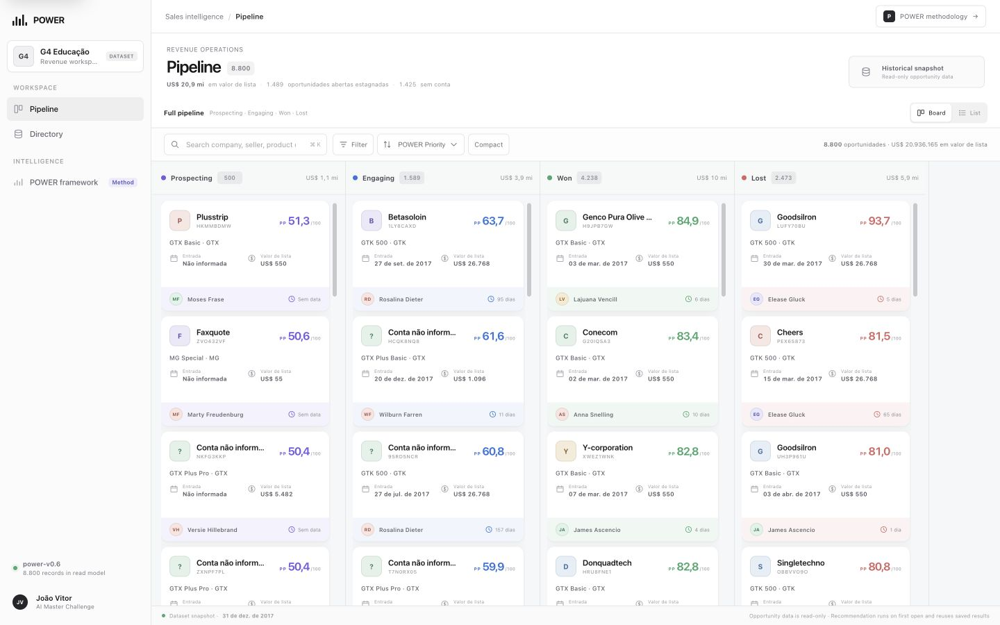
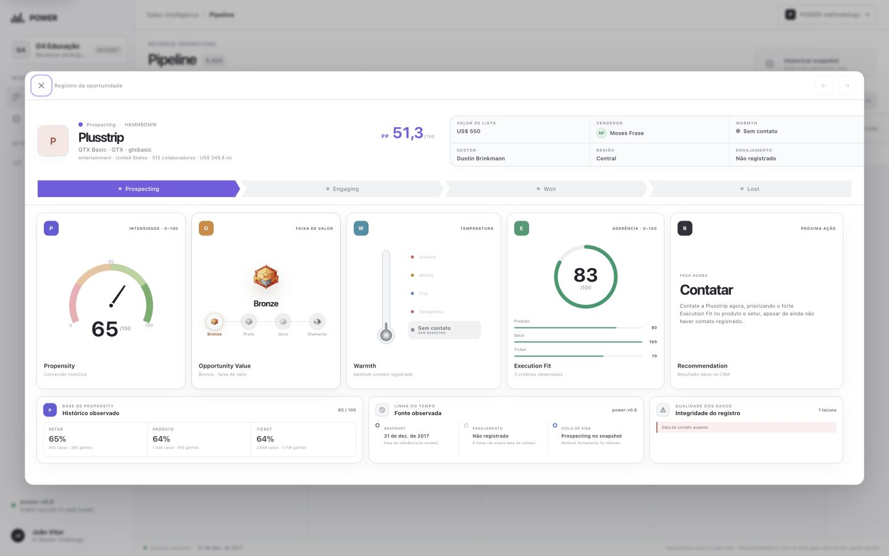

# Submissão: João Vitor Fagundes | Challenge 003

## Sobre mim

- **Nome:** João Vitor Fagundes
- **LinkedIn:** [joão-vitor-fagundes-09460b192](https://www.linkedin.com/in/jo%C3%A3o-vitor-fagundes-09460b192/)
- **Challenge escolhido:** 003: Lead Scorer

## Executive Summary

Construí o **POWER CRM**, uma aplicação funcional que transforma as 8.800 oportunidades do dataset em um pipeline operacional e explicável para o vendedor. O POWER mantém quatro sinais independentes: propensão histórica, valor potencial, frescor e experiência do vendedor. Em seguida, consolida a ordem de atuação no **POWER Priority (PP)** e carrega automaticamente uma próxima ação curta ligada às evidências. O resultado é um CRM que ajuda a decidir onde agir e por quê, mantendo limitações e ausência de dados visíveis.



## Solução

### O que foi entregue

- CRM web com um único pipeline: `Prospecting`, `Engaging`, `Won` e `Lost` aparecem simultaneamente.
- Busca, filtros por vendedor/região/produto/temperatura e ordenações operacionais.
- Scroll independente e renderização incremental em cada coluna para suportar as 8.800 oportunidades.
- Detalhe da oportunidade com o **POWER Profile** e as evidências de cada pilar.
- Recommendation Engine automático na primeira abertura, com saída curta e cache por versão das entradas.
- Diretório derivado de produtos, vendedores, empresas, setores e regiões.
- Documentação visual do framework, auditoria reproduzível e infraestrutura Supabase versionável.



### Como executar

Pré-requisitos: Python 3.9+ e acesso à internet.

```bash
cd submissions/joao-vitor-fagundes/solution
python3 view/server.py
```

Abra [http://127.0.0.1:4173](http://127.0.0.1:4173).

O frontend e o servidor local não exigem instalação de pacotes. O read model público está no Supabase com acesso somente de leitura protegido por RLS; a chave `service_role` e a chave da OpenAI permanecem exclusivamente no ambiente da Edge Function.

Telas principais:

- `/`: pipeline e detalhe das oportunidades;
- `/directory.html`: catálogos derivados do read model;
- `/power-framework`: metodologia, fórmulas, exemplos e guardrails.

Instruções técnicas, reprodução dos dados e arquitetura: [`solution/README.md`](./solution/README.md).

### Como o vendedor usa

1. Seleciona seu nome, região ou produto nos filtros.
2. Trabalha o pipeline por etapa sem perder a visão completa do funil.
3. Abre uma oportunidade para consultar P, O, W e E com suas evidências.
4. Recebe automaticamente o R ao abrir o card; recomendações já salvas são reutilizadas sem nova geração.
5. Mantém a decisão final: o sistema explica e recomenda, mas não executa ações comerciais.

### Lógica POWER

| Pilar | Pergunta respondida | Implementação atual |
|---|---|---|
| **P: Propensity** | Negócios semelhantes costumam ser ganhos? | Taxas históricas de setor, produto, tier de ticket e match completo, ponderadas pela força da amostra. |
| **O: Opportunity Value** | Qual é o impacto econômico potencial? | Preço de catálogo normalizado pelo maior ticket e tier relativo ao catálogo. |
| **W: Warmth** | O negócio ainda está dentro de um ciclo comum? | Idade comparada à distribuição empírica dos 6.711 ciclos encerrados. |
| **E: Execution Fit** | O vendedor possui experiência com esse perfil? | Histórico próprio em produto, setor e tier de ticket. |
| **R: Recommendation** | Qual é a próxima melhor ação? | Prompt estruturado com P/O/W/E, contexto, guardrails e contrato JSON. |

O **POWER Priority** ordena cada etapa do pipeline por `PP = (12P + 3O + 4W + 6E) / 25`. R não entra na equação: ele traduz o perfil em uma ação para o vendedor.

Detalhamento completo: [`docs/power-framework.md`](./docs/power-framework.md), [`docs/power-framework.pdf`](./docs/power-framework.pdf) e a versão navegável em [`docs/power-framework.html`](./docs/power-framework.html).

### Resultados e findings

- **8.800 oportunidades:** 500 Prospecting, 1.589 Engaging, 4.238 Won e 2.473 Lost.
- **63,15% de win rate** entre as 6.711 oportunidades encerradas.
- **2.089 oportunidades ativas**, das quais apenas 664 possuem conta identificada.
- **1.301 Engaging** estão abertas há mais de 138 dias, duração superior ao maior ciclo fechado observado; isso revela um problema real de higiene do pipeline.
- Cobertura dos scores: P em 7.795 registros, O e W em 8.800, E em 7.742.
- A diferença entre produtos de US$ 55 e US$ 26.768 existe no catálogo original e não é erro de importação; O preserva essa diferença e calcula tiers relativos ao catálogo.

Auditoria completa: [`docs/data-audit.md`](./docs/data-audit.md).

### Decisões de produto

- POWER é um perfil explicável, não uma “nota mágica”.
- O board mantém as quatro etapas juntas; não cria pipelines paralelos para ganhos e perdas.
- A ordenação padrão é determinística dentro de cada etapa: maior `POWER Priority` primeiro; o PP aplica `(12P + 3O + 4W + 6E) / 25`.
- P e E respeitam o tempo: um registro histórico não usa seu próprio resultado nem negócios encerrados depois do momento avaliado.
- R é gerado automaticamente na primeira abertura do card e armazenado em cache, evitando 8.800 chamadas de IA sem necessidade.
- Campos ausentes e histórico insuficiente aparecem como indisponíveis, nunca como evidência negativa inventada.

### Recomendações para evolução

1. Validar a ordenação com feedback real de vendedores e métricas de ação/conversão.
2. Calibrar P em uma janela temporal fora da amostra antes de chamá-lo de probabilidade.
3. Incorporar atividades, stakeholders, motivos de perda e origem do lead quando disponíveis.
4. Definir bandas firmográficas antes de incluir Company Fit em E.
5. Adicionar autenticação e escopo por vendedor antes de usar dados comerciais reais.

### Limitações

- O dataset é público, fictício e representa um snapshot de 2017.
- Não há última atividade, mudança de estágio, stakeholders, origem, motivo de perda ou valor previsto pelo vendedor.
- Produto e tier de ticket são correlacionados nesta base.
- P é um índice histórico explicável, não uma probabilidade calibrada.
- PP ordena ações dentro de cada etapa; não foi treinado como classificador de `Won` versus `Lost`. Em etapas encerradas, prioriza expansão ou reativação, não tenta prever um resultado já conhecido.
- O backend demonstrativo depende do projeto Supabase informado no setup; a migração e os scripts permitem reconstrução, mas as credenciais privadas não são versionadas.
- R depende da disponibilidade da Edge Function e da API do modelo; P, O, W e E continuam utilizáveis sem a recomendação.

## Process Log: Como usei IA

O processo curado, incluindo iterações, erros da IA e decisões humanas, está em [`process-log/README.md`](./process-log/README.md).

## Evidências e documentação

- [Process Log](./process-log/README.md)
- [Auditoria de dados](./docs/data-audit.md)
- [POWER Framework: versão resumida](./docs/power-framework.md)
- [POWER Framework: PDF para revisão](./docs/power-framework.pdf)
- [POWER Framework: documentação visual](./docs/power-framework.html)
- [Código e setup](./solution/README.md)

> Estado deste documento: preparado para revisão pré-submissão em 28/08/2026. Nenhum PR foi criado.
