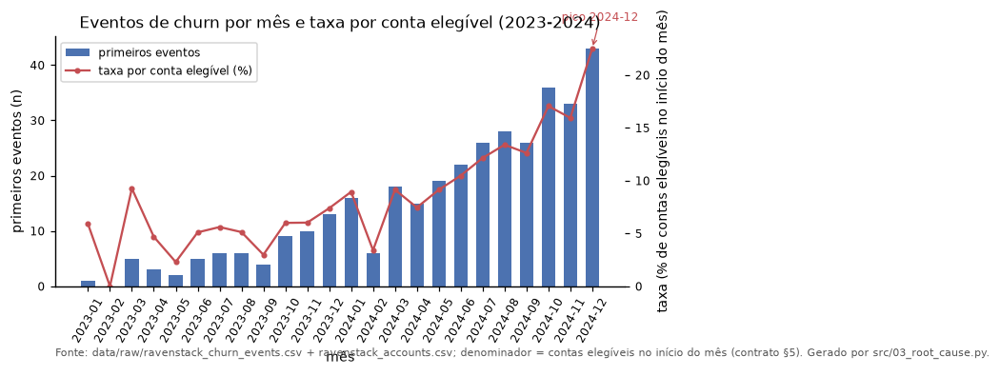
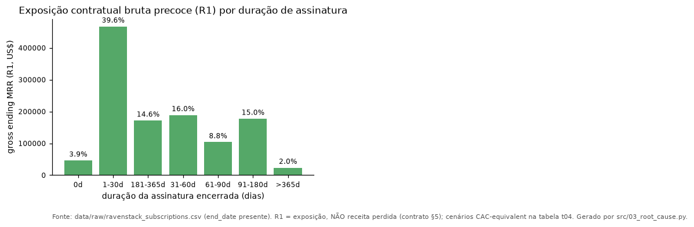
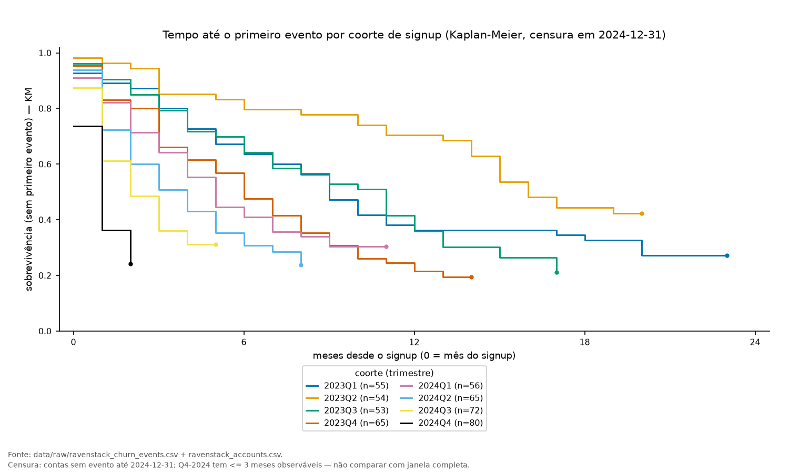
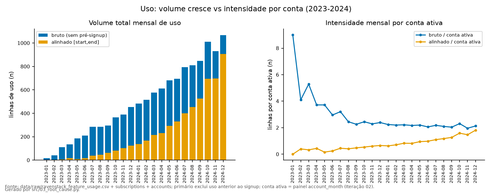
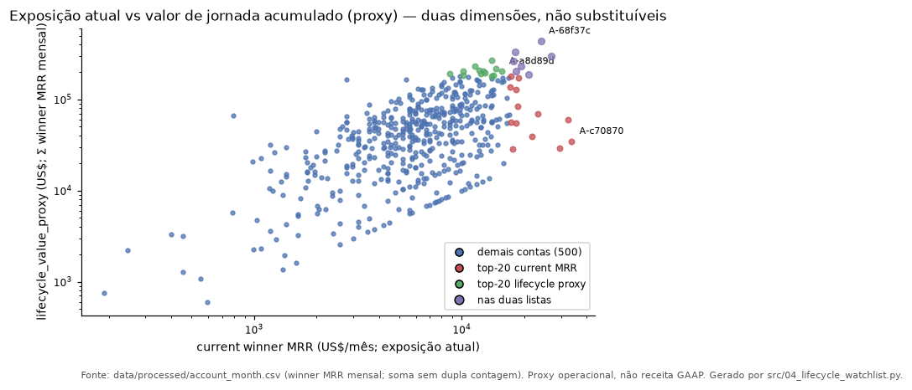
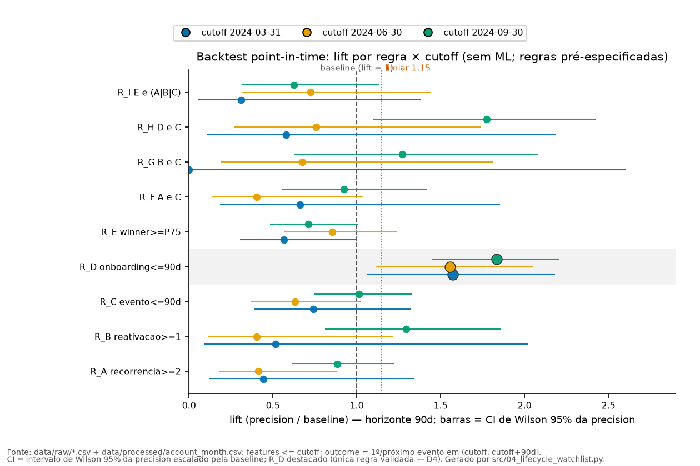

# Relatório Executivo — Diagnóstico de Churn (RavenStack)

*Gerado por `solution/src/07_generate_executive_report.py` a partir dos
artefatos validados (Iterações 01–06); janela 2023-01-01..2024-12-31 (corte
2024-12-31). Todo número tem origem em tabela/evidence linkada (seção 10).*

## 1. Executive summary — decisão solicitada

**Mensagem central:** o churn subiu porque contas recém-adquiridas estão
saindo nos primeiros 90 dias de vida — **churn precoce de onboarding** — e não
por insatisfação geral, por queda de uso ou por um segmento específico. A base
não permite provar causa: o padrão é uma **hipótese causal plausível**, com o
único sinal validado temporalmente em backtest. Por isso a recomendação não é
"uma campanha de retenção": é instrumentar e testar.

**O que aconteceu:** em dezembro de 2024, 43 contas tiveram o
primeiro evento de churn (22,51% das 191 contas
elegíveis do mês), vs mediana de 13,01% nos 6 meses anteriores. O
mês teve 117 episódios no total; os 43 são o hazard
de *primeiro* evento. A composição do pico é decisiva: 83,7% dele
vem de contas com 0–3 meses de vida, e 53,4% dos primeiros eventos
da janela acontecem até 90 dias do signup. O resto do negócio não explica o
movimento (uso total +225,3% com intensidade mediana
0,0%; suporte e CSAT sem diferença material).

**Tamanho e incerteza:** as 80 contas em onboarding somam
621.981 US$/mês de winner MRR (seção 5). Um
programa de ativação bem desenhado poderia afetar, em cenário base de
planejamento, 6,9 eventos e 53.497 US$ de
exposição MRR-equivalent em 90 dias — faixa 2,7–13,0
eventos e 21.104–101.078 US$ (premissas na seção 7;
exposição, não perda). A incerteza é grande: menor efeito detectável a 80%
de poder = 68% / 51% / 37% de redução relativa.

**Decisão solicitada (Now):**
1. **ACT-03 — Instrumentação (Now, SLA ≤ 30d):** milestone de ativação, reason
   estruturado e timestamps alinhados. Sem isso não há medição confiável (CSAT
   com nota 58,8%; 'unknown' 15,8%; vínculo
   evento-assinatura 21,0%).
2. **ACT-01 — Programa de ativação/onboarding 0–90d (Now, após ACT-03):**
   rollout gradual com holdout (experimento); escala só com evidência
   estatística (GO exige IC95 excluindo 0).
3. **ACT-02 — Triage semanal da watchlist top-20 (Now, em paralelo):**
   392.030 US$/mês (10,7% da exposição atual);
   ACT-04 (reativação/recorrência) fica para depois (Later).

## 2. Como medimos churn (lentes; nunca misturar)

As três fontes de "churn" **não medem a mesma coisa**; cada pergunta usa uma
lente declarada (contrato: [analytical-contract.md](docs/analytical-contract.md)
§4):

| Pergunta | Lente | Fonte | Contagem |
|---|---|---|---|
| Quem está churnado hoje (corte 2024-12-31) | A — snapshot `accounts.churn_flag` | `accounts` | 110 contas |
| Quanto MRR contratual termina (exposição, não perda) | B — assinaturas com `end_date` na janela (R1) | `subscriptions` | 486 assinaturas / 312 contas |
| Por que os clientes saem (diagnóstico) | C — eventos de churn | `churn_events` | 600 eventos / 352 contas |
| Estado atual da conta (winner MRR; risco) | painel account-month | `data/processed` | 500 contas (all-active no corte) |

**Regra de ouro:** 110 ≠ 486 ≠
600 não são três medições do mesmo fenômeno — não podem ser
somadas, subtraídas ou usadas como alvo alternativo. Exemplo: dezembro/2024
teve **117 episódios**, dos quais **43 são
primeiros eventos** de contas distintas — o relatório usa primeiro evento para
hazard e coortes. Para receita há duas lentes: **R1** (gross ending MRR,
exposição contratual bruta de 1.179.139 US$ na janela — teto, não perda)
e **R2** (estado líquido: 18.507 + 150.817 = 169.324
US$); o relatório usa R1 e winner MRR, com nomes declarados.

## 3. O que mudou — causa raiz (hipótese causal plausível)

**O pico é real e é de contas novas.** Dezembro/2024: **43
primeiros eventos** sobre 191 elegíveis = **22,51%**
vs mediana de **13,01%** nos 6 meses anteriores (razão 1,73)
e 7,42% na janela; o aumento persiste com tenure controlado
(esperado 24,82, observado 43).

*Leitura: regime elevado com pico em dez/24.*

**O mecanismo é o onboarding.** Do pico, 83,7% (36 de
43) são contas com 0–3 meses de vida (razão 2,37 vs
linha de base do bucket). Na janela: **53,4%** dos primeiros eventos
(188 de 352) ocorrem até 90 dias do signup (30d:
25,9%; 60d: 42,6%); e **68,4%** da exposição
contratual da janela (806.419 de 1.179.139 US$) vem de
assinaturas com até 90 dias de vida — exposição precoce, não perda.

*Leitura: 68,4% da exposição bruta está em assinaturas ≤ 90d —
perder cliente novo é o problema dominante.*

**Coortes recentes churnam mais cedo (com censura).** Kaplan-Meier (censura
no corte): churn no mês 6 de 58,9% (2024Q1) e 69,2%
(2024Q2); coortes 2024Q3/Q4 têm follow-up curto (≤ 3 meses) e não devem ser
comparadas à janela completa — a taxa observada subestima o churn recente.
Taxa global na janela: 70,4% das contas.

*Leitura: coortes mais recentes churnam mais cedo.*

**Status de causalidade:** o conjunto (pico de contas novas + exposição
precoce + única regra validada) sustenta a **hipótese causal plausível** de
churn precoce — **não é prova**. Causalidade exigiria dados de
ativação (ACT-03) e experimento (ACT-01). Tabela:
[out/tables/t09_causality.csv](out/tables/t09_causality.csv).

## 4. O que não explica o churn (evita narrativa falsa)

**"O uso cresceu" é verdade em volume, não por conta.** Linhas de uso (sem
pré-signup): 2.775 → 9.027 (+225,3%);
intensidade mediana por conta-mês: 0,0%. O crescimento vem de
mais contas ativas, não de contas mais engajadas.

*Leitura: volume cresce; intensidade por conta não.*

**Suporte e CSAT não discriminam.** Antes do evento (janela de 90 dias,
anti-leakage): tickets/conta 0,309 (churn) vs 0,349
(controle); escalação 2,8% vs 5,1%; CSAT 4,0
vs 3,97 — sem diferença material. Hipótese H4 (uso pré-evento
precede churn) foi **refutada após correção**: zero-uso 61,7% vs 52,7%
(versão anterior contava meses pré-signup como zero).

**Segmentos amplos não discriminam** (industry/canal/plano/trial): nenhum com
taxa ≥ 1,5× a global (limiar inalcançável com taxa global de 70,4%);
maior gap de KM: 6,9 p.p. **Reasons e CSAT não são confiáveis como
causa:** 41,2% de CSAT nulos, 15,8% de reasons
'unknown', e 21,0% dos eventos não têm assinatura encerrada ±30d
(lentes decopladas).

## 5. Segmentos e contas em atenção (estados de jornada, não industry)

Os segmentos que importam são **estados de jornada**, não indústria (overlap
em [out/tables/t15b_segment_overlap.csv](out/tables/t15b_segment_overlap.csv));
nenhum é score de risco — sinal de backtest em cada linha.

| Segmento | N | Current MRR | Sinal de backtest |
|---|---|---|---|
| S1 Onboarding (tenure ≤ 90d) | 80 | 621.981 | **validado** (lift 1,57 · 1,56 · 1,83) |
| S2 Repeat-event (≥2 eventos) | 175 | 1.245.634 | sem lift (regra A: 0,44/0,41/0,89) |
| S3 Reativação recente (flag out-dez/2024) | 25 | 179.256 | sem lift (regra B: 0,52/0,41/1,29) |
| S4 Evento recente (último evento ≤ 90d) | 178 | 1.299.245 | sem lift (regra C: 0,74/0,63/1,01) |
| S5 Alto valor (winner ≥ P75) | 130 | 1.780.851 | sem lift (regra E: 0,56/0,85/0,71) |

- **S1 Onboarding:** mecanismo do pico (0–3m: 83,7%, razão 2,37) e exposição precoce (R1 ≤ 90d: 68,4% da janela) — hipótese causal plausível.
- **S2 Repeat-event:** 175 contas, 70,5% dos episódios; não prediz o próximo.
- **S3 Reativação recente:** KM 90d = 0,653 (censura declarada); não é ciclo de estado.
- **S4 Evento recente:** janela acionável de CS, não predição.
- **S5 Alto valor:** exposição, não risco.

**Watchlist top-20 (operational priority, nunca score):** cobre
**392.030 US$/mês = 10,7%** da exposição atual
(3.668.852 US$/mês): **8 onboarding validadas**,
**12 exposure-only** (sem sinal validado — não rotular
risco). Completa:
[out/tables/t16_watchlist_top20.csv](out/tables/t16_watchlist_top20.csv);
jornada: [out/tables/t11_account_lifecycle.csv](out/tables/t11_account_lifecycle.csv).

*Leitura: jornada e MRR atual são complementares.*

**Contas específicas (10 de 20 — 8 validadas + 2 de maior exposição):**

| Conta | Grupo | Winner MRR (US$/mês) | Evidência | Limitação |
|---|---|---|---|---|
| A-c70870 | validated_onboarding | 33.830 | onboarding ≤90d — sinal validado | associação, não predição |
| A-18793f | validated_onboarding | 29.452 | onboarding ≤90d — sinal validado | associação, não predição |
| A-d4e0d4 | validated_onboarding | 23.283 | onboarding ≤90d — sinal validado | associação, não predição |
| A-ce550d | validated_onboarding | 21.691 | onboarding ≤90d — sinal validado | associação, não predição |
| A-66224b | validated_onboarding | 18.308 | onboarding ≤90d — sinal validado | associação, não predição |
| A-b48f73 | validated_onboarding | 15.920 | onboarding ≤90d — sinal validado | associação, não predição |
| A-76fa4d | validated_onboarding | 13.731 | onboarding ≤90d — sinal validado | associação, não predição |
| A-82d8a6 | validated_onboarding | 13.532 | onboarding ≤90d — sinal validado | associação, não predição |
| A-56962b | exposure_only | 32.437 | exposure-only: revisão de conta/renovação | sem sinal validado — não rotular risco |
| A-68f37c | exposure_only | 24.079 | exposure-only: revisão de conta/renovação | sem sinal validado — não rotular risco |

## 6. Ações priorizadas

**Sequência:** ACT-03 (Now) → ACT-01 (Now, após readiness) · ACT-02 (Now,
paralelo) · ACT-04 (Later). Sem score: evidência + impacto + esforço; stop/go
por linha ([t18](out/tables/t18_actions_prioritized.csv) ·
[t20](out/tables/t20_measurement_plan.csv)).

| ID | Ação (resumo) | Decisão | Owner | Prazo | 1º sinal (leading) | Stop/Go (resumo) |
|---|---|---|---|---|---|---|
| ACT-01 | Programa de ativação/onboarding 0-90d: m | Now | PM Onboarding (desenho | 90d (1ª coorte completa do rollout | milestone_completion_rate (s | GO (SCALE): redução relativa estimada >= 10% |
| ACT-02 | Triage operacional semanal da watchlist | Now | CS Lead + agente CS | 1 semana | triage_coverage_weekly (sema | GO: >= 90% do top-20 triaged/semana por 4 se |
| ACT-03 | Instrumentação de dados: milestone de at | Now | Data/Product Eng | <= 30d (SLA do milestone de ativação | field_coverage (semanal) · u | GO: milestone de ativação em produção <= 30d |
| ACT-04 | Piloto OBSERVACIONAL de reativação/recor | Later | CS + Data | 1 trimestre (primeiras reativações c | reactivation_followup (mensa | GO (escalar): taxa de próximo evento <= 90d |

**Regra de decisão do ACT-01 (3 estados;
[evidence/05_action_plan.md](evidence/05_action_plan.md) §5):** SCALE/GO =
redução ≥ 10% **e** IC95 exclui 0; CONTINUE/LEARN = ponto favorável, IC95 cruza
0; STOP/HARM = efeito adverso ou guardrail falhado. 1ª decisão em 2
trimestres; escala em 4 trimestres + 90d. O único sinal que justifica o
programa é o lift do backtest: **1,57 · 1,56 · 1,83** (3 cutoffs de 90d, N ≥ 25)
— a única regra consistente:

*Leitura: só onboarding (R_D) passa do limiar 1,15.*

## 7. Impacto em faixa (planejado, não medido)

**Fórmula (só ACT-01 tem estimativa defensável):** eventos afetados = N ×
incidência 90d × redução; exposição afetada = Σ winner MRR × incidência ×
redução (componentes em
[out/tables/t19_impact_sensitivity.csv](out/tables/t19_impact_sensitivity.csv)):

| Cenário | Incidência 90d | N | Eventos esp. 90d | Redução | Eventos afetados | Exposição afetada (US$/90d) |
|---|---|---|---|---|---|---|
| conservador | 0,3393 | 80 | 27,1 | 10% | 2,7 | 21.104 |
| base | 0,4301 | 80 | 34,4 | 20% | 6,9 | 53.497 |
| ambicioso | 0,5417 | 80 | 43,3 | 30% | 13,0 | 101.078 |

**Premissas e honestidade:**
- Incidência 90d = precisão pooled da regra de onboarding
  (83/193 = 0,4301); faixa observada entre
  cutoffs 0,3393–0,5417 — **faixa observada, não
  intervalo de confiança** (CI de Wilson 95%: 0,362–0,501);
- Redução relativa 10/20/30% = **premissa de planejamento** (nenhum programa
  existe na base; lift é associação, não efeito) — testada pelo experimento
  ACT-01;
- Base: 80 contas onboarding, 621.981 US$/mês
  de winner MRR;
- Nomenclatura: **exposure afetada no cenário** — exposição, não perda; nada
  é previsão; eventos ≠ logos ≠ revenue churn (lentes);
- **Poder estatístico:** fluxo ~68 signups/trimestre; MDE a 80% de poder =
  **68% / 51% / 37%**; poder por cenário: **11% / 31% / 61%** (10/20/30%) —
  inconclusivo NÃO é ausência de efeito; P(falso GO) ≈ **24%**;
  escala exige IC95 excluindo 0.

## 8. O que não fazer agora

1. **ML/score preditivo** — nenhuma regra além de onboarding valida
   temporalmente; score sem validação é claim falso.
2. **Desconto generalizado** — sem custos na base, seria preço inventado;
   nenhuma evidência de que preço dirige o churn precoce.
3. **Decisão por reason/CSAT** — evidência sugestiva com missingness alta
   (41,2% de CSAT nulos; 15,8% de reasons 'unknown').
4. **Automação de churn** — sem validação causal; começa pela experimentação
   (ACT-01), nunca sem holdout.
5. **ROI pontual / revenue saved / "reativação mais barata"** — proibido nesta
   base (sem CAC/winback; R1 é exposição).

## 9. Limitações e próximos dados

- **Base sintética** ([evidence/01_audit_report.md](evidence/01_audit_report.md)
  §5): padrões podem refletir o gerador; nada é extrapolado sem rótulo.
- **Lentes decopladas:** 21,0% dos eventos têm assinatura encerrada
  ±30d; o snapshot marca 110 contas churnadas, mas o estado
  por assinatura mantém as 500 ativas no corte (**all-active**) —
  "perda real de estado" não é validável no presente; o backtest usa eventos
  históricos como desfecho.
- **Proxies:** winner MRR é estado/exposição, não receita contábil;
  lifecycle_value_proxy é soma mensal de winner (não GAAP).
- **Poder baixo:** MDE 68% / 51% / 37%; N pequenos limitam conclusões finas.
- **Próximos dados (ACT-03):** milestone de ativação (não capturado), reason
  estruturado ('unknown' < 5%), timestamps alinhados (uso em janela:
  22,3%), CSAT ≥ 90% (hoje 58,8%) — o caminho
  para causalidade real.

## 10. Reprodução e evidence map

**Reprodução (1 comando, offline, determinístico):** `./run.sh` (ou `make all`)
regenera os artefatos das Iterações 01–07, incluindo este relatório, em
~65–75 s (aproximação medida) — [README da solução](README.md) §6;
`06_verify_pipeline.py` valida estrutura, links, imagens e claims.

**Mapa de evidência (auditável):**

| Achado | Status | Auditoria |
|---|---|---|
| Churn precoce de onboarding (pico dez/24 + tenure 0–3m) | hipótese causal plausível | [t01](out/tables/t01_monthly_series.csv) · [t03](out/tables/t03_onboarding_buckets.csv) · [t03b](out/tables/t03b_onboarding_accounts.csv) |
| Único sinal com validação temporal (onboarding ≤ 90d) | validado em backtest | [t14](out/tables/t14_backtest_temporal.csv) · [t14b](out/tables/t14b_backtest_detail.csv) |
| Uso cresce em volume, não por conta | descritivo | [t05](out/tables/t05_usage_monthly.csv) |
| Suporte/CSAT/reasons sem discriminação/confiabilidade | não identificável | [t06](out/tables/t06_support_monthly.csv) · [t10](out/tables/t10_hypothesis_verdicts.csv) |
| Segmentos amplos sem heterogeneidade material | descritivo | [t07](out/tables/t07_segments.csv) · [t09](out/tables/t09_causality.csv) |
| Watchlist top-20 = priorização operacional/exposição | sem score | [t16](out/tables/t16_watchlist_top20.csv) · [t21](out/tables/t21_watchlist_split_actions.csv) |
| Ações, impacto e medição | premissas nomeadas | [t18](out/tables/t18_actions_prioritized.csv) · [t19](out/tables/t19_impact_sensitivity.csv) · [t20](out/tables/t20_measurement_plan.csv) |

**Evidências (It01–05):**
[01](evidence/01_audit_report.md) · [02](evidence/02_consistency_report.md) ·
[03](evidence/03_root_cause_report.md) ·
[04](evidence/04_lifecycle_watchlist_report.md) ·
[05](evidence/05_action_plan.md) · contrato:
[docs/analytical-contract.md](docs/analytical-contract.md).

**Processo (narrativa e decisões):**
[outline](../process-log/decisions/iteration-07-executive-report-outline.md) ·
[prompt](../process-log/prompts/iteration-07-prompt.md) ·
[report de processo](../process-log/reports/iteration-07-executive-report.md).

**Gráficos:** os 6 deste relatório estão em `out/charts/` (manifesto fechado).
