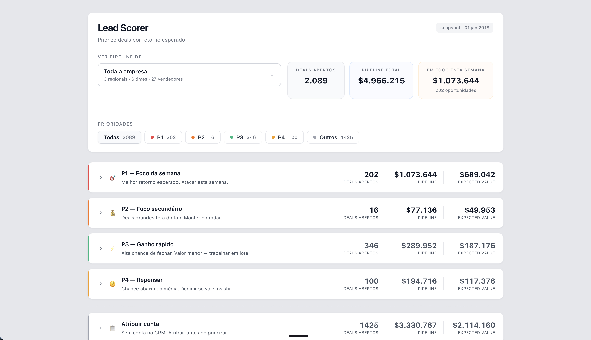

# Submissão. Juan Ordoñez. Challenge 003 Lead Scorer



## Sobre mim

- **Nome:** Juan Ordoñez
- **LinkedIn:** [linkedin.com/in/juanordn](https://www.linkedin.com/in/juanordn/)
- **Challenge escolhido:** `build-003-lead-scorer`

---

## Executive Summary

Construí uma ferramenta web que prioriza o pipeline de vendas de 2.089 deals abertos usando scoring empírico calibrado em 6.711 deals históricos. A exploração dos dados revelou que o dataset é de cross-sell numa base fixa de 85 contas, que variáveis consideradas óbvias (setor, região, tamanho da conta) não têm impacto relevante nos resultados, e que o sinal mais forte vem da combinação do perfil do vendedor com a novidade da relação vendedor × conta × produto. A ferramenta entrega a cada vendedor um ranking pessoal de até 15 deals prioritários por semana, o que chamamos de Prioridade 1, com explicação em linguagem natural de por que cada deal está ali. Recomendação principal: dois terços do pipeline (1.425 deals) não têm conta atribuída no CRM. Resolver isso deve vir antes de qualquer otimização de priorização.

---

## Solução

### Abordagem

1. **Exploração antes de construir:** Antes de propor qualquer solução, rodei 6 scripts de análise exploratória (`eda/01` a `eda/06`) que mapearam a estrutura dos dados, taxas de conversão por todos os recortes disponíveis (produto, setor, vendedor, manager, região, tamanho da conta), o comportamento temporal do pipeline, e o histórico de recompra das contas. O objetivo era descobrir o que realmente influencia o fechamento antes de investir tempo numa solução.

2. **Score empírico em vez de machine learning:** Avaliei três caminhos: heurística com pesos manuais, lookup empírico em grupos calibrados nos dados, e regressão logística. Escolhi o lookup empírico porque cada probabilidade pode ser defendida com "baseado em N casos históricos do mesmo perfil". O vendedor entende de onde o número vem. Um modelo de ML seria mais sofisticado estatisticamente, mas produziria coeficientes que nenhum vendedor consegue interpretar.

3. **Ranking por vendedor, não limites de corte fixos:** A primeira versão usava limites de corte fixos (thresholds) para classificar deals em categorias. Ao testar, a maioria dos deals caía em categorias genéricas que não ajudavam o vendedor a decidir o que fazer. Basicamente a ferramenta estava rotulando em vez de priorizando. A solução foi trocar para um ranking relativo: o "Foco da semana" (Prioridade 1) é o top 30% do pipeline de cada vendedor ordenado por retorno esperado (chance × valor), com até 15 deals. Cada vendedor recebe uma lista pessoal e proporcional ao tamanho do seu pipeline.

4. **Front estático sem build:** A ferramenta é um arquivo HTML que abre com duplo clique, sem servidor, sem build, sem dependência de rede. Os dados são pré-computados em Python e embutidos como `data.js`. Essa decisão priorizou confiabilidade (funciona em qualquer máquina) sobre sofisticação tecnológica.

### Resultados / Findings

**Achados da exploração:**

- **Taxa de conversão global de 63,2%:** isso é alto. Significa que o problema da equipe de vendas não é a capacidade de fechar negócios, a taxa já é boa. O problema real é **alocação de tempo**: com 194 deals abertos (caso do vendedor Darcel Schlecht, que tem 3× a mediana), é impossível decidir no feeling quais atacar primeiro. A ferramenta existe pra resolver esse problema de priorização, não pra melhorar a taxa de conversão em si.

- **Vendedor individual**: diferença de 15 pontos percentuais entre os melhores (70%) e os piores (55%) vendedores, única variável humana com impacto real no resultado.

- **Variáveis descartadas com evidência**: setor (diferença de 4pp entre o melhor e o pior), manager (2,3pp), região (1,4pp), receita da conta (4,5pp), número de funcionários (2,6pp), ano de fundação (3,2pp), subsidiária (0,6pp). Nenhuma dessas variáveis mostrava uma diferença significativa entre categorias. A distância entre "melhor" e "pior" grupo era menor que 5 pontos percentuais em todas elas, insuficiente para justificar inclusão no score.

- **Deals perdidos morrem rápido, deals ganhos demoram**: mediana dos deals perdidos = 14 dias, mediana dos ganhos = 57 dias. Deals "velhos" no pipeline não são sinal de risco. Pelo contrário, deals que sobrevivem mais de 120 dias no pipeline fecham em 76% dos casos. Essa descoberta mudou como a ferramenta comunica a idade dos deals ao vendedor.

- **Interação entre variáveis**: testei se o perfil do vendedor e o tipo de combo (novo vs recorrente) tinham efeito multiplicativo (um potencializando o outro) ou simplesmente somavam seus efeitos. Usando uma matriz cruzada de 6 grupos com 800 a 2.000 deals cada, a diferença entre o efeito real e o efeito aditivo previsto foi menor que 0,6 ponto percentual em todos os casos. Conclusão: os efeitos se somam, não se multiplicam, o que permite usar uma fórmula simples sem perder precisão.

**O que a ferramenta entrega:**

- **5 categorias de prioridade** com ação clara: Prioridade 1 (Foco da semana), Prioridade 2 (Foco secundário), Prioridade 3 (Ganho rápido), Prioridade 4 (Repensar), e Atribuir conta (fora da escala de prioridade, por ser bloqueio estrutural por falta de dados no CRM)
- **Dropdown com filtro por vendedor, time ou região:** 3 visões no mesmo seletor. Na visão de time, o pipeline de todos os vendedores do manager é agregado como união dos focos individuais
- **Cards expandíveis** com explicação personalizada ("Primeira vez oferecendo GTX Pro pra Donquadtech. Vendedores como você fecham 64% em cenários similares") e LTV da conta
- **Coluna Relação** mostrando Cliente (o vendedor já vendeu pra essa conta no passado) ou Prospect (primeiro contato do vendedor com essa conta), baseado no histórico real, não em suposição

### Recomendações

1. **Resolver o backlog de "Atribuir conta":** 1.425 deals (68% do pipeline aberto) não têm conta atribuída no CRM. Sem essa informação, a ferramenta não consegue priorizá-los. Ação imediata: uma blitz de qualificação de pipeline resolveria o maior gargalo antes de qualquer otimização.

2. **Focar Prioridade 1 na segunda de manhã:** cada vendedor tem até 15 deals com melhor retorno esperado. Se o vendedor trabalhar só esses na semana, maximiza resultado com mínimo esforço de decisão.

3. **Revisar Prioridade 4 mensalmente:** deals com chance abaixo da média global (63%) devem ser reavaliados conscientemente: vale insistir ou realocar tempo para deals com melhor retorno?

4. **Em produção, incluir data de última atividade:** o dataset do desafio não contém um campo de "último contato" ou "último update no CRM". Esse campo simplesmente não existe nos dados fornecidos. Em um ambiente real, ele seria a variável mais importante para detectar deals parados: um deal sem contato há 30 dias exige ação diferente de um deal atualizado ontem. Recomendo que o time de RevOps crie esse campo no CRM como primeiro passo antes de colocar a ferramenta em produção.

---

## Limitações

### Calibração sem divisão temporal

O perfil do vendedor e a calibração dos grupos são calculados sobre **todo o histórico fechado** do dataset, sem divisão por período. Em produção, usaríamos uma **janela móvel** (ex: últimos 90 dias) para evitar que resultados antigos dominem a avaliação atual do vendedor. Um vendedor que teve um trimestre ruim há 18 meses e melhorou não deveria ser penalizado hoje.

A decisão de usar todo o histórico foi consciente: para um exercício offline com ~6.700 deals fechados, dividir por período reduziria a amostra por grupo e aumentaria o ruído. O trade-off está documentado aqui para transparência.

### Data de referência fixa em 01 de janeiro de 2018

O dataset é estático e cobre o período de 2016 a 2017. A ferramenta usa `2018-01-01` como data de referência para calcular "há quantos dias o deal está aberto". Essa data foi escolhida como `max(close_date) + 1 dia`, ou seja, o dia seguinte ao último deal fechado no dataset. Se usássemos a data de hoje (abril de 2026), todos os deals apareceriam como "abertos há mais de 3.000 dias", o que não faz sentido. Em produção, a data de referência seria `datetime.now()` e os cálculos seriam dinâmicos.

### Ausência de data de última atividade

O dataset não contém "última interação", "último update no CRM", ou equivalente. Esse campo simplesmente não existe nos dados do desafio. Em um CRM real, ele seria a variável mais valiosa para detectar deals "parados" vs deals "em andamento". Sem ele, a ferramenta reconhece apenas `engage_date` e `close_date`, o que limita a capacidade de distinguir entre um deal que está sendo ativamente trabalhado e um que foi esquecido. Em produção, recomendo que o time de RevOps crie esse campo como prioridade.

### Dados estáticos vs integração em tempo real

A ferramenta atual opera sobre um snapshot estático: os CSVs são lidos uma vez pelo Python, convertidos em `data.js`, e o HTML consome esse arquivo pré-computado. Se um deal fechar ou um novo entrar no pipeline, a ferramenta não reflete a mudança até alguém rodar `build_data.py` novamente. Em produção, a arquitetura seria diferente: conexão via API com o CRM (Salesforce, HubSpot, ou equivalente), recálculo do score em tempo real ou com refresh periódico (ex: a cada hora), e notificações automáticas quando deals mudam de prioridade. A escolha de dados estáticos neste desafio foi intencional. Permite que a ferramenta funcione sem servidor e sem dependências externas, priorizando que o avaliador consiga abrir e testar com um duplo clique.

### Definição de "combo novo"

`is_new_combo` considera que uma combinação (vendedor, conta, produto) é "nova" se nunca apareceu antes no histórico ordenado por data de engajamento. Inclui deals abertos no passado como histórico (não só fechados), para ser consistente entre o tempo de calibração e o tempo de scoring. Um viés possível: o primeiro deal registrado no dataset pode não ser o primeiro real, pode ser apenas o primeiro no recorte temporal. Sem dados anteriores a 2016, não há como validar.

---

## Process Log: Como usei IA

### Ferramentas usadas

| Ferramenta | Para que usou |
|---|---|
| **Claude Code** (Opus 4.6, 1M context) | Exploração dos dados, análise estatística, decisões de arquitetura, refatoração do motor de score, geração do data.js, construção do front. Todo o trabalho técnico foi feito em conversa direta com o modelo, comigo direcionando as decisões e o modelo executando. |
| **Lovable** | Exploração de UI. Gerei uma versão React que serviu como referência visual de layout, tipografia e espaçamento. Repliquei o estilo no nosso HTML estático. |
| **[Almond Voice](https://www.almondvoice.com)** | Gravação de áudio e transcrição direta na terminal do Claude Code. Permitiu ditar instruções e decisões em vez de digitar, acelerando a comunicação com o modelo. |
| **Codex** | Revisão geral final do projeto antes da submissão. Validação de integridade, coerência entre motor e interface, e checagem de que a entrega atende aos critérios do desafio. |
| **pandas / numpy** | Análise tabular, joins, agregações, feature engineering. |

### Workflow

1. **Análise exploratória:** Rodei 6 scripts de análise (`eda/01` a `eda/06`) que mapearam estrutura dos dados, taxas de conversão por todos os recortes, tempo no pipeline, e interação entre variáveis. Claude Code gerou os scripts; eu direcionei as perguntas ("separa por vendedor", "testa se as variáveis se potencializam") e validei se os achados faziam sentido antes de seguir.

2. **Desenho do score:** Avaliei 3 caminhos (heurística com pesos manuais, lookup empírico, regressão logística). Escolhi lookup empírico por explicabilidade. Claude propôs a estrutura de cálculo; eu questionei se as variáveis se potencializavam, ou seja, se um bom vendedor num cenário favorável teria resultado muito melhor que a soma dos dois efeitos separados. Forçamos uma validação com dados reais: comparamos o resultado observado com o resultado previsto pela soma simples, e a diferença foi desprezível (menos de 0,6 ponto percentual em todos os grupos). Isso confirmou que a fórmula podia ser simples.

3. **Taxonomia e UX:** Iteramos 3 versões dos nomes das categorias até chegar em Prioridade 1 a 4 com ações claras. A primeira versão usava limites de corte fixos, mas na prática a maioria dos deals caía em categorias genéricas (como "Acompanhar") que não ajudavam o vendedor a decidir nada, era como dizer "continue fazendo o que já faz". Identifiquei esse problema e propus mudar para ranking relativo por vendedor. Essa foi a decisão mais importante do projeto.

4. **Implementação:** Motor em Python (`score.py` + `build_data.py`), front em HTML estático com Tailwind CSS e Alpine.js. Usei Lovable pra explorar o layout visual (gerando uma versão React como referência), depois repliquei o estilo no nosso HTML estático pra manter a arquitetura simples e sem dependências de build.

5. **Validação:** Fiz uma auditoria completa do motor antes de submeter. Verifiquei que as probabilidades calculadas para cada grupo reproduziam as taxas de conversão observadas nos dados históricos (diferença menor que 1 ponto percentual em todos os 6 grupos). Selecionei 10 deals aleatórios e confirmei que os números no motor batiam exatamente com os números no arquivo de dados da interface. Verifiquei que o ranking do vendedor com mais pipeline (Darcel Schlecht, 194 deals) continha exatamente os 15 deals com maior retorno esperado. Conferi que as contagens agregadas por manager e região somavam ao total global.

### Onde a IA errou e como corrigi

1. **Cálculo de "combo novo" sobre base incompleta:** Na primeira versão, o Claude calculou o efeito de "combo novo" usando apenas deals já fechados, ignorando os deals abertos que já existiam no pipeline. Isso inflou o efeito para ~10 pontos percentuais, fazendo a variável parecer mais poderosa do que realmente era. Identifiquei a inconsistência ao perceber que os números tinham mudado entre rodadas de análise. Quando incluí deals abertos no histórico (que é o cenário real de uso), o efeito caiu para ~4 pontos percentuais, mais modesto, mas mais fiel à realidade.

2. **Limites de corte copiados do script exploratório sem validação:** O script de exploração usava valores arbitrários (0.70, 0.60, 0.55) que foram "chutados" pra ter algo funcional rapidamente. Ao refatorar para o motor final, esses números foram inicialmente copiados por inércia. Corrigi reescrevendo a função de classificação do zero com um limite de 0.63, alinhado à taxa de conversão global de 63,2% observada nos dados.

3. **Texto da explicação em linguagem técnica:** A primeira versão gerava frases como "68% é o win rate histórico de vendedores top em combos novos (1052 deals similares)." Identifiquei que "win rate", "vendedores top" e "combos novos" são termos que um vendedor não usa. Corrigi para "Vendedores como você fecham 68% em cenários similares", pessoal, direto, sem jargão.

4. **Distribuição desequilibrada de categorias:** Com a primeira fórmula baseada em limites de corte fixos, 56% dos deals caíam numa categoria genérica que não ajudava o vendedor a entender o que fazer. A IA considerou a distribuição aceitável. Forcei a discussão e a solução nasceu do meu questionamento: trocar de limites fixos para ranking relativo por vendedor, garantindo que cada vendedor recebe até 15 deals no "Foco da semana".

### O que eu adicionei que a IA sozinha não faria

- **Rejeição de variáveis "óbvias"**: setor da conta, região do escritório, tamanho da empresa. Essas são variáveis que qualquer modelo incluiria por default. Exigi que cada uma provasse impacto real nos dados antes de entrar. Nenhuma passou do limiar mínimo (diferença entre melhor e pior grupo menor que 5 pontos percentuais em todas). O resultado é um score com menos variáveis mas mais defendável

- **De limites fixos para ranking relativo**: a IA propôs limites de corte fixos e aceitou a distribuição resultante. Identifiquei que a maioria dos deals caía em categorias genéricas e que a ferramenta estava rotulando em vez de priorizando. Forcei a mudança para ranking por vendedor. Essa foi a decisão mais importante do projeto, porque é o que transforma a ferramenta de "dashboard com números" em "instrumento de decisão pessoal"

- **Filtragem de informações irrelevantes para o vendedor**: a IA sugeriu diversas informações técnicas para exibir na interface, como o "retorno esperado" (probabilidade multiplicada pelo valor, que resultava num número em reais que confundia com o valor real do deal), quantidade de "casos similares" usados na calibração, nível de confiança estatística, e categorias de tipo de deal que tinham distribuição de 99% concentrada num único valor. Vetei todas essas sugestões porque, do ponto de vista do vendedor, nenhuma delas muda a decisão. O vendedor precisa saber o que fazer, não como o modelo foi calibrado

- **Linguagem de vendedor, não de analista**: forcei 3 iterações no texto da explicação até chegar numa versão sem jargão. Também renomeei as categorias e colunas até ficarem acionáveis (Prioridade 1 em vez de "Agir hoje", coluna Relação com Cliente/Prospect em vez de "Tipo")

- **Todo o design visual e a experiência do usuário**: layout em estilo de CRM profissional (inspirado em Notion e Linear), dropdown com 3 seções (regionais, times, vendedores), sistema de cores por prioridade com cores suaves ao expandir, contrastes altos para leitura rápida, badges com texto preto, espaçamento generoso entre colunas, cards expandíveis com seta indicativa, seção "Atribuir conta" separada visualmente e agrupada por produto. A IA gerou versões rudimentares da interface; todas as iterações de refinamento visual foram direcionadas por mim

- **HTML estático em vez de Streamlit**: a IA sugeriu Streamlit como stack. Argumentei que Streamlit tem aparência de ferramenta interna de análise de dados, funcional mas sem cara de produto que um vendedor usaria no dia a dia. Escolhi HTML estático porque abre com duplo clique, não precisa de servidor, e permite controle total sobre o visual

---

## Evidências

- [x] Decisões detalhadas e cronologia dos pivôs: `process-log/decisoes.md`
- [ ] Evidências visuais do processo (PDF consolidado): `process-log/evidencias-processo.pdf`
- [x] Código-fonte versionado: `score/`, `web/`
- [x] Git history com commits descritivos

---

## Como rodar

### Para ver a ferramenta (mais rápido)

Abra o arquivo diretamente no navegador, não precisa de servidor:

```
submissions/juan-ordonez/web/index.html
```

Duplo clique no arquivo ou arraste para o Chrome. Funciona offline, sem dependências.

### Para regenerar os dados do zero

Se quiser rodar o motor de score e regenerar o `data.js` a partir dos CSVs originais:

```bash
cd submissions/juan-ordonez/score
pip install pandas numpy       # dependências (se não tiver)
python score.py                # self-test do motor
python build_data.py           # gera ../web/data.js
```

Depois abra `web/index.html` normalmente.

**Dataset:** [CRM Sales Predictive Analytics](https://www.kaggle.com/datasets/agungpambudi/crm-sales-predictive-analytics) (licença CC0), incluído completo em `data/` (5 arquivos: `accounts.csv`, `products.csv`, `sales_teams.csv`, `sales_pipeline.csv`, `metadata.csv`).

---

_Submissão enviada em: 11 de abril de 2026_
