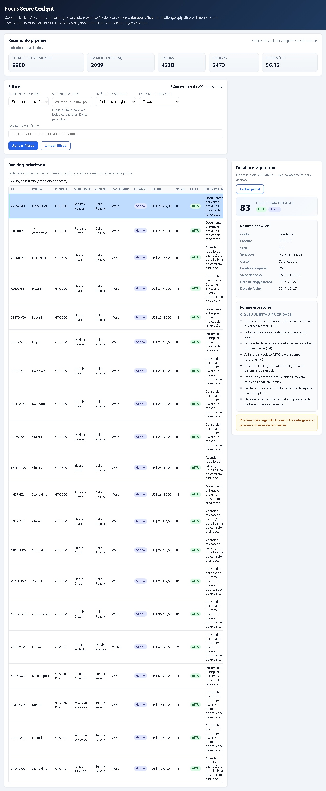
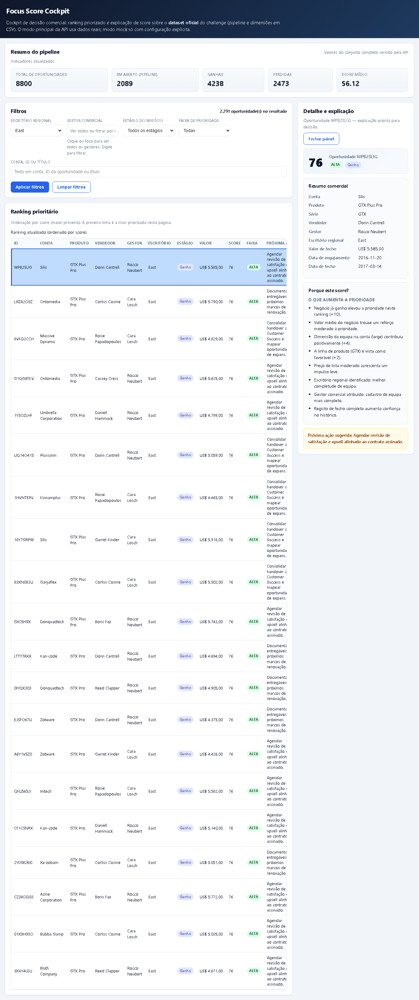
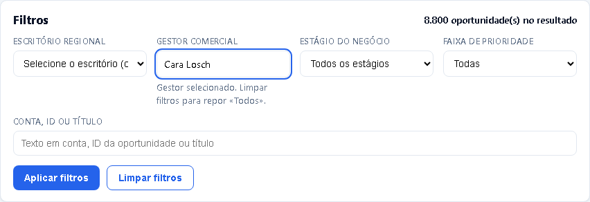

# Submissão — Leopoldo Lima — Challenge 003 (Lead Scorer)

Cockpit web com **score explicável** sobre o **dataset oficial** do challenge, priorizando **onde agir agora** no pipeline aberto. A solução roda localmente, usa **dados reais por omissão** e traz process log auditável do uso de IA com revisão humana contínua.

## Leitura rápida

### O que ler primeiro

| Ordem | arquivo | O que mostra |
|-------|----------|--------------|
| **1** | [`README.md`](./README.md) | Resumo da entrega, como correr, screenshots e framing do score |
| **2** | [`process-log/PROCESS_LOG.md`](./process-log/PROCESS_LOG.md) | Process log obrigatório com CRPs, correções humanas e evidências |
| **3** | [`docs/SETUP.md`](./docs/SETUP.md) | Setup e comandos completos |
| **4** | [`docs/SCORING_V2.md`](./docs/SCORING_V2.md) | Lógica do score e recalibração para pipeline aberto |
| **5** | [`docs/FINAL_AUDIT_CHALLENGE_003.md`](./docs/FINAL_AUDIT_CHALLENGE_003.md) | Matriz honesta de aderência ao challenge |

### Onde está cada coisa

- **Produto executável:** [`solution/`](./solution/)
- **Process log e evidências:** [`process-log/`](./process-log/)
- **Docs complementares:** [`docs/`](./docs/)
- **Índice detalhado:** [`docs/SUBMISSION_CONTENT_INDEX.md`](./docs/SUBMISSION_CONTENT_INDEX.md)
- **Repositório original:** [`https://github.com/leopas/build-003-lead-scorer`](https://github.com/leopas/build-003-lead-scorer)

## Como rodar em 60 segundos

```powershell
cd submissions\leopoldo-lima\solution
python .\scripts\tasks.py install
python .\scripts\tasks.py dev
```

- **UI / API:** `http://127.0.0.1:8787`
- **Health:** `http://127.0.0.1:8787/health`
- **Ranking real:** `http://127.0.0.1:8787/api/ranking?limit=3`
- **Detalhe real:** `http://127.0.0.1:8787/api/opportunities/1C1I7A6R`

## Screenshots reais da aplicação

### 1. Home com KPIs, ranking e volume real do dataset



### 2. Detalhe de oportunidade com score, explicação, riscos e próxima ação


### 3. Filtros em uso numa navegação comercial real



### 4. Evidência visual do dataset real e do filtro por gestor



---

## Sobre mim

- **Nome:** Leopoldo Lima  
- **LinkedIn:** [linkedin.com/in/leopoldodelima](https://www.linkedin.com/in/leopoldodelima/)  
- **Challenge escolhido:** **003 — Lead Scorer** (entrega tipo *build*: software utilizável pelo comercial, com priorização e explicabilidade)

---

## Executive Summary

Entrego o **Focus Score Cockpit**: aplicação web servida pela mesma stack que a API (**FastAPI** + UI estática em `public/`), sobre os **cinco arquivos CSV** do desafio (incluindo `metadata.csv`), com **motor de scoring declarativo** (`config/scoring-rules.json`) e **texto comercial** no detalhe da oportunidade (“porque este score?”). A solução **corre localmente** (Python ou Docker), tem **testes** e **documentação de contrato** (dados + API). O **process log obrigatório** está em [`process-log/PROCESS_LOG.md`](./process-log/PROCESS_LOG.md), com CRPs, notas de decisão, exports de conversa e snapshots JSON. A construção foi **iterativa**, com **IA como acelerador** e **revisão humana** explícita no log e em [`docs/IA_TRACE.md`](./docs/IA_TRACE.md).

**Síntese para o avaliador:** a aposta é priorizar **onde agir agora** no pipeline **aberto**, com score **explicável** sobre o **dataset oficial**; a IA **acelerou** tarefas, mas **hipóteses, sanity checks e rumo** foram **humanos** e estão **documentados** (README abaixo, process log e testes).

---

## Solução

| Área | Local |
|------|--------|
| API, domínio, scoring, serving | [`solution/src/`](./solution/src/) |
| UI (cockpit) | [`solution/public/`](./solution/public/) |
| Dados (CSVs oficiais) | [`solution/data/`](./solution/data/) |
| Regras de score / normalização | [`solution/config/`](./solution/config/) |
| Scripts (`tasks.py`, validações) | [`solution/scripts/`](./solution/scripts/) |
| Testes | [`solution/tests/`](./solution/tests/) |
| Docker / CI | [`solution/Dockerfile`](./solution/Dockerfile), [`solution/docker-compose.yml`](./solution/docker-compose.yml), [`.github/workflows/`](./solution/.github/workflows/) |

### Abordagem

Pipeline: **CSVs** → serving (joins, integridade) → **features** → **scoring v2** → **API** (ranking, detalhe, KPIs, filtros, pesquisa) → **UI** cockpit. Trabalho decomposto em **CRPs** com rastreio no process log; decisões arquiteturais em [`docs/ADR/`](./docs/ADR/).

### Hipóteses e julgamento humano

Antes de pedir implementação à IA, a **hipótese central** foi: o cockpit deve ajudar o comercial a **focar oportunidades abertas** (ação presente), **não** a coroar sobretudo deals já **ganhos** nem a **substituir** o problema por “ordenar por valor em bruto”.

Decisões **humanas** explícitas ao longo do trabalho:

- **Dataset oficial** como fonte de verdade no runtime por omissão (`real_dataset` sobre os CSV do challenge); mock/demo só como **caminho controlado**, nunca como narrativa silenciosa da demo (ver [`docs/RUNTIME_DEFAULTS.md`](./docs/RUNTIME_DEFAULTS.md)).  
- **Recalibração do score** para o pipeline aberto (pesos e features que evitam domínio de `Won` na cabeça do ranking quando o objetivo é priorizar trabalho atual — detalhe em [`docs/SCORING_V2.md`](./docs/SCORING_V2.md) e notas `CRP-FIN-03` / `CRP-FIN-04` no [`process-log/PROCESS_LOG.md`](./process-log/PROCESS_LOG.md)).  
- **Explicação em linguagem comercial** no detalhe (camada de narrativa sobre fatores, riscos e próxima ação — [`docs/EXPLANATION_NARRATIVE.md`](./docs/EXPLANATION_NARRATIVE.md)).  
- **Validação e correção de rumo** contínuas: falhas de teste, revisão de contratos contra o CSV real, e auditorias (`CRP-REAL-*`, `CRP-FIN-*`, `CRP-SUB-*`) antes de fechar a submissão.

A IA **reduziu custo de execução**; **critério, aceite e prova** ficaram do lado humano, com registo no process log.

### Resultados / Findings

#### Validações do score

O arquivo [`process-log/test-runs/crp-real-09-dashboard-kpis.json`](./process-log/test-runs/crp-real-09-dashboard-kpis.json) (export reproduzível do fluxo com **dataset real**) regista, para o `sales_pipeline.csv` carregado na app: **8800** oportunidades no total, **2089** abertas, **4238** ganhas e **2473** perdidas. Usei estes agregados como **referência de sanidade** para o runtime e para os **KPIs** do dashboard: totais coerentes com o pipeline, sem “sumir” abertas nem inflar artificialmente uma face do funil.

Sanidade de **priorização**: houve verificação explícita para **não** deixar o ranking ser dominado por deals já **ganhos** quando a pergunta de negócio é **onde atuar agora** — traduzida em ajustes de pesos/features e em testes sobre listagens reais (ver [`docs/SCORING_V2.md`](./docs/SCORING_V2.md), [`docs/TEST_STRATEGY_REAL_DATA.md`](./docs/TEST_STRATEGY_REAL_DATA.md) e a suíte em `solution/tests/test_real_dataset_main_flow.py`).

Sanidade de **explicabilidade**: o detalhe da oportunidade expõe **o que empurra o score para cima**, **o que reduz prioridade**, **riscos** e **próxima ação** em texto orientado ao vendedor (contrato em [`docs/VIEW_MODELS.md`](./docs/VIEW_MODELS.md)); não basta um número isolado.

**Modo principal:** com omissão de variáveis de ambiente problemáticas, o serving usa **sempre** os CSV oficiais em `solution/data/`; repositório **mock** na UI é **fallback** documentado, não base invisível da demo (ver [`docs/RUNTIME_DEFAULTS.md`](./docs/RUNTIME_DEFAULTS.md)).

- **Como correr:** [`solution/README.md`](./solution/README.md) e [`docs/SETUP.md`](./docs/SETUP.md) (comandos a partir de `solution/`).  
- **Demo / rotas:** [`docs/DEMO_SCRIPT.md`](./docs/DEMO_SCRIPT.md), [`docs/RUNBOOK.md`](./docs/RUNBOOK.md).  
- **Lógica de score (critérios e pesos):** [`docs/SCORING_V2.md`](./docs/SCORING_V2.md) + [`solution/config/scoring-rules.json`](./solution/config/scoring-rules.json).  
- **Explicabilidade na API/UI:** [`docs/VIEW_MODELS.md`](./docs/VIEW_MODELS.md), [`docs/EXPLANATION_NARRATIVE.md`](./docs/EXPLANATION_NARRATIVE.md).  
- **Auditoria vs. enunciado do challenge:** [`docs/FINAL_AUDIT_CHALLENGE_003.md`](./docs/FINAL_AUDIT_CHALLENGE_003.md).

### Recomendações

- Métricas persistentes e E2E no browser na CI.  
- Calibração com **outcomes** reais quando existirem dados de fecho históricos.

### Limitações

- Score **heurístico** (regras), não modelo ML treinado em produção.  
- Métricas HTTP em memória reiniciam com o processo.  
- `solution/artifacts/process-log/` contém apenas **saídas opcionais de scripts**; o pacote auditável de evidências está em [`process-log/`](./process-log/).

---

## Aderência ao Challenge 003

Conforme [`challenges/build-003-lead-scorer/README.md`](../../challenges/build-003-lead-scorer/README.md):

| Requisito | Como está coberto |
|-----------|-------------------|
| Solução **funcional** (não só documento) | App + API em `solution/`; instruções em `docs/SETUP.md` |
| Usar **dados reais** do dataset | Modo padrão `real_dataset` sobre `solution/data/*.csv` (ver [`docs/RUNTIME_DEFAULTS.md`](./docs/RUNTIME_DEFAULTS.md)) |
| **Scoring / priorização** além de ordenar por valor | Motor em `solution/src/scoring/` + regras em `config/scoring-rules.json` |
| Vendedor entende **porquê** o score | Texto comercial no detalhe + documentação em `docs/SCORING_V2.md` / `EXPLANATION_NARRATIVE.md` |
| **Setup** mínimo | `solution/README.md`, `docs/SETUP.md`, Docker opcional |
| **Lógica** e **limitações** documentadas | Secções acima + `docs/` |

---

## Process Log — Como usei IA

> **Obrigatório para o challenge** (ver [`submission-guide.md`](../../submission-guide.md)). Sem process log = desclassificado.

Isto **não** foi “um prompt → uma resposta → submissão”. Foi um fluxo de **muitas iterações**, cada uma com **aceite** ou **correção humana** registada.

| Recurso | Onde |
|---------|------|
| Log por CRP | [`process-log/PROCESS_LOG.md`](./process-log/PROCESS_LOG.md) |
| Changelog | [`process-log/LOG.md`](./process-log/LOG.md) |
| Narrativa IA (prompts / correções) | [`docs/IA_TRACE.md`](./docs/IA_TRACE.md) |
| Notas de decisão | [`process-log/decision-notes/`](./process-log/decision-notes/) |
| Exports de conversa | [`process-log/chat-exports/`](./process-log/chat-exports/) |
| Snapshots HTTP (dataset real) | [`process-log/test-runs/`](./process-log/test-runs/) |
| CRPs + índice | [`process-log/crps/`](./process-log/crps/), [`process-log/indexes/crp-index.csv`](./process-log/indexes/crp-index.csv) |
| Saídas locais de scripts (opcional) | [`solution/artifacts/process-log/README.md`](./solution/artifacts/process-log/README.md) |

### Método: CRPs, ferramentas e controlo humano

- **GPT-5.4** apoiou a **modelagem** do desafio e a **decomposição** em unidades pequenas (**CRP** = *Change Request Prompt*): pacotes curtos, **auditáveis** e orientados a **resultado verificável** (código, teste ou artefacto), não blocos vagos.  
- **Cursor** foi o ambiente onde esses CRPs foram **executados**, com disciplina inspirada em **Vibecoding Industrial** (trabalho granular, evidências, separação entre geração automática e **julgamento humano** — ver referência em [`docs/IA_TRACE.md`](./docs/IA_TRACE.md)).  
- **Lovable** gerou uma **primeira casca visual** rápida; a seguir **novos CRPs** cobriram **importação, adaptação, integração** com FastAPI/dataset real e **endurecimento** (contratos HTTP, testes, UX operacional).  
- Em cada passo, a IA foi **aceleradora**, não **autoridade final**: revisão de contratos contra CSVs, ajuste de testes, trilhas `CRP-REAL-*` e auditorias de submissão fecham o ciclo com **prova** no repositório.

### Ferramentas usadas

| Ferramenta | Para que usei |
|------------|----------------|
| **GPT-5.4** (e similares) | Decomposição em CRPs, esboços de arquitetura e redacção-base de documentação — sempre revista |
| **Cursor** | Implementação, testes, refatoração e documentação com agentes, CRP a CRP |
| **Lovable** | Protótipo visual inicial, depois substituído/industrializado no stack real |

### Workflow

1. Ler o Challenge 003 e **definir hipóteses de produto** (pipeline aberto, explicabilidade) **antes** de escalar pedidos à IA.  
2. **Gerar e executar CRPs** com critérios de aceite mensuráveis (teste, script, diff fechado).  
3. **Validar** com `pytest`, gates e exports sobre **dataset real**; registar falhas e correções no `PROCESS_LOG.md` e em `process-log/decision-notes/`.  
4. Fechar com demo reproduzível, auditoria ao README do challenge e checklist de submissão.

### Onde a IA errou e como corrigi

Exemplos concretos e padrões de correção humana: [`docs/IA_TRACE.md`](./docs/IA_TRACE.md) e tabelas por CRP em [`process-log/PROCESS_LOG.md`](./process-log/PROCESS_LOG.md).

### O que eu adicionei que a IA sozinha não faria

- **Hipótese de negócio** sobre o que o cockpit deve otimizar (ação no **aberto** vs. celebração de **Won** ou ordenação por valor).  
- Critérios do que é **entregável** vs. ruído para o avaliador (faxina da pasta de submissão, arquivo em `docs/archive/`).  
- **Trade-offs** de produto (UX comercial, explicabilidade, escopo) e **sanity checks** contra agregados reais e testes.  
- **Verificação** local (comandos, contratos, coerência entre testes e documentação).

---

## Submissão via Pull Request

O challenge exige envio **via PR** (ver [`submission-guide.md`](../../submission-guide.md) e [`CONTRIBUTING.md`](../../CONTRIBUTING.md)).

- Alterações apenas dentro de `submissions/leopoldo-lima/`.  
- Título sugerido: `[Submission] Leopoldo Lima — Challenge 003`.  
- Checklist e comandos de verificação: [`docs/PR_HANDOFF.md`](./docs/PR_HANDOFF.md).

---

## Evidências

- [x] Process log estruturado ([`process-log/PROCESS_LOG.md`](./process-log/PROCESS_LOG.md))  
- [x] Export / reconstrução de conversa em Markdown ([`process-log/chat-exports/`](./process-log/chat-exports/))  
- [x] Evolução documentada (`LOG.md`, notas, CRPs)  
- [x] Snapshots JSON reproduzíveis ([`process-log/test-runs/`](./process-log/test-runs/))  
- [x] Capturas UI (ex.: [`process-log/ui-captures/cbx-08/`](./process-log/ui-captures/cbx-08/)) — quando presentes no repositório  
- [ ] Gravação de menu — opcional; ver [`docs/VIDEO_RUNBOOK.md`](./docs/VIDEO_RUNBOOK.md) e [`docs/EVIDENCE_INDEX.md`](./docs/EVIDENCE_INDEX.md)

---

_Submissão enviada em: 2026-03-21_
