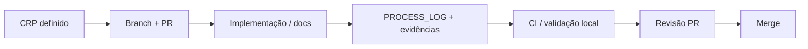

# Estratégia de submissão

Este documento alinha o repositório ao **submission guide** do desafio: narrativa clara, processo auditável, evidências e trilha de PR.

## Duas partes obrigatórias da submissão

A entrega completa compreende:

1. **Solução funcional** — o que resolve o desafio (código, APIs, dados, UI se houver, documentação técnica necessária).
2. **Process log** — `PROCESS_LOG.md` atualizado em sintonia com cada CRP, com ligação a evidências em `artifacts/process-log/`.

**Entregar só a solução sem process log adequado implica risco sério de desclassificação**, por não cumprir a exigência de transparência do processo e do uso de ferramentas de IA.

A **submissão materializa-se via Pull Request (PR)**: integração no repositório através de PRs que citam CRPs e permitem revisão da solução e do registo de processo.

## Uso estratégico de IA no projeto (resumo executivo)

A entrega foi construída com **decomposição explícita**: o GPT-5.4 apoiou a **modelagem** e a geração de **CRPs** (*Change Request Prompts*) — unidades de trabalho pequenas e auditáveis. A implementação correu no **Cursor**, com disciplina de artefactos alinhada ao método **Vibecoding Industrial** (referência: [*Vibecoding Industrial*](https://www.amazon.com/dp/B0GQR585SC)). A **primeira UI** nasceu no **Lovable**; CRPs posteriores levaram a **importação, adaptação e industrialização** dessa interface no stack real, com **dataset oficial**, testes e **revisão humana** contínua. O detalhe cronológico e exemplos de correção estão em [`IA_TRACE.md`](./IA_TRACE.md) e no [`PROCESS_LOG.md`](../process-log/PROCESS_LOG.md). Isto não substitui o cumprimento literal dos critérios do challenge — apenas documenta **como** o processo foi conduzido.

## Princípios

1. **Um CRP, um PR** — alterações pequenas, mensagem de commit e descrição de PR que citam o CRP.
2. **Todo CRP atualiza o process log** — não fechar trabalho de CRP sem entrada correspondente (abertura, iterações relevantes, fecho com PR e evidências).
3. **Todo CRP gera evidência** — arquivos ou referências verificáveis (testes, exports, capturas acordadas) ligados no `PROCESS_LOG.md`.
4. **PROCESS_LOG como fonte da verdade do processo** — ferramentas de IA, decomposição do problema, erros da IA, correções humanas, iterações e evidências (ver [PROCESS_LOG_GUIDE.md](./PROCESS_LOG_GUIDE.md)).
5. **Contribuição com IA sem julgamento humano registado é incompleta** — registe explicitamente validação, rejeição ou alteração do output.
6. **Output genérico de IA, copiado sem verificação e sem correção documentada, é anti-padrão** e enfraquece a submissão perante avaliadores.
7. **Evidência verificável** — arquivos em `artifacts/process-log/` e outputs de testes referenciados no log, não apenas descrições vagas.
8. **README honesto** — usar `docs/README_SUBMISSION_SKELETON.md` como base; submissões fortes estruturam **resumo executivo, abordagem, resultado, recomendações e limitações** com conteúdo concreto e verificável. Cortes de framing e anti-marketing: `docs/README_DECISIONS.md` (CRP-REAL-07).

## Fluxo recomendado

## Artefatos por fase

| Fase | Artefatos |
|------|-----------|
| Durante o trabalho | Entradas no `PROCESS_LOG.md`, arquivos em `artifacts/process-log/` |
| Antes de submeter | `README.md` alinhado ao esqueleto (cinco blocos fortes), `LOG.md`, `docs/DEMO_SCRIPT.md` (se existir) |
| Fecho | Checklist do desafio (ver `CRP-S04`), revisão final em PR (`CRP-S05`) |

## Ligações

- Guia do process log: [PROCESS_LOG_GUIDE.md](./PROCESS_LOG_GUIDE.md)
- Governança de CRPs: [CRP_GOVERNANCE.md](./CRP_GOVERNANCE.md)
- Esqueleto do README de submissão: [README_SUBMISSION_SKELETON.md](./README_SUBMISSION_SKELETON.md)
- Consolidado de uso de IA e correções humanas: [IA_TRACE.md](./IA_TRACE.md)

## Nota sobre este repositório

O *Challenge Pack* pode ser sobretudo documental ou misto. A estratégia mantém-se: o que não existir (ex.: UI) deve constar como **limitação explícita** na submissão, não como lacuna oculta — e o **process log** deve refletir essas escolhas com evidência.
