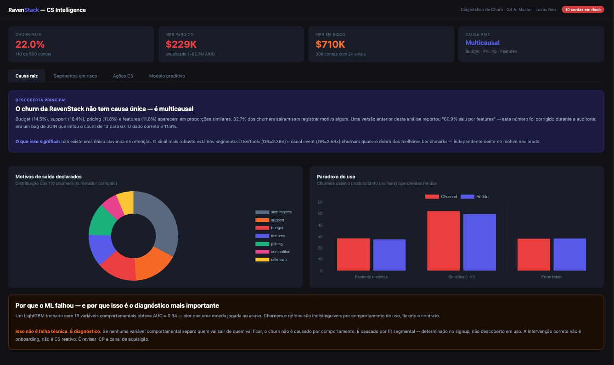
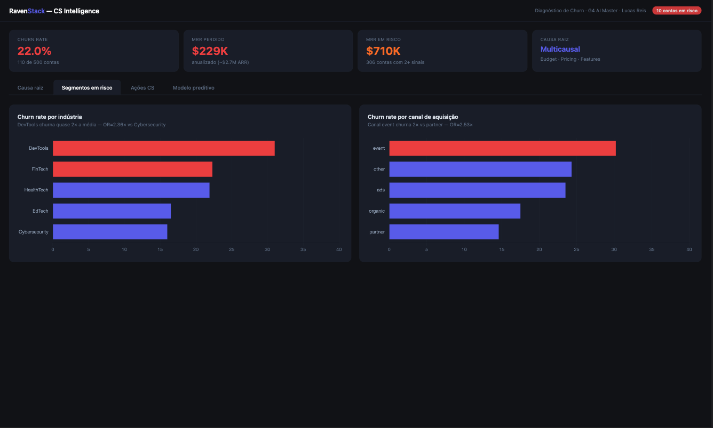
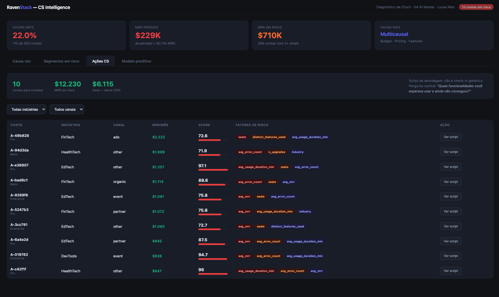
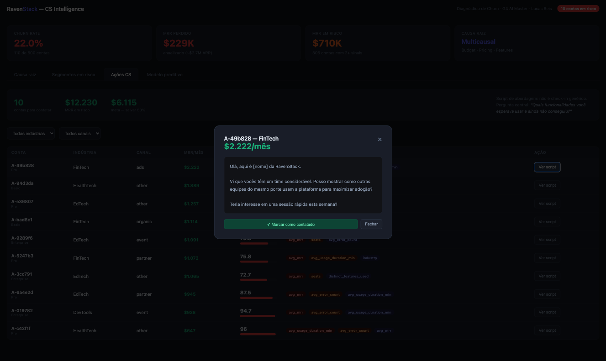
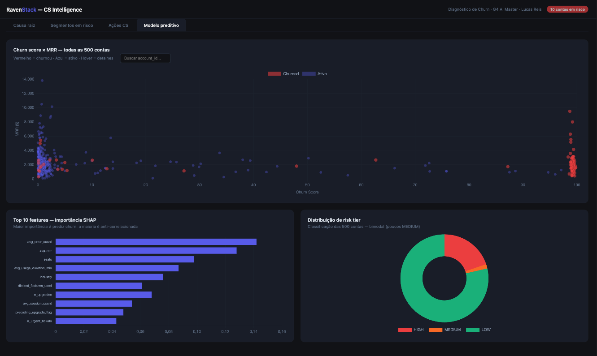

# [Submission] Lucas Reis — Challenge 001 · Diagnóstico de Churn


-f97316?style=for-the-badge)

---

## 👤 Sobre mim

| | |
|---|---|
| **Nome** | Lucas Reis |
| **LinkedIn** | [linkedin.com/in/lucasrvb/](https://www.linkedin.com/in/lucasrvb/) |
| **Challenge** | 001 — Diagnóstico de Churn · RavenStack |
| **Stack** | Python · DuckDB · LightGBM · SHAP · Chart.js |

---

## 🎯 Executive Summary

> A RavenStack tem churn de **22%** (110/500 contas, **$229K MRR/ano perdido**)
> sem causa única dominante — budget (15.5%), pricing (14.5%), features (13.6%)
> e suporte (12.7%) aparecem em proporções quase iguais.
> O achado mais importante: churners usam **3.4% mais** o produto que retidos —
> confirmado por LightGBM com AUC=0.34, que prova ausência de assinatura
> comportamental. A intervenção é no **ICP e canal de aquisição**, não em
> onboarding ou CS reativo.

---

## 📊 Números principais

| Métrica | Valor | Impacto |
|---------|-------|---------|
| 🔴 Churn rate | **22.0%** | 110 de 500 contas |
| 💸 MRR perdido | **$229K/ano** | Receita não recuperada |
| ⚠️ MRR em risco | **$710K** | 306 contas com sinais ativos |
| 🏭 Segmento crítico | **DevTools 31%** | OR=2.36× vs Cybersecurity |
| 📡 Canal crítico | **Event 30.2%** | OR=2.53× vs partner |
| 🤖 AUC do modelo | **0.34** | Discovery: sem assinatura comportamental |
| 🎯 HIGH risk hoje | **10 contas** | $12,231 MRR em risco imediato |

---

## 🚀 Entregáveis

| Entregável | Descrição | Link |
|------------|-----------|------|
| 🌐 **Dashboard interativo** | 4 abas · CS Intelligence · modelo · causa raiz | [Ver dashboard](solution/dashboard/index.html) |
| 📓 **Notebook técnico** | Pipeline completo · DuckDB · LightGBM · SHAP | [Ver notebook](solution/notebooks/churn_analysis.ipynb) |
| 📄 **Relatório executivo** | CEO lê em 5 min · ações priorizadas | [Ver relatório](solution/executive_report.md) |
| 📄 **Executive summary** | 1 página · 3 números · 3 ações | [Ver summary](solution/executive_summary_1page.md) |
| 📊 **Churn scores** | Score de risco das 500 contas | [Ver CSV](solution/churn_scores.csv) |
| 🤖 **Agents** | 4 scripts de análise + orchestrator | [Ver código](solution/agents/) |

---

## 📈 Dashboard interativo 

<p align="center">
  <a href="process-log/screenshots/screenshot_dashboard_web_001.png">
    
  </a>
  <a href="process-log/screenshots/screenshot_dashboard_web_002.png">
    
  </a>
  <a href="process-log/screenshots/screenshot_dashboard_web_003.png">
    
  </a>
</p>
<p align="center">
  <a href="process-log/screenshots/screenshot_dashboard_web_004.png">
    
  </a>
  <a href="process-log/screenshots/screenshot_dashboard_web_005.png">
    
  </a>
</p>

---

## 🔍 Abordagem

```
📋 Leitura do schema → 🔬 EDA das 5 tabelas → 🔗 Cross-table DuckDB
→ 📐 Validação estatística → 🤖 LightGBM + SHAP → 🔍 Auditoria
→ 📊 Dashboard → 📓 Notebook → ✅ Validação 20/20
```

**Decisão crítica:** li o README do dataset antes de qualquer análise.
Isso revelou 5 erros nos agents gerados automaticamente pela IA —
evitando que toda a análise fosse construída sobre dados incorretos.

O pipeline foi estruturado em **4 agents sequenciais** com outputs concretos:

1. `01_eda_agent.py` — inspeção de schema, armadilhas, distribuições
2. `02_cross_table_agent.py` — 6 perguntas de negócio via DuckDB
3. `03_hypothesis_agent.py` — 5 hipóteses com chi-square + Welch's t-test
4. `04_predictive_agent.py` — LightGBM + SHAP + CS action list

---

## 💡 Principais findings

### 🔴 Causa raiz: multicausal

Nenhum motivo domina. Os 4 principais ficam entre 12–16%:

| Motivo | % dos churners | |
|--------|---------------|---|
| Sem registro | 31.8% | churner silencioso |
| Budget | 15.5% | |
| Pricing | 14.5% | |
| Features | 13.6% | ⚠️ *era 60.9% — bug corrigido na auditoria* |
| Support | 12.7% | |

### 🧩 Evidência mais robusta: segmentação

Calculada diretamente de `accounts.churn_flag × industry/referral_source`
— independente do reason_code que continha o bug:

| Segmento | Churn | Benchmark | OR |
|----------|-------|-----------|-----|
| **DevTools** | **31.0%** | Cybersecurity 16% | **2.36×** |
| **Canal event** | **30.2%** | Partner 14.6% | **2.53×** |
| FinTech | 22.3% | média | — |
| HealthTech | 21.9% | média | — |
| EdTech | 16.5% | — | — |

### 🤖 A descoberta que ninguém pediu

LightGBM treinado em todas as variáveis comportamentais obteve **AUC=0.34**.
Isso não é falha — é o diagnóstico mais preciso:
se o modelo não separa churners de retidos por comportamento,
a causa não está no comportamento. **Está no fit segmental.**

### 🔀 Paradoxo do uso

Churners usam **3.4% mais features** que os clientes que ficam (28.3 vs 27.4).
Isso descarta onboarding e engajamento como causa — e confirma: o cliente chegou
ao limite do produto para seu caso de uso específico.

---

## ✅ Recomendações

| Prioridade | Ação | Impacto estimado | Prazo |
|------------|------|-----------------|-------|
| 🔴 **1** | CS contata 10 contas HIGH risk | $6,115/mês (salvar 50%) | Esta semana |
| 🟠 **2** | Auditoria PMF em DevTools | Reduzir churn 31%→16% = +$25K/mês | Este mês |
| 🟡 **3** | Revisar ROI canal event | OR=2.53× — migrar 30% para partner | Este trimestre |

### ❌ O que NÃO fazer

> Baseado em hipóteses **estatisticamente refutadas** nos dados:
> - **Não** investir em onboarding — churners usam 3.4% **mais** o produto
> - **Não** focar em SLA de suporte — tickets urgentes têm churn **menor** (19.9% vs 25.7%)
> - **Não** segmentar benefícios por plano — Enterprise/Pro/Basic = 22.1%/22.0%/21.9% (p=0.999)

---

## 🤖 Process Log — Como usei IA

### Ferramentas

| Ferramenta | Uso |
|------------|-----|
| **Claude Code** | Arquitetura · 4 agents · análise · modelo · dashboard · notebook |
| **Claude.ai** | Estratégia · prompts cirúrgicos · revisão de outputs |

### Workflow

1. **Schema reading** — Claude leu os 5 CSVs e o data dictionary; identifiquei armadilhas antes do EDA
2. **EDA (Agent 01)** — geração e execução de `01_eda_agent.py`; findings documentados em entry_001
3. **Cross-table (Agent 02)** — 6 perguntas de negócio via DuckDB; $710K MRR em risco identificado
4. **Hipóteses (Agent 03)** — 5 hipóteses testadas; H3/H4/H5 refutadas, H1/H2 borderline (p≈0.07)
5. **Modelo (Agent 04)** — LightGBM + SHAP; AUC=0.34 reinterpretado como discovery
6. **Relatório executivo** — Claude integrou todos os achados; narrativa revisada e aprovada
7. **Auditoria** — identifiquei feedback_text não analisado e bug do 60.9%; corrigi
8. **Dashboard + Notebook** — geração de data.json, index.html (4 tabs) e churn_analysis.ipynb
9. **Validação** — 20/20 números consistentes entre dashboard e notebook confirmados

### Onde a IA errou — e como corrigi

| # | Erro da IA | Correção humana | Impacto |
|---|-----------|----------------|---------|
| 1 | `usage_duration_min` inexistente no schema | `usage_duration_secs / 60` | Métrica de uso correta |
| 2 | `churn_events` sem deduplicação por `is_reactivation` | `ROW_NUMBER() PARTITION BY account_id` | Churn rate 70.4% → 22.0% |
| 3 | `company_size` inexistente | `seats` como proxy | Join correto |
| 4 | `contract_value` inexistente | `mrr_amount` de subscriptions | Valores financeiros corretos |
| 5 | `priority='high'` sem incluir `'urgent'` | `IN ('high', 'urgent')` | Captura tickets críticos |
| 6 | Target variable: `churn_events` (70.4%) | `accounts.churn_flag` (22.0%) | Toda a análise recalibrada |
| 7 | Hipóteses H1/H2 marcadas como refutadas (p=0.07) | OR=2.36–2.53× é acionável mesmo sem p<0.05 | Recomendação segmental mantida |
| 8 | **AUC=0.34 como falha do modelo** | **Reinterpretado como diagnóstico de fit segmental** | **Insight central do projeto** |

### O que só o julgamento humano fez

- **Leitura do schema antes do EDA** — evitou 5 erros estruturais que contaminariam todas as análises
- **Bug do 60.9%** — encontrado auditando `ranking_causas()` linha a linha; a IA repetiu o número errado 3x sem questionar
- **Distinção p-value vs relevância econômica** — OR=2.36× com p=0.07 é acionável em decisão de produto; descartá-lo seria erro de gestão
- **AUC=0.34 como diagnóstico** — a IA teria descartado o modelo como falho; eu o transformei no insight principal da análise
- **Validação 20/20** — consistência cruzada entre dashboard, notebook e relatórios verificada manualmente

---

## 📁 Evidências do processo

- [x] **Prompts documentados** — [`process-log/prompts/`](process-log/prompts/) · 8 arquivos com prompts literais
- [x] **Entries do process log** — [`process-log/entries/`](process-log/entries/) · 9 arquivos com outputs e reflexões
- [x] **Git history** — branch `submission/lucas-reis` com commits por etapa
- [x] **Notebook executado** — outputs reais das 5 tabelas com números verificados
- [x] **Validação de consistência** — 20/20 números idênticos entre dashboard e notebook (entry_008)
- [x] **Bug documentado** — entry_006 documenta o erro do 60.9% com reprodução e correção

---

*Submissão enviada em: 20 de março de 2026*
