# Walkthrough — Como Construí o Lead Scorer com IA

**Candidata:** Mariana Peixoto Coelho
**Challenge:** 003 — Lead Scorer
**Ferramentas de IA:** Claude Code + Stitch (Google) + Antigravity Kit

---

## Etapa 1 — Setup e organização com Claude Code

Comecei definindo a estrutura do projeto com Claude Code. A IA recomendou a Opção B — pasta dedicada com seções separadas para evidências, análise e assets.

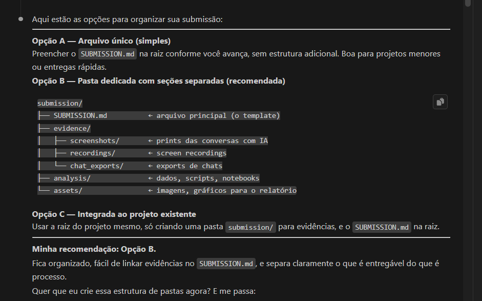

---

## Etapa 2 — Design visual com Stitch

Antes de codar, pedi ao Claude Code para criar um prompt detalhado para o Stitch (Google AI) com especificações de UX/UI: tema dark neon, 4 telas, badges de score, filtros por região/manager/vendedor.

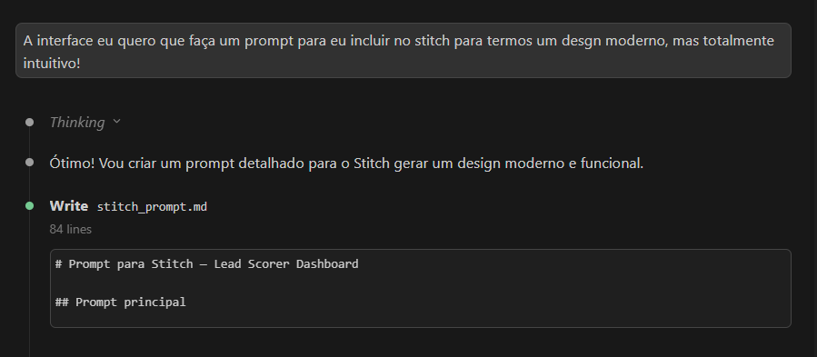

O Stitch gerou múltiplas variações. Escolhi o estilo neon/cyberpunk — decisão curatorial minha.

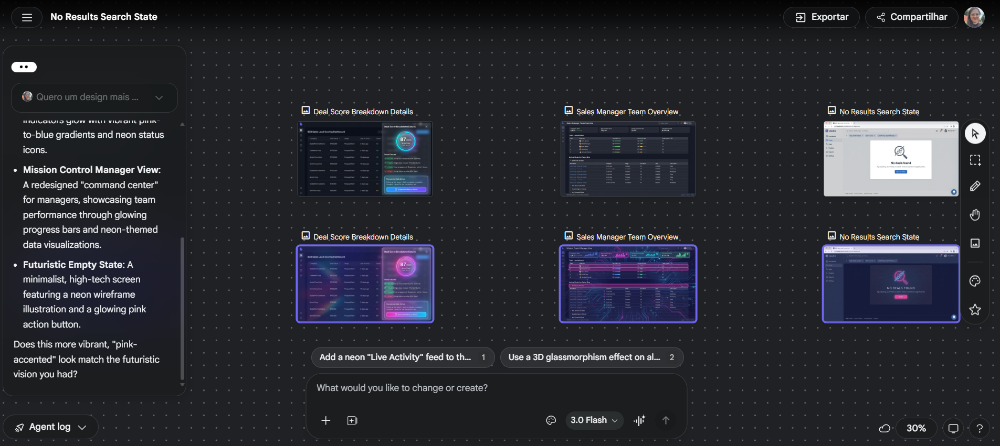

### Designs finais escolhidos

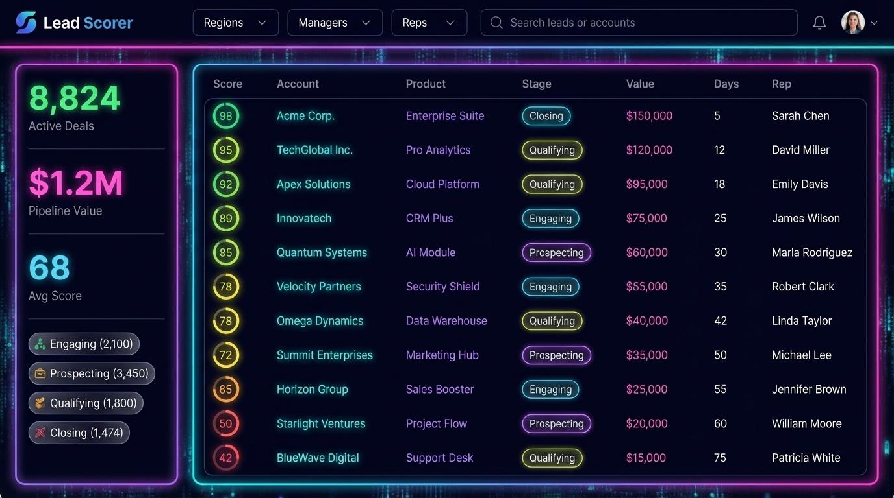

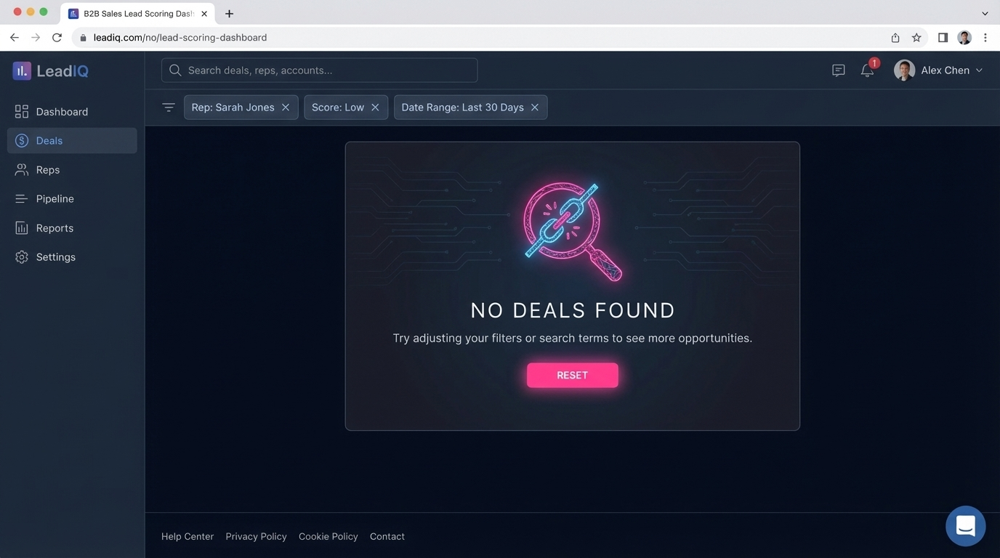

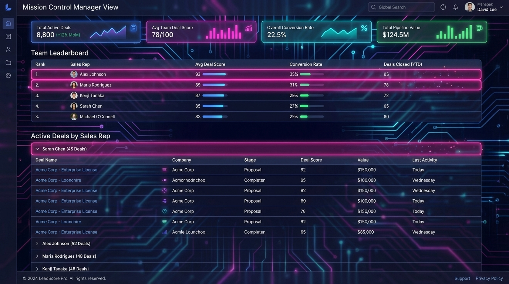

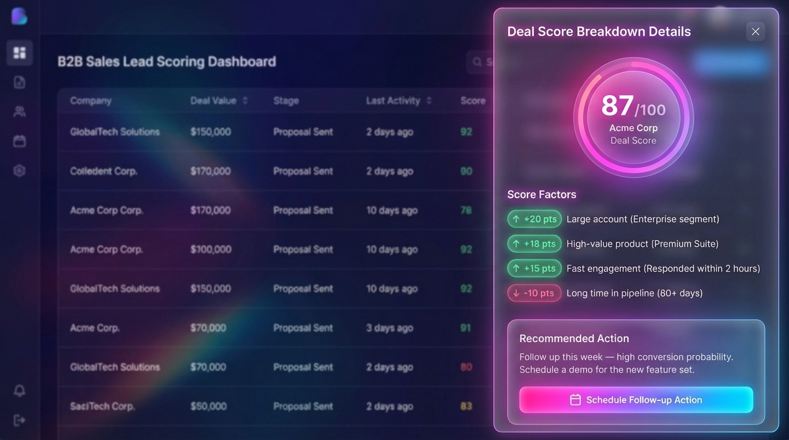

---

## Etapa 3 — Antigravity Kit e ferramentas

Utilizei o [Antigravity Kit](https://github.com/vudovn/antigravity-kit.git) como base de agentes para potencializar o Claude Code. Também documentei todas as ferramentas usadas no processo.

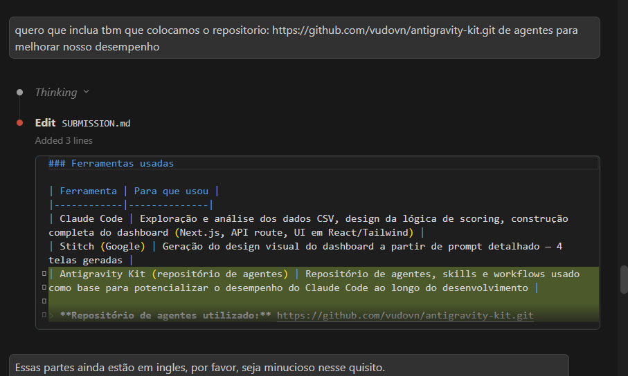

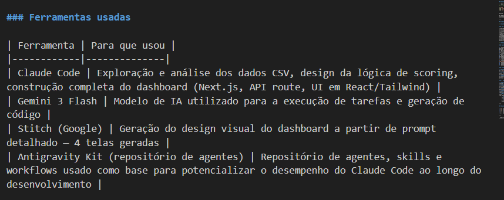

---

## Etapa 4 — Workflow documentado

Registrei as 9 etapas do processo de construção, do briefing ao build final.

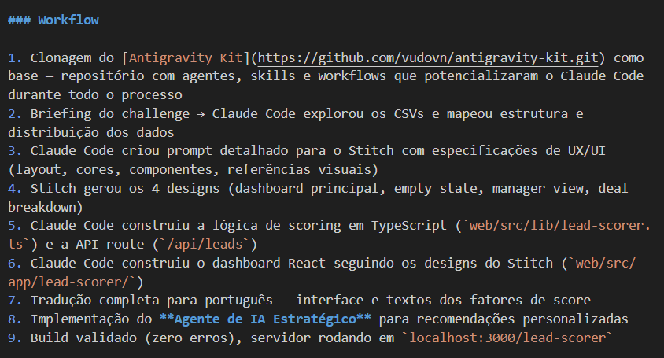

---

## Etapa 5 — Decisões humanas vs. IA

A parte mais importante: o que eu adicionei que a IA sozinha não faria — data de referência, escolha de explicabilidade sobre ML complexo, threshold de priorização, curadoria do design.

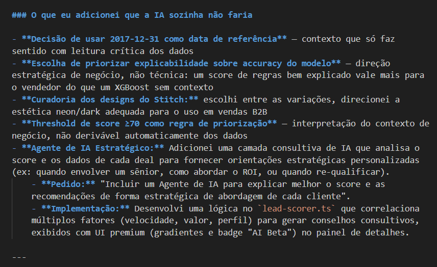

---

## Resultado — Sistema funcionando

### Dashboard principal (2.089 deals ativos)

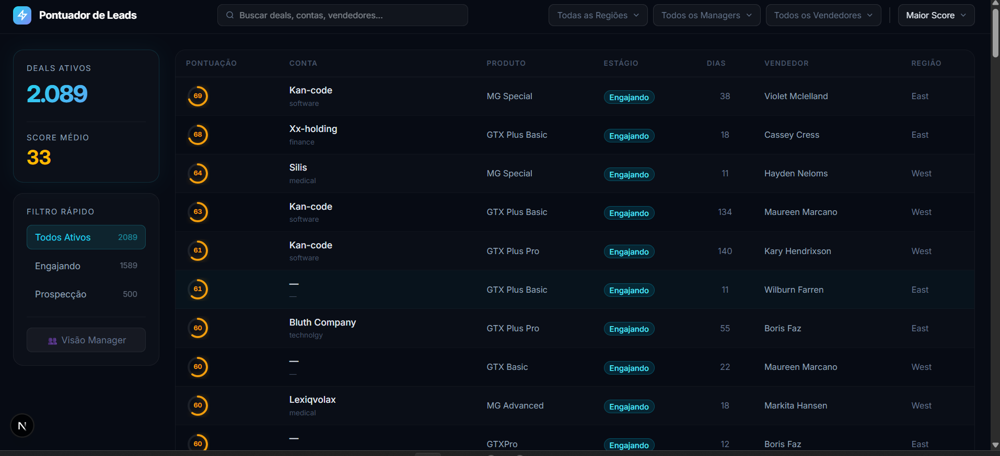

### Filtro por Engajamento

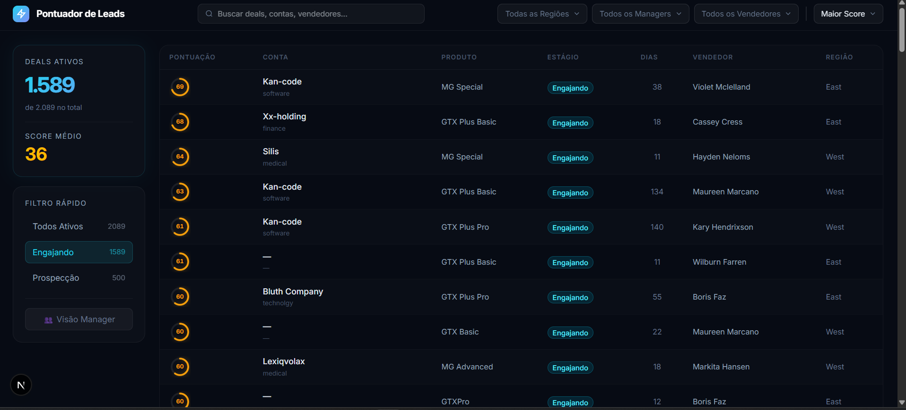

### Filtro por Prospecção

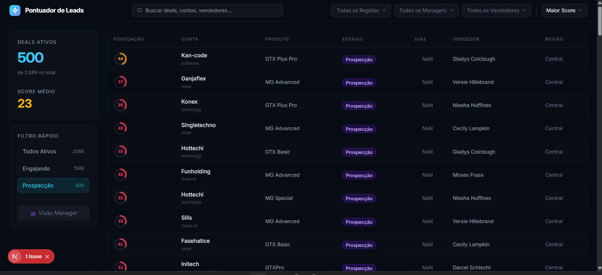

### Filtros e dropdowns

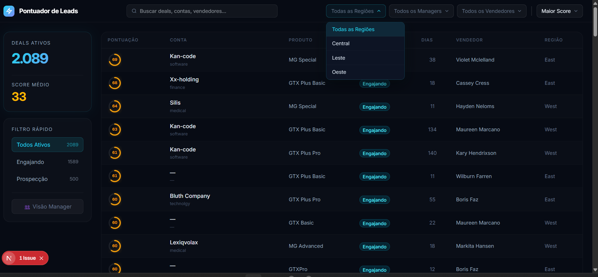

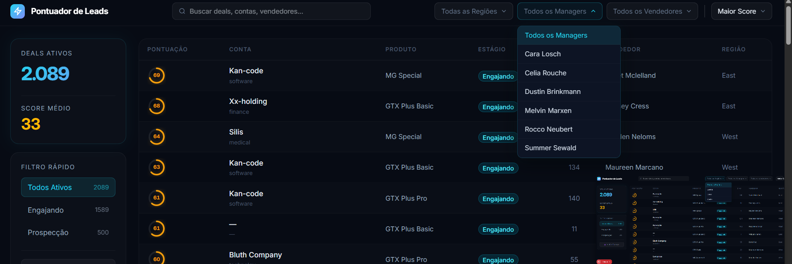

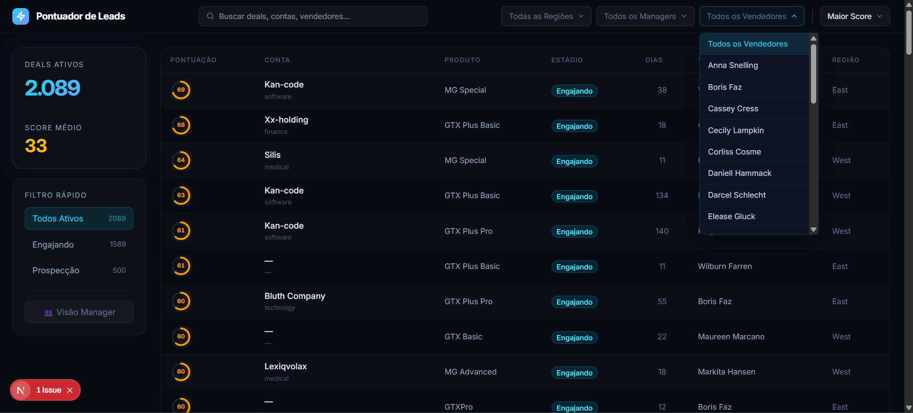

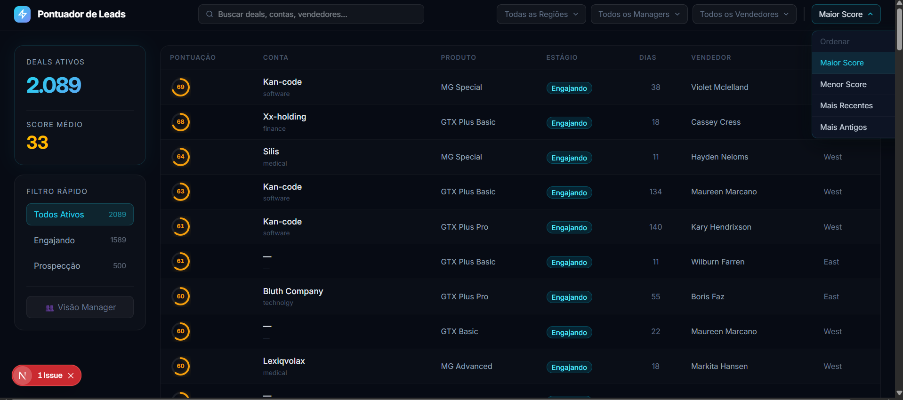

### Painel de detalhes do deal

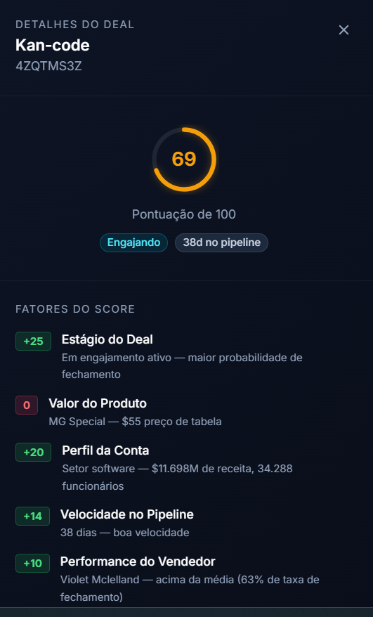

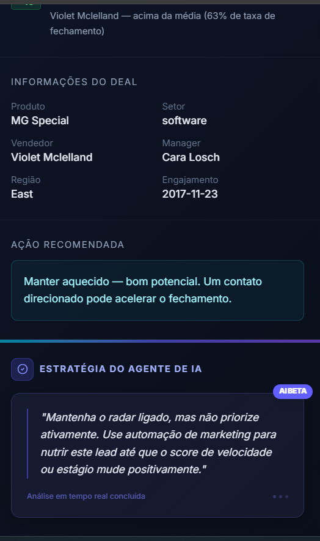

---

## Como rodar

```bash
cd submissions/mariana-peixoto/solution/web
npm install
npm run dev
# Acesse: http://localhost:3000/lead-scorer
```

---

*Walkthrough escrito em: 2026-03-24*
