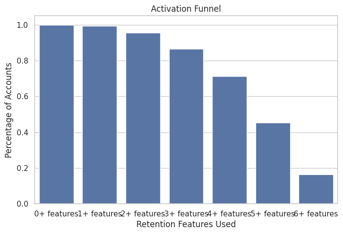
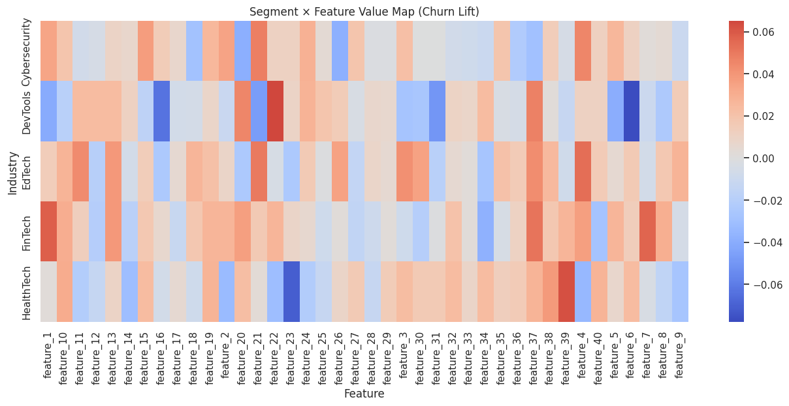
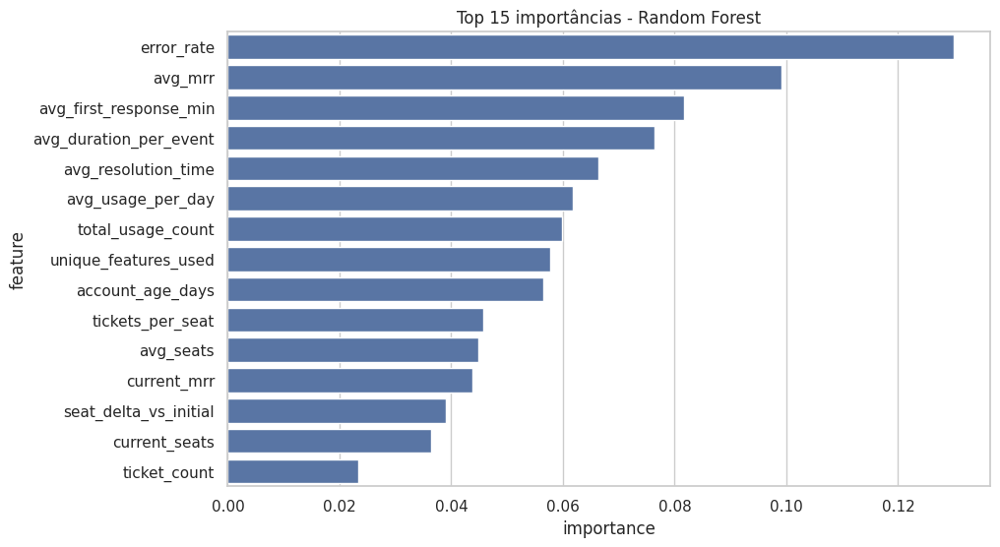

# [Submission] Matheus Miranda — Challenge Churn Prediction

## Sobre mim

- **Nome:** Matheus Miranda Vasconcelos
- **LinkedIn:** https://www.linkedin.com/in/matheus-miranda-v/
- **Instagram:** miranda.mth
- **Challenge escolhido:** Churn Prediction

---

## Executive Summary

Uma análise exploratória de dados indicou que o churn não é causado principalmente por falhas do sistema ou abandono espontâneo do produto. O principal fator está ligado à falta de ativação completa do produto e fit de algumas features para heavy-users no segmento DevTools.

Contas que adotam as seis funcionalidades-chave associadas à retenção apresentam cerca de 40% menos churn, porém apenas 16% dos clientes atingem esse nível de adoção.

Adicionalmente, o segmento DevTools apresenta uma taxa de churn quase duas vezes maior que os demais setores, indicando um possível desalinhamento entre o produto e as necessidades de usuários mais avançados.

Como ações a serem desempenhadas, foi possível chegar a uma ferramenta de recomendação por feature por cliente com o objetivo de maximizar a retenção do cliente. Além disso, o mapa de features também pode ser usado para encontrar features que merecem atenção para desenvolvimentos adicionais para usuários mais avançados. 

---

## Solução

A solução foi estruturada em quatro frentes:

1. **Entendimento e exploração dos dados**
   - Análise das tabelas disponibilizadas
   - Avaliação da variável alvo (`churn_flag`)
   - Inspeção de distribuição de planos, indústrias, trial, seats e histórico de assinaturas

2. **Preparação e engenharia de atributos**
   - Consolidação de informações por conta
   - Criação de variáveis derivadas relevantes para churn
   - Tratamento de dados categóricos e temporais

3. **Modelagem preditiva**
   - Treinamento de um modelo de classificação com foco em interpretabilidade
   - Avaliação do desempenho em identificar contas com maior risco
   - Leitura das variáveis mais relevantes para explicar churn

4. **Recomendação de ações**
   - Tradução do modelo em recomendações práticas
   - Geração de sugestões de features com potencial de retenção por perfil de conta
   - Estruturação de possíveis próximos passos para operação de Customer Success / Produto

---

## Abordagem

Comecei pelo entendimento do problema de negócio: não bastava apenas prever churn, mas transformar a previsão em decisão prática. Por isso, priorizei uma abordagem interpretável, que permitisse explicar o “porquê” do risco de cancelamento e não apenas gerar um score.

A decomposição do problema foi feita em etapas:

- Análise Exploratória Inicial
- Feature Engineering
- Modelo de classificação usando Árvore de Decisão Simples + RandomFlorest para identificação de fatores-chaves relationados ao churn.
- Verificação dos resultados obtidos
- Exploração adicional por segmentos, features e usos.
- Determinação das features de retenção, neutras e problemáticas
- Desenvolvimento de motor de retenção para clientes. 

Dessa forma, foi possível criar insights acionáveis - qual feature incentivar em qual cliente para aumentar a retenção. 

---

## Resultados / Findings

### 1. O churn não é aleatório
A análise mostrou que existem padrões observáveis nas contas que cancelam, indicando que o churn pode ser tratado como um problema previsível e parcialmente controlável.

### 2. Falha de ativação é o principal driver de churn

A análise do funil de ativação mostra que poucos clientes chegam ao estágio completo de adoção das funcionalidades associadas à retenção. Apenas uma pequena parcela das contas atinge o nível máximo de ativação, o que está diretamente relacionado a menores taxas de churn.

Clientes que atingem a adoção completa das funcionalidades apresentam aproximadamente **40% menos churn**, porém apenas **16% das contas** chegam a esse nível.

---

### 3. Algumas features têm impacto direto na retenção

A análise das funcionalidades utilizadas pelos clientes permitiu classificar features em três grupos:

- **Retention drivers** – funcionalidades cuja adoção está associada a menor churn  
- **Neutral features** – funcionalidades sem impacto relevante  
- **Risk indicators** – funcionalidades cuja adoção está correlacionada a maior churn

Esse mapeamento permite identificar **quais funcionalidades incentivar para cada perfil de cliente**, criando oportunidades claras de intervenção para times de produto e customer success.

---

### 4. O modelo confirma os fatores explicativos

Um modelo Random Forest foi utilizado para identificar quais variáveis apresentam maior importância na explicação do churn. Os resultados reforçam os insights obtidos na análise exploratória, destacando variáveis ligadas a **ativação, adoção de funcionalidades e perfil de uso**.

Isso confirma que churn está muito mais ligado ao **nível de adoção do produto** do que a fatores puramente operacionais.

---

### Evidências
- Notebook com exploração, preparação e modelagem
- Outputs com recomendações por conta
- Processo documentado no log de uso de IA

---

## Recomendações

### 1. Recomendações personalizadas por conta
### Retention Recommendation Engine

A partir da análise de churn e da identificação das funcionalidades associadas à retenção, foi desenvolvido um mecanismo simples de recomendação que sugere **features com maior potencial de reduzir churn para cada conta**.

Abaixo estão alguns exemplos de recomendações geradas:

| Account ID | Company | Industry | Recommended Features | # |
|-------------|---------|----------|----------------------|---|
| A-a2485e | Company_467 | FinTech | feature_12, feature_14, feature_31 | 3 |
| A-970c97 | Company_477 | HealthTech | feature_23, feature_12, feature_16 | 3 |
| A-9a532a | Company_333 | HealthTech | feature_23, feature_14, feature_12 | 3 |
| A-8ed5dd | Company_222 | EdTech | feature_16, feature_23, feature_12 | 3 |
| A-034368 | Company_353 | EdTech | feature_23, feature_31, feature_14 | 3 |
| A-038089 | Company_156 | DevTools | feature_6, feature_16, feature_31 | 3 |
| A-f1f639 | Company_296 | EdTech | feature_16, feature_23, feature_12 | 3 |
| A-faa28c | Company_91 | HealthTech | feature_23, feature_14, feature_12 | 3 |
| A-9ee962 | Company_59 | HealthTech | feature_23, feature_12, feature_16 | 3 |
| A-4ae22a | Company_229 | EdTech | feature_23, feature_31, feature_14 | 3 |

Essas recomendações podem ser utilizadas por times de **Customer Success, Growth ou Product** para direcionar campanhas de ativação e aumentar a adoção das funcionalidades associadas à retenção. Esse mecanismo pode ser operacionalizado como um **playbook de retenção automatizado**, onde cada conta recebe recomendações específicas de funcionalidades a serem incentivadas, aumentando a probabilidade de atingir o nível de ativação associado a menor churn.

#### Sanity Check — Segmentos priorizados pelo motor de recomendação

Como verificação de consistência, analisamos a distribuição das contas priorizadas pelo motor de recomendação por indústria.

| Industry | Accounts flagged |
|---------|------------------|
| Cybersecurity | 9 |
| DevTools | 34 |
| EdTech | 33 |
| FinTech | 19 |
| HealthTech | 39 |

Observa-se que **DevTools aparece entre os segmentos mais frequentemente priorizados**, o que é consistente com os resultados da análise exploratória que indicaram que esse setor apresenta **taxas de churn significativamente mais altas**.

Esse resultado funciona como um **sanity check** para o sistema de recomendação: as contas que o modelo identifica como necessitando maior atenção estão justamente concentradas em segmentos previamente associados a maior risco de churn.

Isso aumenta a confiança de que o motor de recomendação está capturando **padrões reais de risco**, em vez de gerar recomendações arbitrárias.

## Limitações

- Algumas hipóteses de churn poderiam ser melhor exploradas com mais contexto de negócio
- Não foi implementado um pipeline de produção ou monitoramento contínuo
- A recomendação de features pode ser refinada com dados mais ricos de uso e experimentação real

---

## Process Log — Como usei IA

### Ferramentas usadas

| Ferramenta | Para que usou |
|---|---|
| ChatGPT | Brainstorm de hipóteses, estruturação da análise, apoio na interpretação dos resultados e refinamento da comunicação |
| Python / Jupyter Notebook | Exploração dos dados, transformação, modelagem e geração de outputs |
| GitHub | Organização e submissão final da solução |

### Workflow

1. Comecei entendendo o enunciado e o objetivo de negócio do challenge.
2. Usei IA para me ajudar a estruturar um plano de ataque inicial e levantar hipóteses sobre churn.
3. Fiz a leitura das bases e organizei a exploração dos dados no notebook.
4. Refinei ideias de features e caminhos de modelagem, mas validei manualmente a lógica e os resultados.
5. Treinei o modelo, analisei sua interpretabilidade e transformei os outputs em recomendações de negócio.
6. Por fim, usei IA para melhorar a clareza da documentação e organizar a submissão final.

### Onde a IA errou e como corrigi

O resultado inicial do RandomFlorest mostrou que o fator mais associado ao Churn era taxa de erros, na próxima iteração verificamos esse hipótese e concluímos que não é realmente o principal fator. 

### O que eu adicionei que a IA sozinha não faria

O principal diferencial foi o julgamento sobre o que priorizar. Em vez de buscar complexidade técnica, foquei em uma solução explicável, conectada ao uso prático no negócio. Também fiz a tradução dos outputs para recomendações operacionais, pensando em como a empresa poderia realmente usar a análise para retenção.

**Submissão enviada em:** 08/03/2026
