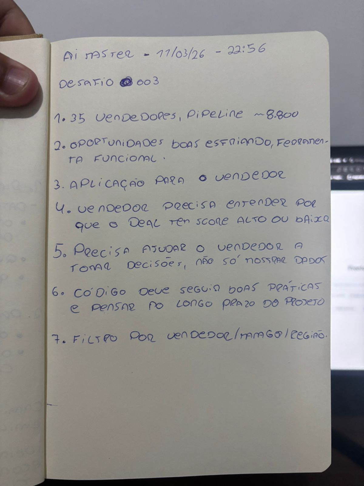
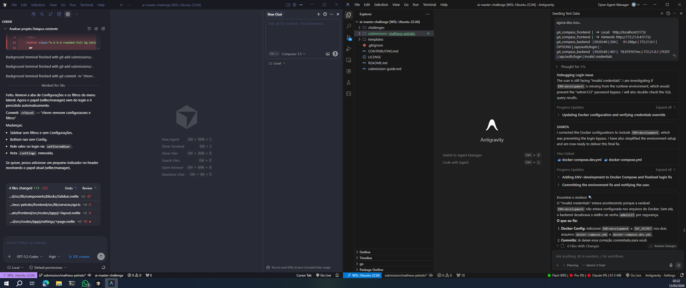
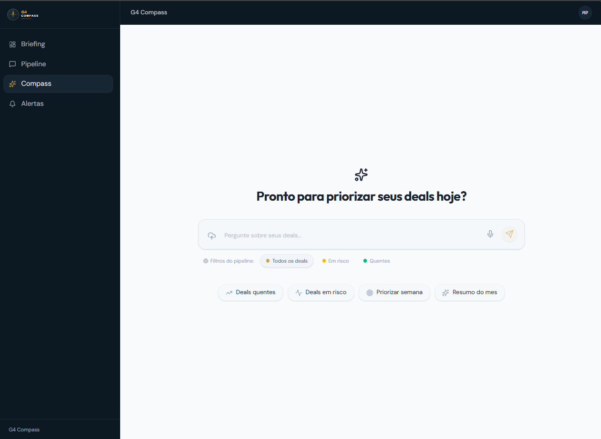

# G4 Compass — Lead Scorer & Sales Copilot 🚀

O **G4 Compass** é um assistente de inteligência e produtividade para vendas B2B, desenhado para transformar dados brutos de pipeline em decisões claras de priorização. 

O projeto resolve o problema da "paralisia por análise" no comercial através de:
1.  **Pipeline Priorizado:** Foco no que realmente fecha (Hot Deals) e no que está morrendo (Zombie Deals).
2.  **Explainability:** O vendedor vê *por que* um deal tem score baixo ou alto.
3.  **Agente ReAct:** Um assistente via chat que cruza dados do banco para dar respostas táticas em tempo real.

---

## 🛠️ Como Rodar (Stack Completa)

Tudo o que você precisa para rodar o ambiente completo (Frontend + Backend + Banco de Dados) está organizado na pasta `solution`:

1.  Acesse a pasta da solução:
    ```bash
    cd submissions/matheus-petrato/solution
    ```
2.  Garanta que o arquivo `.env` exista (baseado no `.env.example`).
3.  Execute o script de inicialização automática:
    ```bash
    ./dev.sh
    ```

**Ambientes disponíveis após o start:**
-   **Frontend:** [http://localhost:5173](http://localhost:5173)
-   **Backend (API):** [http://localhost:8080](http://localhost:8080)
-   **Seeding:** O banco já sobe com usuários de teste pré-cadastrados.

---

## 👥 Papéis e Acesso

O sistema possui governança de dados real baseada no cargo:

### **1. Gestora (Manager)**
-   **Login:** `camila@g4.com` / `admin123`
-   **Identidade no Sistema:** "Dustin Brinkmann"
-   **Capacidades:** Visão completa do time, acesso a dashboards macro e ferramenta de **Importação de CSV**.

### **2. Vendedor (Seller)**
-   **Login:** `joao@g4.com` / `admin123`
-   **Identidade no Sistema:** "Anna Snelling"
-   **Capacidades:** Visão restrita aos seus próprios deals, briefing personalizado e chat focado no seu pipeline.

---

## 📊 Testando com Dados Reais (CSV)

Para popular o sistema com os dados do desafio, o **Manager** deve realizar os uploads na aba de "Imports". Os arquivos CSV de exemplo estão na pasta `solution/`. A ordem importa para o cruzamento de dados:

1.  **Time (`sales_teams.csv`):** Cadastra a hierarquia de vendedores.
2.  **Catálogo (`products.csv`) e Contas (`accounts.csv`):** Cadastra os produtos e clientes.
3.  **Pipeline (`sales_pipeline.csv`):** Importa os negócios. O backend processará os scores automaticamente após este passo.

---

## 💬 O que perguntar ao Agente Compass?

O chat (Compass) é sensível ao contexto de quem pergunta:

**Vendedor (Anna Snelling):**
-   *"Quais são meus deals ativos no momento?"*
-   *"Tenho algum deal em risco (risk) que eu precise priorizar?"*
-   *"Por que o score do meu deal com a [Nome da Conta] é baixo?"*

**Manager (Dustin Brinkmann):**
- *"Como está a saúde do pipeline do time hoje?"*
- *"Quais vendedores estão com mais negócios em risco?"*
- *"Qual região (Central, East ou West) está performando melhor?"*

---

## 🔒 Nota sobre Segurança (API Key)

> [!WARNING]
> Deixamos uma chave do **Mercury** previamente configurada no ambiente para facilitar os testes da banca avaliadora. Esta chave é temporária e será removida logo após o período de submissão. Em um ambiente de produção real, use sua própria chave via `.env`.

---

## 🚀 Visão de Futuro: Agente Proativo

A ideia central do G4 Compass é evoluir de um assistente reativo para um **copiloto proativo**. 
- **Notificações via WhatsApp:** O vendedor não precisará entrar na plataforma para ser avisado de um deal que esfriou ou de uma oportunidade quente. O agente enviará mensagens diretas com o "Action Plan" do dia.
- **Automação de Follow-up:** Sugestão de agendamentos e redação de e-mails baseada no histórico da conversa.

---

## 🏗️ Processo de Implementação

Todo o desenvolvimento foi registrado passo a passo para garantir a rastreabilidade das decisões. O desafio foi realizado em uma maratona de **5 horas de desenvolvimento intenso**:
- **Início:** 11/03 às 23:00
- **Término:** 12/03 às 04:00

1.  **Análise Inicial (22:56):** Escolha do Desafio 003 - Lead Scorer e análise do repositório base.
2.  **Mapeamento (23:11):** Leitura do README e anotação de pontos críticos antes do brainstorm com as IAs.
3.  **Desenvolvimento:** Uso combinado de **Codex e Antigravity** para construir o backend e o frontend em paralelo, garantindo que os contratos de API estivessem sempre síncronos.

### Evidências do Processo:

| Anotação de Pontos Importantes | Desenvolvimento com Codex & Antigravity |
| :---: | :---: |
|  |  |
| *Primeiras impressões e regras de negócio* | *Codificando em tempo real com apoio das IAs* |

### Preview da Aplicação:


---

## 📂 Documentação Complementar

Para detalhes técnicos profundos, consulte a pasta `docs/`:
- **[API_GUIDE.md](docs/API_GUIDE.md):** Guia completo de endpoints e autenticação.
- **[backend-expected-routes.md](docs/backend-expected-routes.md):** Contratos de rotas por tela.
- **[sales-copilot-context.md](docs/sales-copilot-context.md):** Contexto de negócio e regras de scoring.

---

## 📝 Process log — Como usei IA (Obrigatório)

### Ferramentas usadas
| Ferramenta | Para que usei |
|---|---|
| Claude | Estruturação da ideia, framing do produto e **extração do design system** (vibratilidade e componentes) a partir do site da G4 (Talent Flow). |
| Codex (ChatGPT) | Implementação do frontend, ajustes de design e scaffolding do ambiente dev. |
| Antigravity | Implementação do backend, WebSocket, IA Agent e SQL. |
| Git | Controle de versão e commits explicativos. |

### Workflow (resumo)
1.  **Definição:** Mapeamos os KPIs que realmente movem o ponteiro de receita.
2.  **Design System:** Extração de tokens e estética do G4 Talent Flow usando IA para garantir um visual "premium" e alinhado à marca.
3.  **Implementação Mobile:** Foco na rotina do vendedor (briefing e pipeline rápido).
3.  **Engine:** Criação do motor de ReAct Agent com ferramentas de SQL dinâmico.
4.  **Alinhamento:** Sincronização de UUIDs e lógica de Governança para Seller vs Manager.

### Onde a IA errou e como corrigi
-   **SQL:** Algumas queries de join precisavam de ajustes para lidar com campos nulos; corrigi manualmente a lógica de `COALESCE`.
-   **Versão Go:** O linter reclamou da versão do Go; ajustei o boilerplate para ser compatível com o ambiente local.

### Evidências (Process Log)
- [x] **Git History:** Commits organizados por etapa.
- [x] **Screenshots:** Registro das fases de design e código (ver `process-log/screenshots`).
- [x] **Chat Export:** [Conversa com Claude (Brainstorm e Framing)](https://claude.ai/share/c00dcdf3-884d-49a0-88e0-499571429c1c)

---

Submissão enviada em: 12 de Março de 2026
