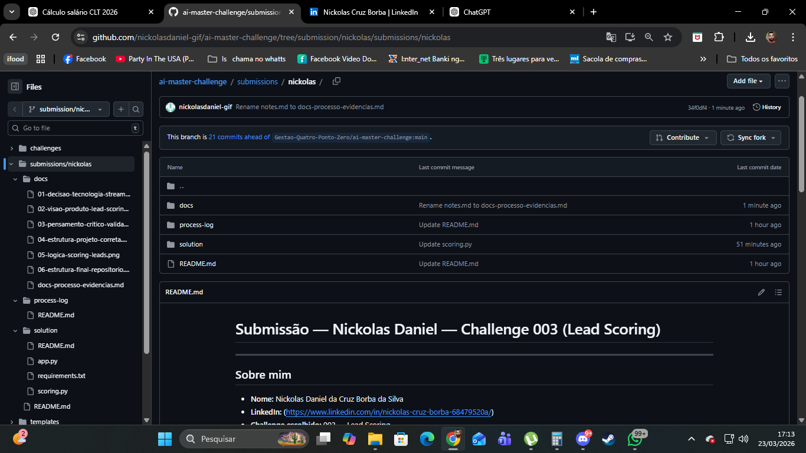
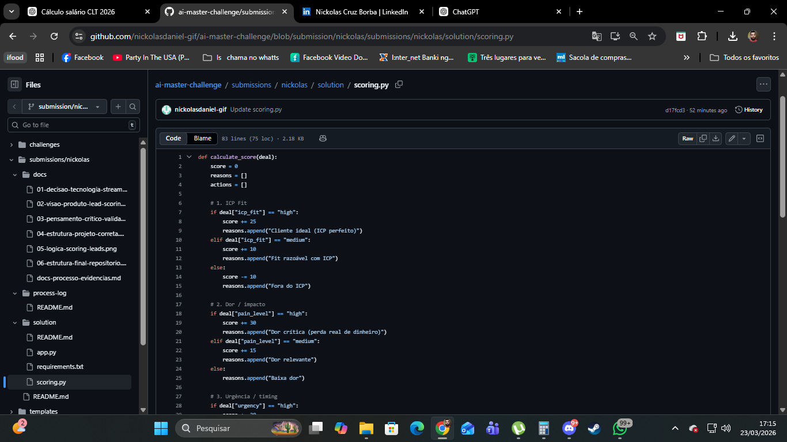

# Evidências do processo

## 1. Estrutura do projeto

Organizei o projeto seguindo o padrão solicitado pelo desafio:

- submissions/nickolas
- solution/
- process-log/
- docs/

## 2. Construção da lógica

A lógica foi baseada em experiência real em vendas, considerando:

- ICP (perfil ideal do cliente)
- Dor do cliente (impacto financeiro)
- Timing (urgência)
- Autoridade (poder de decisão)

## 3. Desenvolvimento da solução

Criei:

- scoring.py → responsável pelo cálculo da pontuação
- app.py → interface simples para interação
- requirements.txt → dependências

## 4. Execução local

Executei testes via terminal para validar:

- Estrutura dos arquivos
- Funcionamento do script
- Integração entre app e scoring

