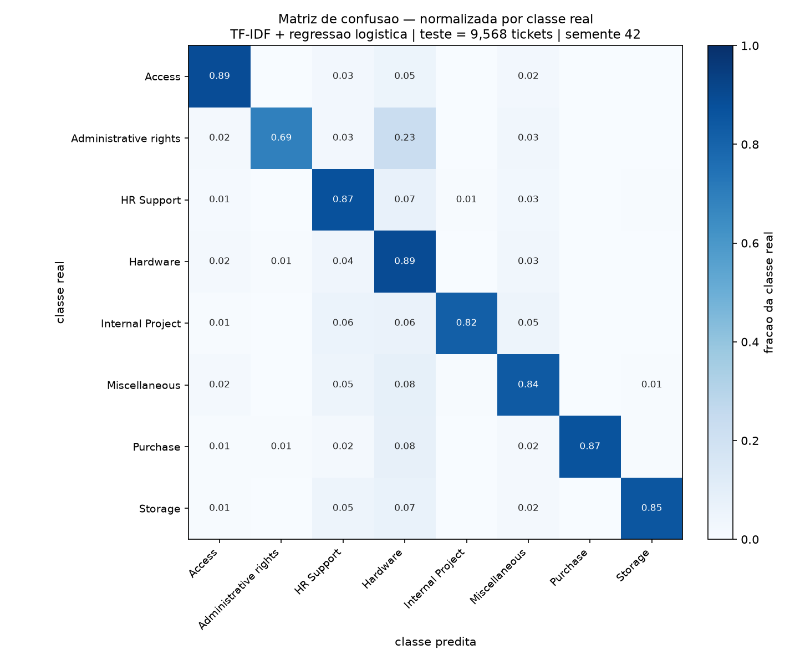
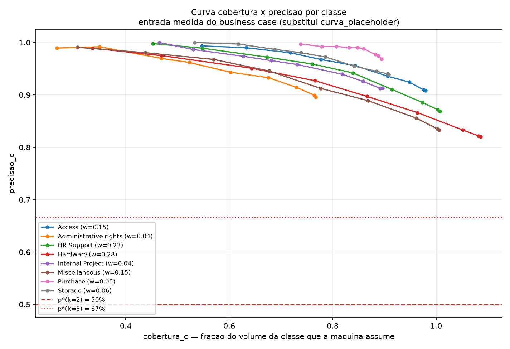

# Submissão — Pablo Marques — Challenge 002

## Sobre mim

- **Nome:** Pablo Marques
- **LinkedIn:** https://www.linkedin.com/in/pablo-marques-b65812203/
- **Challenge escolhido:** Challenge 002 — Redesign de Suporte

---

## Executive Summary

Auditei os dois datasets antes de analisar qualquer coisa e o Dataset 1 não sustenta diagnóstico operacional: não há timestamp de abertura, então tempo de resolução é **incalculável** — e mais seis evidências independentes mostram que as variáveis de processo foram sorteadas. Em vez de produzir horas desperdiçadas a partir de dado sintético, entreguei o business case como uma **função paramétrica** com procedência marcada em cada insumo, mais a lista de instrumentação que a operação precisa registrar para que a pergunta passe a ter resposta. O protótipo roda no Dataset 2 (texto real): classificador com **acurácia 0,8651 e F1 macro 0,8637**, e uma política de triagem que auto-**roteia** 74,6% dos chamados com 89,7% de precisão contra um piso derivado de 83,3% — com κ=5 e tempo de triagem de 0 a 3 min [premissa arbitrada], isso libera **0,1 a 0,3 FTE/ano**, que **não cruza** o limiar de materialidade de 1 FTE [convenção do analista]. Não converti para reais de propósito: exigiria inventar custo/hora e custo de construção, e premissa sobre premissa vira ficção composta — quem tem o custo/hora real multiplica em dois segundos. **Recomendação principal:** instrumentar antes de automatizar — a automação de triagem sozinha não paga um FTE, e o que destrava tanto o business case quanto a camada de respostas sugeridas é um punhado de campos que hoje não são registrados.

## Demo

<!-- gif entra aqui -->

```
.venv/Scripts/python.exe demo.py "meu notebook nao liga desde ontem"
echo "please grant access to the finance folder" | .venv/Scripts/python.exe demo.py
.venv/Scripts/python.exe demo.py --sessao     # os 5 chamados reais abaixo
```

Saída **literal** de [`solution/demo.py`](solution/demo.py) — dois dos cinco casos da sessão gravada. Os cinco (as três rotas, um chamado sem precedente e um erro do modelo) estão em [`solution/demo/sessao_demo.txt`](solution/demo/sessao_demo.txt), e nenhum foi escolhido a dedo: são os primeiros do conjunto de teste que satisfazem cada critério.

```text
### CASO 2 — criterio: aprovacao (categoria sensivel)

==============================================================================
CHAMADO RECEBIDO
==============================================================================
  create record net which points to thursday pm dear please create record
  which points thanks regards engineer

  [rotulo real: Access — mostrado so nesta demo, o sistema nao ve]

------------------------------------------------------------------------------
1. CLASSIFICACAO
------------------------------------------------------------------------------
  categoria prevista : Access
  confianca          : 0.831
  segunda hipotese   : Miscellaneous (margem 0.764)

------------------------------------------------------------------------------
2. DECISAO DE TRIAGEM
------------------------------------------------------------------------------
  rota   : APROVACAO   -> humano com poder de aprovar decide.
  regra  : R1 — categoria sensivel (vence tudo, inclusive confianca alta)
  limiar : tau=0.00 para 'Access', da curva medida do bloco 3
  motivo :
           categoria sensivel: 'Access' concede privilegio; exige aprovacao
           humana [decisao de processo]

------------------------------------------------------------------------------
3. CONTEXTO — CHAMADOS SIMILARES JA ROTEADOS
------------------------------------------------------------------------------
  CONTEXTO PARA O AGENTE — nao e resposta ao cliente, nao e rascunho, nao fecha ticket.

  1. similaridade 0.726 | foi para a fila 'Access'
     texto     : create a record net tuesday hi please create record which
                 points record exists change destination thanks regar
     resolucao : [INDISPONIVEL — o campo resolution_code nao existe nesta base]
  2. similaridade 0.405 | foi para a fila 'Access'
     texto     : create new record for prod service friday pm create record
                 prod hi create record prod questions please let bes
     resolucao : [INDISPONIVEL — o campo resolution_code nao existe nesta base]

  voto dos vizinhos : 'Access'
  modelo            : 'Access'   -> CONCORDAM


### CASO 5 — criterio: o modelo errou

==============================================================================
CHAMADO RECEBIDO
==============================================================================
  mailbox user creation mailbox volume purchase plan apple apple profile
  push apple please

  [rotulo real: Purchase — mostrado so nesta demo, o sistema nao ve]

------------------------------------------------------------------------------
1. CLASSIFICACAO
------------------------------------------------------------------------------
  categoria prevista : Storage
  confianca          : 0.555
  segunda hipotese   : Access (margem 0.183)

------------------------------------------------------------------------------
2. DECISAO DE TRIAGEM
------------------------------------------------------------------------------
  rota   : AUTO        -> fila automatica. auto-ROTEADO, NAO resolvido.
  regra  : R4 — auto-roteado (nenhuma regra anterior disparou)
  limiar : tau=0.00 para 'Storage', da curva medida do bloco 3
  motivo :
           auto-ROTEADO para a fila 'Storage': confianca 0.555 >= tau=0.00,
           margem 0.183 ok. Nao resolvido — agente atende normalmente.

------------------------------------------------------------------------------
3. CONTEXTO — CHAMADOS SIMILARES JA ROTEADOS
------------------------------------------------------------------------------
  CONTEXTO PARA O AGENTE — nao e resposta ao cliente, nao e rascunho, nao fecha ticket.

  1. similaridade 0.345 | foi para a fila 'Hardware'
     texto     : set up and install latest apple and prepare for purchase hi
                 please tickets assign two tickets each each differ
     resolucao : [INDISPONIVEL — o campo resolution_code nao existe nesta base]
  2. similaridade 0.340 | foi para a fila 'Storage'
     texto     : mailbox creation mailbox creation hello please create
                 mailbox user permissions mailbox mails please thank
     resolucao : [INDISPONIVEL — o campo resolution_code nao existe nesta base]

  voto dos vizinhos : 'Hardware'
  modelo            : 'Storage'   -> DISCORDAM
  (discordancia nao muda a rota nesta politica; e um sinal para o
   agente. Precisao medida: 0.928 quando concordam, 0.733 quando nao.)
```

O caso 5 é o sistema errando — `Purchase` classificado como `Storage`, com confiança 0,555 e margem 0,183 — e ficou porque o critério o escolheu, não apesar disso. Ele mostra o mecanismo funcionando onde importa: os vizinhos discordaram do modelo exatamente no caso em que o modelo estava errado.

---

## Solução

### Abordagem

Decompus em cinco blocos, cada um commitado quando o estado existia de verdade, e cada bloco só podia começar depois que o anterior tivesse fechado a sua pergunta:

| Bloco | Pergunta | Saída |
|---|---|---|
| 0 | Os dados sustentam o que o briefing promete? | [`01_exploracao_saida.txt`](solution/01_exploracao_saida.txt) |
| 1 | Se não sustentam, qual é a forma honesta do business case? | [`02_business_case_saida.txt`](solution/02_business_case_saida.txt) |
| 3 | Qual precisão por classe o texto real permite? | [`03_classificador_saida.txt`](solution/03_classificador_saida.txt) |
| 4 | Como isso vira política de roteamento em código? | [`04_triagem_saida.txt`](solution/04_triagem_saida.txt) |
| 5 | E as respostas sugeridas que o enunciado pede? | [`05_contexto_similar_saida.txt`](solution/05_contexto_similar_saida.txt) |

Duas regras valeram do começo ao fim. **Escala vem do enunciado, forma vem dos dados, e as duas não se misturam:** V = 30.000 tickets/ano é `[enunciado]` (linha 11), e os 8.469 registros do arquivo não são multiplicados por fator nenhum. E **número sem marca de procedência não entra nos arquivos**: `[dados]`, `[enunciado]`, `[premissa arbitrada, sem fonte]` ou `[convenção do analista]`.

**A espinha da entrega: auto-roteamento não é auto-resolução.** O Bloco 3 mede precisão de *classificação*. Classificar bem prova que dá para **escolher a fila** — poupa o tempo de triagem T e arrisca o custo de misrouting M — e não prova nada sobre *resolver*. A diferença não é cosmética: o parâmetro deixa de ser "custo do erro em múltiplos do handle time" e passa a ser κ = M/T, o que empurra o piso de precisão de 50–75% para **83–95%**. Nenhuma rota desta entrega fecha ticket ou responde cliente, e **nenhum número de auto-resolução aparece aqui** — por falta de instrumento, não por modéstia.

### Resultados / Findings

#### Diagnóstico: com os dados fornecidos não é possível dizer onde a operação trava

Isso é o achado, não a desculpa. O briefing (linha 45) promete "~30.000 registros com texto real de descrição e resolução"; o arquivo tem 8.469 linhas e a resolução não é real — divergência de tamanho **e de natureza**. As evidências que matam o diagnóstico convencional:

- **Não existe timestamp de abertura.** Sem marco inicial não existe duração: tempo de resolução não é difícil de calcular, é impossível.
- **O proxy de duração é ruído:** 1.365 de 2.769 pares (**49,3%**) têm resolução *antes* da primeira resposta. Causalidade invertida em metade dos casos.
- **Todos os timestamps cabem em ~27 horas.** Morrem sazonalidade, curva de chegada e comparação de backlog.
- **O CSAT é indistinguível de uniforme** (qui-quadrado de aderência, p=0,797) e **não varia com nada**: amplitude de 0,149 ponto entre 13 grupos de canal, tipo e prioridade. Não há sinal de satisfação a explicar.
- **`Ticket Type` e `Ticket Subject` são independentes** (p=0,981), e **100%** das descrições contêm o placeholder `{product_purchased}` não expandido.

O único achado estrutural real do Dataset 1: **CSAT existe se e somente se `Status == Closed`** — 2.769 tickets, 32,7% da base. Não é missing aleatório, é viés de sobrevivência: quem abandonou o ticket não avalia.

**O que o diagnóstico entrega no lugar do número que não existe:** a lista de instrumentação (11 campos, detalhada na Parte 3 do [Bloco 0](solution/01_exploracao_saida.txt)), priorizada em três ondas — Onda 1 destrava o business case (`opened_at`, `resolved_at`, `handle_time_seconds`), Onda 2 destrava o diagnóstico (`queue_*`, `transfer_count`, `reopened_count`), Onda 3 destrava a qualidade (`resolution_code`, `interaction_count`, `csat_*`). Uma operação que não registra esses campos não consegue localizar onde perde tempo — e sem localizar, não há o que automatizar com critério.

#### O que rodou de verdade: classificador, política e painel

Dataset 2, 47.837 chamados reais de TI em 8 categorias, split estratificado 80/20 com semente 42. TF-IDF (1-2gram, min_df=3, sublinear) + Regressão Logística. **A auditoria de vazamento foi feita *antes* do split**, não depois de um número bonito.

| Métrica | Valor |
|---|---|
| Acurácia (teste inteiro) | **0,8651** |
| F1 macro | **0,8637** |
| Gêmeos (≥0,90) do teste que caíram no treino | 12,17% |
| Acurácia excluindo esses documentos | 0,8532 (**Δ −0,0119**) |
| Maior / menor precisão por classe | Purchase 0,968 / **Hardware 0,820** |

O delta pequeno é o que autoriza ler a acurácia como aprendizado e não como memorização.



**Hardware é o ralo da base.** Sendo a maior classe (28,5%), absorve **532 predições erradas** vindas das outras sete — 158 de HR Support, 116 de Miscellaneous, 81 de Administrative rights, 74 de Access. O erro não anda para a vizinha semântica, anda para a maior classe: prior venceu semântica.



A curva por classe é o entregável real do Bloco 3, e é dela que saem os limiares — nenhum escolhido à mão. Com κ=5 (piso p* = 83,3%), margem mínima 0,15 e duas categorias sensíveis, a política roda assim nos 9.568 chamados de teste:

| Rota | Chamados | % | Precisão |
|---|---|---|---|
| **auto** (roteado, não resolvido) | 7.142 | 74,6% | **0,897** |
| **aprovação** (humano decide) | 1.666 | 17,4% | 0,906 |
| **humano** (triagem manual) | 760 | 7,9% | 0,479 |

Os 25,4% que não são automatizados têm motivo medido e separado: R1 categoria sensível 1.666 (17,4%), R2 empate no topo 627 (6,6%, precisão 0,472), R3 abaixo do limiar da classe 133 (1,4%, precisão 0,511). As duas últimas cortam exatamente onde a máquina erraria — precisão da sugestão bem abaixo do piso.

**A camada de respostas sugeridas (enunciado, linha 82) não foi construída, e o motivo é medido.** O Dataset 1 tem a coluna `Resolution`, mas ela é texto gerado: 2.769 de 2.769 valores únicos, 36 caracteres. Um teste com controle pareado mede a sobreposição de vocabulário entre a resolução e o problema dela (0,0102) contra a resolução e o problema de *outro* cliente sorteado (0,0076): **ambas em torno de 1%**, muito abaixo de qualquer limiar utilizável para recuperação. A diferença entre as duas é real e estatisticamente significante (p=0,013), e irrelevante em magnitude (d de Cohen = 0,047). Em **94,9%** dos casos a resolução não tem uma única palavra em comum com o problema que teria resolvido. O Dataset 2 tem texto real e nenhum campo de resolução.

No lugar, o Bloco 5 entrega um **painel de contexto**: para um chamado novo, os 3 chamados históricos mais parecidos, com similaridade e a fila para onde cada um foi — e o campo `resolucao_aplicada` impresso como `[INDISPONIVEL]`. O painel devolve **vazio** nos 30,6% de casos sem comparável, em vez de inventar três. Efeito colateral mensurável: o voto dos vizinhos é uma segunda opinião independente dos coeficientes do modelo, e a precisão é **0,928 quando os dois concordam contra 0,733 quando discordam** (+0,196; +0,186 excluindo os casos com gêmeo).

### Recomendações

**1. Instrumentar antes de automatizar (Onda 1: `opened_at`, `resolved_at`, `handle_time_seconds`).** Destrava todas as outras. Hoje o handle time é premissa arbitrada; medido, vira fato — e basta HR Support custar **1,25× o tempo de triagem** de Hardware para o primeiro lugar da fila de prioridade inverter. A premissa de tempo uniforme é barata para decidir o que *não* priorizar e cara para decidir o que priorizar primeiro.

**2. Ligar o auto-roteamento, não a auto-resolução.** 74,6% do volume com 89,7% de precisão contra o piso de 83,3%. O agente continua atendendo, escrevendo e resolvendo; o que a máquina poupa é a triagem manual.

**3. O que NÃO automatizar — e não é uma lista de assuntos proibidos.** Esperava-se alguma categoria cair fora por baixa separabilidade; **nenhuma das oito cai**, em nenhum κ da faixa. O piso não morde em exclusão de classe, morde em **cobertura**: a taxa de automação global vai de 96,5% (κ=5) a 85,2% (κ=10) e 66,3% (κ=20). O que fica com humano é, **dentro de cada assunto, a cauda de baixa confiança** — por isso o corte é uma regra em [`04_triagem.py`](solution/04_triagem.py), testável, e não regra de negócio estática em slide.

> **Os 96,5% e os 74,6% não se contradizem — são dois estágios.** 96,5% é a cobertura medida do classificador ponderada pelo mix (Σ w_c · cobertura_c), **antes** de qualquer regra de política: é o teto que a medição do Bloco 3 autoriza. 74,6% é o que sobra **depois** que a política do Bloco 4 corta — R1 tira 17,4% por categoria sensível, R2 tira 6,6% por empate no topo, R3 tira 1,4% por confiança abaixo do limiar da classe. A distância entre os dois números é exatamente o preço das regras, e ele está discriminado.

**4. Access e Administrative rights exigem aprovação humana — decisão de processo, com o preço na mesa.** Desvia **17,4% do volume** que a máquina classificaria com **90,6% de precisão**, acima do piso. A regra não existe porque a precisão é ruim; existe *apesar* de ela ser boa: conceder privilégio não tem desfazer barato, e o custo de errar não está na fila errada, está no privilégio concedido a quem não devia. Quem discordar da troca move `CATEGORIAS_SENSIVEIS` e reroda.

**5. Não perseguir a camada de respostas sugeridas antes do `resolution_code`.** Quatro blocos independentes travaram no mesmo campo. A distância até ela não é um modelo — é uma coluna.

### Limitações

- **O Dataset 1 é sintético.** O valor do diagnóstico está no **método** — como se audita, quantifica e comunica — e não nos valores absolutos, que não refletem operação real. Nenhuma conclusão de negócio saiu de variável sorteada.
- **O classificador é de TI interno; o Dataset 1 é consumo.** O mix `w_c` do business case vem do Dataset 2 (HR Support, Access, Internal Project) e é um **transplante declarado entre operações** — não é o mix desta operação, e não há fonte para ele. Uso-o porque é a única taxonomia em que a medição do classificador e a ponderação do business case falam a mesma língua. O Dataset 1 entra com **zero pesos**: seu mix é sorteio.
- **O limiar de confiança é quase inerte nesta política.** Com κ=5, τ_c = 0,0 em **seis das oito classes** (só Hardware 0,5 e Miscellaneous 0,3). Quem corta de fato é a regra de margem (R2, 627 chamados) e a de categoria sensível (R1, 1.666). *Para que serve o limiar, então?* Ele **morde com κ alto**: quando o custo do misrouting sobe, o piso p* sobe junto e os limiares deixam de ser zero — é o que derruba a cobertura global de 96,5% para 66,3% entre κ=5 e κ=20. O limiar é o mecanismo que responde a mudança de custo; nesta calibragem ele está frouxo porque a precisão já começa alta.
- **`cobertura_c` passa de 1,0 em HR Support (1,007) e Miscellaneous (1,002).** É classe-ímã: atrai mais volume do que possui, porque o canal automático recebe chamados de outras classes. É **informação, não defeito da métrica** — cobertura é fração dentro da classe justamente para ser comparável entre classes sem exigir que o score seja.
- **Auto-resolução não foi dimensionada porque não é dimensionável aqui.** Exigiria medir repetição de solução (`resolution_code` / `kb_article_id`). Repetição de *problema* é medível — 6,3% dos chamados de teste têm gêmeo ≥0,90 no espaço de features do classificador; repetição de *solução* não é.
- **Sem comparação com embeddings ou LLM zero-shot.** Decisão de orçamento, declarada: um baseline clássico completo e auditado vale mais que duas abordagens pela metade.

---

## Process Log — Como usei IA

### Ferramentas usadas

| Ferramenta | Para que usou |
|------------|--------------|
| Claude Code (sessão de trabalho) | Análise exploratória, código dos cinco blocos, gráficos, commits |
| Claude Code (2ª sessão, paralela) | Revisão crítica dos outputs da primeira e direção dos próximos passos |
| Git | Histórico incremental como evidência de processo |

### Workflow

1. **Auditar antes de analisar.** O primeiro prompt não pediu insight, pediu viabilidade: os dados sustentam o que o briefing promete? Sete evidências depois, a resposta era não — e isso redefiniu a entrega inteira.
2. **Registrar previsões falsificáveis *antes* de medir**, cada uma com o critério que a derruba (commit `bef5c92`, anterior ao classificador). Previsão sem critério de falsificação é horóscopo.
3. **Medir e conferir sem suavizar** — o Bloco 3 aplicou os critérios registrados e reportou duas previsões minhas falsificadas.
4. **Transformar a política em código:** a regra de fallback humano virou um `if` testável com o custo medido, não uma promessa de slide.
5. **Fechar o item que não dava para entregar** (respostas sugeridas) medindo por que não dava, em vez de pular ou fingir.
6. Uma segunda sessão de Claude Code leu os outputs da primeira com olho adversarial e apontou o rumo — inclusive puxando as correções 3 e 6 abaixo.

### Onde a IA errou e como corrigi

1. **Denominador errado (Bloco 0).** Calculou os deltas negativos dividindo por 8.469 (base inteira) em vez de 2.769 (pares válidos): 16,1% quando o certo era **49,3%**. Pegou sozinha antes de commitar — fica registrado porque a auto-correção também é dado sobre o processo.
2. **Contradição interna no Bloco 1** (corrigida em `71baef6`): a Seção 6 afirmava "não há ranking nesta saída" enquanto a Seção 3 imprimia o ranking quatro vezes. Exigi que ou o texto mudasse ou a tabela saísse; saiu a tabela, e o motivo da recusa virou explícito.
3. **Commit encenado.** Deletou uma seção, commitou um estado que **nunca existiu na máquina** e restaurou depois. Aceitou sem defesa e virou regra permanente: *commit reflete estado que existiu de verdade*. O histórico não foi reescrito — apagar o episódio seria repetir o erro.
4. **Contagem dupla do `w_c`.** Ia dissolver o mix — transplante declarado entre operações — dentro de uma grandeza rotulada `[medido]`, transformando premissa em medição. Ela pegou o bug; rejeitei o conserto proposto (reindexar por cobertura global) e fixei cobertura como fração dentro da classe, com `w_c` visível e rotulado.
5. **Duas previsões próprias falsificadas** (P1 e P3R-b) e uma **confirmada por critério mal especificado** (P2, que testou a direção de um par em vez de perguntar quem absorve — pior que falsificada, porque sobrevive à conferência). As duas que ela marcou com base "ALTA" foram justamente a que mais errou e a que passou por critério frouxo.
6. **Comparação de espaços vetoriais diferentes (Bloco 5).** Escreveu que os 6,3% de gêmeos eram "o mesmo número do Bloco 3 com o sinal trocado". Falso: o Bloco 3 mediu **12,17%** num espaço mais frouxo (unigrama, min_df=2, sem sublinear_tf, ajustado na base inteira). Os dois números foram publicados com a diferença de método declarada, em vez de ficar com o mais conveniente.

### O que eu adicionei que a IA sozinha não faria

- **Separar auto-roteamento de auto-resolução.** A IA tinha escrito um ganho que supunha economia de handle time inteiro, e a primeira versão do corte dizia "automatize 100%, nenhuma classe fora" — o red flag que o próprio enunciado cita. Exigir que a álgebra respeitasse o que a medição de fato licencia mudou o piso de precisão de 50–75% para 83–95% e é a espinha da entrega.
- **Exigir procedência marcada em cada número.** Número sem marca não entra nos arquivos. É o que impede premissa arbitrada de se disfarçar de medição três seções depois.
- **Recusar converter para reais.** Custo/hora e custo de construção seriam duas premissas novas empilhadas sobre as que já existem. Parei em FTE, na última fronteira que o modelo alcança sem inventar dinheiro.
- **Travar o mix como transplante declarado** em vez de fingir que o Dataset 1 tinha mix. O caminho fácil era ponderar por `Ticket Type`; ele é sorteado (p=0,981), e usá-lo teria produzido um business case coerente por fora e vazio por dentro.

---

## Evidências

- [ ] Screenshots das conversas com IA
- [ ] Screen recording do workflow
- [x] **Chat exports** — [duas sessões de trabalho exportadas na íntegra](process-log/chat-exports/)
- [x] **Git history** — commits incrementais, um por bloco concluído, na branch `submission/pablo-marques`
- [x] **Outro: código rodando** — cinco scripts reproduzíveis (semente 42) com a saída completa versionada em [`solution/`](solution/), mais [`curva_medida.json`](solution/curva_medida.json), [`politica_triagem.json`](solution/politica_triagem.json) e [`contexto_medido.json`](solution/contexto_medido.json). Dependências em [`requirements.txt`](solution/requirements.txt); os CSVs não vão no PR — baixar do Kaggle ([Dataset 1](https://www.kaggle.com/datasets/suraj520/customer-support-ticket-dataset), [Dataset 2](https://www.kaggle.com/datasets/adisongoh/it-service-ticket-classification-dataset)) para `data/`.

---

_Submissão enviada em: 21/07/2026_
