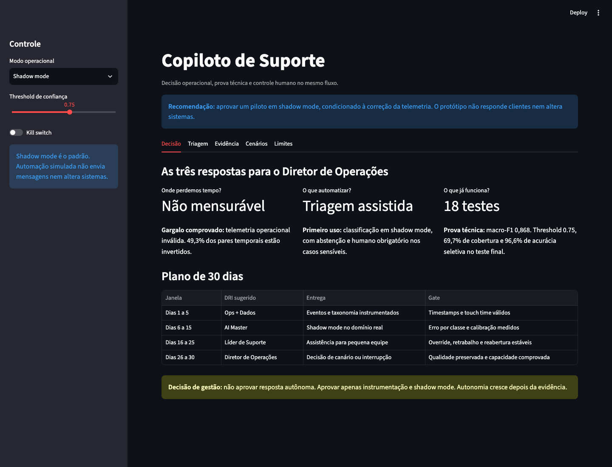
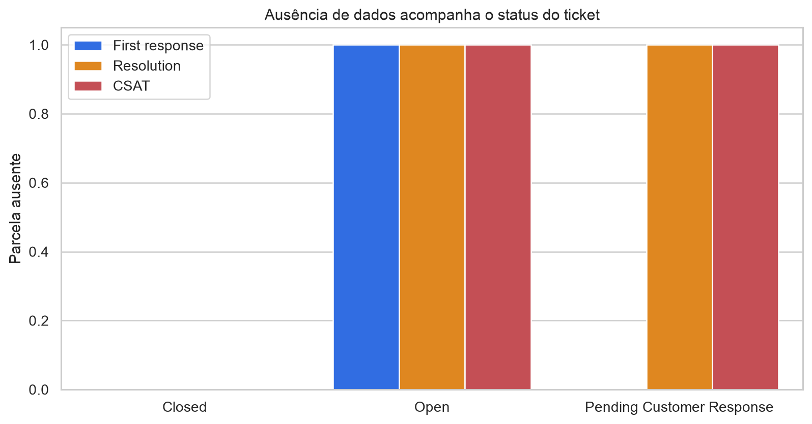
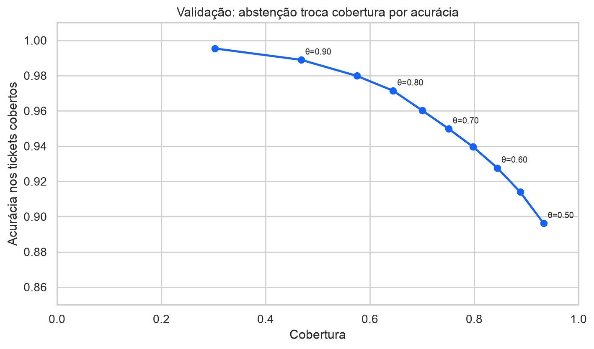
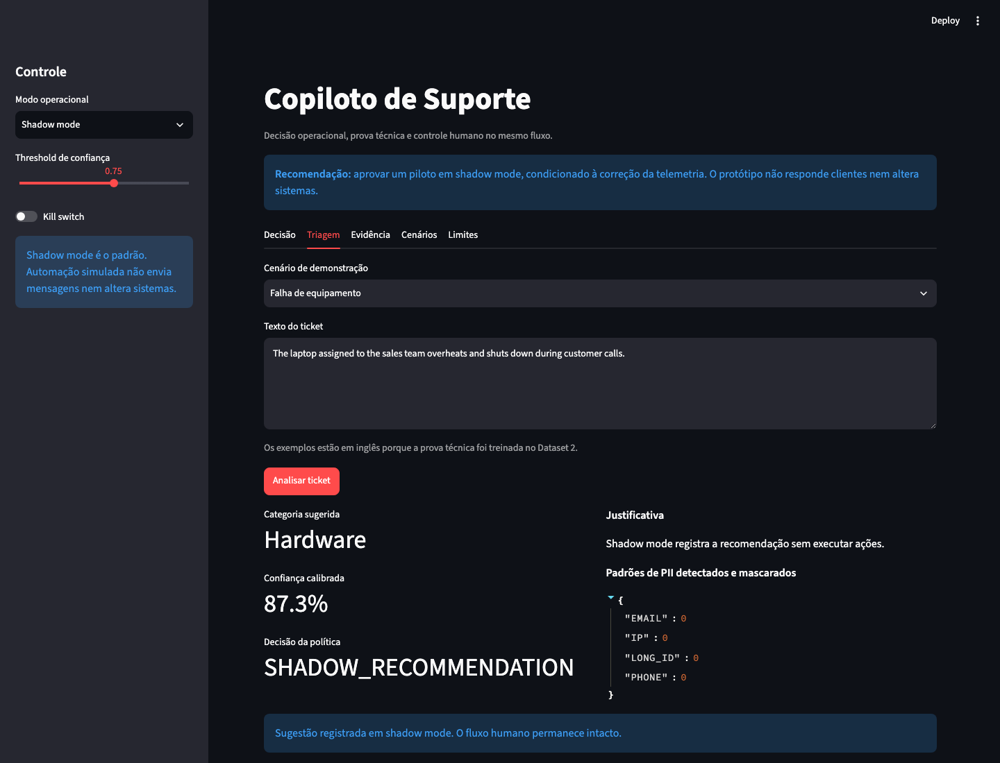

# Support Copilot: Challenge 002

> **Decisão recomendada:** aprovar instrumentação + piloto em shadow mode.  
> **Decisão vetada:** resposta autônoma em produção.

## Resumo executivo

O diagnóstico encontrou um problema anterior à automação: o Dataset 1 possui **8.469 tickets**, não os aproximadamente 30 mil descritos no contexto, e seus campos temporais não permitem medir FRT, TTR ou touch time. Em **49,3% dos 2.769 pares temporais**, a resolução aparece antes da primeira resposta. Em vez de inventar ROI, construí um **copiloto de triagem em shadow mode**: classificador calibrado, abstenção, categorias human-only, máscara de PII, audit log e kill switch.

No Dataset 2, o classificador atingiu **macro-F1 0,868** no teste final de 7.176 tickets. O threshold 0,75 foi escolhido apenas na validação e, no teste final, cobriu 69,7% com 96,6% de acurácia nos cobertos. Isso é uma prova técnica no domínio de TI, não uma validação para a G4.

## As três respostas do diretor

| Pergunta | Resposta executiva | Próxima decisão |
|---|---|---|
| Onde perdemos tempo? | O arquivo não permite medir. 49,3% dos pares temporais estão invertidos e não existe timestamp de abertura | Corrigir telemetria antes de prometer eficiência |
| O que automatizar? | Classificação em shadow mode, com abstenção e humano obrigatório em casos sensíveis | Rodar piloto sem impacto no cliente |
| Funciona? | 18 testes, macro-F1 0,868 e 96,6% de acurácia nos tickets cobertos no teste final | Validar novamente no domínio real |



## A decisão em uma frase

**Medir o fluxo real, rodar a IA em paralelo ao humano e só ampliar autonomia depois que erro, risco e capacidade forem observados.**

## O diferencial

O resultado mais importante não é o modelo. É o **gate de decisão**. A IA encontrou uma solução aparentemente convincente e chegou a inventar touch time, custo-hora e elegibilidade. Eu interrompi esse caminho, auditei os dados e redesenhei a proposta. O protótipo demonstra onde usar IA e, principalmente, onde ela ainda não merece autonomia.

## Plano de 30 dias

| Janela | DRI sugerido | Entrega | Gate |
|---|---|---|---|
| Dias 1 a 5 | Ops + Dados | Eventos e taxonomia instrumentados | Timestamps e touch time válidos |
| Dias 6 a 15 | AI Master | Shadow mode no domínio real | Erro por classe e calibração medidos |
| Dias 16 a 25 | Líder de Suporte | Assistência para pequena equipe | Override, retrabalho e reabertura estáveis |
| Dias 26 a 30 | Diretor de Operações | Decisão de canário ou interrupção | Qualidade preservada e capacidade comprovada |

## Potencial econômico, sem falsa precisão

Usando **30 mil tickets apenas como contexto narrativo do brief**, a sensibilidade abaixo mostra capacidade líquida anual. Não é resultado observado:

| Cenário | Tickets no período | Elegível | Adoção | Taxa segura | Min poupados | Revisão | Retrabalho | Horas líquidas |
|---|---:|---:|---:|---:|---:|---:|---:|---:|
| Conservador | 30.000 | 10% | 30% | 85% | 3,0 | 1,5 min | 0,5 min | 8,3 h |
| Base | 30.000 | 25% | 50% | 90% | 5,0 | 1,0 min | 0,5 min | 187,5 h |
| Expansão | 30.000 | 40% | 70% | 95% | 7,0 | 0,5 min | 0,25 min | 826,0 h |

O valor financeiro só deve ser calculado depois de medir touch time e aprovar custo-hora, integração, plataforma e manutenção.

## Achados

| Achado | Evidência | Consequência |
|---|---:|---|
| Volume real do Dataset 1 | 8.469 tickets | Não usar 30 mil como denominador |
| Pares temporais inválidos | 1.365 de 2.769 | Vetar FRT, TTR e ROI observado |
| Texto templado | 8.469 descrições com placeholder | Vetar inferência semântica operacional |
| Sinal de CSAT | Efeitos nulos ou desprezíveis | Não priorizar segmento por causalidade |
| Prova técnica | Macro-F1 0,868 | Classificação é tecnicamente viável no Dataset 2 |
| Abstenção | 69,7% de cobertura a 96,6% de acurácia no teste final | Expor a troca entre escala e erro |





## Matriz de decisão

Escala de 1 a 5. A nota ponderada não supera veto crítico.

| Alternativa | Evidência 30% | Impacto 25% | Segurança 20% | Viabilidade 15% | Diferenciação 10% | Nota | Veto |
|---|---:|---:|---:|---:|---:|---:|---|
| Resposta autônoma | 1,0 | 4,0 | 1,0 | 2,0 | 3,0 | 2,1 | Sim |
| Roteamento automático | 4,0 | 4,0 | 3,0 | 4,0 | 4,0 | 3,8 | Produção |
| Copiloto em shadow mode | 5,0 | 3,5 | 5,0 | 5,0 | 4,5 | **4,6** | Não |
| Dashboard isolado | 3,0 | 2,0 | 5,0 | 5,0 | 2,0 | 3,4 | Não |

## O que funciona

O protótipo Streamlit:

- recebe texto e mascara padrões de PII;
- classifica em oito categorias;
- mostra confiança e alternativas;
- abstém abaixo do threshold;
- bloqueia categorias sensíveis;
- força revisão com kill switch;
- registra decisão sem guardar texto bruto;
- calcula capacidade apenas com premissas explícitas.



## Rodar

Requer Python 3.11 ou superior e [uv](https://docs.astral.sh/uv/).

```bash
cd solution
uv sync
uv run streamlit run app.py
```

Abra `http://localhost:8501`.

## Testar

```bash
uv run python -m unittest discover -s tests -v
```

Resultado validado: **18 testes aprovados**.

## Reproduzir a análise

Baixe os dois arquivos CC0 indicados no challenge e posicione:

```text
data/raw/customer-support/customer_support_tickets.csv
data/raw/it-service/all_tickets_processed_improved_v3.csv
```

Depois:

```bash
uv run python scripts/data_audit.py
uv run python scripts/train_classifier.py
uv run python scripts/build_figures.py
uv run python scripts/build_notebook.py
```

O notebook executado está em `notebooks/challenge-002-analysis.ipynb`. Os dados brutos não são versionados.

## Recomendações

1. **Instrumentar antes de automatizar:** criação, primeira resposta, touch time, resolução, reabertura e override.
2. **Shadow mode:** comparar IA e humano no domínio real sem impacto no cliente.
3. **Assistência controlada:** exibir sugestão, manter confirmação humana e medir retrabalho.
4. **Canário restrito:** somente ações reversíveis depois dos gates de segurança.

## Limitações

- O Dataset 1 não mede tempos operacionais de forma válida.
- O Dataset 2 representa suporte interno de TI, não atendimento da G4.
- Não há dados da G4, validação temporal ou experimento em produção.
- Regex não detecta todo tipo de PII.
- Threshold validado em dados públicos não autoriza produção.
- ROI permanece cenário até touch time, custos, adoção e retrabalho serem medidos.

## Mapa da entrega

- `docs/gate-1/`: auditoria, diagnóstico e decisão
- `docs/gate-2/`: modelo, arquitetura, claims e medição
- `artifacts/`: métricas, tabelas, figuras e modelo
- `notebooks/`: análise executada
- `src/`: política, inferência, privacidade, auditoria e ROI
- `tests/`: testes da política e da interface
- `process-log/`: uso de IA, erros e correções

## Process log

Leia [`process-log/README.md`](process-log/README.md).

## Sobre mim

- **Nome:** Pedro Gonçalves
- **LinkedIn:** [linkedin.com/in/pedrotg22](https://br.linkedin.com/in/pedrotg22)
- **Formação:** Engenharia de Produção, Unicamp
- **Challenge:** 002, Redesign de Suporte

Submissão preparada em 24/07/2026.
