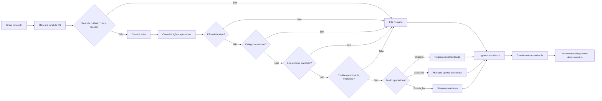

# Arquitetura final: medir antes de automatizar

## Decisão

O sistema é um **copiloto de operação em modo de observação**, não um agente autônomo. Ele
demonstra classificação, confiança calibrada, abstenção e governança sem enviar respostas ou
alterar sistemas externos. Aceita uma mensagem, uma fila ou duas planilhas em CSV/XLSX. Antes da
análise universal, o humano valida colunas, papéis, ordem, contexto e relação.

## Componentes

| Componente | Função | Controle |
|---|---|---|
| `privacy.py` | Mascara padrões de PII | Executa localmente antes da inferência |
| `inference.py` | Retorna categoria e probabilidades | Modelo versionado e teste final documentado |
| `customer_care.py` | Identifica sinais explícitos de reclamação e possível dano | Qualquer sinal força decisão humana |
| `batch.py` | Processa DataFrames sem guardar texto bruto | O contexto escolhido, não o nome da coluna, define a fila |
| `policy.py` | Aplica gates de risco | Cliente, kill switch, human-only, memória e abstenção |
| `audit.py` | Gera registro rastreável | Sem texto e sem fingerprint do texto |
| `memory.py` | Registra correções e recupera lições aprovadas | SQLite local, sem texto bruto, sem RAG e com aprovação humana |
| `local_ai.py` | Revisa coerência antes e depois do gate humano | Granite local, saída estruturada, falha segura e sem autoridade decisória |
| `demo_matrix.py` | Executa 16 cenários representativos | Resultado esperado explícito e sem dados pessoais |
| `universal_analysis.py` | Perfila e organiza duas planilhas | Sugestão de estrutura sempre confirmada por humano |
| `roi.py` | Simula capacidade e valor | Todas as premissas são entradas explícitas |
| `app.py` | Ferramenta de avaliação e uso cotidiano | Visão geral, Demonstração, Analisar planilhas, Aprendizado, Entregáveis e Ajuda |
| `cross_dataset_audit.py` | Aplica o modelo do Dataset 2 em todas as mensagens do Dataset 1 | Mede concentração e confiança sem alegar acurácia |

## Fronteira humano-IA

### IA pode

- mascarar padrões conhecidos de PII;
- identificar sinais explícitos de cuidado prioritário com o cliente;
- sugerir uma categoria;
- mostrar confiança e alternativas;
- abster-se;
- registrar a decisão e o estado da política;
- registrar correções e consultar lições aprovadas;
- mostrar o motivo do encaminhamento humano.
- revisar metadados do recebimento e procurar contradições no parecer determinístico.

### IA não pode

- determinar prioridade sem dados adequados;
- enviar resposta;
- conceder reembolso;
- alterar acesso ou permissão;
- tratar casos de RH autonomamente;
- converter TTR em horas de trabalho;
- declarar ROI sem touch time e custos medidos;
- aprovar uma lição ou retreinar o modelo silenciosamente.
- calcular indicadores, alterar prioridade ou substituir o parecer determinístico.

## Duas chamadas locais, um gate humano

O Granite local entra somente como revisor:

1. recebe metadados estruturais, nunca a planilha inteira, e aponta inconsistências antes da
   aprovação;
2. após a aprovação humana e o cálculo determinístico, procura contradições no parecer.

O gate humano fica entre as duas chamadas. Saída inválida, indisponibilidade ou demora do modelo
não autoriza automação. O OSS mostra a limitação e mantém a análise determinística disponível.

## Por que a memória não altera os pesos

Retropropagação é adequada para uma etapa de treino, não para aceitar cada correção operacional
como verdade. Neste case ainda faltam volume de correções aprovadas, autorização de uso e teste
final independente. Alterar pesos agora reduziria a rastreabilidade e poderia espalhar uma
correção ruim por milhares de decisões.

O SQLite atua como uma camada de precedentes: guarda evidência estruturada, exige outro revisor e
força análise humana quando reconhece um erro conhecido. Isso melhora o processo sem fingir que o
modelo foi retreinado.

## Por que não há RAG

RAG recupera trechos de uma coleção ampla para ajudar uma resposta gerada. Aqui o conhecimento
útil é pequeno, estruturado e normativo: categoria prevista, categoria corrigida, termos gerais,
evidência, aprovador e controle. Busca vetorial adicionaria incerteza sem resolver um gargalo
observado. Ela só passa a fazer sentido quando políticas e materiais validados crescerem além da
capacidade de regras explícitas e houver avaliação de recuperação.

## Estado do protótipo

O protótipo é local e funcional. A rota do avaliador começa em `Visão geral`, passa pela
`Demonstração` e termina em `Entregáveis`. A rota de uma nova operação começa em `Analisar
planilhas`, exige validação humana e termina num painel gerencial. Nenhuma integração externa é
executada.

## Caminho para produção

1. Instrumentar o fluxo real.
2. Definir taxonomia e risco com a operação.
3. Rotular amostra do domínio alvo.
4. Rodar shadow mode por janela suficiente.
5. Avaliar erro crítico, override, reabertura, touch time e CSAT.
6. Liberar canário apenas para ações reversíveis.
7. Manter revisão amostral, auditoria, rollback e kill switch.
