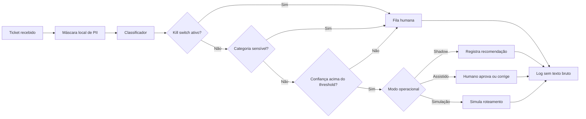

# Arquitetura final: medir antes de automatizar

## Decisão

O sistema é um **copiloto de triagem em shadow mode**, não um agente autônomo. Ele demonstra classificação, confiança calibrada, abstenção e governança sem enviar respostas ou alterar sistemas externos.

## Componentes

| Componente | Função | Controle |
|---|---|---|
| `privacy.py` | Mascara padrões de PII | Executa localmente antes da inferência |
| `inference.py` | Retorna categoria e probabilidades | Modelo versionado e teste final documentado |
| `policy.py` | Aplica gates de risco | Kill switch, human-only, abstenção e modo |
| `audit.py` | Gera registro rastreável | Sem texto e sem fingerprint do texto |
| `roi.py` | Simula capacidade e valor | Todas as premissas são entradas explícitas |
| `app.py` | Interface demonstrável | Shadow mode como padrão |

## Fronteira humano-IA

### IA pode

- mascarar padrões conhecidos de PII;
- sugerir uma categoria;
- mostrar confiança e alternativas;
- abster-se;
- registrar a decisão e o estado da política;
- simular capacidade com premissas fornecidas.

### IA não pode

- determinar prioridade sem dados adequados;
- enviar resposta;
- conceder reembolso;
- alterar acesso ou permissão;
- tratar casos de RH autonomamente;
- converter TTR em horas de trabalho;
- declarar ROI sem touch time e custos medidos.

## Estado do protótipo

O protótipo é local e funcional. O modo de automação é deliberadamente simulado. A ausência de integração externa não é dívida escondida: é uma barreira de segurança coerente com a evidência disponível.

## Caminho para produção

1. Instrumentar o fluxo real.
2. Definir taxonomia e risco com a operação.
3. Rotular amostra do domínio alvo.
4. Rodar shadow mode por janela suficiente.
5. Avaliar erro crítico, override, reabertura, touch time e CSAT.
6. Liberar canário apenas para ações reversíveis.
7. Manter revisão amostral, auditoria, rollback e kill switch.
