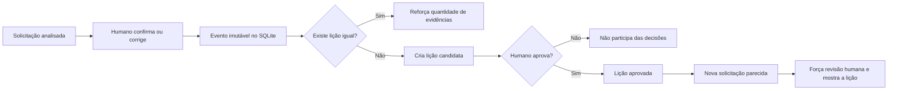

# Memória de aprendizado: corrigir sem perder controle

## Resumo executivo

O protótipo já registra decisões, mas um registro sozinho não evita que o mesmo erro volte a
acontecer. A nova camada transforma correções humanas em uma memória operacional simples,
versionável e auditável. O banco SQLite guarda eventos de feedback e lições generalizadas. Toda
lição nasce como candidata. Somente outro revisor identificado pode aprová-la para consultas
futuras.

Isso não é retropropagação e também não é RAG. É uma memória estruturada de precedentes: o
sistema consulta experiências aprovadas antes de decidir. Retropropagação exige retreinar o
modelo com exemplos rotulados, medir o novo modelo num teste separado e liberar a nova versão
apenas se ela superar a anterior. RAG exige uma coleção não estruturada, recuperação e geração,
complexidade que ainda não resolve um gargalo observado neste case.

## Diagnóstico pela tese do vídeo

A tese central da transcrição é que o valor está migrando da construção técnica para o
diagnóstico do problema e a transformação do processo. Aplicada ao case:

1. O pedido superficial seria "faça a IA aprender sozinha".
2. O problema real é que correções humanas se perdem e o mesmo erro pode reaparecer.
3. Automatizar retreinamento não resolve feedback ruim, contraditório ou malicioso.
4. O processo precisa primeiro capturar, revisar, aprovar e medir cada aprendizado.
5. SQLite é infraestrutura invisível. O produto é o ciclo confiável de melhoria.

Analogia: um caderno de erros ajuda um aluno a revisar antes da próxima prova. Ele não altera
automaticamente o cérebro do aluno. A retropropagação corresponde ao treino posterior, quando o
aluno pratica novamente e comprova que melhorou.

## Decisão

Implementar agora memória por recuperação com controle humano. Adiar retreinamento até existir
volume suficiente de correções aprovadas, dados autorizados e um teste final congelado.

## Matriz de decisão

Pesos: aprendizado 30%, segurança 25%, auditoria 20%, simplicidade 15%, prontidão 10%.

| Alternativa | Aprendizado | Segurança | Auditoria | Simplicidade | Prontidão | Nota |
|---|---:|---:|---:|---:|---:|---:|
| Sem memória | 1,0 | 5,0 | 5,0 | 5,0 | 5,0 | 3,8 |
| Apenas guardar logs | 2,0 | 5,0 | 5,0 | 5,0 | 5,0 | 4,1 |
| SQLite com lições aprovadas | 4,5 | 4,5 | 5,0 | 4,5 | 4,5 | **4,6** |
| RAG sobre documentos e correções | 4,0 | 2,5 | 2,5 | 2,0 | 2,5 | 2,9 |
| Retreinamento automático contínuo | 5,0 | 1,0 | 2,0 | 1,0 | 1,0 | 2,4 |

## O diferencial: saber onde parar

O desafio alerta que automatizar tudo é uma armadilha. Aqui isso aparece em três recusas
deliberadas:

1. a memória não transforma uma correção isolada em verdade;
2. a aplicação não responde nem altera sistemas externos;
3. RAG e retreinamento não entram antes de existir necessidade e evidência.

O ganho não é “menos IA”. É **IA proporcional ao risco e à maturidade dos dados**. Como um
piloto de avião, o sistema pode mostrar instrumentos e sugerir direção, mas não assume o comando
quando os sensores são incompletos ou existe consequência crítica.

## Aprendizado já demonstrado

O protótipo inicia com lições operacionais sustentadas pelos artefatos do case: cuidado com
contato repetido, separação das taxonomias, confiança não prova aderência ao domínio, horários
inválidos, repetição não é duplicata e ruído de templates.

Há também uma correção reproduzida: uma solicitação de compra de monitores foi prevista como
`Hardware`. A lição aprovada associa os termos gerais `monitor` e `order` ao risco de erro. Na
próxima ocorrência, o sistema não muda a categoria sozinho. Ele aciona a memória e força revisão
humana.

## Como funciona

## Estrutura do banco

| Tabela | Função | Regra |
|---|---|---|
| `feedback_events` | Guarda cada confirmação ou correção | Um evento por decisão, sem texto bruto e protegido contra alteração |
| `lessons` | Consolida a regra geral gerada pelo sistema | Candidata, aprovada por outro revisor ou desativada |
| `lesson_evidence` | Liga lições aos eventos que as sustentam | Permite contar evidências e auditar origem |
| `operational_lessons` | Guarda aprendizados derivados da análise do case | Criados, editados ou aposentados, nunca excluídos |
| `memory_revisions` | Preserva cada versão de uma lição operacional | Histórico imutável com autor, data e motivo |

O arquivo é único: `artifacts/memory/learning.sqlite3`. Eventos de feedback são protegidos contra
alteração e exclusão comum. Uma lição desativada deixa de participar das análises, mas continua
disponível para auditoria. Antes de produção, retenção e eliminação excepcional de registros
indevidos precisam de procedimento administrativo separado.

No protótipo, o líder consulta todas as tabelas, cria lições e edita o estado pelo próprio OSS.
Cada alteração é salva imediatamente e gera uma revisão imutável. Não existe ação de exclusão:
uma lição inadequada é aposentada e permanece auditável. Autor e revisor ainda informam seus
identificadores manualmente, o que demonstra separação de funções sem substituir autenticação
corporativa.

## Fronteira humano e IA

### IA pode

- registrar feedback estruturado, sem justificativa livre;
- detectar uma lição idêntica e aumentar sua contagem de evidências;
- recuperar lições aprovadas por categoria e termos gerais;
- mostrar a recomendação e forçar revisão humana;
- gerar uma lição candidata a partir das categorias e dos termos validados.

### IA não pode

- transformar a própria inferência em verdade;
- aprovar a própria lição ou aprovar silenciosamente uma nova lição;
- guardar texto bruto, credenciais ou dados pessoais na memória;
- editar o histórico de feedback;
- retreinar e substituir o modelo em produção sem avaliação independente.

## Quando entra a retropropagação

A fase de retreinamento só começa quando houver exemplos autorizados e rotulados. O fluxo será:

1. exportar correções aprovadas para um conjunto de treino;
2. separar treino, validação e teste final;
3. retreinar uma nova versão do classificador;
4. comparar memória ligada, memória desligada, modelo antigo e modelo novo;
5. bloquear a versão se erro crítico, privacidade ou qualidade piorarem;
6. liberar primeiro em modo de observação, com retorno rápido à versão anterior.

## Quando entra RAG

RAG só será considerado se surgirem muitos procedimentos, políticas e históricos validados que
não caibam em regras estruturadas. Antes da adoção, será necessário provar qualidade da busca,
procedência das fontes, proteção contra instruções maliciosas e ganho sobre a memória atual.
Sem esse teste, RAG seria arquitetura adicional, não solução.

## Métricas

- repetição de erro conhecido;
- correções por 100 sugestões;
- percentual de lições candidatas aprovadas;
- acerto com memória ligada versus desligada;
- conflitos entre lições;
- tempo de revisão humana;
- incidentes de privacidade;
- regressão por categoria.

## Riscos e controles

| Risco | Controle |
|---|---|
| Feedback humano errado | Lição começa como candidata e exige aprovação |
| Autoaprovação | Autor e revisor precisam ser identificados e diferentes |
| Regra específica demais | Guardar termos e instrução generalizados |
| Envenenamento da memória | Conteúdo recuperado é dado, nunca instrução de sistema |
| Regressão | Teste comparativo com memória ligada e desligada |
| Vazamento | Não guardar texto bruto e proibir dados pessoais na lição |
| Acúmulo de regras conflitantes | Versionar, desativar e auditar cada lição |

## Gate de liberação

A memória só avança além da demonstração quando provar menos repetição de erros sem aumentar erro
crítico, tempo de revisão ou incidentes de privacidade. Até lá, ela funciona como apoio à decisão,
nunca como autorização para ação automática.
