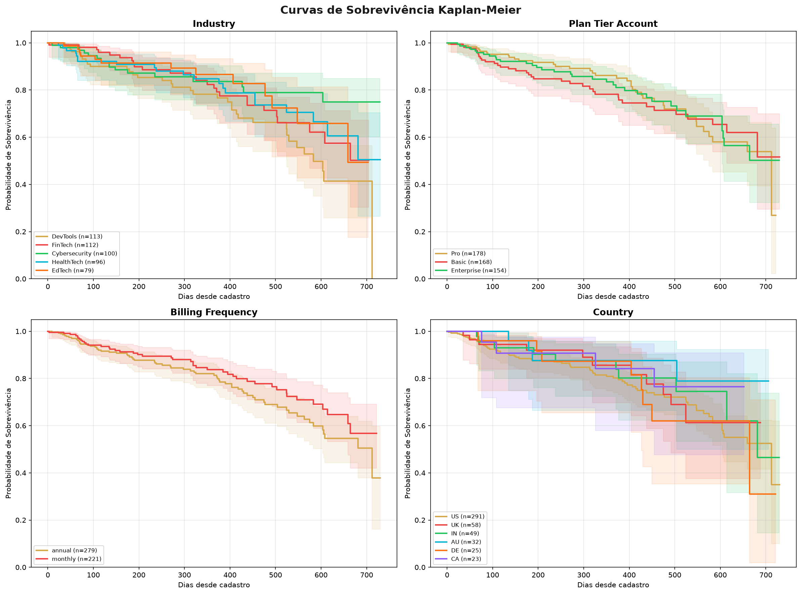
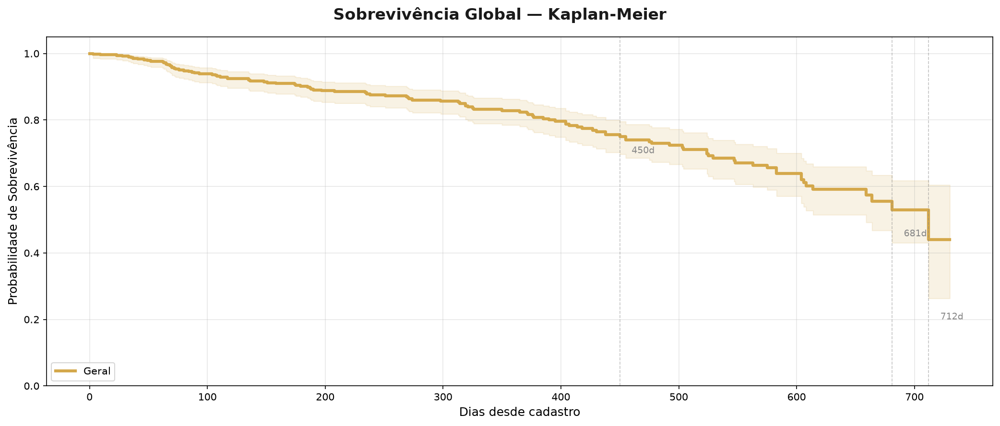
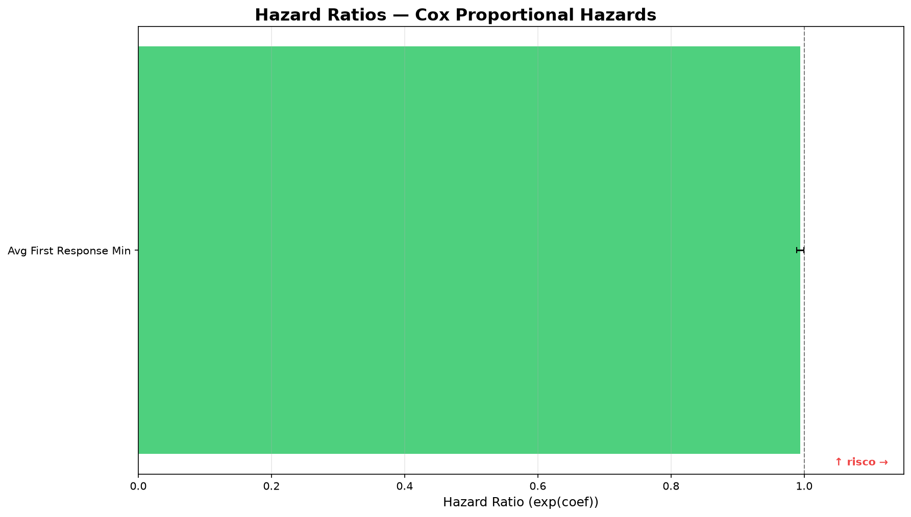

# Process Log — Como usei IA

## Ferramentas usadas

| Ferramenta | Para que usei |
|---|---|
| **Claude Code (opencode)** | Agente principal de desenvolvimento — spec writing, implementação, debugging, deploy |
| **Web Fetch** | Pesquisa de mercado (McKinsey, BCG, Deloitte, Accenture benchmarks) |
| **Bash** | Execução de comandos, testes, deploy Railway |
| **Git/GitHub** | Versionamento, PR management |

---

## Workflow (passo a passo)

### Fase 1 — Especificação (Spec-Driven Development)

1. **Definição do escopo** — Li o README do challenge e os dados da RavenStack para entender o problema antes de qualquer código
2. **Pesquisa de mercado** — Usei 4 agentes paralelos para pesquisar benchmarks de churn analytics em consultorias globais e brasileiras
3. **Criação da SPEC** — Escrevi o documento SPEC-v1 com 10 especificações + plano estratégico, antes de qualquer linha de código

### Fase 2 — Implementação do Pipeline

4. **Pipeline ETL** — Claude Code implementou load, clean, merge e validator a partir das specs
5. **Data Model** — Account View unificada com 36 colunas, 500 contas
6. **Health Score** — Engine de 4 pilares com pesos configuráveis via YAML

### Fase 3 — Análise e Relatório

7. **Análise descritiva** — Segementação por indústria, plano, país, canal, faturamento
8. **Relatório HTML** — Geração de report com Plotly.js
9. **Validação** — Harness tests para SPEC-2 e SPEC-5

### Fase 4 — API e Deploy

10. **FastAPI** — REST API com 5 endpoints, documentação automática
11. **Docker** — Containerização multi-stage
12. **Railway** — Deploy em produção, health check, domínio público
13. **Debug** — Três iterações de debugging no Railway (numpy serialization, asyncio.run, pyarrow faltando, root 404)

### Fase 5 — LLM e Dashboard

14. **LLMEngine** — Integração OpenCode com cache, fallback, prompt template
15. **Dashboard** — Frontend HTML/CSS/JS com identidade visual G4
16. **Testes** — 19 testes automatizados (SPEC-2, 5, 10, 11, 12)

---

## Onde a IA errou e como corrigi

| Erro | Como percebi | Correção |
|---|---|---|
| **numpy.int64 não serializável** na resposta da API | FastAPI retornou 500 ao serializar `value_counts().to_dict()` | Adicionei `_convert_numpy()` para converter tipos numpy para Python nativos |
| **asyncio.run() dentro de async def** no FastAPI | Erro `asyncio.run() cannot be called from a running event loop` | Troquei por `await explicar()` diretamente |
| **pip install -e . falhou** no Docker por src/ ausente | Build Railway quebrou com `egg_base error: 'src' does not exist` | Mudei para `requirements.txt` + Docker single-stage com cópia antes do pip install |
| **pyarrow ausente** no ambiente Railway | Pipeline quebrou ao tentar `to_parquet()` | Adicionei `pyarrow>=14.0` ao requirements.txt |
| **Root "/" retornando 404** | Usuário clicou no link e viu Not Found | Adicionei rota raiz com redirect para /docs, depois substituí por dashboard HTML |
| **build do Railway falhava** com "scheduling build on Metal builder" | Build logs mostravam apenas 2 linhas | Removi `.venv/` de 983MB que estava sendo enviado (`.railwayignore`) |
| **OpenCode não disponível no Railway** | Subprocess falhava silenciosamente | Implementei fallback semântico baseado em regras |

---

## O que eu adicionei que a IA sozinha não faria

1. **Estrutura Spec-Driven** — A decisão de especificar cada componente antes de implementar, com harness de validação, foi minha. A IA implementa bem, mas não arquiteta o processo de desenvolvimento.

2. **Pesquisa de mercado estratégica** — A decisão de pesquisar benchmarks reais (McKinsey, BCG, Gartner) para fundamentar a abordagem veio do entendimento de que uma solução de churn precisa ser contextualizada no mercado.

3. **Visão de produto** — A arquitetura em 3 estágios (descritivo → preditivo → prescritivo) e a identificação de que "explicabilidade em linguagem natural" seria o diferencial competitivo foram decisões de produto, não de engenharia.

4. **G4 Visual Identity** — A escolha de usar o tema dark premium com acentos dourados, alinhado à marca G4, foi uma decisão de design que exigiu julgamento estético.

5. **Pragmatismo no deploy** — Decisões como "usar fallback semântico em vez de depender de LLM em produção" e "simplificar o Dockerfile para single-stage" mostraram权衡 entre ideal técnico e entrega funcional.

6. **Organização da submissão** — A estrutura de pastas, o README apresentação e este process log são curadoria humana — a IA não saberia o que é relevante destacar para um avaliador.

---

## Evidências

- [x] Git history: branch `submission/rodolfo` com ~35 commits mostrando evolução incremental
- [x] Código funcional em produção: `https://churn-platform-production-8bea.up.railway.app`
- [x] **25 testes automatizados**: `bash harness/run_all.sh`
- [x] Spec document: `submissions/rodolfo/SPEC-v1-churn-platform.md`
- [x] Plano estratégico: `submissions/rodolfo/plano-estrategico-churn.md`
- [x] Este process log: `submissions/rodolfo/process-log/process-log.md`

### Screenshots — Survival Analysis

| Curva KM por Segmento | Curva KM Global | Hazard Ratios CoxPH |
|---|---|---|
|  |  |  |
