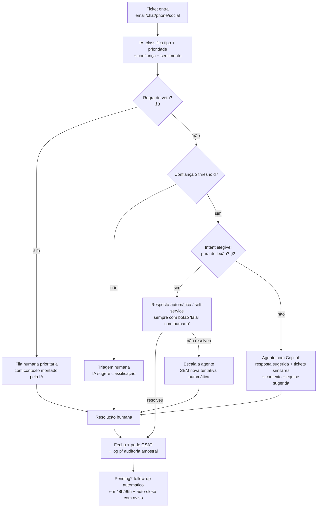

# FASE 4 — Estratégia de Automação com IA

**Challenge 002 — Redesign de Suporte (G4 Educação)**
**Data:** 2026-07-17 · **Autor:** Thales Barbosa (com Claude Code)

**Fonte única e coerência:** a matriz abaixo vive como código em [`src/automation.py`](../src/automation.py); as tabelas deste documento são **geradas** por `render_matrix_markdown()`/`render_routing_markdown()` e a coerência com as premissas de deflexão do ROI ([`src/roi_model.py`](../src/roi_model.py)) é garantida por 9 testes em [`tests/test_automation.py`](../tests/test_automation.py) — os percentuais nunca são redigitados (D-012/D-013). O protótipo da FASE 6 importa as mesmas estruturas (recomendação de automação e equipe sugerida do Copilot).

**Uso dos dois datasets:** o Dataset 1 fornece a taxonomia B2C (5 tipos × 16 assuntos), os volumes e o modelo econômico; o Dataset 2 fornece **texto real** (47.823 tickets) e as 8 classes que fundamentam o classificador (FASE 5) e o roteamento por equipe. A ponte entre os dois vocabulários está na §5.

---

## 1. Princípio de desenho

**A decisão de automação não é por tipo de ticket — é por camada e por intent.**

- **Triagem (classificar, priorizar, rotear): automatizada em 100% dos casos**, em todos os tiers. É a automação de menor risco e maior alavanca — ataca diretamente os 33,3% de tickets sem primeira resposta (diagnóstico P1).
- **Resolução:** o tier por tipo (abaixo) decide se a IA responde sozinha (deflexão), assiste o humano ou apenas prepara contexto.
- **Regras transversais de veto (§3) têm precedência sobre qualquer tier** — são avaliadas antes da deflexão.

Automatizar 100% é red flag, não virtude: o desenho abaixo deflete ~37% dos tickets no cenário base e mantém humano exatamente onde ele é insubstituível.

## 2. Matriz de decisão — taxonomia B2C (Dataset 1)

Critérios do plano em escala 1–5: **R**epetitividade, **P**revisibilidade, **Ri**sco, **C**riticidade, **J**ulgamento humano. Deflexão = premissa low/base/high do modelo de ROI (líquida de escalação, a validar em piloto).

| Tipo (D1) | Decisão (resolução) | Deflexão (low/base/high) | R | P | Ri | C | J | O que automatiza | O que NUNCA automatiza |
|---|---|---|---|---|---|---|---|---|---|
| Product inquiry | **Automatizar** | 50% / **65%** / 80% | 5 | 5 | 1 | 1 | 1 | respostas informacionais (compatibilidade, recomendação, setup, specs) via base de conhecimento + RAG; FAQ dinâmico | aconselhamento de compra com reclamação implícita; cliente que já teve resposta automática e reabriu |
| Billing inquiry | **Parcial** | 30% / **45%** / 60% | 4 | 4 | 3 | 3 | 2 | consulta de cobrança/fatura, explicação de itens, 2ª via, atualização de forma de pagamento com verificação | disputa/contestação de cobrança, suspeita de fraude, cobrança em duplicidade acima do limite definido |
| Refund request | **Parcial** | 20% / **35%** / 50% | 4 | 3 | 4 | 3 | 3 | status do reembolso, elegibilidade por política clara, processamento de casos dentro da política e abaixo do teto de valor | exceções à política, valores acima do teto, cliente reincidente ou com histórico de disputa |
| Cancellation request | **Parcial** | 15% / **25%** / 40% | 4 | 3 | 4 | 4 | 5 | confirmação de recebimento, coleta de motivo, execução do cancelamento JÁ decidido, instruções pós-cancelamento | a conversa de retenção — é negociação humana de alto valor; IA prepara o contexto (motivo, LTV, histórico), humano conduz |
| Technical issue | **Parcial** | 10% / **20%** / 30% | 3 | 2 | 3 | 4 | 4 | triagem + coleta estruturada de sintomas, sugestões de troubleshooting L1 (reiniciar/atualizar/verificar), artigos relevantes; detecção de incidente em massa | diagnóstico além de L1, perda de dados, segurança, qualquer caso Critical — vai direto ao especialista com contexto montado pela IA |

**Leituras da matriz:**
- A ordenação tier↔deflexão é monotônica por construção (testada): quanto mais automatizável, maior a premissa de deflexão.
- `julgamento_humano ≥ 4` **bloqueia** o tier "Automatizar" (testado) — é o critério-veto: Cancellation (J=5) e Technical (J=4) nunca serão deflexão plena, por mais repetitivos que pareçam.
- Em Technical issue (28% das horas estimadas — maior pool do diagnóstico), o ganho dominante é **assistência** (copilot reduz AHT), não substituição.

## 3. Regras transversais de NÃO automatização (têm precedência sobre a matriz)

O que define uma automação madura não é a lista do que ela faz — é a lista do que ela **se recusa a fazer**:

| Regra de veto | Por quê | Ação |
|---|---|---|
| Sentimento negativo forte / cliente irritado | empatia é o produto; resposta automática a raiva fabrica detrator | rotear a humano com prioridade elevada + contexto da IA |
| Menção a advogado, Procon, regulador ou imprensa | risco legal/reputacional supera qualquer economia | fila especializada, resposta 100% humana, auditoria |
| Disputa financeira acima do teto (parâmetro do negócio) | erro tem custo direto e mina confiança | humano decide; IA anexa política e histórico |
| Cliente reabriu após resposta automática | segunda tentativa automática = loop de frustração | escalação obrigatória (sem nova deflexão) |
| Prioridade Critical | criticidade exige responsabilização humana imediata | triagem automática apenas; resolução sempre humana |
| Suspeita de fraude / dados pessoais sensíveis | compliance/LGPD; IA não decide nem expõe | fila restrita; mascaramento de PII no log |

## 4. Roteamento por classe — taxonomia real (Dataset 2)

O classificador da FASE 5 treina nestas 8 classes (texto real). A coluna "Decisão" segue os mesmos critérios da §2 — com dois casos didáticos: **Access** (reset de senha = automação clássica, alta repetição + resposta determinística + risco controlável por verificação de identidade) e **Administrative rights** (superficialmente parecido, mas conceder privilégio é decisão de segurança → humano sempre). É o par que prova que a decisão é por *natureza do intent*, não por semelhança de texto.

| Classe (D2) | Equipe sugerida | Decisão | Nota |
|---|---|---|---|
| Hardware | Suporte de campo / TI local | Parcial | triagem + coleta de sintomas automáticas; troca física é humana |
| HR Support | RH / People Ops | Parcial | consultas padrão (férias, folha) automatizáveis; casos pessoais são humanos |
| Access | IAM / Segurança | Automatizar | reset de senha/acesso padrão = automação clássica COM verificação de identidade |
| Administrative rights | IAM / Segurança | Não automatizar | concessão de privilégio é decisão de segurança — aprovação humana sempre; IA só triagem |
| Storage | Infraestrutura | Automatizar | quota/mailbox cheio = self-healing (expansão automática com limites e log) |
| Purchase | Compras / Procurement | Parcial | cotação/status automatizáveis; aprovação de gasto é humana |
| Internal Project | PMO / responsável do projeto | Não automatizar | contexto de projeto específico; IA apenas classifica e roteia |
| Miscellaneous | Triagem humana | Não automatizar | classe guarda-chuva (14,8%): confusão esperada do classificador — threshold de confiança manda para humano (D-007) |

Exemplos reais do corpus que ancoram as decisões: *"reset passwords for external accounts... expire days please kindly help prolongation"* (Access → automação clássica); *"mailbox almost full"* (Storage → self-healing); *"all staff outlook hello please make cancel moved offices"* (Administrative rights → aprovação humana).

## 5. A ponte entre os dois datasets

| | Dataset 1 (B2C) | Dataset 2 (TI corporativo) |
|---|---|---|
| Papel | métricas, volumes, economia (ROI), taxonomia de negócio | texto real, treino/avaliação do classificador, prova de capacidade |
| Limitação | texto sintético (templates) — não treina modelo | domínio ≠ B2C — classes não transferem 1:1 |
| Uso na solução | matriz §2 + modelo de ROI + dashboards | classificador + busca semântica (FASE 5) + roteamento §4 |

**Como a ponte funciona na prática:** a FASE 5 demonstra a *capacidade* (classificar texto real em 8 classes com métricas honestas + busca semântica). Em produção no contexto B2C, o mesmo pipeline seria re-treinado com os tickets reais da empresa rotulados na taxonomia da §2 — a arquitetura, os thresholds e os guardrails transferem; os pesos não. **Disclosure:** no Dataset 1, o cruzamento Subject×Type é uniforme (sintético), então os recortes "o que automatiza dentro do tipo" da §2 derivam dos critérios declarados, não de frequências empíricas.

## 6. Como funciona na prática — o fluxo proposto

Etapa a etapa, amarrado ao diagnóstico:

1. **Entrada e triagem automática (100% dos tickets).** Classificação de tipo/prioridade/sentimento com confiança calibrada (FASE 5). Ataca os **33,3% sem primeira resposta**: todo ticket recebe resposta de recebimento contextualizada em segundos.
2. **Vetos primeiro (§3).** Irritação, risco legal, fraude, Critical → humano com prioridade e contexto. Nenhuma economia justifica errar aqui.
3. **Gate de confiança.** Abaixo do threshold (calibrado na FASE 5; Miscellaneous cai aqui por construção), a IA não age — sugere e o humano decide. Confiança baixa é informação, não obstáculo.
4. **Deflexão (§2).** Intents elegíveis recebem resposta automática com **escape hatch permanente** ("falar com humano" a um clique — deflexão forçada infla métrica e detrator).
5. **Assistência (Copilot).** Para tudo que não deflete: resposta sugerida, 5 tickets similares resolvidos (busca semântica), contexto do cliente e equipe sugerida. É a alavanca dos 20% de redução de AHT do ROI — e o protótipo da FASE 6 demonstra exatamente esta tela.
6. **Pós-resolução.** CSAT em 100% dos fechamentos (corrige o viés de seleção da P2); QA humano amostral (~5%) das respostas automáticas.
7. **Pending (34,0% do snapshot).** Follow-up automático em 48h/96h e auto-close com aviso e reabertura fácil — a segunda alavanca do funil, hoje parada esperando o cliente.

## 7. KPIs e gates do piloto (liga com o ROI da FASE 3)

| KPI | Gate para rollout | Por quê |
|---|---|---|
| Deflexão real por tipo | ≥ premissa *low* da matriz | valida a premissa dominante do regime |
| Taxa de escalação pós-deflexão | < 25% das deflexões | deflexão que volta não é deflexão (taxas da matriz são líquidas) |
| CSAT das interações automatizadas | ≥ CSAT humano − 0,2 ponto | economia não pode custar experiência |
| AHT com Copilot vs sem (A/B) | redução ≥ 10% (premissa low) | valida a alavanca de assistência |
| Reabertura/FCR | sem piora vs baseline | detecta resolução falsa |
| Custo real por ticket IA | ≤ R$ 2,00 (premissa high) | trava o denominador do ROI |

Piloto sugerido: 1 tipo de alta confiança (Product inquiry) + Copilot para Technical issue, 4–6 semanas, com os gates acima decidindo expansão — coerente com o tornado da FASE 3 (medir AHT e performance cedo; controlar custo recorrente por ticket).

## 8. Limitações

1. Tiers e recortes por intent derivam de **critérios declarados**, não de frequências empíricas do D1 (Subject×Type é sintético — disclosure §5); a validação é o piloto.
2. As classes do D2 (TI corporativo) não transferem 1:1 para B2C — a FASE 5 prova capacidade, não o modelo final de produção.
3. Thresholds de confiança e tetos de valor são parâmetros do negócio a calibrar (FASE 5 calibra confiança; tetos ficam como input do piloto).
4. Sentimento/veto dependem de detecção que também erra — por isso QA amostral humano e escape hatch permanente.

---

**Status histórico da FASE 4: ✅ concluída.** Artefatos: `src/automation.py` (fonte única testada), este documento (tabelas geradas do código), 9 testes novos (36 no total naquele fechamento). Decisão: D-013. A FASE 5 posteriormente implementou o classificador nas 8 classes do D2 e a busca semântica seguindo as diretrizes da D-007.
