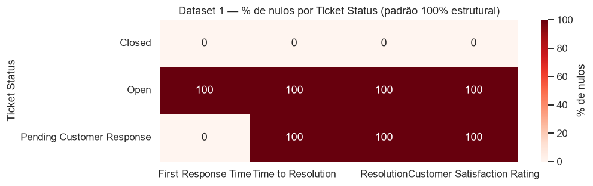
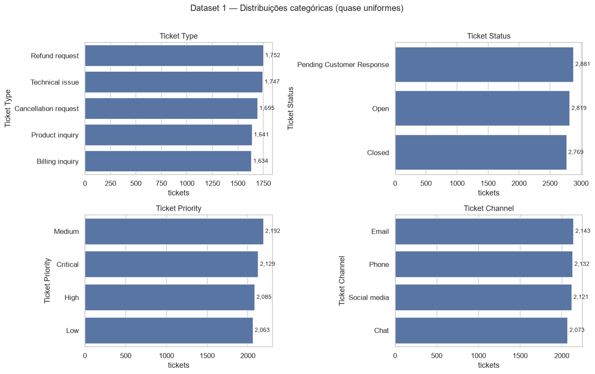
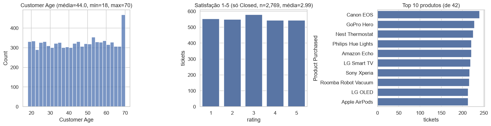
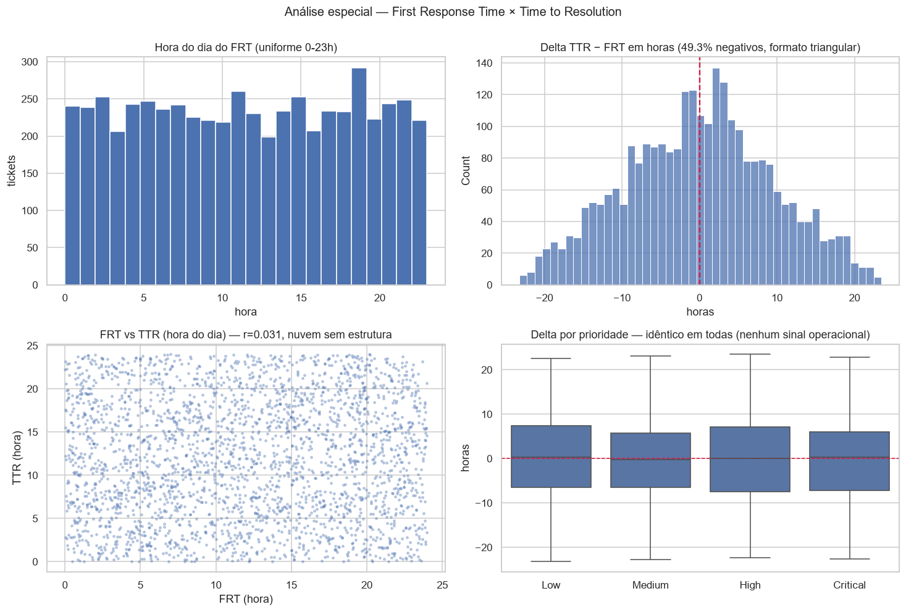
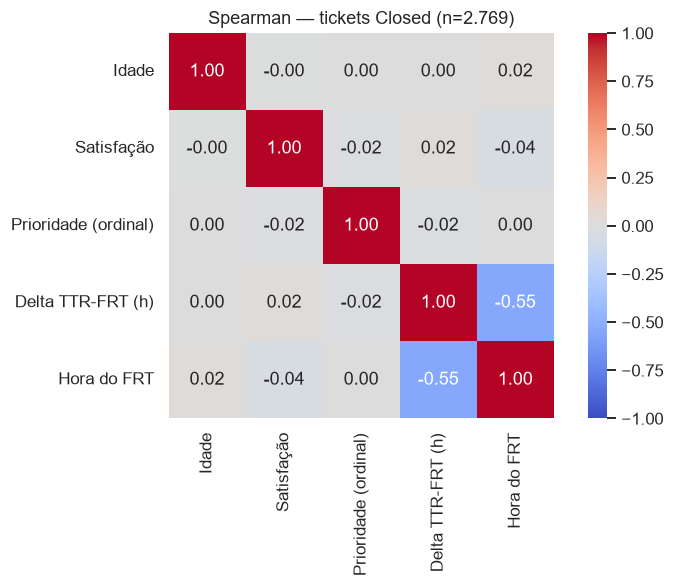
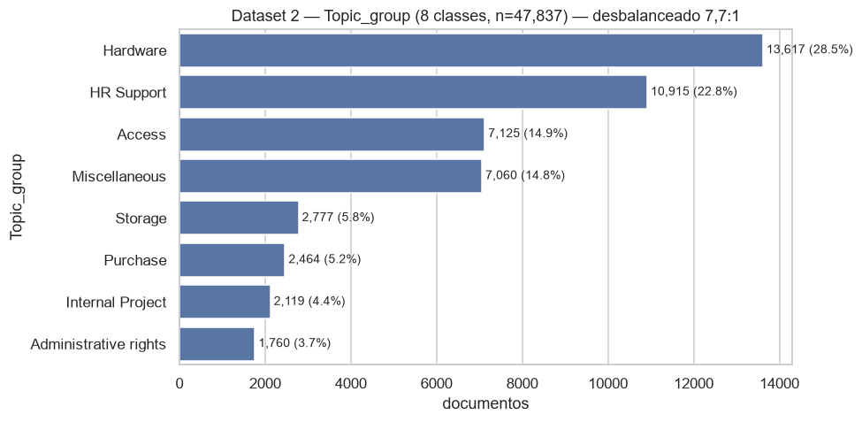
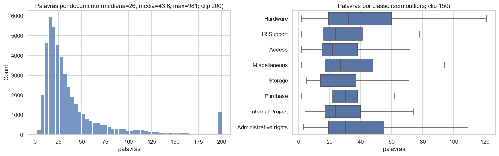

# FASE 1 — Auditoria dos Dados

**Challenge 002 — Redesign de Suporte (G4 Educação)**
**Data:** 2026-07-16 · **Autor:** Thales Barbosa (com Claude Code)
**Reprodutibilidade:** todos os números deste relatório foram gerados por [`notebooks/data_audit.ipynb`](../notebooks/data_audit.ipynb), executado de ponta a ponta no venv do projeto (Python 3.13; pandas, numpy, scipy, matplotlib, seaborn). Nenhum número foi digitado de memória.

---

## TL;DR — o que a auditoria descobriu

| # | Achado | Evidência | Impacto nas próximas fases |
|---|--------|-----------|---------------------------|
| 1 | Dataset 1 tem **8.469 tickets**, não ~30k como diz o brief | contagem via parser CSV | ROI extrapola para 30k/ano com premissa explícita |
| 2 | Nulos do Dataset 1 são **100% estruturais** (função do status) | crosstab determinístico | TTR/Resolution/satisfação só existem para os 2.769 Closed; FRT existe para Pending+Closed (5.650); **não imputar** |
| 3 | 🚨 **`First Response Time` e `Time to Resolution` são timestamps aleatórios, não durações** | TTR < FRT em 49,3%; corr FRT×TTR ≈ 0,06; tudo em 3 dias de calendário; delta triangular ±24h | tempos derivados são ruído — **Hipóteses A e B rejeitadas**; diagnóstico de gargalos precisa de outra âncora |
| 4 | Todas as categóricas e a satisfação são **uniformes** (dados sintéticos) | qui-quadrado p ≥ 0,115 em todos os testes | correlações reais ≈ 0; a FASE 3 deve reportar isso com honestidade |
| 5 | Texto do Dataset 1 é **template sintético** | 100% com `{product_purchased}`; só 16 aberturas distintas | NLP de produção usa o Dataset 2 |
| 6 | Dataset 2 é **texto real, limpo**, 8 classes desbalanceadas **7,7:1** | 0 nulos, 0 duplicatas | FASE 5: split estratificado + macro-F1, não só accuracy |

---

## 1. Dataset 1 — `customer_support_tickets.csv`

### 1.1 Identificação

- **8.469 registros × 17 colunas** (o `wc -l` marca ~29,8k linhas porque `Ticket Description` tem quebras de linha internas)
- Grão: 1 linha = 1 ticket (`Ticket ID` único, 0 duplicados)
- Fonte: Kaggle — Customer Support Ticket Dataset (CC0)

### 1.2 Schema, tipos, nulos e cardinalidade

| Coluna | Tipo | Nulos | % Nulos | Cardinalidade |
|--------|------|-------|---------|---------------|
| Ticket ID | int64 | 0 | 0% | 8.469 |
| Customer Name | str | 0 | 0% | 8.028 |
| Customer Email | str | 0 | 0% | 8.320 |
| Customer Age | int64 | 0 | 0% | 53 |
| Customer Gender | str | 0 | 0% | 3 |
| Product Purchased | str | 0 | 0% | 42 |
| Date of Purchase | str (data) | 0 | 0% | 730 |
| Ticket Type | str | 0 | 0% | 5 |
| Ticket Subject | str | 0 | 0% | **16** |
| Ticket Description | str | 0 | 0% | 8.077 |
| Ticket Status | str | 0 | 0% | 3 |
| Resolution | str | **5.700** | **67,3%** | 2.769 |
| Ticket Priority | str | 0 | 0% | 4 |
| Ticket Channel | str | 0 | 0% | 4 |
| First Response Time | str (timestamp) | **2.819** | **33,3%** | 5.470 |
| Time to Resolution | str (timestamp) | **5.700** | **67,3%** | 2.728 |
| Customer Satisfaction Rating | float64 | **5.700** | **67,3%** | 5 |

**Duplicados:** 0 linhas duplicadas; 0 `Ticket ID` repetidos; 392 `Ticket Description` textualmente idênticas (efeito template — ver 1.5); 149 e-mails repetidos (clientes recorrentes ou colisão do gerador sintético).

### 1.3 Padrão de nulos: estrutural, não aleatório

| Ticket Status | n | FRT nulo | TTR nulo | Resolution nula | Satisfação nula |
|---|---|---|---|---|---|
| Open | 2.819 | 100% | 100% | 100% | 100% |
| Pending Customer Response | 2.881 | 0% | 100% | 100% | 100% |
| Closed | 2.769 | 0% | 0% | 0% | 0% |

O padrão é **determinístico**: cada status define exatamente quais campos existem. Consequências:

1. Análises de satisfação e de "tempos" usam **apenas os 2.769 tickets Closed** (32,7% da base) — população não aleatória por construção.
2. **Não imputar** esses nulos: são "não se aplica ao estágio do ticket", não falha de coleta.

### 1.4 Distribuições e estatísticas

| Variável | Distribuição | Teste de uniformidade (qui-quadrado) |
|---|---|---|
| Ticket Type (5 níveis) | 1.634–1.752 por nível | p = 0,115 → não rejeita uniforme |
| Ticket Status (3) | 2.769–2.881 | p = 0,328 |
| Ticket Priority (4) | 2.063–2.192 | p = 0,205 |
| Ticket Channel (4) | 2.073–2.143 | p = 0,718 |
| Satisfação (1–5, só Closed) | 543–580 por nota; média **2,99** | p = 0,797 |
| Customer Age | ~uniforme 18–70 (média 44,0; sem outliers) | — |
| Product Purchased (42) | 213–240 por produto | — |

**Leitura crítica:** operações reais têm assimetrias fortes (mais Low que Critical, satisfação concentrada em 4–5, canais com volumes muito diferentes). Aqui **tudo é uniforme** — assinatura de dados gerados por sorteio. Isso não invalida o exercício: o dataset representa bem o *formato* de uma operação de suporte, e as fases seguintes tratarão as distribuições como retrato do mix operacional, reportando a limitação.

### 1.5 Qualidade do texto

- **100% das 8.469 descrições** contêm o placeholder literal `{product_purchased}` não substituído.
- Apenas **16 `Ticket Subject` distintos** e **16 primeiras-frases distintas** — o corpo é template com frases de enchimento desconexas (ex.: "Your billing zip code is: 71701" em um ticket de setup de produto).
- `Resolution` existe só para Closed (2.769 textos únicos, também genéricos).

**Decisão derivada:** o texto do Dataset 1 serve para demonstrar pipeline (ex.: input do protótipo), mas **não** para treinar modelos — papel do Dataset 2.

---

## 2. ANÁLISE ESPECIAL — `First Response Time` e `Time to Resolution`

O plano exigia testar duas hipóteses sem assumir o significado das colunas:

- **Hipótese A:** `Time to Resolution` = tempo **total** (abertura → resolução)
- **Hipótese B:** `Time to Resolution` = tempo **após a primeira resposta**

### 2.1 O que as colunas contêm de fato

As duas colunas **não são durações — são timestamps** (`2023-06-01 11:14:38`). E o intervalo é implausível:

| Métrica | First Response Time | Time to Resolution |
|---|---|---|
| Valores presentes | 5.650 | 2.769 |
| Falhas de parse | 0 | 0 |
| Range | 2023-05-31 21:55 → 2023-06-02 00:54 | 2023-05-31 21:53 → 2023-06-02 00:55 |
| Dias de calendário distintos | **3** | **3** |
| Concentração | 96,2% em 01/jun/2023 | ~96% em 01/jun/2023 |

Um ano de operação (~8,5k tickets) com todos os eventos em **3 dias** é impossível. Além disso, **não existe timestamp de abertura do ticket** no dataset — `Date of Purchase` é a data de compra do produto (2020–2021), 518 a 1.248 dias antes do FRT (mediana 886 dias). Logo, **nenhuma duração real é calculável**.

### 2.2 Teste das hipóteses (delta = TTR − FRT, n = 2.769 Closed)

| Evidência | Valor |
|---|---|
| Deltas **negativos** (resolução "antes" da 1ª resposta) | **1.365 = 49,3%** |
| Delta médio / mediano | −0,06 h / +0,17 h (centrado em zero) |
| Range do delta | −23,2 h a +23,5 h |
| Percentis 1/25/50/75/99 | −20,6 / −6,9 / +0,2 / +6,5 / +20,3 h |
| Correlação FRT × TTR | Pearson 0,056 · Spearman 0,055 (**≈ zero**) |
| Formato da distribuição do delta | **Triangular simétrica** em ±24h |
| Delta mediano por prioridade | Low +0,35 · Medium −0,30 · High +0,07 · Critical +0,35 (indistinguíveis) |

### 2.3 Veredito

| Hipótese | Critério de validação | Resultado |
|---|---|---|
| **B** — TTR = tempo após 1ª resposta | exigiria TTR ≥ FRT em ~100% dos casos | ❌ **Rejeitada** — violada em 49,3% |
| **A** — TTR = tempo total | exigiria data de abertura (inexistente) e ainda TTR ≥ FRT | ❌ **Não sustentável** |

**Diagnóstico:** FRT e TTR são **horários independentes sorteados aleatoriamente em torno de 01/jun/2023**. Cinco evidências convergem:

1. Delta com distribuição **triangular** simétrica — exatamente a distribuição da diferença de duas uniformes independentes;
2. Correlação FRT×TTR ≈ 0 (num processo real seria fortemente positiva);
3. Hora do dia uniforme 0–23h, sem padrão de horário comercial;
4. 3 dias de calendário para um ano de operação;
5. Delta idêntico entre prioridades (Critical deveria resolver mais rápido que Low).

Confirmação adicional na matriz de correlação (seção 3): o delta correlaciona −0,55 com a *hora* do FRT — artefato mecânico de sorteio no mesmo dia (quanto mais tarde a 1ª resposta, mais negativo o delta), impossível em processo real.

### 2.4 Consequência para o projeto (limitação maior — registro formal)

> **As colunas de tempo do Dataset 1 não medem tempo operacional real.** Qualquer métrica de duração derivada delas (tempo médio de resolução por canal, SLA etc.) é ruído estatístico e não deve fundamentar decisão de negócio.

Como as próximas fases lidam com isso:

- **FASE 2:** *(revisado pelo painel de design da FASE 2 — D-008)* só as features de tempo **computáveis** são criadas, com prefixo `synthetic_` no nome; `response_minutes`/`total_handling_minutes` são documentadas como N/A (não existe timestamp de abertura) e o mecanismo de SLA vira função pura não materializada (D-009). Detalhes em `docs/feature_engineering.md` §2.6.
- **FASE 3 (gargalos):** o diagnóstico será ancorado em sinais válidos do dataset — **volumes, mix canal×tipo×prioridade, taxas de status (backlog/pendência) e satisfação** — complementados por benchmarks externos de mercado *declarados como premissa* para converter volume em horas/custo.
- **FASE 3 (drivers de satisfação):** os testes estatísticos exigidos serão executados e o resultado (ausência de relação nos dados sintéticos) será reportado honestamente, com a interpretação executiva correta.

---

## 3. Correlações numéricas (tickets Closed, n = 2.769)

Spearman: idade × satisfação = −0,004 · prioridade × satisfação = −0,021 · delta × satisfação = +0,022 · hora do FRT × satisfação = −0,040. **Nenhuma relação de negócio** — coerente com variáveis sorteadas independentemente. A exceção, delta × hora do FRT = **−0,545**, é o artefato mecânico descrito em 2.3 (evidência adicional de sorteio, não sinal operacional).

---

## 4. Dataset 2 — `it_service_ticket_classification.csv`

### 4.1 Identificação e qualidade

- **47.837 registros × 2 colunas** (`Document`, `Topic_group`); 1 linha = 1 ticket de TI
- Fonte: Kaggle — IT Service Ticket Classification Dataset (CC0)
- **0 nulos · 0 linhas duplicadas · 0 documentos duplicados** → sem risco de vazamento treino/teste por duplicata e sem labels conflitantes
- Texto real, já pré-processado (minúsculas, sem pontuação, aparentemente sem stopwords)

### 4.2 Distribuição das 8 classes

| Topic_group | n | % |
|---|---|---|
| Hardware | 13.617 | 28,5% |
| HR Support | 10.915 | 22,8% |
| Access | 7.125 | 14,9% |
| Miscellaneous | 7.060 | 14,8% |
| Storage | 2.777 | 5,8% |
| Purchase | 2.464 | 5,2% |
| Internal Project | 2.119 | 4,4% |
| Administrative rights | 1.760 | 3,7% |

Desbalanceamento **7,7:1** entre a maior e a menor classe.

### 4.3 Comprimento dos textos

- Palavras por documento: mediana **26**, média 43,6, P1 = 6, P99 = 284, máximo 981
- Apenas **14 documentos com < 3 palavras** (0,03% — ruído desprezível)
- Mediana por classe varia pouco (21 a 32 palavras) — comprimento não é proxy de classe

### 4.4 Implicações para a FASE 5 (ML)

1. **Split estratificado** por classe (desbalanceamento 7,7:1);
2. Reportar **macro-F1 e F1 por classe**, não apenas accuracy (um modelo que ignora `Administrative rights` ainda teria ~96% de accuracy binária contra essa classe);
3. `Miscellaneous` (14,8%) é classe "guarda-chuva" — esperar confusão e considerar thresholds de confiança para triagem humana;
4. Texto já normalizado → TF-IDF funciona direto; para embeddings, testar se a remoção de stopwords/pontuação prejudica modelos sentence-transformers (treinados com texto natural).

---

## 5. Inconsistências consolidadas

| # | Inconsistência | Gravidade | Tratamento |
|---|---|---|---|
| 1 | FRT/TTR: timestamps aleatórios, TTR < FRT em 49,3% | 🔴 Alta | Não usar como duração real; benchmarks externos como premissa declarada (FASE 3) |
| 2 | Sem timestamp de abertura do ticket | 🔴 Alta | Impossível medir FRT real; registrar em limitações |
| 3 | Todos os eventos em 3 dias de calendário | 🔴 Alta | Confirma dados sintéticos; sem análise temporal/sazonalidade |
| 4 | Placeholder `{product_purchased}` em 100% das descrições | 🟡 Média | Texto do D1 só para demo de pipeline; treino no D2 |
| 5 | Distribuições uniformes em todas as dimensões | 🟡 Média | Reportar; tratar mix como retrato, não como verdade de mercado |
| 6 | Satisfação uniforme 1–5 (média 2,99) | 🟡 Média | Testes da FASE 3 executados com interpretação honesta |
| 7 | 392 descrições duplicadas / 149 e-mails repetidos | 🟢 Baixa | Sem ação; não afeta grão (Ticket ID único) |
| 8 | D2: 14 docs com < 3 palavras | 🟢 Baixa | Filtrar no pré-processamento da FASE 5 |

## 6. Limitações registradas

1. **Tempos do Dataset 1 são sintéticos** — o diagnóstico de "onde perdemos tempo" será construído sobre volume/mix/status/satisfação + premissas externas explícitas, não sobre os timestamps.
2. **Satisfação existe só para tickets Closed** (32,7% da base) — qualquer modelo de satisfação descreve tickets fechados, não a operação inteira.
3. **Sem dimensão temporal confiável** — análises de tendência/sazonalidade são impossíveis com estes dados.
4. **Uniformidade sintética** — correlações fracas são propriedade do gerador dos dados; em dados reais os mesmos métodos encontrariam sinal. Os métodos serão aplicados e documentados mesmo assim (é o que o desafio avalia).
5. Dataset 2 é de suporte de **TI corporativo** (Hardware, HR, Access...), não de suporte ao cliente B2C — a taxonomia de classes não transfere 1:1 para o contexto do Dataset 1; o classificador demonstra a *capacidade*, e a estratégia de automação fará a ponte explicitamente.

---

**Status da FASE 1: ✅ concluída.** Artefatos: este relatório, [`notebooks/data_audit.ipynb`](../notebooks/data_audit.ipynb) (executado, com outputs), 7 gráficos em `docs/assets/`. Próxima fase (aguardando gate): **FASE 2 — Preparação dos Dados / Feature Engineering**.
