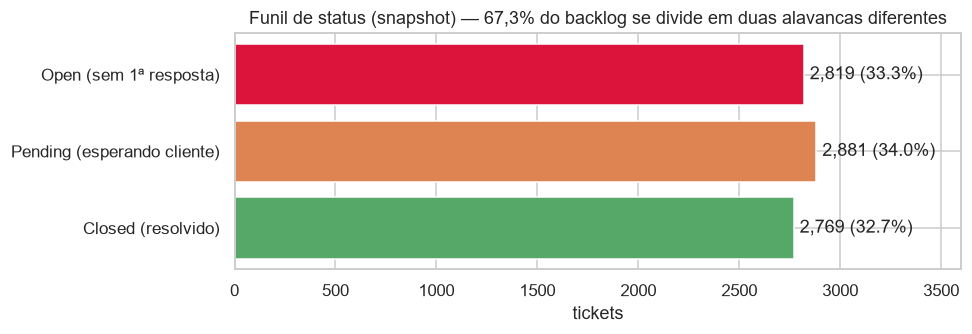
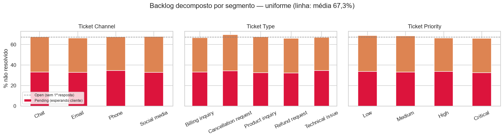
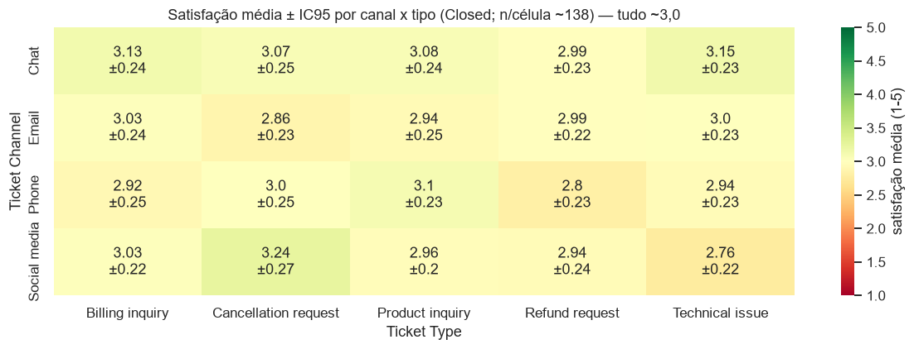
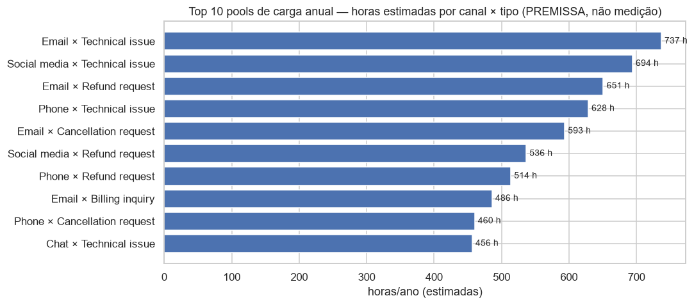
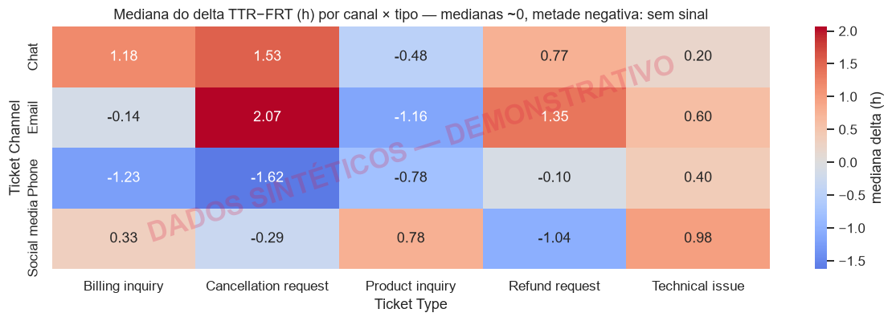
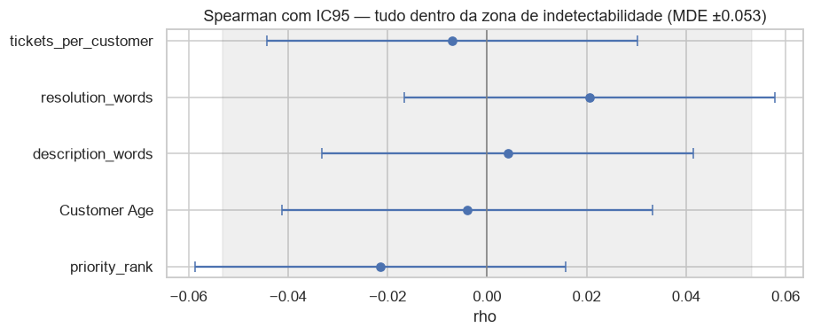
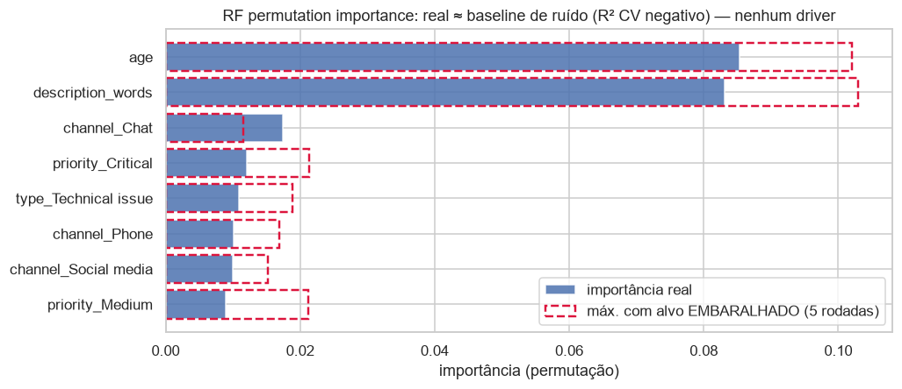
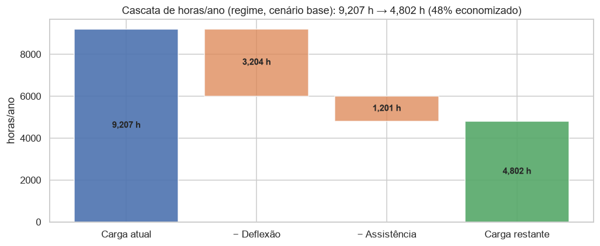
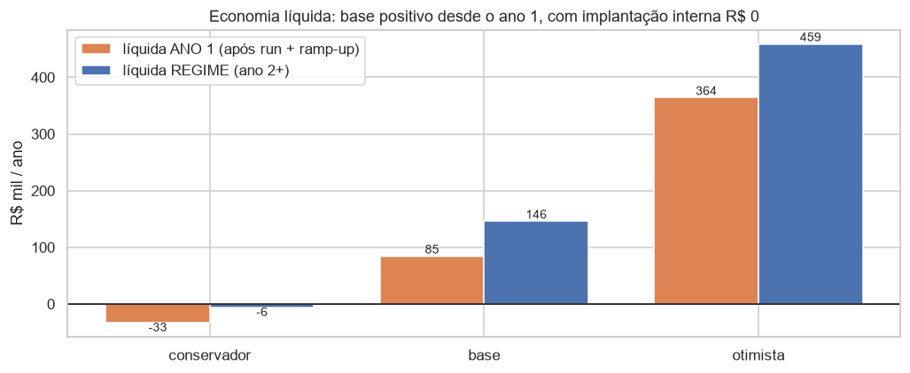
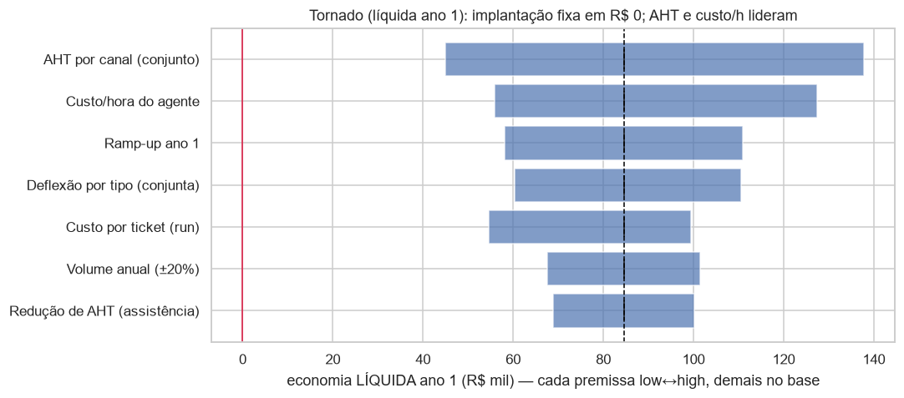

# FASE 3 — Diagnóstico Operacional e Modelo de ROI

**Challenge 002 — Redesign de Suporte (G4 Educação)**
**Data:** 2026-07-16 · **Autor:** Thales Barbosa (com Claude Code)

**Reprodutibilidade:** todos os números vêm de [`notebooks/diagnostic_analysis.ipynb`](../notebooks/diagnostic_analysis.ipynb) (executado de ponta a ponta) e do modelo [`src/roi_model.py`](../src/roi_model.py) (14 testes de sanidade matemática em [`tests/test_roi_model.py`](../tests/test_roi_model.py), 51 testes no total do projeto). Espec revisada por painel de 3 lentes antes da implementação (D-010 a D-012) e consolidada na premissa final de implantação interna com custo incremental R$ 0 (D-019).

**Guardrail:** análises principais usam apenas features `measured`; colunas sintéticas aparecem só em seções demonstrativas rotuladas, com marca d'água dentro das figuras (D-011).

---

## TL;DR — as 3 respostas ao Diretor de Operações

1. **Onde perdemos tempo?** O travamento é **sistêmico, não segmentado**: 1 em cada 3 tickets (33,3%) nunca recebeu primeira resposta e outros 34,0% aguardam o cliente — 67,3% de backlog **uniforme** em todos os canais, tipos e prioridades (qui-quadrado: todos p>0,10, com poder para detectar associações a partir de w≈0,04). Não existe canal vilão a consertar; existe um sistema sobrecarregado. Sob premissas declaradas, a operação consome **9.207 h/ano (5,5 FTE, R$ 368 mil/ano)**, com Technical issue liderando os pools de carga em todos os canais.
2. **O que impacta a satisfação?** **Nestes dados, nada mensurável** — e esse nulo é informativo: com n=2.769, os intervalos de confiança descartam qualquer efeito maior que |ρ|≈0,059, e nenhum par de segmentos difere em mais de 0,33 ponto (limite Tukey 95%). A média é 2,99/5 com **39,8% de detratores em todo lugar**. Consequência prática: priorizar automação por volume×custo (não por "driver de satisfação") e **instrumentar os timestamps que a operação não mede** — o pipeline estatístico fica pronto para re-rodar com dados reais.
3. **Quanto desperdiçamos?** A automação (deflexão + assistência) libera **4.404 h/ano = 2,6 FTE = R$ 176 mil/ano brutos em regime** (cenário base). Com implantação interna e custo incremental de implantação **R$ 0**, o ano 1 entrega **R$ 84,5 mil líquidos (ROI 282%)** e o payback é **imediato**; em regime, devolve **R$ 146 mil/ano líquidos (ROI 487%)**. O conservador continua negativo por baixa performance e custo recorrente — por isso a recomendação é piloto com gates, não rollout direto.

---

## PERGUNTA 1 — Onde o fluxo trava?

**Disclosure simétrico:** os percentuais são o retrato dos dados *como entregues* (a auditoria provou uniformidade sintética — a ressalva vale para tempos E para volumes/backlog/satisfação). O que transfere é o método e o funil.

### 1.1 O funil: dois problemas, duas alavancas

| Estágio (snapshot) | n | % | Alavanca |
|---|---|---|---|
| **Open — sem 1ª resposta** | 2.819 | **33,3%** | capacidade/triagem do time → auto-resposta + roteamento automático |
| **Pending — esperando cliente** | 2.881 | **34,0%** | espera do cliente → follow-up automatizado + auto-close com aviso |
| Closed — resolvido | 2.769 | 32,7% | — |

Tratar os 67,3% como um único "backlog" misturaria dois problemas com intervenções opostas. Leitura de snapshot, não de fluxo — o dataset não tem timestamps confiáveis para aging (D-005).

### 1.2 O backlog é uniforme — e esse nulo é informativo

| Segmento | qui-quadrado p | p (BH) | Cramér V | MDE (w, 80% poder) |
|---|---|---|---|---|
| Ticket Channel | 0,771 | 0,771 | 0,014 | 0,040 |
| Ticket Type | 0,339 | 0,509 | 0,023 | 0,042 |
| Ticket Priority | 0,227 | 0,509 | 0,022 | 0,040 |

Com n=8.469, detectaríamos associações a partir de w≈0,04 — **não existe segmento vilão**; o travamento é do sistema. Reincidência (único sinal relacional): sem associação com backlog (p=0,147; caveat: possível colisão do gerador sintético).

### 1.3 Satisfação por segmento: uniformemente ruim

Média global **2,99/5**, detratores **39,8%**. Células (canal×tipo) variam de 2,76 a 3,24 com IC95 de ±0,24 — todas englobam a média global: flutuação amostral, não padrão.

### 1.4 Onde estão as horas (premissa-based)

Total: **9.207 h/ano**. Top pools: Email×Technical (737 h), Social media×Technical (694 h), Email×Refund (651 h). Na combinação tripla, Email×Technical×Critical lidera (228 h/ano). **Disclosure:** com volumes ~uniformes, o ranking é majoritariamente dirigido pelas premissas de esforço (FASE 2 §3) — ele responde "onde a automação libera mais horas *sob estas premissas*", e o tornado (§P3) dimensiona a sensibilidade.

### 1.5 Cumprimento demonstrativo — estatísticas de tempo exigidas pelo plano

O notebook (§1.6) traz **médias, medianas e percentis P25/P50/P75/P90/P95** do delta TTR−FRT por canal, tipo e prioridade, heatmap canal×tipo com **marca d'água "DADOS SINTÉTICOS — DEMONSTRATIVO" dentro do PNG**, e estatísticas do FRT. Kruskal-Wallis não distingue segmentos em nenhum eixo (p=0,460/0,919/0,640) — coerente com D-005: as colunas são sorteio. **Nada dessa seção fundamenta decisão.**

---

## PERGUNTA 2 — O que impacta a satisfação? (Closed, n=2.769)

**Desenho pré-declarado (D-011):** análises principais sem colunas sintéticas; família de testes com correção Benjamini-Hochberg (com ~15 testes sob H0, 1 p<0,05 espúrio é esperado — antecipado antes de rodar); nulos reportados com limites de efeito, nunca como "prova de ausência".

### 2.1 Resultados (todos os métodos exigidos pelo plano)

| Método | Resultado | Limite de efeito |
|---|---|---|
| **Spearman** (5 features × rating) | todos \|ρ\| ≤ 0,021; p_BH ≥ 0,70 | IC95: nenhum excede **\|ρ\| = 0,059** |
| **Kendall tau-b** (robustez a empates) | confirma (τ ≤ 0,018) | — |
| **ANOVA + Kruskal-Wallis** (tipo/canal/prioridade) | p 0,28–0,70; p_BH = 0,70 | η² ≤ 0,0014; IC95 sup ≤ 0,0074 |
| **Tukey HSD** (todos os pares) | — | nenhuma diferença entre grupos > **0,33 ponto** (1–5) |
| **OLS** (HC3) | R² = 0,0028; F p = 0,727; nenhum coef. p<0,05 | — |
| **Logística** (robustez ordinal, alvo `is_dissatisfied`) | pseudo-R² = 0,0029; LR p = 0,468 | — |
| **Random Forest** (5-fold CV) | **R² = −0,022 ± 0,009** (pior que prever a média) | importâncias ≈ baseline de alvo embaralhado |

O baseline de alvo embaralhado é o guardrail metodológico: um gráfico de feature importance de modelo com R²≤0 é ranking de ruído — as barras reais não superam o contorno do ruído puro.

**Poder (calculado em código):** MDE Spearman |ρ| = 0,053; MDE ANOVA f = 0,063–0,066 (η² ≈ 0,004). **Formulação correta:** não detectamos sinal, e o desenho limita qualquer efeito real não detectado a |ρ| < 0,053 — efeitos de negócio relevantes (>0,25 ponto) são incompatíveis com estes dados.

**Rodada demonstrativa (exigência literal do plano):** Spearman de rating × FRT, × TTR e × delta (sintéticos, rotulados). O FRT aparece com p=0,046 *sem correção* — exatamente o falso-positivo esperado que a política pré-declarada antecipou: |ρ|=0,038 < MDE, p_BH=0,139, e a coluna é timestamp sorteado. Um pipeline sem correção reportaria isso como "achado".

### 2.2 Conclusões acionáveis

1. **Decisão de alocação:** sem segmento vilão, o investimento é **horizontal** (deflexão + velocidade de 1ª resposta), priorizado por volume×custo — ponte direta para a P3.
2. **Instrumentação (o nulo mais caro é o que não se mede):**

| Campo/evento a instrumentar | Métrica destravada | Decisão habilitada |
|---|---|---|
| `created_at` | FRT e TTR **reais** | SLA por prioridade; staffing por hora |
| `first_response_at` | tempo de 1ª resposta | meta de resposta; ataca os 33% Open |
| `resolved_at` + `closed_at` | tempo de resolução; aging | gargalos reais por segmento |
| `reopen_flag` / recontato | FCR | qualidade da deflexão da IA |
| CSAT no fechamento (todos) | satisfação sem viés de seleção | drivers reais (re-rodar este pipeline) |

3. **Pipeline reexecutável:** as mesmas células (Spearman/ANOVA/OLS/RF com baseline) produzem o diagnóstico verdadeiro trimestralmente assim que houver dados instrumentados — **o método é o entregável**.

---

## PERGUNTA 3 — Quanto estamos desperdiçando?

**Ponte P2→P3:** o caso econômico é 100% de **custo** — não assume melhoria de satisfação (coerente com o nulo da P2). Reduzir os 33% sem resposta e os 39,8% de detratores é upside estratégico **não contabilizado**: o ROI quantificado é o **piso** do caso.

### 3.1 O tamanho do desperdício (cenário base)

| Métrica | Valor | Fórmula |
|---|---|---|
| Carga anual | **9.207 h** (as-is 8.469 tickets: 2.599 h) | Σ volume_anual(tipo) × AHT(tipo)/60 |
| FTE equivalentes | **5,5** | horas / 1.680 h produtivas/FTE/ano (~21 d×8h×83% ocupação) |
| Custo anual | **R$ 368 mil** | horas × R$ 40/h (carregado) |
| Economia em regime | **4.404 h = 2,6 FTE = R$ 176 mil/ano brutos** | deflexão (11.294 tickets) + assistência (1.201 h) |

**Capacidade liberada ≠ corte automático de custo:** a captura exige decisão de realocação. Recomendação: apontar os 2,6 FTE para os 33,3% de tickets sem primeira resposta (amarração P1↔P3 — mesma equipe, backlog zerado, sem contratação).

### 3.2 Cenários de negócio (implantação R$ 0; performance e custo recorrente em direções opostas — D-019)

| | Conservador | **Base** | Otimista |
|---|---|---|---|
| Economia bruta em regime (R$/ano) | 54.159 | **176.170** | 474.205 |
| Líquida ano 1 (após run, com ramp-up) | −32.921 | **+84.510** | +364.364 |
| Líquida em regime (ano 2+) | −5.841 | **+146.170** | +459.205 |
| ROI em regime | −10% | **+487%** | +3.061% |
| Payback | nunca | **imediato** | imediato |

O custo incremental de implantação é fixo em **R$ 0** nos três cenários: construção interna pelo AI Master. `roi_scenario('low')` (todas as demais premissas no mesmo nível) existe para sensibilidade; cenários de **decisão** pareiam performance-low com custo recorrente-high (conservador) e vice-versa — sem essa coerência, o "conservador" esconderia risco.

### 3.3 Break-even e sensibilidade

- **Ano 1 só com deflexão:** **12,5%** de deflexão uniforme paga o custo recorrente já no ramp-up.
- **Regime (run):** **8,1%** de deflexão paga o custo recorrente.

Tornado (líquida ano 1, one-at-a-time): **AHT (amplitude R$ 92,8k) > custo/h (R$ 71,6k) > ramp-up (R$ 52,9k) > deflexão (R$ 50,3k) > custo recorrente por ticket (R$ 45,0k)**. Implantação não aparece porque é premissa fixa em R$ 0. Ações: medir AHT e performance real nas primeiras semanas; manter gate de deflexão e custo/ticket antes do rollout.

### 3.4 Custo de não fazer nada (ilustrativo, fora do modelo)

`custo_churn ≈ detratores_ano × taxa_cancelamento × LTV`. Com ~9.800 tickets fechados/ano × 39,8% de detratores, **cada 1% de cancelamento entre detratores × R$ 1.000 de LTV ≈ R$ 39 mil/ano** — ordem de grandeza da economia de custo do cenário base. Não entra no ROI (falsa precisão); entra como razão para o piloto medir churn de detratores.

### 3.5 Limitações do modelo

1. AHT/custo-hora são **premissas** (tempos do dataset são sintéticos — D-005); faixas + tornado dimensionam a incerteza.
2. Volumes ~uniformes → ranking de pools é premissa-dependente (disclosure em §1.4).
3. Deflexões = hipóteses de mercado, líquidas de escalação, **provisórias até a FASE 4** (que importa as mesmas constantes) e a validação em piloto.
4. Ramp-up linear na economia do ano 1; a curva real de adoção pode diferir.
5. Lado receita fora do modelo — ROI é piso.
6. Volume 30k/ano flat (premissa do brief, D-001) — sem crescimento; crescimento favoreceria a solução (custo marginal da IA ≪ custo marginal de agente).

---

## Rastreabilidade requisito → seção (plano mestre, FASE 3)

| Exigência do plano | Onde está |
|---|---|
| P1: investigar canal, tipo, prioridade e combinações | Notebook §1.2 (segmentos), §1.5 (pares e tripla canal×tipo×prioridade) |
| P1: tempos médios | §1.6 (demonstrativa, rotulada) — coluna `mean` |
| P1: medianas | §1.6 — coluna `50%` |
| P1: percentis | §1.6 — P25/P50/P75/P90/P95 |
| P1: heatmaps | §1.3 (satisfação), §1.6 (delta sintético c/ watermark), §1.5 (pools) |
| P1: tabelas | §§1.1–1.6 |
| P1: gargalos e grupos problemáticos | §1.1–1.2 (funil; uniformidade = gargalo sistêmico) |
| P1: quantificar horas e impacto | §1.4 + P3 §3.1 (9.207 h/ano; R$ 368k) |
| P2: apenas tickets válidos | Closed n=2.769 (§P2 header) |
| P2: testar Time to Resolution e First Response Time | §2.6 rodada demonstrativa (rotulada; D-011) |
| P2: testar tipo, canal, prioridade | §2.1–2.3 (principais) |
| P2: Spearman | §2.1 (com IC Fisher-z + BH + Kendall robustez) |
| P2: ANOVA | §2.2 (+ KW + η² com IC bootstrap + Tukey) |
| P2: Regressão | §2.3 (OLS HC3 + logística ordinal-binária) |
| P2: Random Forest Regressor | §2.4 (CV + permutation importance + baseline y-embaralhado) |
| P2: feature importance | §2.4 (com baseline de ruído) |
| P2: explicações executivas e conclusões acionáveis | §2.5, §2.7 (limites de efeito; 3 ações; instrumentação) |
| P3: horas por ano | §3.1 (9.207 h) |
| P3: FTE | §3.1 (5,5 FTE; derivação da premissa declarada) |
| P3: custo operacional | §3.1 (R$ 368 mil/ano) |
| P3: economia potencial | §3.1–3.2 (R$ 176 mil brutos regime; cenários) |
| P3: modelo de ROI | `src/roi_model.py` + §3.2–3.3 (ROI ano-1, regime, payback, break-even, tornado) |
| P3: premissas, fórmulas, limitações | docstrings do modelo + §3.1 (fórmulas) + §3.5 (limitações) |

---

**Status da FASE 3: ✅ concluída** (espec revisada por painel de 3 lentes; verificação adversarial dos artefatos ao final — ver `process-log/iterations.md`). Próxima fase (aguardando gate): **FASE 4 — Automação com IA** (`docs/automation_strategy.md`, importando `DEFLECTION_BY_TYPE` como fonte única).
