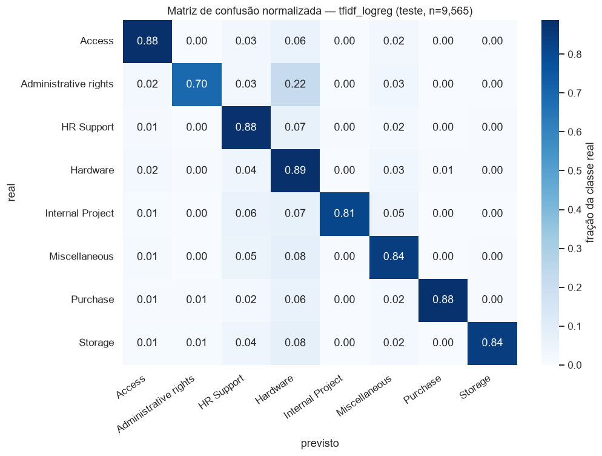
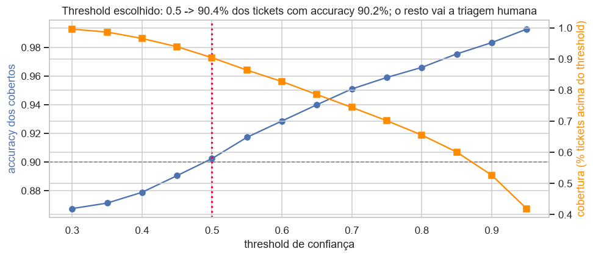
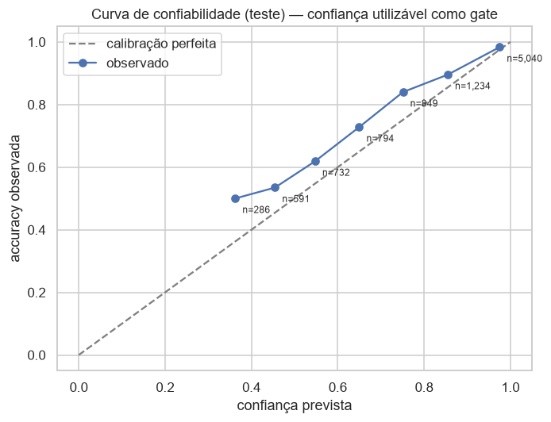

# FASE 5 — Machine Learning: Classificador de Tickets e Busca Semântica

**Challenge 002 — Redesign de Suporte (G4 Educação)**
**Data:** 2026-07-17 · **Atualização do modelo servido:** 2026-07-19 · **Autor:** Thales Barbosa (com Claude Code e Codex)

**Reprodutibilidade:** `python bootstrap.py` prepara dados, baseline inglês, embeddings e classificador multilíngues na ordem correta, com retomada automática; apresentação do experimento original em [`notebooks/ml_models.ipynb`](../notebooks/ml_models.ipynb); artefatos em `models/` (pesados fora do git — `.gitignore`); API de inferência em [`src/ticket_ai.py`](../src/ticket_ai.py) (`load_ticket_ai()`), consumida pelo protótipo da FASE 6. Testes: [`tests/test_ticket_ai.py`](../tests/test_ticket_ai.py) (5 testes específicos; **51 no projeto**).

**Dados:** Dataset 2 pós-filtro da FASE 2 (47.823 tickets reais de TI, 8 classes, desbalanceamento 7,7:1). Split **estratificado** 80/20 com seed 42 (38.258 / 9.565), proporções por classe preservadas e determinismo cobertos por teste (D-007).

> **Leitura deste documento:** as seções 1–5 registram o experimento inglês da FASE 5 (D-014). A seção 6 documenta a evolução multilíngue efetivamente servida pelo portal (D-018), preservando o baseline para comparação honesta.

---

## 1. Comparação dos candidatos (exigência do plano)

| Modelo | Accuracy | Precision (macro) | Recall (macro) | **F1 (macro)** | F1 (weighted) |
|---|---|---|---|---|---|
| **tfidf_logreg** (TF-IDF 1-2gramas + Regressão Logística) | 0,8653 | 0,8960 | 0,8402 | **0,8652** | 0,8654 |
| tfidf_linsvc (TF-IDF + LinearSVC calibrado) | 0,8657 | 0,8860 | 0,8502 | **0,8669** | 0,8657 |
| embed_logreg (Sentence-Transformers MiniLM + LogReg) | 0,8073 | 0,8303 | 0,7963 | 0,8118 | 0,8072 |

**Escolha (D-014):** `tfidf_linsvc` lidera por 0,0017 de macro-F1 — **empate técnico** (< 0,005, critério pré-declarado no script). Desempate por simplicidade: **`tfidf_logreg`** vence — probabilidades nativas (sem camada de calibração extra), treino mais rápido, mesma operação.

**Por que os embeddings perderam:** o texto do D2 chega **pré-processado** (minúsculas, sem stopwords/pontuação) — exatamente o formato que favorece bag-of-words e degrada sentence-transformers (treinados com linguagem natural). Limitação declarada: com texto cru de produção, a comparação deve ser refeita (os embeddings continuam sendo usados na **busca semântica**, onde performam bem).

## 2. Desempenho por classe (vencedor, teste n=9.565)

| Classe | Precision | Recall | F1 | Suporte |
|---|---|---|---|---|
| Access | 0,905 | 0,884 | 0,895 | 1.425 |
| Administrative rights | 0,901 | 0,696 | **0,785** | 352 |
| HR Support | 0,868 | 0,882 | 0,875 | 2.182 |
| Hardware | 0,819 | 0,888 | 0,852 | 2.722 |
| Internal Project | 0,935 | 0,811 | 0,869 | 424 |
| Miscellaneous | 0,837 | 0,841 | 0,839 | 1.412 |
| Purchase | 0,964 | 0,880 | 0,920 | 493 |
| Storage | 0,940 | 0,840 | 0,887 | 555 |

- Pior classe: **Administrative rights** (menor suporte; recall 0,696) — maior confusão do modelo: 21,9% dela vai para Hardware. Coerente com a FASE 4: é justamente a classe cujo fluxo **nunca** automatiza concessão (aprovação humana), então o erro de classificação não vira erro de ação.
- **Miscellaneous** (guarda-chuva): F1 0,839 — melhor que o previsto no D-007, mas segue concentrada abaixo do gate (§3).

## 3. Gate de confiança (o número que liga o ML ao fluxo da FASE 4)

Critério: menor threshold com **accuracy ≥ 90% nos tickets cobertos** → **threshold 0,50: cobre 90,4% do teste com 90,2% de accuracy**. Os 9,6% abaixo do gate vão para triagem humana — e são desproporcionalmente Miscellaneous (19,1% dos abaixo-do-gate vs 14,8% da base), ou seja, **o gate implementa na prática a regra da FASE 4 §4** (guarda-chuva → humano).

**Calibração** (curva de confiabilidade no teste): no bin (0,9–1,0] a accuracy observada é 98,3%; nos bins baixos o modelo é levemente superconfiante (bin 0,4–0,5 → 53,5%) — mais uma razão para o gate em 0,5, e a análise de erros mostra que ainda existem erros com confiança 1,0 (por isso o fluxo mantém QA humano amostral e escape hatch — nenhum gate é perfeito).

## 4. Busca semântica (FAISS + MiniLM)

Índice `IndexFlatIP` sobre embeddings normalizados (cosseno) dos **47.823 documentos** — `find_similar(texto, k)` retorna os k tickets mais próximos com classe e similaridade. Exemplo real do notebook:

> Query: *"cannot login to my account password expired please reset"* → classificado **Access (conf 1,00, ação automática: SIM)**; similares: 3 tickets Access de reset de senha com similaridade 0,79–0,80.

No Copilot da FASE 6, isso alimenta "tickets semelhantes já resolvidos" e a resposta sugerida — a alavanca de assistência (redução de AHT) do modelo de ROI.

## 5. Limitações

1. **Domínio:** o classificador prova a *capacidade* em texto real de TI; no B2C do challenge, seria re-treinado na taxonomia da FASE 4 §2 (ponte na FASE 4 §5) — arquitetura, gate e guardrails transferem, pesos não.
2. **Texto pré-processado** penaliza os sentence-transformers na classificação — refazer a comparação com texto cru em produção.
3. **Threshold calibrado no teste** — em produção, janela separada e revisão por classe.
4. Erros com confiança 1,0 existem (ex.: HR Support→Administrative rights) — o gate reduz, não elimina; QA amostral e escape hatch permanecem obrigatórios (FASE 4 §6).
5. Embeddings/inferência em CPU — suficiente para o protótipo; produção dimensiona conforme fila.

## 6. Modelo multilíngue servido no portal (D-018)

O baseline inglês acima é o melhor classificador no corpus pré-processado, mas não atende diretamente perguntas em pt-BR. Para o fluxo cliente → tickets históricos em inglês, o protótipo serve `paraphrase-multilingual-MiniLM-L12-v2` + Regressão Logística no mesmo espaço vetorial usado pela busca.

| Métrica no teste inglês (n=9.565) | Modelo multilíngue servido |
|---|---:|
| Accuracy | 0,7804 |
| Precision macro | 0,8083 |
| Recall macro | 0,7646 |
| **F1 macro** | **0,7836** |
| Threshold operacional | 0,70 |
| Cobertura no threshold | 64,1% |
| Accuracy nos casos cobertos | 91,7% |

**Trade-off explícito:** o F1 macro cai de 0,8652 no baseline TF-IDF inglês para 0,7836 no modelo servido, em troca de alinhamento semântico entre perguntas em português e o acervo inglês. O baseline fica preservado em `models/en_baseline/`; `models/metadata.json` garante que o artefato final carregado seja `embed_logreg` multilíngue.

**Dupla trava:** confiança ≥ 0,70 não basta. O portal também exige similaridade máxima ≥ 0,55 com um caso do acervo; vetos de risco têm precedência sobre ambas. Essa segunda trava foi adicionada porque texto vago em pt-BR podia receber confiança artificialmente alta na classe Hardware.

**Sonda exploratória pt-BR:** 3 de 5 intenções foram classificadas corretamente. Purchase→Hardware e Administrative rights→HR Support falharam. Portanto, o protótipo demonstra arquitetura e guardrails, mas a recomendação de produção continua sendo piloto com dados pt-BR rotulados, calibração por classe e monitoramento.

---

**Status atual: ✅ baseline e evolução multilíngue documentados.** Artefatos regenerados por `bootstrap.py`: `src/ticket_ai.py`, scripts de treino/embeddings, classificador, índice FAISS, corpus, métricas, predições e baseline inglês. Decisões: D-014 e D-018. O consumidor vigente é o protótipo FastAPI + front web em `app.py`/`web/`.
