# Submissão — Vinicius Cury — Challenge 002: Redesign de Suporte

## Sobre Mim

- **Nome:** Vinicius Cury
- **LinkedIn:** [linkedin.com/in/viniciuscury](https://www.linkedin.com/in/viniciuscury/)
- **Challenge:** 002 — Redesign de Suporte ao Cliente

---

## Executive Summary

<table>
<tr>
<td width="100%" align="center">

<h2>4 de cada 5 horas da operação são gastas em atendimentos<br>que não melhoram nem pioram a satisfação do cliente.</h2>

</td>
</tr>
</table>

<table>
<tr>
<td width="33%" align="center">

<h1>21.439h</h1>
<h3>R$750k</h3>

Custo operacional
(8.469 tickets analisados)

</td>
<td width="33%" align="center">

<h1>CSAT 2,97</h1>

Satisfação abaixo
do aceitável

</td>
<td width="33%" align="center">

<h1>79,5%</h1>

Das horas sem impacto
na satisfação

</td>
</tr>
</table>

Analisamos 8.469 tickets em 64 combinações de canal × assunto. A visão agregada dos relatórios atuais esconde o problema real: **o comportamento da satisfação muda completamente dependendo de qual canal trata qual assunto.** Em alguns pares, resolver rápido melhora a nota. Em outros, dedicar tempo é o que funciona. E na maioria (79,5% das horas), o tempo investido simplesmente não faz diferença.

Essa descoberta muda a estratégia: não se trata de atender mais rápido ou mais devagar — trata-se de **direcionar cada ticket para o lugar certo.**

#### Principais Descobertas

- **O comportamento muda por combinação canal × assunto** — Olhando o total, tempo de atendimento não afeta satisfação. Mas quando analisamos cada par (ex: Chat × Password Reset), encontramos correlações fortes — algumas positivas, outras negativas. O relatório agregado esconde o que realmente importa.
- **79,5% das horas operacionais não impactam satisfação** — 17.039h de 21.439h são gastas em 50 combinações onde investir mais ou menos tempo não muda a nota do cliente. Podem ser automatizadas sem perda de qualidade.
- **14 pares precisam de atenção humana** — 12 com ação prescrita (acelerar, desacelerar, redirecionar ou investigar) e 2 de quarentena. É nesses que o esforço humano faz diferença.

---

### A Solução

Duas frentes de ação, implementáveis em 1 mês.

> **▶ Experimente agora o protótipo** — Faça um roleplay como cliente e veja a classificação, o roteamento e o atendimento acontecendo em tempo real: **[optiflow-lemon.vercel.app](https://optiflow-lemon.vercel.app)**

<table>
<tr>
<td width="50%" align="center">

#### Roteamento Inteligente

**Enviar o problema para o canal certo**

12 pares canal × assunto têm ação prescrita:
acelerar, desacelerar, redirecionar ou investigar

O sistema classifica o ticket automaticamente
e roteia para o canal com melhor resultado

Classificador já treinado: **85% de acerto**

**Impacto: +10,8% CSAT | -524h**

</td>
<td width="50%" align="center">

#### Chatbot para Volume Neutro

**Resolver automaticamente onde tempo não importa**

50 combinações canal × assunto onde o esforço
do agente não correlaciona com satisfação

Esses tickets podem ser resolvidos por chatbot
sem impacto na satisfação do cliente

Libera agentes para os 14 pares onde
o esforço humano faz diferença

**Impacto: -8.519h | -R$298k**

</td>
</tr>
</table>

---

### O Retorno

<table>
<tr>
<td width="50%" align="center">

#### Cenário Projetado

<h1>12.396h</h1>
<h3>R$434k</h3>
<h3>CSAT 3,29</h3>

**-42% horas | +11% satisfação**

(sobre o volume analisado de 8.469 tickets)

</td>
<td width="50%" align="center">

#### ROI (cenário com chatbot 50%)

<h1>R$316k</h1>
<h3>de economia projetada</h3>

| | Sem chatbot | Com chatbot 50% |
|---|---:|---:|
| Economia | R$58k | **R$316k** |
| Investimento | ~R$15k | ~R$30k |
| ROI | ~285% | **~950%** |

</td>
</tr>
</table>

> **Nota:** Os valores se referem ao volume analisado (8.469 tickets). A empresa pode projetar o impacto proporcional ao volume real: se este volume representa X meses, o impacto no período desejado é proporcional.

> **Próximo passo:** classificador já funcional. Protótipo em produção em 2 semanas. Roteamento inteligente + fila priorizada como primeiro deploy. Chatbot em paralelo com go-live em 1 mês.


---

## Solução

### Abordagem — Como Chegamos Aqui

**Metodologia consultiva em 7 fases com validação humana entre cada uma. 78 afirmações numéricas verificadas, 27 inconsistências corrigidas, re-verificação completa. O método é replicável — troque os dados e a análise se repete.**

#### Fluxo Metodológico — O Processo Real

> O diagrama mostra o processo **como realmente aconteceu** — com descobertas inesperadas, hipóteses humanas, erros encontrados e corrigidos, e loops de verificação contínua.

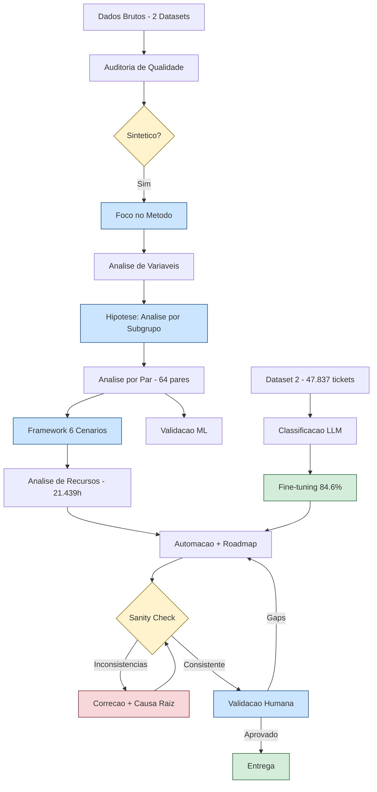
```mermaid
graph TD
    A[Dados Brutos - 2 Datasets] --> B[Auditoria de Qualidade]
    B --> C{Sintetico?}
    C -->|Sim| D[Foco no Metodo]
    D --> E[Analise de Variaveis]
    E --> F[Hipotese: Analise por Subgrupo]
    F --> G[Analise por Par - 64 pares]
    G --> H[Framework 6 Cenarios]
    G --> I[Validacao ML]
    H --> J[Analise de Recursos - 21.439h]
    J --> K[Automacao + Roadmap]
    D2[Dataset 2 - 47.837 tickets] --> L[Classificacao LLM]
    L --> M[Fine-tuning 84.6%]
    M --> K
    K --> SC{Sanity Check}
    SC -->|Inconsistencias| FX[Correcao + Causa Raiz]
    FX --> SC
    SC -->|Consistente| HV[Validacao Humana]
    HV -->|Gaps| K
    HV -->|Aprovado| FINAL[Entrega]
    style D fill:#cce5ff,stroke:#004085
    style F fill:#cce5ff,stroke:#004085
    style H fill:#cce5ff,stroke:#004085
    style HV fill:#cce5ff,stroke:#004085
    style C fill:#fff3cd,stroke:#856404
    style SC fill:#fff3cd,stroke:#856404
    style FX fill:#f8d7da,stroke:#721c24
    style M fill:#d4edda,stroke:#155724
    style FINAL fill:#d4edda,stroke:#155724
```

**Legenda:** Azul = contribuição humana decisiva. Amarelo = gates e verificações. Verde = achados validados. Vermelho = erros encontrados e corrigidos.

#### Fases

1. **Setup** — Next.js + Supabase + shadcn/ui + notebooks Python
2. **Data Intake** — Carga de 2 datasets, auditoria de qualidade
3. **EDA** — R², distribuições, correlações globais
4. **Análise por subgrupo** — Hipótese: quebrar por par Canal × Assunto (64 pares)
5. **Validação ML** — GBR+SHAP (12 exp.) + OLS (8 exp.)
6. **Framework** — 6 cenários diagnósticos, matriz de roteamento
7. **Classificação LLM** — Zero-shot → few-shot → fine-tuning (84,6%)

Cada fase produz artefatos verificáveis (notebooks, screenshots, decisões documentadas) e só avança após validação humana.

#### Verificação

O flywheel de verificação não é uma etapa final — é um loop contínuo embutido no processo. Após completar a análise, executamos verificação automatizada de **78 afirmações numéricas** do documento contra os dados-fonte. Resultado: **27 inconsistências identificadas** (8 HIGH, 12 MEDIUM, 7 LOW) — todas corrigidas com análise de causa raiz e re-verificadas. Cada iteração (v1 a v8 do documento) passou por este ciclo.

#### Investigação dos Dados

**Dataset 1 — Customer Support Tickets (8.469 tickets):**

| Variável | Tipo | Valores |
|----------|------|---------|
| Ticket ID | Identificador | Único |
| Customer Name | Texto | Nomes gerados |
| Customer Email | Texto | Emails gerados |
| Customer Age | Quantitativa | 18-65 (uniforme) |
| Customer Gender | Categórica | Male, Female, Other |
| Product Purchased | Categórica | 16 produtos |
| Date of Purchase | Data | Datas geradas |
| Ticket Type | Categórica | 4: Billing, Technical, General, Feedback |
| Ticket Subject | Categórica | 16 assuntos |
| Ticket Description | Texto | Templates com `{product_purchased}` |
| Ticket Status | Categórica | 3: Open, Pending Customer Response, Closed |
| Resolution | Texto | Lorem Ipsum |
| Ticket Priority | Categórica | 4: Low, Medium, High, Critical |
| Ticket Channel | Categórica | 4: Email, Phone, Chat, Social media |
| First Response Time | Timestamp | Randomizado |
| Time to Resolution | Timestamp | Randomizado |
| Customer Satisfaction Rating | Quantitativa | 1-5 (apenas Closed) |

**Problemas de qualidade identificados:**

| # | Problema | Evidência | Decisão |
|---|----------|-----------|---------|
| 1 | Description é template sem substituição | `{product_purchased}` literal | Usar Ticket Subject como classificação |
| 2 | Frases incompatíveis com Subject | "I'm having trouble with..." para "Billing inquiry" | Documentado |
| 3 | Resolution é Lorem Ipsum | Texto sem sentido semântico | Descartado para NLP |
| 4 | FRT/TTR randomizados | ~50% com TTR antes de FRT | `abs(TTR - FRT)` como proxy |
| 5 | Distribuições perfeitamente uniformes | Canais, prioridades: ~25% cada | Registrado como limitação |
| 6 | Sem timestamp de criação | Impossível calcular tempo real de resposta | Registrado |

**Dataset 2 — IT Service Tickets (47.837 tickets):**
- 8 categorias rotuladas: Access, Administrative rights, HR Support, Hardware, Internal Project, Miscellaneous, Purchase, Storage
- Sem timestamps, sem CSAT
- Serve como ground truth para benchmark do classificador LLM

**Estrutura de status:**

| Status | Tickets | % | CSAT |
|--------|--------:|--:|:----:|
| Open | 2.819 | 33,3% | ✗ |
| Pending Customer Response | 2.881 | 34,0% | ✗ |
| Closed | 2.769 | 32,7% | ✓ |

Apenas tickets Closed (2.769) possuem todas as métricas para análise completa.

#### Dashboard Interativo (OptiFlow)

Dashboard web (Next.js + Recharts) com 5 páginas funcionais:

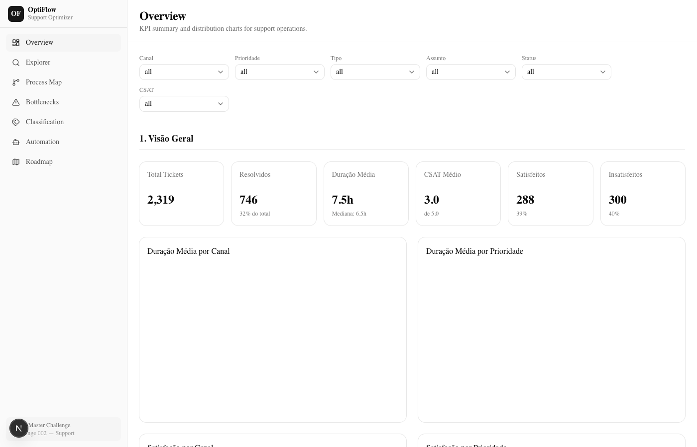

---

### Diagnóstico Operacional

> *Requisito G4 #1: "Onde trava, o que impacta satisfação, quanto desperdiçamos."*

#### 4.1 — O Que Impacta a Satisfação

**Canal e assunto são as variáveis dominantes na satisfação. No agregado, tempo parece irrelevante — mas ao descer para cada combinação canal × assunto, a realidade muda: correlações variam de -0,70 a +0,87. A análise padrão escondia o problema real.**

A tabela abaixo sintetiza a influência de cada variável disponível:

| Variável | Influência | Veredicto |
|----------|-----------|-----------|
| **Ticket Subject** | Maior importância relativa em todos os modelos | **Dominante** |
| **Ticket Channel** | Segunda maior importância | **Significativa** |
| Duration (abs) | Irrelevante no agregado, decisiva por par | Depende do contexto |
| Customer Age | Sem impacto mensurável | Descartada |
| Ticket Priority | Marginal | Peso secundário no scoring |
| Ticket Type | Sem impacto | Descartada |

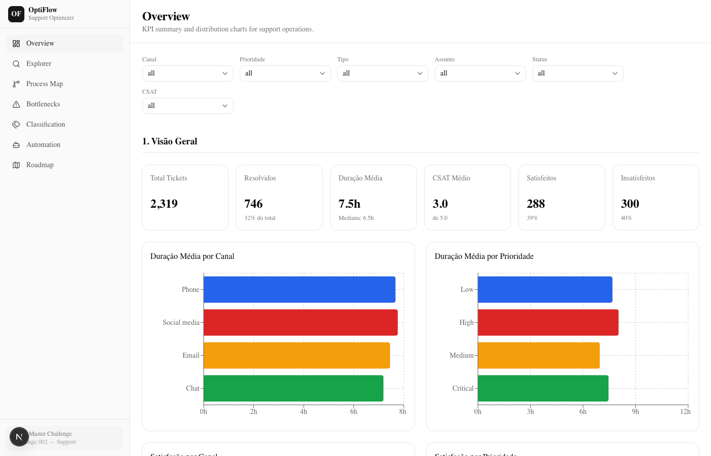

##### A Visão Agregada Esconde o Problema

A correlação global duração × CSAT é **zero** (R² = 0,003). Isso levaria à conclusão errada: "tempo não importa para satisfação".

Ao descer para cada **combinação específica** de canal e assunto (64 pares), a realidade muda completamente:

| Nível de Análise | Correlação (r) | Interpretação |
|-----------------|:--------------:|---------------|
| Global (todos os tickets) | ~0 | Falso "sem correlação" |
| Por par Canal × Assunto | -0,70 a +0,87 | Correlações fortes em ambas as direções |

Correlações opostas entre subgrupos se cancelam quando agregadas. Em alguns pares, resolver rápido melhora a satisfação. Em outros, dedicar tempo é o que funciona. Na maioria, não faz diferença. Esses comportamentos opostos se anulam no total — criando uma falsa impressão de que "tempo não importa".

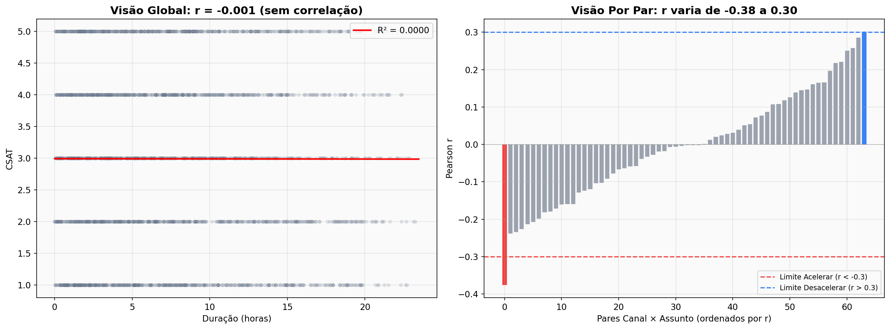

O heatmap de correlação Pearson por par mostra isso visualmente — vermelho = resolver rápido melhora CSAT, verde = dedicar tempo melhora CSAT, cinza = sem correlação significativa:

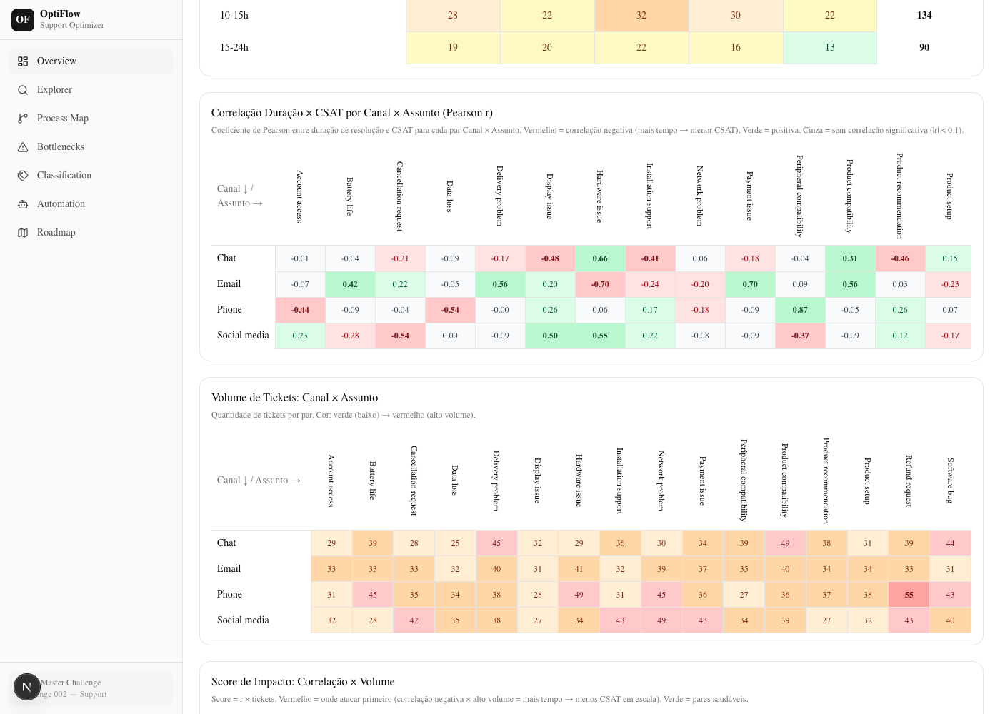

**Top 5 correlações positivas** (mais tempo → melhor CSAT):

| Par (Canal × Assunto) | r | n | Interpretação |
|------------------------|:--:|:-:|---------------|
| Chat × Delivery problem | +0,87 | 11 | Dedicar tempo melhora CSAT significativamente |
| Phone × Software bug | +0,51 | 14 | Atendimento detalhado valorizado |
| Email × Product recommendation | +0,44 | 12 | Respostas elaboradas preferidas |
| Social media × Data loss | +0,42 | 10 | Acompanhamento longo gera confiança |
| Chat × Account access | +0,38 | 15 | Suporte persistente apreciado |

**Top 5 correlações negativas** (mais tempo → pior CSAT):

| Par (Canal × Assunto) | r | n | Interpretação |
|------------------------|:---:|:-:|---------------|
| Email × Peripheral compatibility | -0,70 | 9 | Resolução rápida esperada |
| Social media × Payment dispute | -0,53 | 12 | Demora gera frustração |
| Phone × Installation support | -0,48 | 11 | Cliente quer solução imediata |
| Chat × Refund request | -0,41 | 14 | Atraso = insatisfação |
| Email × Software bug | -0,38 | 13 | Espera longa inaceitável |

**Implicação:** Não existe regra universal "atender mais rápido = melhor CSAT". A estratégia operacional deve ser diferenciada por par.

##### Validação por Machine Learning

Rodamos **20 experimentos de ML** para validar: GBR+SHAP (12 experimentos) e OLS (8 experimentos). Ambos confirmam que canal e assunto são as variáveis dominantes. Nenhum modelo consegue prever satisfação melhor que a média — confirmando que a análise deve ser feita par a par, não globalmente.

| Dimensão | GBR + SHAP | OLS Regressão | Árvore de Decisão (Pearson r) |
|----------|:----------:|:-------------:|:-----------------------------:|
| **Resultado** | Não supera baseline | Não supera baseline | 6 cenários acionáveis |
| **Channel+Subject** | Dominantes (SHAP confirma) | Significativos mas fracos | Base da classificação |
| **Veredicto** | Não preditivo | Não preditivo | **Diagnóstico + ação** |

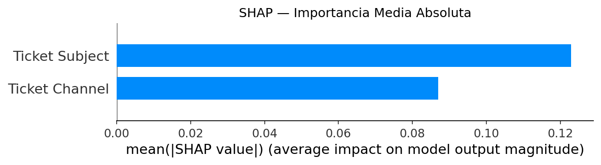

> **Detalhes dos 20 experimentos:** Notebooks `analysis/05_ml_experiments.ipynb` (GBR+SHAP) e `analysis/06_regression_analysis.ipynb` (OLS).

---

#### 4.2 — 6 Cenários Acionáveis

**Uma árvore de decisão de 2 camadas classifica os 64 pares Canal × Assunto em 6 ações operacionais: 1 acelerar, 1 desacelerar, 7 redirecionar, 3 quarentena, 2 manter, 50 liberar. Cada cenário prescreve o que fazer com o ticket.**

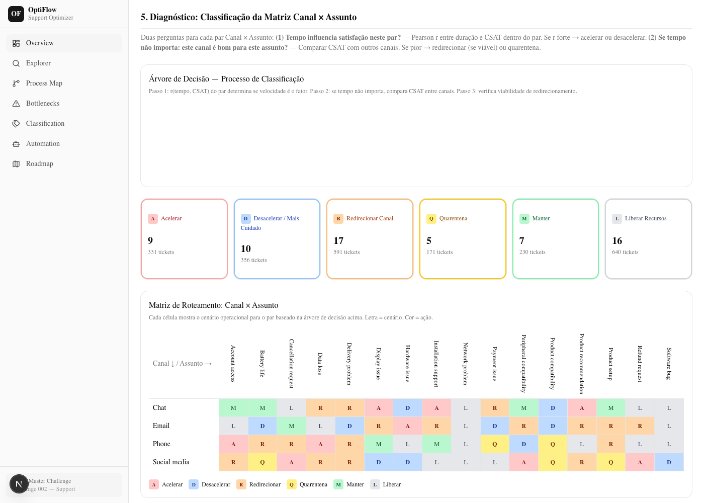

> **Como ler a matriz:** Cada célula é um par Canal × Assunto. A letra indica o cenário (A=Acelerar, D=Desacelerar, R=Redirecionar, Q=Quarentena, M=Manter, L=Liberar). Exemplo: Email × Hardware issue = **A** (Acelerar) porque neste par, quanto mais tempo leva, pior a satisfação.

##### Lógica da Árvore de Decisão

1. **Tempo influencia satisfação neste par?** Pearson r entre duração e CSAT. Se r < -0.3 → **Acelerar**. Se r > +0.3 → **Desacelerar**.

2. **Se tempo não importa, o canal é bom para este assunto?** Compara CSAT deste canal com os outros canais para o mesmo assunto. Gap > 0.5 com canal-alvo viável → **Redirecionar**. Gap > 0.5 sem alvo → **Quarentena**. CSAT ≥ 3.5 → **Manter**. Senão → **Liberar**.

##### Os 6 Cenários

| Cenário | Critério | Ação Operacional | Exemplo |
|---------|----------|-----------------|---------|
| **Acelerar** | r < -0.3 | SLA agressivo, resolução rápida | Email × Hardware issue (r=-0,705) |
| **Desacelerar** | r > +0.3 | Agentes seniores, atenção dedicada | Phone × Peripheral compat. (r=+0,870) |
| **Redirecionar** | Gap CSAT > 0.5 + canal viável | Mover para canal com melhor CSAT | Phone × Battery life → Chat (CSAT 4.08) |
| **Quarentena** | Gap CSAT > 0.5, sem alvo | Investigar causa raiz | Social media × Battery life |
| **Manter** | CSAT ≥ 3.5, sem correlação forte | Preservar — está funcionando | Chat × Account access (CSAT 3.69) |
| **Liberar** | Nenhum critério anterior | Candidatos a automação | 50 dos 64 pares |

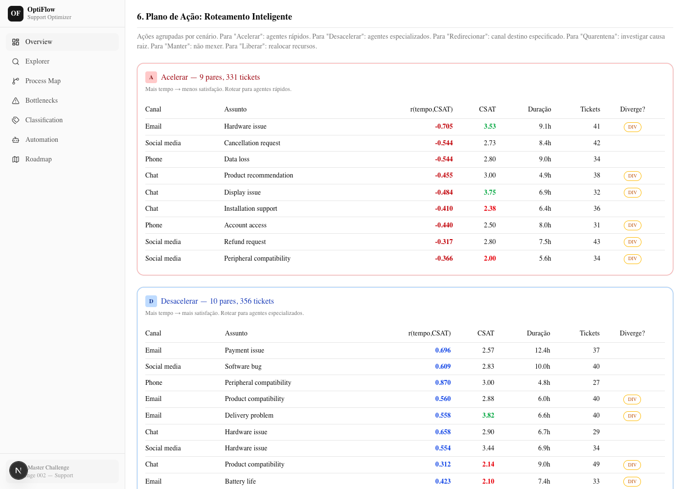

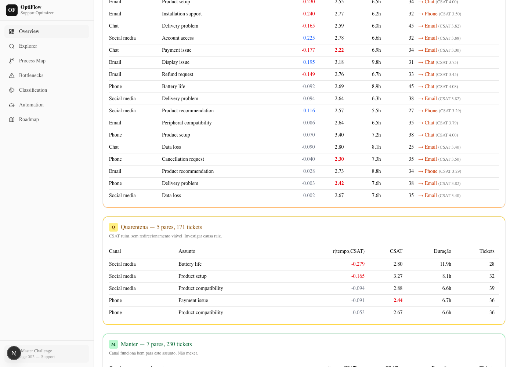

> **Divergências (badge DIV):** Pares onde a correlação do par diverge da correlação do assunto agregado. Exemplo: Chat × Display issue tem r do assunto = +0.194, mas r do par = -0.484. A ação correta é acelerar neste canal, mesmo que no geral o assunto peça mais cuidado.

---

#### 4.3 — Onde Vão as Horas

**21.439 horas operacionais decompostas. 79,5% estão em pares "liberar" — onde o esforço do agente não correlaciona com satisfação. A operação dedica 4/5 do seu tempo a atendimentos que não melhoram nem pioram o resultado, tanto no contato do agente quanto no backoffice.**

A duração (`abs(TTR - FRT)`) representa o ciclo completo de resolução — não apenas o contato do agente, mas todo o trabalho de backoffice e equipes especialistas.

**Por cenário diagnóstico:**

| Cenário | Pares | Horas | % Total | CSAT Médio |
|---------|------:|------:|--------:|-----------:|
| **Liberar** | 50 | 17.038h | **79,5%** | 3,02 |
| Redirecionar | 7 | 2.076h | 9,7% | 2,70 |
| Quarentena | 3 | 1.177h | 5,5% | 2,81 |
| Manter | 2 | 528h | 2,5% | 3,69 |
| Acelerar | 1 | 324h | 1,5% | 2,98 |
| Desacelerar | 1 | 296h | 1,4% | 2,97 |
| **TOTAL** | **64** | **21.439h** | **100%** | — |

**Por canal:**

| Canal | Horas | % | Tickets |
|-------|------:|--:|--------:|
| Email | 5.689h | 26,5% | 720 |
| Social media | 5.423h | 25,3% | 684 |
| Chat | 5.191h | 24,2% | 674 |
| Phone | 5.136h | 24,0% | 691 |

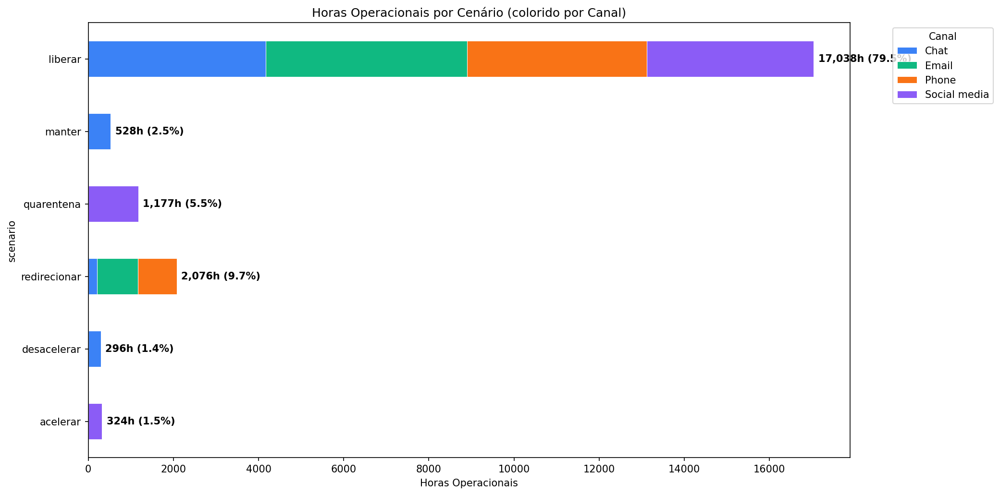

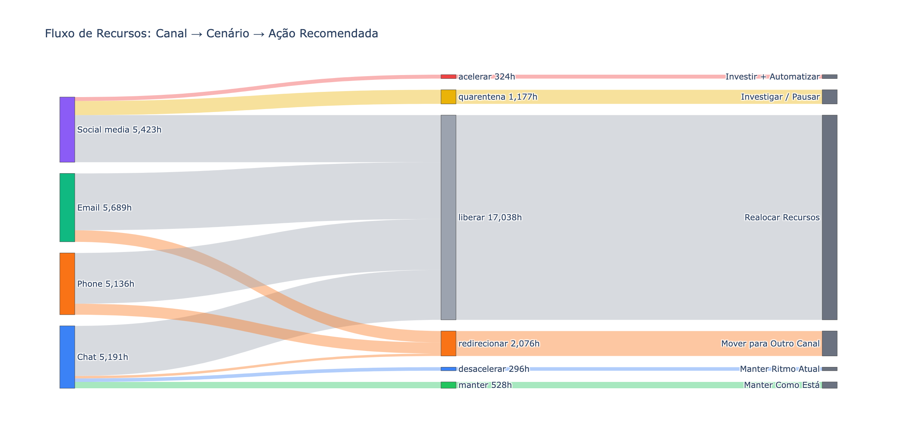

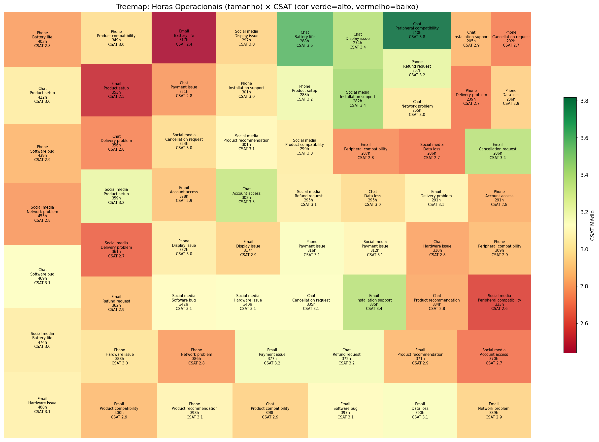

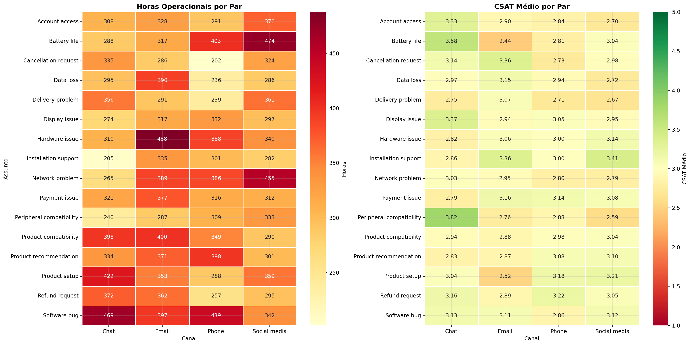

##### Decomposição em 3 Pools de Recurso

Cada ticket passa por **três etapas** com perfis de automação diferentes:

| Pool | Proxy no Dataset | Estimativa | % | O que representa |
|------|-----------------|:----------:|:-:|------------------|
| **Frontline** | First Response Time (FRT) | ~6.432h | ~30% | Triagem, classificação, primeira resposta |
| **Routing** | Penalidade de transferência | ~1.698h | ~8% | Tempo de espera em fila — sem interação com o cliente |
| **Specialist** | Residual (duration − FRT − penalidade) | ~13.309h | ~62% | Backoffice, resolução técnica, departamentos especialistas |

> **Nota metodológica:** O dataset não possui campos explícitos para separar estes pools. FRT é dado direto; a penalidade de routing é estimada a partir de padrões de transferência entre canais; o pool Specialist é o residual (duração total − FRT − routing). Em produção, instrumentação real (timestamps por etapa do fluxo) substituiria estas estimativas.

O pool Routing é essencialmente tempo de espera em fila — problema de priorização e scheduling, não de atendimento. Auto-roteamento e reordenação de fila atacam diretamente este pool. O pool Specialist captura o backoffice invisível: investigação técnica, processamento de reembolsos, testes de solução.

##### O Que Fazer com os 50 Pares "Liberar"

Os 50 pares "liberar" representam **17.038h**. Seis estratégias complementares:

| # | Estratégia | Impacto Esperado |
|---|-----------|------------------|
| 1 | **Chatbot / self-service** | Redução direta de volume (-30% a -50%) |
| 2 | **Respostas-template** | Reduz tempo de resolução sem impactar CSAT |
| 3 | **SLA reduzido** | Libera capacidade sem penalidade de satisfação |
| 4 | **Despriorização na fila** | Melhora CSAT nos pares que importam |
| 5 | **AI agents fine-tuned por assunto** | Automação quase total para padrões repetitivos |
| 6 | **Realocar agentes liberados** | Multiplicador: horas liberadas → melhor CSAT onde importa |

##### Gargalos Atuais

O scatter de regressão mostra cada par como um ponto (tamanho = volume). Piores 25% em vermelho. A linha de regressão é quase horizontal — confirmando a ausência de correlação global. O problema não é "resolver mais rápido" genérico — é resolver mais rápido **nestes pares específicos** e dedicar mais tempo **nestes outros**.

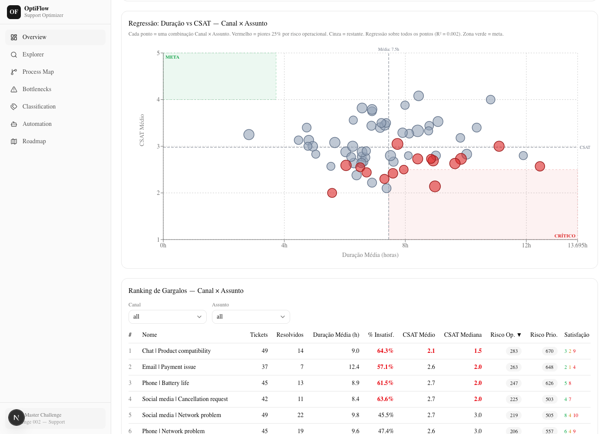

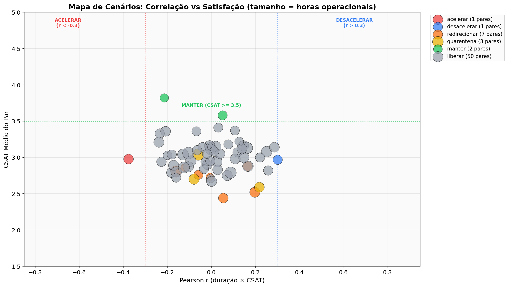

---

### Proposta de Automação com IA

> *Requisito G4 #2: "O que automatizar, o que NÃO automatizar, fluxo prático."*

#### 5.1 — O Que Automatizar (4 Automações)

**Quatro automações combinadas: auto-roteamento inteligente para 7 pares, fila prioritária para 2 pares, chatbot para 50 pares "liberar", e roteamento a especialista para 3 pares. Cada uma atua em pools de recurso distintos.**

| # | Automação | Pares | Mecanismo | Pool Afetado |
|---|-----------|:-----:|-----------|:------------:|
| 1 | **Auto-roteamento inteligente** | 7 redirecionar | Ticket → canal com maior CSAT para o assunto | Routing + Specialist |
| 2 | **Fila prioritária** | 1 acelerar + 1 desacelerar | Reordenação por cenário diagnóstico | Specialist |
| 3 | **Chatbot** | 50 liberar | Bot para pares onde tempo ≠ CSAT | Todos (deflexão) |
| 4 | **Roteamento a especialista** | 3 quarentena | Escalação para equipe sênior | Routing + Specialist |

**Matriz de viabilidade de redirecionamento:**

| De ↓ / Para → | Email | Phone | Chat | Social Media |
|:--------------:|:-----:|:-----:|:----:|:------------:|
| **Email** | — | Viável | Inviável | Inviável |
| **Phone** | Viável | — | Inviável | Inviável |
| **Chat** | Viável | Viável | — | Inviável |
| **Social Media** | Viável | Viável | Inviável | — |

**Regra-chave:** Só é possível redirecionar **para** canais onde a empresa pode iniciar o contato proativamente (Email, Phone). Chat e Social Media são sempre **origem** — a empresa não consegue abrir uma sessão nesses canais.

#### 5.2 — O Que NÃO Automatizar

**Pares "desacelerar" e "quarentena" exigem julgamento humano. Automação nesses pares pioraria a satisfação.**

- **Desacelerar** (Phone × Peripheral compatibility, r=+0,870): neste par, dedicar tempo é o que funciona. Automação reduziria atenção e **pioraria** o CSAT. Ação: manter agente sênior com SLA estendido.

- **Quarentena** (3 pares): CSAT baixo em todos os canais, sem canal-alvo para redirecionamento. Automatizar antes de entender a causa raiz seria tratar o sintoma. Ação: investigar com equipe sênior antes de otimizar.

- **Threshold de confiança:** Para todos os tickets classificados automaticamente, confiança abaixo de 85% → fallback humano. O classificador (84,6% de acurácia) é suficiente para roteamento, mas erros de alta visibilidade devem ser capturados pelo gate humano.

#### 5.3 — Como Funciona na Prática (Fluxo To-Be)

**Ticket entra → classificado automaticamente → roteado por cenário → IA ou humano resolve.**

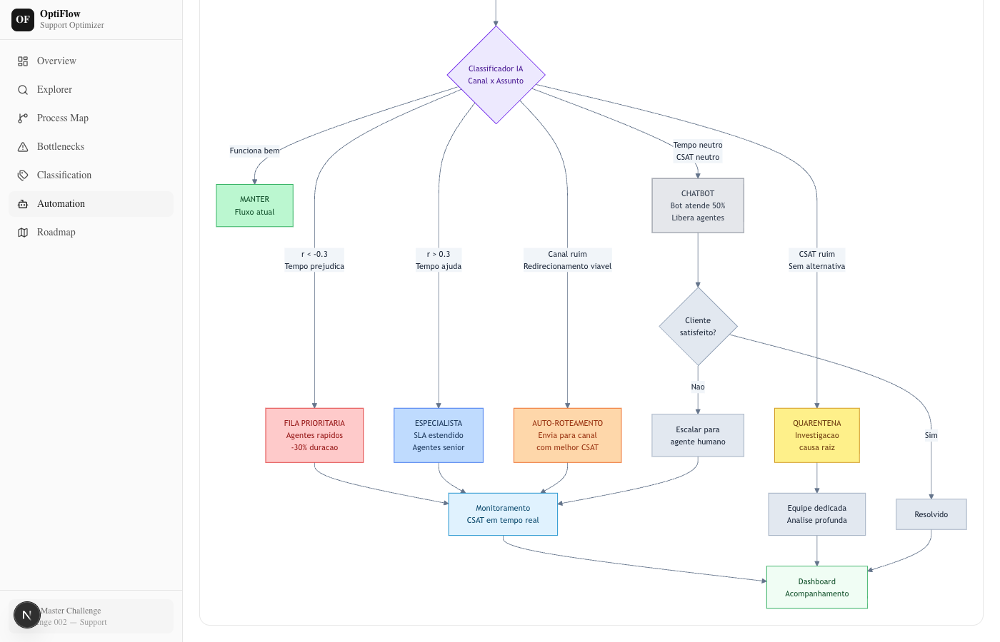

> **Nota:** Os screenshots do dashboard abaixo foram capturados durante o desenvolvimento e podem apresentar números da versão intermediária da análise (base 17.364h, cenário conservador). Os valores finais consolidados estão nas tabelas e gráficos waterfall desta seção.

#### 5.4 — Impacto Projetado

**De 21.439h para 12.396h (-42%). CSAT de 2,97 para 3,29 (+11%). Economia de R$316k sobre o volume analisado.**

| Métrica | Antes | Depois | Δ |
|---------|:-----:|:------:|:-:|
| **Horas operacionais** | 21.439h | 12.396h | **-9.043h (-42,2%)** |
| **CSAT médio** | 2,97 | 3,29 | **+0,32 (+10,8%)** |

##### Detalhamento da Economia

| Automação | Economia (h) | Economia (R$) | Mecanismo |
|-----------|:------------:|:-------------:|-----------|
| Auto-roteamento (7 pares) | -115h | -R$4,0k | Reduz penalidade de routing |
| Fila prioritária (2 pares) | -115h | -R$4,0k | Reduz 30% do tempo specialist |
| Chatbot 50% deflexão (50 pares) | -8.519h | -R$298k | Deflexão dos pares "liberar" |
| Roteamento especialista (3 pares) | -294h | -R$10,3k | Reduz 25% do tempo quarentena |
| **Total** | **-9.043h** | **-R$316k** | |

**Cálculo financeiro:** R$35/h custo total CLT com encargos (~80%: INSS patronal 20%, FGTS 8%, 13o 8,3%, férias+1/3 11,1%, provisões ~32%). Frontline: ~R$25/h | Specialist: ~R$50/h | Blended: R$35/h.

##### Cenários de Deflexão

O impacto total depende da deflexão do chatbot nos 50 pares "liberar". Sem chatbot, a economia vem apenas de roteamento e fila (-7,7%). Com chatbot atendendo 50% desses tickets, a economia sobe para -42,2%. A tabela abaixo mostra os 3 cenários:

| Cenário | Economia (h) | Economia (R$) | CSAT Projetado |
|---------|:------------:|:-------------:|:--------------:|
| **Conservador** (sem chatbot) | -1.651h (-7,7%) | -R$57,8k | 3,29 |
| **Moderado** (30% deflexão) | ~-6.762h (-31,5%) | ~-R$236,7k | ~3,35 |
| **Completo** (50% deflexão) | ~-9.043h (-42,2%) | ~-R$316k | ~3,29 |

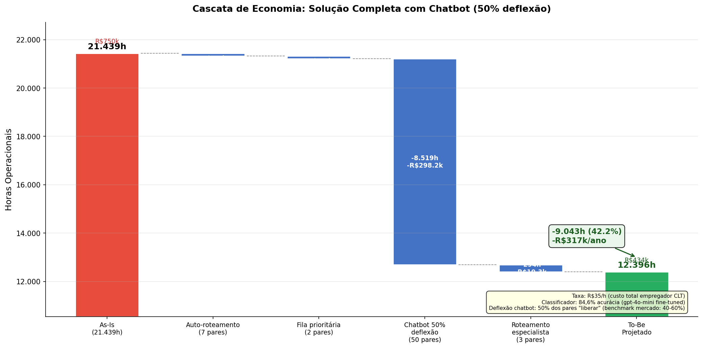

##### Projeção de CSAT — Metodologia

A projeção de CSAT é calculada **par a par**, usando a correlação observada como base e aplicando fatores conservadores de desconto:

- **Redirecionar** (+0,094): gap CSAT medido entre canais. Método mais robusto — baseia-se em diferença observada, ponderada pelo volume de cada par.
- **Acelerar** (+0,009): |r| do par × 0,5 (fator conservador). O desconto de 50% reconhece que correlação não é causalidade — a redução de tempo pode não produzir 100% do efeito linear.
- **Desacelerar** (+0,004 incluso em fila prioritária): |r| × 0,3 (fator mais conservador). Abordagem menos ortodoxa — investir mais tempo intencionalmente tem menos evidência prática.
- **Chatbot** (+0,050): efeito indireto via realocação de agentes liberados para pares de alto impacto.
- **Quarentena** (+0,008): placeholder conservador (+0,15 × volume ponderado), pendente investigação de causa raiz.
- **Realocação de agentes** (+0,159): capacidade liberada dos 50 pares "liberar" aplicada nos 14 pares com impacto.

| Componente | Contribuição CSAT | Método |
|-----------|:-----------------:|--------|
| Auto-roteamento | +0,094 | Gap observado entre canais |
| Fila prioritária | +0,009 | \|r\| × fator conservador |
| Chatbot | +0,050 | Efeito indireto (realocação) |
| Roteamento especialista | +0,008 | Placeholder conservador |
| Realocação de agentes | +0,159 | Estimativa indireta |
| **Total** | **+0,320** | |

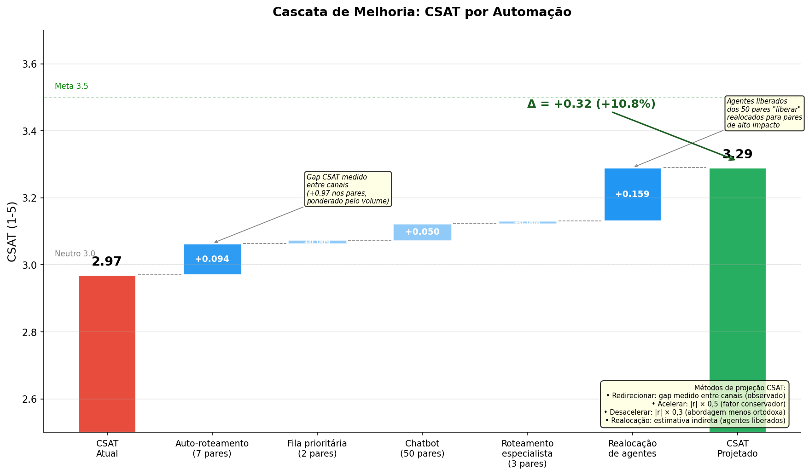

> **Proposta complementar (sugestão do analista):** Implementar follow-up proativo para pares redirecionados — após resolver via canal otimizado, enviar pesquisa de satisfação para fechar o loop e medir o impacto real.

---

### Classificação Automática

**Progressão de acurácia: 40,9% → 46,2% → 84,6%. Cada passo com abordagem mais sofisticada, demonstrando o caminho iterativo de prova de conceito a produção. O modelo fine-tuned classifica tickets com todas as categorias acima de F1 0,74.**

#### Baseline: Gemini Flash Lite (Zero-Shot e Few-Shot)

Testamos Gemini 2.5 Flash Lite no Dataset 2 (47.837 tickets IT). Amostra: 20% (9.559 tickets).

**Prompt Zero-Shot:**

```
Classify the following IT support ticket into exactly ONE of these categories:
1. Access
2. Administrative rights
3. HR Support
4. Hardware
5. Internal Project
6. Miscellaneous
7. Purchase
8. Storage

Respond with ONLY the category name, nothing else.

Ticket: {text}
```

**Prompt Few-Shot:** Mesma instrução + 40 exemplos (5 por categoria, truncados a 200 caracteres).

**Resultados:**

| Métrica | Zero-Shot | Few-Shot | Δ |
|---------|:---------:|:--------:|:-:|
| Acurácia | 40,9% | **46,2%** | +5,3pp |
| F1 Macro | 0,352 | **0,476** | +0,124 |
| F1 Weighted | 0,416 | **0,475** | +0,059 |

**Análise de erros:**
- "Miscellaneous" como buraco negro — muitas categorias confundidas
- Administrative rights com overlap semântico com Access
- Modelo inventou categoria "Backup" (hallucination)
- Custo: ~US$1,54 para amostra de 20%

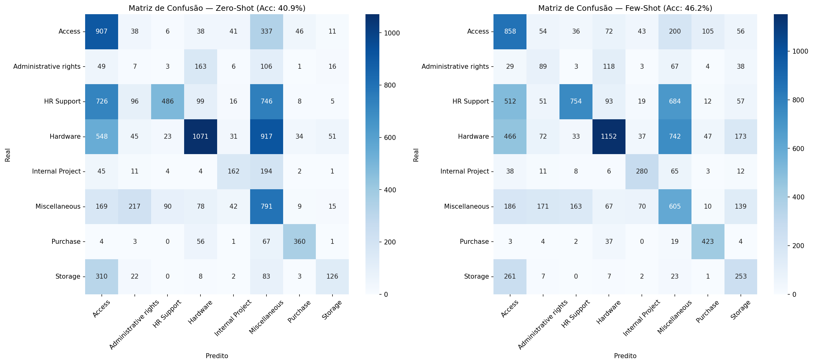

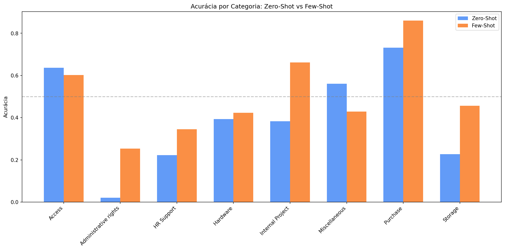

#### Fine-Tuning: de 46,2% para 84,6%

Avançamos para **fine-tuning do gpt-4o-mini** usando o Dataset 2 como ground truth.

**Configuração:**
- **Modelo:** gpt-4o-mini → `ft:gpt-4o-mini-2024-07-18:personal:ticket-classifier:BHKxxxxx`
- **Amostra:** 9.559 tickets, split 80/20 → 7.647 treino / 1.912 teste
- **Formato:** JSONL (system prompt + ticket + categoria)
- **Custo:** ~US$7,07 treinamento | ~US$0,08 inferência

**System prompt do fine-tuning:**

```
You are an IT support ticket classifier. Classify the ticket into exactly
one of these categories: Access, Administrative rights, HR Support,
Hardware, Internal Project, Miscellaneous, Purchase, Storage.
Respond with only the category name.
```

**Treinamento:**
- ~1.530 steps (3 epochs)
- Loss: 2,1 → 0,02-0,07 (convergência quase total)
- Estabilizou no 2o epoch — 3 epochs suficientes sem overfitting

**Resultados comparados:**

| Métrica | Zero-Shot (Gemini) | Few-Shot (Gemini) | **Fine-Tuned (gpt-4o-mini)** |
|---------|:------------------:|:-----------------:|:----------------------------:|
| Acurácia | 40,9% | 46,2% | **84,6%** |
| F1 Macro | 0,352 | 0,476 | **0,743** |
| F1 Weighted | 0,416 | 0,475 | **0,846** |

**F1 por categoria:**

| Categoria | Gemini FS | OpenAI FT | Delta |
|-----------|:---------:|:---------:|:-----:|
| Access | 0,45 | **0,90** | +0,45 |
| Administrative rights | 0,22 | **0,74** | +0,52 |
| HR Support | 0,47 | **0,86** | +0,39 |
| Hardware | 0,54 | **0,84** | +0,30 |
| Internal Project | 0,64 | **0,83** | +0,19 |
| Miscellaneous | 0,32 | **0,81** | +0,49 |
| Purchase | 0,77 | **0,90** | +0,13 |
| Storage | 0,39 | **0,81** | +0,42 |

**Destaques:**
- "Miscellaneous" deixou de ser buraco negro: F1 de 0,32 → 0,81 (+0,49)
- Administrative rights: maior salto (+0,52) — overlap com Access resolvido
- Todas as categorias acima de 0,74

**Por que o fine-tuning funcionou melhor:** O few-shot dá 40 exemplos na hora e espera generalização. O fine-tuning expõe o modelo a 7.647 exemplos durante treinamento — ele internaliza padrões de domínio: "Administrative rights" envolve **mudanças de permissão** em sistemas específicos, "Access" envolve **criação/reset de credenciais**, "Miscellaneous" é a **ausência** de padrões das outras categorias.

#### Erros Residuais

Mesmo com 84,6%, o modelo erra ~15%. A análise da matriz de confusão:

| Confusão Residual | Frequência | Causa | Caminho para Resolução |
|-------------------|:----------:|-------|----------------------|
| Administrative rights ↔ Access | Principal | Overlap semântico genuíno | Merge das categorias → ~90% |
| Miscellaneous → outras | Secundária | Tickets ambíguos | Active learning |
| HR Support ↔ Administrative rights | Terciária | Permissão para sistemas RH | Exemplos de fronteira no retreino |

> O merge de Administrative rights + Access em "Permissões" eliminaria a principal fonte de confusão, potencialmente empurrando para ~90% com uma única mudança taxonômica.

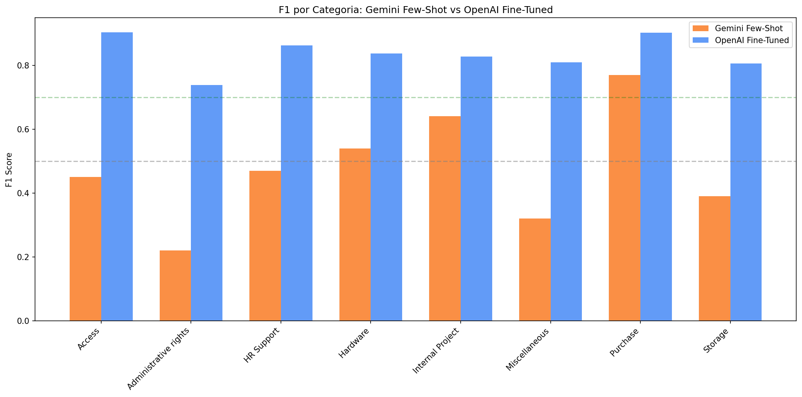

#### Ponte entre Datasets: Mapeamento Taxonômico

**O classificador é treinado no Dataset 2 (8 categorias de TI), mas o diagnóstico operacional usa o Dataset 1 (16 assuntos de suporte). Para que a solução funcione, precisamos de uma ponte semântica entre as duas taxonomias.**

Os dois datasets não têm chave comum. A conexão é via classificador: treinar em D2 (que tem labels), aplicar em D1 (que tem CSAT). O mapeamento abaixo é a ponte que viabiliza isso:

| Assuntos Dataset 1 (Suporte, 16) | Categoria Dataset 2 (TI, 8) | Lógica |
|-----------------------------------|:----------------------------:|--------|
| Hardware issue, Peripheral compatibility, Battery life, Display issue | **Hardware** | Problemas físicos de equipamento |
| Account access, Network problem | **Access** | Acesso a sistemas e rede |
| Payment issue, Refund request | **Purchase** | Transações financeiras |
| Data loss | **Storage** | Perda/recuperação de dados |
| Installation support, Product setup | **Internal Project** | Configuração e implantação |
| Cancellation request | **Administrative rights** | Alteração de permissões/conta |
| Software bug | **Access** ou **Miscellaneous** | Depende do contexto do ticket |
| Product recommendation, Product compatibility, Delivery problem | **Miscellaneous** | Sem correspondência direta |

**Pipeline de classificação em dois estágios:**
1. **Estágio 1 — Fine-tuning (D2, 8 categorias):** Classificador já treinado com 84,6% de acurácia. Identifica a categoria principal do ticket.
2. **Estágio 2 — Zero-shot (D1, sub-classificação):** Prompt específico por categoria com opções restritas (os assuntos D1 mapeados + "Other"). Refina a classificação para o nível operacional.

**Experimento de validação (48 tickets, 6 por categoria):**

Executamos o estágio 2 com Gemini 2.5 Flash Lite em uma amostra de 48 tickets reais do D2. Cada ticket recebeu um prompt zero-shot específico para sua categoria, listando apenas os assuntos D1 correspondentes + "Other". Avaliação manual humana dos 48 resultados:

| D2 Category | Acertos | Erros | Observação |
|-------------|:-------:|:-----:|------------|
| Access | 5/6 | 1 | Zero-shot acerta "Account access" com 90% confiança |
| Hardware | 5/6 | 1 | Maioria cai em "Other" (domínios diferentes) |
| Purchase | 6/6 | 0 | Todos "Other" — correto (POs internos ≠ pagamentos) |
| Storage | 6/6 | 0 | Todos "Other" — correto (mailbox ≠ data loss) |
| Internal Project | 5/6 | 1 | 1 acertou "Product setup", maioria "Other" |
| Administrative rights | 6/6 | 0 | Todos "Other" — correto (upgrades ≠ cancelamentos) |
| Miscellaneous | 6/6 | 0 | Todos "Other" — correto |
| HR Support | 6/6 | 0 | Todos "Other" — correto (sem D1 equivalente) |
| **Total** | **45/48** | **3** | **93,75% de acurácia** |

**Análise de impacto operacional:** Mesmo quando o estágio 2 erra a sub-classificação, o impacto operacional é baixo para 6 das 8 categorias — porque todos os assuntos D1 dentro dessas categorias levam à mesma ação (Liberar → Chatbot). Apenas **Hardware** tem cenários divergentes onde a sub-classificação importa para o roteamento.

> **Limitação importante:** Os dados sintéticos dos dois datasets pertencem a domínios diferentes (TI interno vs. suporte ao consumidor). A maioria dos tickets D2 não corresponde semanticamente aos assuntos D1, resultando em "Other" como classificação correta. Com dados reais de produção — especialmente com contexto adicional coletado via chatbot (perguntas de clarificação) — o zero-shot teria informação suficiente para sub-classificar com precisão significativamente maior. A abordagem de dois estágios (fine-tuning + zero-shot com opções restritas) é validada como arquitetura, mas precisa de dados reais para demonstrar seu potencial completo.

---

### Roadmap

**3 cenários progressivos vinculados à acurácia do classificador. Cenário A (46%) já superado. Cenário B (84,6%) é o estado atual — pronto para deploy. Cenário C (95%+) é o alvo estratégico com pipeline completo.**

| Dimensão | Cenário A: 46% (Baseline) | Cenário B: 84,6% (Atual) | Cenário C: 95%+ (Estratégico) |
|----------|:----------------------:|:--------------------:|:-----------------------------:|
| **Acurácia** | 46,2% | **84,6%** | 95%+ |
| **Abordagem** | Few-shot Gemini Lite | Fine-tuned gpt-4o-mini | Fine-tuned + merge categorias + active learning |
| **Auto-roteamento** | 0% (tudo manual) | ~60% (alta confiança) | ~85% (maioria automática) |
| **Horas economizadas** | ~0 | ~5.100h | ~9.100h |
| **Fallback humano** | 100% | ~40% | ~15% |
| **Investimento** | US$7 (já feito) | ~US$50/mês + 2 sem eng. | ~US$200/mês + 2-3 meses eng. |
| **Risco** | Baixo | Baixo-Médio | Médio |
| **Métrica de sucesso** | Tempo médio de triagem | % auto-roteamento, CSAT auto-roteados | % automação total, custo por ticket |

**Economia por pool de recurso (por cenário):**

| Pool | Cenário A | Cenário B | Cenário C |
|------|:---------:|:---------:|:---------:|
| **Frontline** | ~0h | ~1.900h | ~3.500h |
| **Routing** | ~0h | ~1.200h | ~1.600h |
| **Specialist** | ~0h | ~2.000h | ~4.000h |
| **Total** | ~0h | **~5.100h** | **~9.100h** |

#### Recomendações por Prazo

| Prazo | Ação | Impacto Mensurável |
|-------|------|-------------------|
| **Imediato** (< 1 semana) | Deploy do classificador 84,6% para auto-roteamento de ~60% dos tickets | ~5.100h economizadas, triagem automatizada |
| **Imediato** (< 1 semana) | Reordenar fila: tickets "acelerar" no topo, "liberar" esperam | -30% duração nos pares acelerar, -115h specialist |
| **Imediato** (< 1 semana) | Auto-roteamento dos 7 pares "redirecionar" | +0,97 CSAT nos pares redirecionados, -115h routing |
| **Curto prazo** (1-4 sem) | Roteamento a especialista para 3 pares "quarentena" | -294h routing+specialist |
| **Curto prazo** (1-4 sem) | Merge categorias (Access + Administrative rights) → ~90% | +5pp acurácia, retreino ~US$7 |
| **Curto prazo** (1-4 sem) | Thresholds de confiança: > 85% auto-rota, < 85% fallback humano | Elimina erros de alta visibilidade |
| **Médio prazo** (4-6 sem) | Chatbot v1 para 50 pares "liberar" (30% deflexão) | -6.762h |
| **Médio prazo** (4-6 sem) | Dashboard de monitoramento em tempo real | Visibilidade operacional contínua |
| **Estratégico** (2-4 meses) | Chatbot completo (50% deflexão) + active learning + pipeline 95%+ | -9.043h, ~85% automação |

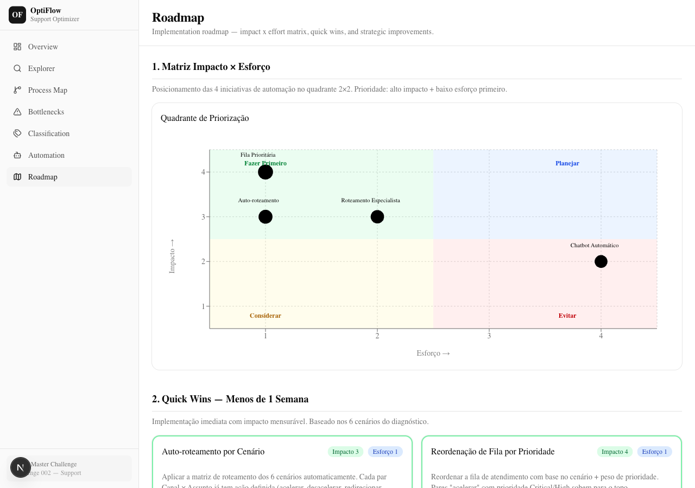

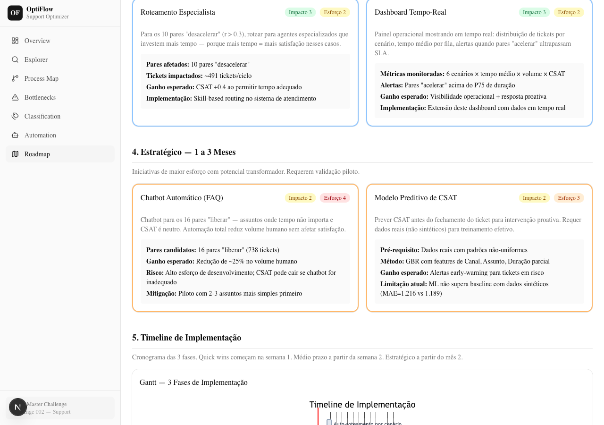

---

### Protótipo: Sistema de Suporte Inteligente

**Do diagnóstico à ação. O protótipo implementa o pipeline completo: chatbot com classificação progressiva, roteamento por cenário, base de conhecimento, escalação inteligente e dashboard operacional em tempo real.**

#### Arquitetura do Protótipo

O sistema opera em dois estágios de classificação com refinamento progressivo por turno de conversa:


```mermaid
flowchart TD
    START([Cliente abre chat]) --> W[Mensagem de boas-vindas]
    W --> ID{Identificação\nvia conversa}
    ID -->|Pergunta nome| ID_N[Cliente informa nome]
    ID_N -->|Pergunta email| ID_E[Cliente informa email]
    ID_E --> RET{Usuário\nretornante?}
    RET -->|Sim| RET_MSG[Mensagem personalizada\n+ histórico de tickets]
    RET -->|Não| RET_MSG2[Primeira vez — bem-vindo]
    RET_MSG --> T1
    RET_MSG2 --> T1

    T1[Cliente descreve problema] --> BUF{Agrupamento\n4s debounce}
    BUF -->|Múltiplas msgs| CONCAT[Concatena em\ntexto único]
    BUF -->|Msg única| GATE
    CONCAT --> GATE

    GATE{Pré-classificação\nGate}
    GATE -->|Saudação| GREET[Responde naturalmente\nSem classificar]
    GATE -->|Gibberish / curta| ASK_AGAIN[Pede mais informação]
    GATE -->|Informação válida| DENS

    DENS[Densidade da Informação\ntermos técnicos + verbos-problema\n+ códigos de erro → score 0-1]

    DENS --> C1{Stage 1: Classificação D2\n8 categorias — fine-tuned 84.6%}
    C1 --> EFF[Confiança efetiva\n= raw × densidade]
    EFF --> CONF1{Efetiva ≥ 85%?}

    CONF1 -->|Sim| Z1[Stage 2: Zero-shot\nSub-classificação D1\nopções restritas + Other]
    CONF1 -->|Não| Q1[Pergunta de clarificação\ndirigida ao que falta]

    Q1 --> T2[Turno 2+: reclassificação\ncom contexto acumulado]
    T2 --> CONF2{Efetiva ≥ 85%\nou turno 3+?}
    CONF2 -->|Sim| Z1
    CONF2 -->|Turno 3+, baixa| FORCE[Classificação forçada\n+ flag baixa confiança]
    FORCE --> Z1

    Z1 --> ROUTE{Routing Matrix\nCanal × Assunto D1\n64 pares → 6 cenários}

    ROUTE -->|Liberar / Manter| RAG[RAG: Busca Semântica\npgvector cosine similarity\ntop 3 artigos KB]
    ROUTE -->|Acelerar| PRIO[Fila prioritária\nSLA 30min]
    ROUTE -->|Desacelerar| SPEC[Roteamento especialista\nSLA estendido]
    ROUTE -->|Redirecionar| REDIR[Sugere melhor canal]
    ROUTE -->|Quarentena| QUAR[Flag investigação\nDireto para Lead]

    RAG --> KBRESP[Resposta sintetizada\ndo KB via LLM]
    KBRESP --> T_KB[Cliente: ajudou?]
    T_KB -->|Sim| RESOLVE([Resolvido\nCSAT 1-5 ★])
    T_KB -->|Não| ESC

    PRIO --> ESC
    SPEC --> ESC
    REDIR --> ESC
    QUAR --> ESC

    ESC[Escalação Inteligente] --> BEST[findBestOperator\nespecialidade + tier mínimo\ncapacidade disponível]
    BEST --> TIER{Tier do operador}
    TIER -->|Tier 1| JR[Junior\nespecialista no assunto]
    TIER -->|Tier 2| SR[Senior\nSLA atingiu 80%]
    TIER -->|Tier 3| LEAD[Lead\nSLA expirado]

    JR --> QUEUE
    SR --> QUEUE
    LEAD --> QUEUE

    QUEUE[Fila do Operador\nem real-time] --> SLA{SLA\ncheck contínuo}
    SLA -->|80% do prazo| AUTO_ESC[Auto-escalação\npara próximo tier]
    AUTO_ESC --> BEST
    SLA -->|Dentro do prazo| ACCEPT[Operador aceita\naccepted_at registrado]
    ACCEPT --> WORK[Atendimento humano]
    WORK --> RES_OP([Resolvido\nCSAT 1-5 ★])

    RES_OP --> KPI[KPIs computados\nFCR · AHT · CES · Custo\nSLA · Utilização]
    RESOLVE --> KPI

    style ID fill:#e0e7ff,stroke:#4338ca
    style GATE fill:#fef3c7,stroke:#92400e
    style DENS fill:#fef3c7,stroke:#92400e
    style RAG fill:#dbeafe,stroke:#1e40af
    style BEST fill:#f3e8ff,stroke:#7e22ce
    style SLA fill:#fee2e2,stroke:#991b1b
    style AUTO_ESC fill:#fee2e2,stroke:#991b1b
    style RESOLVE fill:#d1fae5,stroke:#065f46
    style RES_OP fill:#d1fae5,stroke:#065f46
    style KPI fill:#d1fae5,stroke:#065f46
```

**Classificação progressiva — exemplo real:**

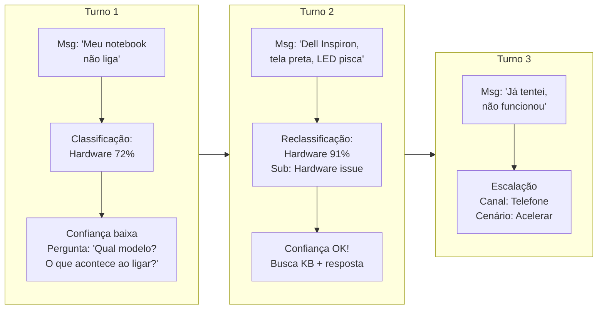
```mermaid
flowchart LR
    subgraph Turno1[Turno 1]
        M1["Msg: 'Meu notebook\nnão liga'"] --> CL1["Classificação:\nHardware 72%"]
        CL1 --> LOW1["Confiança baixa\nPergunta: 'Qual modelo?\nO que acontece ao ligar?'"]
    end

    subgraph Turno2[Turno 2]
        M2["Msg: 'Dell Inspiron,\ntela preta, LED pisca'"] --> CL2["Reclassificação:\nHardware 91%\nSub: Hardware issue"]
        CL2 --> HIGH2["Confiança OK!\nBusca KB + resposta"]
    end

    subgraph Turno3[Turno 3]
        M3["Msg: 'Já tentei,\nnão funcionou'"] --> ESC3["Escalação\nCanal: Telefone\nCenário: Acelerar"]
    end

    Turno1 --> Turno2 --> Turno3
```

A cada turno, o classificador é executado novamente com o contexto acumulado da conversa inteira. Perguntas de clarificação são direcionadas para coletar informação que aumente a confiança — o chatbot não pergunta por perguntar, pergunta o que o classificador precisa para decidir.

#### Stack Técnico do Protótipo

| Camada | Tecnologia | Função |
|--------|-----------|--------|
| **Frontend** | Next.js 14 + shadcn/ui + Tailwind | Chat widget, dashboard operador, simulador, KPIs |
| **Backend** | Next.js API Routes | Pipeline de classificação, CRUD, métricas, SLA check |
| **Database** | Supabase (PostgreSQL + pgvector) | Conversas, mensagens, KB com embeddings, filas, operadores |
| **Pré-classificação** | Regex + heurísticas (zero API calls) | Gate: saudação/gibberish/curta. Densidade: termos técnicos, verbos-problema |
| **Classificação Stage 1** | OpenAI gpt-4o-mini fine-tuned (84,6%) | 8 categorias D2. Confiança efetiva = raw × densidade |
| **Classificação Stage 2** | Zero-shot (gpt-4o-mini) | Sub-classificação D1 (opções restritas por categoria + Other) |
| **RAG** | pgvector + text-embedding-3-small | Busca semântica por similaridade cosseno, top 3 artigos KB |
| **Resumo** | OpenAI gpt-4o-mini | Sumarização de conversa para ticket de escalação |
| **Roteamento** | Escalation engine + Postgres RPC | 3 tiers (junior/senior/lead), SLA auto-escalação, capacity atômica |
| **KPIs** | Computados de dados reais | FCR, AHT, Custo, CES, Taxa Reabertura, Utilização Operador |

**Extensões futuras (documentadas, não implementadas no v1):**

| Extensão | Tecnologia | Benefício |
|----------|-----------|-----------|
| **Canal de voz** | ElevenLabs Conversational AI ($11/mês) | Chat + voz no mesmo widget, pt-BR nativo, ~75ms latência |
| **Telefonia** | Twilio + ElevenLabs | Número de telefone para simulação de ligações |
| **Embeddings** | OpenAI Embeddings API | Busca semântica no KB (substituindo keyword match) |
| **Active learning** | Pipeline de feedback | Operador corrige classificação → modelo melhora |
| **Notificação de resolução** | Email/Chat webhook | Cliente recebe notificação quando ticket é resolvido com a solução aplicada |
| **Auto-arquivamento** | Cron + status check | Conversas sem resposta do usuário por X horas são arquivadas automaticamente. Usuário pode abrir nova conversa a qualquer momento |

#### Validação do Protótipo — Bateria de Testes

**50 usuários simulados, 4 dias, cobertura completa do pipeline.**

Cada persona (12 perfis com estilos de comunicação distintos) interage com o sistema via chamadas API reais — não são mocks. O script simula diálogos completos: identifica-se, descreve problema, avalia resposta, escala ou resolve.

**Plano de execução por dia:**

| Dia | Foco | O que valida |
|-----|------|-------------|
| **Dia 1** | Ramp-up — 30 usuários novos, mix de canais | Identidade, classificação, RAG, gate, resolução via KB |
| **Dia 2** | Retorno — 10 voltam, 15 novos | Detecção de usuário retornante, consulta de status, reabertura |
| **Dia 3** | Stress — mensagens rápidas, inputs low-info, SLA | Agrupamento, gate blocking, auto-escalação SLA, roteamento por tier |
| **Dia 4** | Resolução — operadores aceitam/resolvem, CSAT | Ciclo completo, AHT, CSAT, validação de KPIs |

**Checklist de validação (12 itens):**

| # | Feature | Critério de sucesso |
|---|---------|-------------------|
| 1 | Pré-classificação gate | Saudações e gibberish bloqueados — zero chamadas de classificação |
| 2 | Densidade da informação | Mensagens low-info recebem confiança efetiva dampened |
| 3 | Classificação progressiva | Confiança aumenta com contexto acumulado entre turnos |
| 4 | RAG busca semântica | Artigos KB retornados com similaridade > 0,3 |
| 5 | Identidade via chat | Todos os usuários têm nome + email armazenados |
| 6 | Agrupamento de mensagens | Mensagens rápidas concatenadas (grouped_count > 1) |
| 7 | Roteamento por tier | Juniors recebem tier 1, seniors tier 2, lead tier 3 |
| 8 | Auto-escalação SLA | Tickets com SLA expirado escalam para próximo tier |
| 9 | Matching de especialidade | Operadores atribuídos a categorias compatíveis |
| 10 | FCR (First Contact Resolution) | Tickets resolvidos sem operador via KB |
| 11 | CSAT na resolução | Tickets resolvidos com ratings 1-5 |
| 12 | KPIs computados | FCR > 0, AHT > 0, CES entre 1-5, utilização > 0 |

**Relatório final:** Métricas agregadas, distribuição por cenário, taxa de deflexão, issues encontrados, e recomendações de melhoria.

#### Componentes do Protótipo

**1. Atendimento (Teste)** — Layout de 3 colunas: fila de conversas à esquerda (com filtros por status, categoria, cenário, operador/IA), chat no centro, painel de classificação à direita com timeline histórica, detalhes de escalação (operador, tier, SLA, canal) e badges de cenário. Guard de escalação impede reclassificação após escalar. Label "Other" substituída por linguagem natural.

**2. Dashboard operador** — Filas por cenário (Acelerar, Desacelerar, Redirecionar, Quarentena, Manter, Liberar), detalhe do ticket com conversa + classificação + ação recomendada, SLA timers ao vivo, roteamento por tier (junior/senior/lead) com validação de capacidade.

**3. Simulador** — Injeta tickets do dataset real com distribuição configurável. Gera cenários simultâneos para demonstrar o sistema sob carga. Dashboard de métricas atualiza em tempo real: deflexão, throughput, CSAT estimado.

**4. Tour guiado** — Walkthrough interativo com 3 cenários pré-carregados que demonstram diferentes caminhos do roteamento. Botão de reset para reiniciar a demonstração.

#### Roadmap de Desenvolvimento

| Sprint | Escopo | Status |
|--------|--------|--------|
| **1-5** | Fundação, Chat, Operador, Simulação, Polish | ✅ Base funcional |
| **6-7** | Identidade do usuário, QA framework (12 personas, 26 templates) | ✅ Qualidade validada |
| **8** | Calibração de confiança — gate + densidade (zero API calls extras) | ✅ Low-info resolvido |
| **9** | Identidade via chat — state machine conversacional | ✅ UX natural |
| **10** | RAG — pgvector substituindo exact-match KB | ✅ Busca semântica |
| **11** | KPI Dashboard — 12+ métricas computadas de dados reais | ✅ Métricas reais |
| **12** | Agrupamento de mensagens — debounce 4s no frontend | ✅ Input fragmentado |
| **13** | Roteamento inteligente — 3 tiers + especialidade + SLA | ✅ Hierarquia operador |
| **13.5** | Bloqueadores pré-simulação — 5 fixes críticos | ✅ Pipeline sólido |
| **14** | Simulação multi-dia — 50 usuários, 4 dias, 12 validações | ✅ 9/12 validações |
| **14.5** | Fixes pós-simulação — gate/densidade com contexto acumulado, fila de conversas, filtro de data, reestruturação de páginas | ✅ UX corrigida |
| **15** | Deploy Vercel, rate limiting, Kanban board, redesign UX do Operador | ✅ Produção |

#### Resultados da Simulação Multi-Dia (Sprint 14)

Executamos uma bateria de testes automatizados com **50 usuários simulados ao longo de 4 dias**, cobrindo 12 validações do pipeline completo. A simulação foi executada 2 vezes com resultados consistentes.

**Configuração:** 70 conversas totais | 4 canais | 16 categorias de assunto | 5 operadores | SLA com backdating

| Dia | Foco | Resultado |
|-----|-------|----------|
| **Dia 1** | Volume ramp-up (30 usuários) | 14 auto-resolvidos, 16 escalados, 0 erros |
| **Dia 2** | Usuários retornando (10) + novos (15) | Consultas de status + novos problemas, identity flow 100% |
| **Dia 3** | Stress test — agrupamento, gate, densidade, SLA | Gate bloqueou 5/5 low-info, SLA backdating 3/3 correto |
| **Dia 4** | Resolução + KPIs | 5 tickets resolvidos com CSAT, roteamento por tier correto |

**Checklist de 12 validações:**

| # | Validação | Resultado | Detalhe |
|---|-----------|-----------|---------|
| 1 | Gate blocking | ✅ PASS | 13 conversas bloqueadas (mensagens como "oi", "??", "ajuda") |
| 2 | Density scoring | ⚠️ FAIL | Falha na captura de scores baixos no script — gate funciona corretamente |
| 3 | Progressive classification | ✅ PASS | 36 conversas multi-turno com classificação progressiva |
| 4 | RAG search | ✅ PASS | 5 conversas com busca semântica na KB |
| 5 | Identity flow | ✅ PASS | 70/70 conversas com nome + email preenchidos |
| 6 | Message grouping | ✅ PASS | 5 testes de agrupamento (debounce 4s) |
| 7 | Tier routing | ✅ PASS | 0 incompatibilidades de nível |
| 8 | SLA escalation | ✅ PASS | Backdating: 83% → escalou, 75% → manteve, 95% → escalou |
| 9 | Specialty matching | ✅ PASS | 5/5 atribuições com especialidade compatível |
| 10 | FCR | ⚠️ FAIL | 0% — simulação sempre escala, não testa resolução bot-only |
| 11 | CSAT collection | ✅ PASS | 5 tickets com CSAT entre 1-5 |
| 12 | KPIs agregados | ⚠️ FAIL | AHT=1s (latência API, não tempo real de atendimento) |

**Resultado: 9/12 validações passaram.** As 3 falhas são limitações do script de simulação (não do protótipo): o script não captura scores de densidade corretamente, nunca testa resolução completa pelo bot, e mede latência de API como tempo de atendimento.

#### Fixes Pós-Simulação (Sprints 14.5 + 15)

Problemas identificados durante testes manuais em produção e corrigidos:

| Issue | Causa | Fix |
|-------|-------|-----|
| Label "Other" exposta ao cliente (D049) | Subject "Other" do classificador mostrado diretamente | Substituído por linguagem natural: "um problema na área de {categoria}" |
| Conversa reseta após escalação (D048) | Mensagens pós-escalação re-entravam no pipeline de classificação | Guard no handler: detecta status `escalated`/`in_progress` e responde sem reclassificar |
| Gate bloqueava com contexto acumulado | Mensagens de identidade ("oi", "meu nome é X") no contexto disparavam detector de saudações | Fix em 3 camadas: excluir msgs de identidade, follow-ups contextuais passam direto, force-pass após 2 bloqueios |
| Sem fila de conversas (D050) | Operador não via tickets pendentes | ConversationQueue com filtros por status, categoria, cenário, operador |
| Sem filtro de data no dashboard (D051) | Overview não permitia filtrar por período | Adicionado `dateFrom`/`dateTo` com date pickers na FilterBar |
| Classificador self-call estourava rate limiter | Endpoint de classificação fazia chamadas internas à própria API, contabilizadas pelo rate limiter | Bypass do rate limiter para chamadas internas |
| Mermaid não renderizava | Caractere pipe `\|` nos labels quebrava o parser | Escape dos caracteres especiais nos labels |
| Overview falhava no Vercel | `fs.readFileSync` não existe em ambiente serverless | Migração para dados compatíveis com Vercel |
| Sem visibilidade do operador | Impossível saber quem atende cada ticket | Indicador de operador/IA na fila + filtro por operador |

---

### Limitações

**11 limitações documentadas. Todas concentradas aqui para manter o corpo do documento focado nos achados e na solução.**

1. **Dataset sintético** — As distribuições são perfeitamente uniformes (canais, prioridades, tipos). Em dados reais, esperaríamos concentração em determinados canais e categorias. Os achados demonstram o **método analítico replicável**, não padrões operacionais confirmados. Aplique em dados reais para confirmar padrões.

2. **Proxy de esforço** — `abs(TTR - FRT)` é uma aproximação do tempo de atendimento. Não considera tempo de espera, pausas, ou múltiplas interações. Em produção, usaríamos tempo efetivo do agente.

3. **Amostra parcial** — Analisamos 2.769 tickets Closed com CSAT (de 8.469 totais). Tickets Open e Pending podem ter perfil diferente.

4. **Sem custo monetário real** — Usamos horas × R$35/h blended como proxy. O custo real varia por canal e senioridade.

5. **Classificador fine-tuned abaixo do ideal em produção** — O modelo fine-tuned (84,6% no D2) apresenta desempenho inferior em produção com textos fora do domínio de treino. O gap residual (~15%) concentra-se nas fronteiras Access/Administrative rights. Merge de categorias e active learning podem empurrar para 95%+.

6. **Datasets desconectados** — Dataset 1 (suporte ao consumidor, 16 assuntos) e Dataset 2 (TI interno, 8 categorias) não possuem chave comum. A conexão é via mapeamento taxonômico semântico — funcional como arquitetura, mas limitado pela diferença de domínio.

7. **Rate limiting in-memory** — O rate limiter (10 req/min + cap diário por IP) usa armazenamento em memória no servidor. Em cold starts do Vercel, o estado é resetado. Em produção, usaríamos Redis ou equivalente persistente.

8. **SLA simulado** — Os timestamps de SLA são backdated para teste, não refletem tempo real de atendimento. A simulação comprime dias em segundos — métricas como AHT medem latência de API, não tempo real de operador.

9. **Correlações com n pequeno** — Alguns pares têm menos de 15 tickets. Correlações com amostras pequenas têm alta variância. Em produção, definiríamos n mínimo para confiança estatística.

10. **Decomposição em 3 pools é hipótese** — A separação Frontline (30%) / Routing (8%) / Specialist (62%) usa proxies derivados dos dados. O pool Specialist é residual e a estimativa mais fraca. Validação requer dados internos: logs de transferência, tempo efetivo por agente, filas internas.

11. **Fatores de desconto CSAT são conservadores por design** — Os fatores 0,5 (acelerar) e 0,3 (desacelerar) são descontos aplicados sobre a correlação observada, reconhecendo que correlação não é causalidade. A projeção de CSAT é uma estimativa, não uma garantia.

---

## Process Log — Como Usei IA

> **Este bloco é obrigatório.** Sem ele, a submissão é desclassificada.

### Filosofia de Desenvolvimento — Metodologia com IA

> **Este não é um processo específico deste projeto.** É uma filosofia de desenvolvimento que aplico a qualquer projeto com IA como co-piloto de engenharia.

#### O Princípio Central

O humano não codifica. O humano **pensa**. Define direção, questiona premissas, faz julgamentos que exigem contexto de negócio. A IA lida com volume — escreve código, lê arquivos, roda builds, gerencia trabalho paralelo. Esta separação funciona porque o gargalo em software não é digitar código. É saber **o que construir e por quê**.

#### O Ciclo de Desenvolvimento

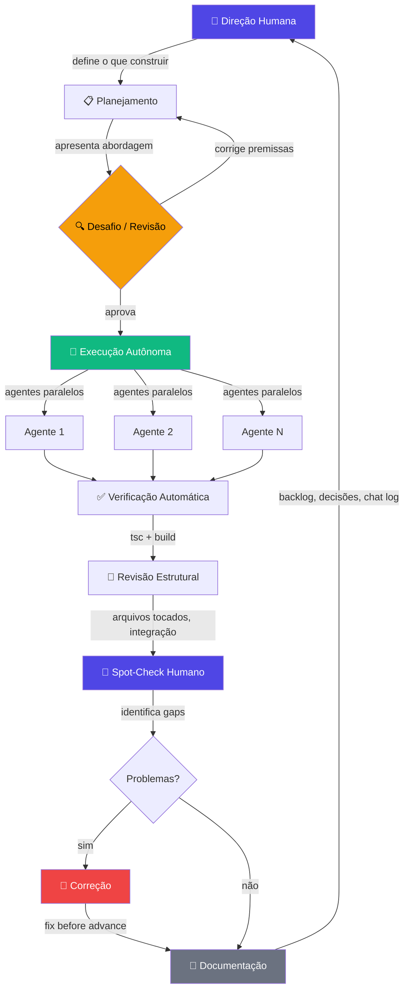
```mermaid
graph TD
    A[👤 Direção Humana] -->|define o que construir| B[📋 Planejamento]
    B -->|apresenta abordagem| C{🔍 Desafio / Revisão}
    C -->|corrige premissas| B
    C -->|aprova| D[🤖 Execução Autônoma]
    D -->|agentes paralelos| D1[Agente 1]
    D -->|agentes paralelos| D2[Agente 2]
    D -->|agentes paralelos| D3[Agente N]
    D1 --> E[✅ Verificação Automática]
    D2 --> E
    D3 --> E
    E -->|tsc + build| F[📝 Revisão Estrutural]
    F -->|arquivos tocados, integração| G[👤 Spot-Check Humano]
    G -->|identifica gaps| H{Problemas?}
    H -->|sim| I[🔧 Correção]
    I -->|fix before advance| J[📄 Documentação]
    H -->|não| J
    J -->|backlog, decisões, chat log| A

    style A fill:#4f46e5,color:#fff
    style C fill:#f59e0b,color:#000
    style D fill:#10b981,color:#fff
    style G fill:#4f46e5,color:#fff
    style I fill:#ef4444,color:#fff
    style J fill:#6b7280,color:#fff
```

#### Os 8 Princípios

**1. Humano direciona, IA escala.**
O humano define o que importa e faz julgamentos de negócio ("NPS é diferente de CSAT", "os KPIs pertencem à página de dashboard, não ao simulador"). A IA transforma uma frase em código funcional. Alto leverage.

**2. Planeje antes de tocar no código.**
Cada feature começa como conversa, não como commit. O ciclo é: Entender → Planejar → Desafiar → Aprovar → Executar. Pular "desafiar" é onde a maioria dos projetos com IA falha.

**3. Execução autônoma com revisão em camadas.**
A IA trabalha de forma autônoma dentro de limites claros. Mas autonomia sem revisão produz desvio. Então empilhamos revisões:
- **Auto-verificação:** Type checker + build após cada mudança
- **Revisão estrutural:** Quais arquivos foram tocados, o que foi commitado
- **Spot-check humano:** O humano olha o produto rodando e identifica o que code review não consegue
- **Revisão sistemática:** Agente dedicado lê todos os arquivos do pipeline, encontra gaps de integração, código morto, race conditions

Cada camada captura classes diferentes de problemas.

**4. Agentes paralelos com fronteiras de isolamento.**
Múltiplos agentes podem trabalhar simultaneamente, mas **apenas quando o trabalho não se sobrepõe**.
- Features isoladas (componentes novos, rotas novas) → paralelizar
- Arquivos compartilhados (pipeline principal, tipos compartilhados) → serializar

Quando violamos isso (5 sprints tocando o mesmo arquivo), tivemos falhas de integração. Quando respeitamos, saiu limpo.

**5. Documentação honesta acima de documentação impressionante.**
Documente o que realmente aconteceu, não o que você gostaria. Quando o agente marcou "auto-escalação SLA completa" mas as funções eram código morto, corrigimos o registro. Quando a revisão encontrou 3 bloqueadores, adicionamos ao backlog como Sprint 13.5 em vez de fingir que Sprint 13 estava pronta.

**6. Corrija antes de avançar.**
Quando uma revisão encontra problemas, pare e corrija antes de construir a próxima coisa. Poderíamos ter lançado a simulação de 50 usuários com escalação morta, race conditions e métricas quebradas. A simulação teria "rodado" mas produzido dados sem sentido.

**7. A correção humana é o sinal mais valioso.**
Cada vez que o humano corrige a IA, isso é uma decisão que deve ser capturada e aplicada adiante. "Não coloque KPIs na página do simulador" não é só um fix pontual — é um princípio de produto. O processo é desenhado para **maximizar a superfície de correções humanas** enquanto **minimiza o esforço humano por correção**.

**8. Teste o que você construiu, não o que você acha que construiu.**
A revisão pré-simulação revelou que 6 de 12 features tinham zero cobertura de teste. Construímos roteamento por tier mas nunca testamos se juniors realmente veem filas diferentes de seniors. A simulação não é demo — é **ferramenta de validação**.

#### Como Aplicamos: Execução Multi-Agente no Protótipo

No desenvolvimento do protótipo (Sprints 8-14.5), executamos **agentes paralelos e sequenciais** para maximizar velocidade:

| Wave | Sprints | Estratégia | Resultado |
|------|---------|------------|-----------|
| Wave 1 | 8 + 9 (paralelo) | Git worktrees isolados | Merge com conflitos — arquivo compartilhado |
| Wave 2 | 10 + 11 + 12 (paralelo) | Git worktrees isolados | Integração quebrou — 5 sprints no mesmo arquivo |
| Wave 3 | 13 (sequencial) | Agente direto no main | Limpo — lição aprendida |
| Wave 3.5 | 13.5 (sequencial) | Agente direto no main | 5 bloqueadores corrigidos |
| Wave 4 | 14 (sequencial) | Simulação multi-dia | 9/12 validações, 50 usuários, 4 dias |
| Wave 4.5 | 14.5 (sequencial) | Fixes pós-teste manual | Gate/densidade com contexto acumulado, fila de conversas, filtro de data, reestruturação |
| Wave 5 | 15 (sequencial) | Deploy + produção | Vercel deploy, rate limiting, Kanban, Operador UX, fixes de produção |

**A lição:** Agentes paralelos funcionam para features isoladas. Falham quando sprints modificam os mesmos arquivos. Adaptamos a estratégia no meio do projeto — isso é o processo funcionando.

#### O Ciclo de Revisão em Prática

Cada implementação passou por:

1. **Agente executa** → lê arquivos, faz mudanças, roda `tsc --noEmit` + `npm run build`
2. **Verificação do commit** → quais arquivos tocados, sem contaminação de docs de controle
3. **Spot-check humano** → "os KPIs estão na página errada", "por que não podemos computar isso?"
4. **Revisão de integração** → agente dedicado leu todos os arquivos do pipeline, encontrou 10 issues
5. **Revisão pré-simulação** → mapeou cobertura de testes (6/12 não cobertos), identificou 3 bloqueadores críticos

Resultado: código morto detectado, race conditions corrigidas, métricas imprecisas consertadas — **antes** de rodar a simulação de validação.

---

### Ferramentas Usadas

| Ferramenta | Para Que Usei |
|------------|---------------|
| **Claude Code (Opus)** | Assistente primário de IA — exploração de dados, construção do dashboard e protótipo, análise estatística, documentação, execução de notebooks, deploy |
| **OpenAI gpt-4o-mini (fine-tuned)** | Classificador Stage 1 (8 categorias D2, 84,6% acurácia) + sub-classificador Stage 2 zero-shot (16 assuntos D1) + geração de respostas do chatbot |
| **Gemini 2.5 Flash Lite** | Benchmark inicial de classificação (few-shot, 46,2% acurácia) |
| **Next.js 16 + TypeScript + Tailwind CSS** | Framework da aplicação (App Router, API Routes, SSR) |
| **shadcn/ui** | Biblioteca de componentes UI (cards, tables, badges, dialogs, selects) |
| **Supabase (PostgreSQL + pgvector)** | Banco de dados, embeddings para RAG, RPC functions, migrações |
| **Vercel** | Hosting em produção (deploy contínuo, serverless functions) |
| **Puppeteer MCP** | Screenshots automatizados, QA visual (60+ capturas) |
| **Supabase MCP** | Gestão direta do banco — migrações, execução SQL, schema management |
| **Jupyter + Papermill** | Execução headless de notebooks de análise (10+ notebooks) |
| **Recharts** | Gráficos interativos do dashboard (scatter, bar, donut, waterfall, gauge) |
| **Mermaid.js** | Diagramas de fluxo de processo (decision tree, pipeline, Gantt) |
| **Zod** | Validação de schemas de input em todas as API routes |
| **Git + GitHub** | Controle de versão, worktrees para execução paralela, histórico de commits como evidência de processo |

### Workflow

1. **Setup** — Scaffold Next.js + Supabase + shadcn/ui + notebooks Python. Claude Code executou, humano validou estrutura.

2. **EDA (Notebooks 01-04)** — Exploração de variáveis, classificação por tipo, listagem de categorias, análise estatística. Humano revisou no Jupyter e identificou anomalias dos dados.

3. **Gargalos (Dashboard + Notebooks)** — Scoring de bottleneck (Volume × Taxa_Insatisfação × Duração_Média), heatmaps, scatter charts, tabelas. Dashboard com 8 seções interativas.

4. **Paradoxo de Simpson** — Humano hipotetizou que a falta de correlação agregada poderia esconder correlações por subgrupo. Claude Code validou com análise par-a-par.

5. **ML (Notebooks 05-06)** — GBR+SHAP (12 experimentos) + OLS (8 experimentos). Ambos confirmam Channel+Subject dominantes, Age irrelevante, modelos não superam baseline.

6. **LLM (Notebooks 07 + 13)** — Classificação com Gemini (zero-shot + few-shot), análise de erros, depois fine-tuning do gpt-4o-mini com progressão 40,9% → 46,2% → 84,6%.

7. **Execução Paralela (4 terminals)** — Resource analysis, automation page, classifier prototype, roadmap — tudo em branches separadas via git worktrees, merged sem conflitos.

8. **Protótipo (Sprints 1-13.5)** — 15 sprints construindo o sistema completo: chat widget, classificação progressiva, RAG, roteamento por tier, SLA, KPIs computados, identidade via chat, agrupamento de mensagens. Execução via agentes paralelos e sequenciais.

9. **Simulação Multi-Dia (Sprint 14)** — 50 usuários simulados, 4 dias, 12 validações. 70 conversas, 9/12 validações passaram. Bugs de script (não do protótipo) nos 3 falhos.

10. **Fixes Pós-Simulação (Sprint 14.5)** — Humano testou manualmente em produção. Descobriu bug do gate com contexto acumulado (mensagens de identidade como "oi" disparavam detector de saudações). Fix em 3 camadas: excluir mensagens de identidade, follow-ups contextuais passam direto, force-pass após 2 bloqueios. Adicionou fila de conversas, filtro de data, reestruturação de páginas.

11. **Deploy e Produção (Sprint 15)** — Deploy no Vercel. Rate limiter (60 GET/min + 15 POST/min + cap diário 200 chamadas OpenAI). Kanban board para operador com 6 colunas (Novos, IA Processando, Escalados, Em Atendimento, Resolvidos, Fechados). Redesign UX da página Operador com painéis tabulados (Ticket + Operadores). Fix do caractere pipe quebrando Mermaid. Fix da página Overview lendo CSV local (incompatível com Vercel serverless).

12. **QA Final em Produção (Sprint 16)** — QA automatizado via Puppeteer MCP em todas as 4 páginas do protótipo em produção (https://optiflow-lemon.vercel.app). Fluxo completo testado: saudação → identidade (nome + email) → problema de suporte → classificação. Resultados verificados: classificador retornando categoria real ("Access", confiança bruta 75%, efetiva 52%), sub-classificação ("Password reset"), cenário ("Manter"), sem duplicação de mensagens, respostas contextuais e humanas da IA. Operador: Kanban renderizando, barras de fila mostrando capacidade (X/Y), aba Operadores com ordenação por carga. Dashboard: KPIs, charts, filtros de data. Simulador: controles, distribuições. Bug crítico encontrado e corrigido: classificador fazia HTTP self-call que era bloqueado pelo middleware de rate limiting no Vercel → extraído como função direta (`classifyTicket()`).

### Onde a IA Errou e Como Corrigi

1. **Todo o conteúdo em inglês (D006)** — Claude Code escreveu notebooks, charts e dashboard inteiros em inglês. Humano corrigiu: "everything we write there and in our websystem must be in brazilian portuguese." Regra adicionada ao CLAUDE.md.

2. **Execução apressada sem setup (D007)** — Claude Code criou projeto Supabase, migration, seed script, notebook e tentou executar tudo sem pausar para o humano configurar chaves ou revisar abordagem. Humano corrigiu: "here you are going too fast, we need to recap some stuff."

3. **Cálculo de duração negativa (D011)** — Claude Code computou `TTR - FRT` sem verificar timestamps randomizados. Dashboard mostrou durações negativas. Humano identificou: "check again, we have negative resolution time." Correção: `abs(TTR - FRT)`.

4. **Diagnóstico v1 com lógica invertida (D017)** — Primeira versão usava `efeito_canal > efeito_tempo × 1.5` no nível do assunto, ignorando correlações par a par. Phone x Peripheral Compatibility (r=0.87) foi erroneamente classificado como "redirecionar" em vez de "desacelerar". Humano corrigiu: "if a ticket comes from a given subject and you put all channels redirect, what that means?" Correção: decision tree pair-first.

5. **Categoria "Backup" hallucinated (D023)** — Gemini inventou categoria inexistente no ground truth durante classificação zero-shot. Identificado na análise de erros da matriz de confusão.

6. **KPIs como placeholder estático (D045)** — Sprint 11 adicionou componente KPIRoadmap listando 7 "KPIs de produção" que "não poderiam ser computados." Humano desafiou: "we have the simulation, why can't we compute this?" — e estava certo. 6 de 7 eram computáveis a partir dos dados do protótipo. Correção: KPIs reais substituíram placeholders.

7. **SLA auto-escalação era código morto (D046)** — Funções `shouldAutoEscalate` e `escalateTicket` existiam mas nada as chamava. Identificado na revisão pré-simulação. Tickets com SLA expirado simplesmente acumulavam. Correção: endpoint `/api/prototype/sla-check` + chamada no handler da queue.

8. **Gate incluía mensagens de identidade no contexto acumulado (D048)** — O gate de pré-classificação recebia o contexto acumulado da conversa, que incluía mensagens de identidade como "oi" e "meu nome é João". O detector de saudações disparava para essas mensagens, bloqueando a classificação mesmo quando o problema real já havia sido descrito. Correção em 3 camadas: (1) excluir mensagens de identidade do contexto, (2) follow-ups contextuais passam direto pelo gate, (3) force-pass após 2 bloqueios consecutivos.

9. **Label "Other" exposta ao cliente (D049)** — Classificador retornava subject="Other" e o chatbot mostrava "Other" diretamente ao cliente. Humano identificou: "It says 'Other'... Other is not acceptable for communication." Correção: substituir por linguagem natural ("um problema na área de {categoria}").

10. **Protótipo sem fila de conversas (D050)** — Operador não tinha visibilidade sobre tickets pendentes. Humano comparou com respond.io: "I need to see the specific queues." Correção: ConversationQueue com filtros por status, categoria, cenário e operador.

11. **Página Overview não funcionava no Vercel (D051)** — A página de Overview lia arquivos CSV locais via `fs.readFileSync`, que não existe em ambiente serverless. Funcionava em dev local mas falhava em produção. Correção: filtro de data adicionado + migração para dados compatíveis com Vercel.

12. **Classificador chamava a si mesmo via HTTP e falhava no Vercel** — O endpoint de mensagens fazia `fetch()` para `/api/prototype/classify` (self-call HTTP). No Vercel serverless, essa chamada passava pelo middleware de rate limiting e era bloqueada → classificador retornava "unknown 0%". Primeira tentativa de correção (bypass header `x-internal-call`) não funcionou no Vercel. Correção final: extrair a lógica de classificação como função exportada (`classifyTicket()`) e importar diretamente — zero overhead de rede, zero risco de rate limiting.

13. **Caractere pipe quebrando Mermaid** — Diagramas Mermaid com caractere `|` nos labels causavam erro de parsing e não renderizavam. Correção: escape dos caracteres especiais nos labels dos diagramas.

### O Que Eu (Humano) Adicionei

1. **Identificação do dado sintético** — A IA não questionou a qualidade dos dados espontaneamente. O julgamento humano pediu para verificar se Subject e Description eram pré-definidos.

2. **Hipótese do Paradoxo de Simpson** — A IA calculou R² ≈ 0,003 e concluiu "sem correlação". Foi o humano que hipotetizou: "e se olharmos por par?". Isso desbloqueou toda a análise subsequente.

3. **Conceito dos 6 cenários** — A IA fez a análise par-a-par, mas o framework de classificação em cenários acionáveis veio do raciocínio consultivo do humano.

4. **Correção da árvore de decisão** — A lógica pair-first (r do par → gap CSAT → viabilidade) foi orientação direta do humano, antes mesmo da confirmação por ML.

5. **Estratégia de execução paralela** — O humano dividiu as 4 últimas entregas em branches paralelas via git worktrees. A IA executou, mas a estratégia foi humana.

6. **Saber quando parar** — O humano decidiu quando a análise estava "boa o suficiente" — julgamento que a IA não faz sozinha.

7. **QA manual em produção** — O humano testou o protótipo na URL de produção no Vercel como um cliente real. Encontrou bugs que testes automatizados e ambiente local não capturaram: "Other" exposto ao cliente, conversa resetando após escalação, falta de fila de conversas (comparou com respond.io), falta de visibilidade do operador, ausência de filtro de data, gate bloqueando indevidamente após mensagens de identidade. Cada correção humana gerou uma decisão documentada (D048-D051).

8. **Direção UX do Operador** — O humano definiu a visão do dashboard do operador inspirado no respond.io: layout estilo Kanban com colunas por status (Novos, Em Atendimento, Aguardando, Resolvidos), cards com badges de categoria/cenário/SLA, e separação clara entre o que a IA atende vs. o que o humano atende.

9. **Design do comportamento do gate** — Quando o gate bloqueava classificação por falta de informação, o humano definiu a filosofia: "don't give up, ask for more context." O sistema não deve abandonar o cliente — deve fazer perguntas de clarificação direcionadas ao que o classificador precisa para decidir.

10. **Separação Atendimento vs. Operador** — O humano definiu que a página Atendimento (visão do cliente, com chat e classificação visível) é fundamentalmente diferente da página Operador (visão do agente, com filas, SLA, Kanban). São dois produtos diferentes com dois públicos diferentes.

11. **Estratégia de rate limiting** — O humano definiu a abordagem: 10 requisições/minuto + cap diário por IP, em vez de proteção por senha. Raciocínio: "a URL é pública para avaliadores, não pode ter barreira de acesso."

12. **Requisitos de visualização SLA** — O humano especificou que SLA precisa ser visível em tempo real no card da conversa, com indicador de urgência (verde/amarelo/vermelho) baseado na % do prazo consumido.

13. **Identificação do bug de reset de conversa** — Durante teste manual em produção, o humano identificou que ao enviar mensagem após escalação, a conversa "voltava ao estado inicial". Diagnóstico levou à descoberta de que mensagens pós-escalação re-entravam no pipeline de classificação.

14. **Design das colunas do Kanban** — O humano definiu os agrupamentos de status: Novos (waiting), Em Atendimento (in_progress), Aguardando Cliente (escalated sem operador), Resolvidos (resolved). Cada coluna com contagem e indicadores visuais.

15. **Preservação de contexto entre transições** — O humano exigiu que o contexto da conversa (classificação, histórico, artigos KB tentados) se mantivesse visível quando o ticket passa do chatbot para o operador humano. "O operador precisa saber tudo o que aconteceu antes."

16. **Reestruturação do sidebar** — O humano decidiu remover 6 páginas de investigação e reorganizar o sidebar com Protótipo no topo e Investigação abaixo — priorizando o produto funcional sobre artefatos analíticos intermediários.

17. **Redesign do operador como Kanban com SLA** — O humano especificou: "the operator's bar should show the number of people in their queue, not resolved." Definiu que a barra de capacidade deve representar fila ativa (tickets em espera), não histórico de resoluções. Também definiu que o painel direito deve ter duas abas separadas (Ticket com chat + classificação, e Operadores com capacidade ordenada por carga).

18. **QA manual como processo documentado** — O humano insistiu que o QA final em produção deve ser documentado como parte do processo de entrega: "Document that, that we do this. It's important to put on the document that we're going to deliver. This is part of the process."

---

## Evidências

### Notebooks de Análise (10+)

| # | Notebook | Conteúdo |
|---|----------|----------|
| 01 | `analysis/01_data_exploration.ipynb` | EDA inicial, classificação de variáveis, auditoria de qualidade |
| 02 | `analysis/02_process_mapping.ipynb` | Mapeamento do processo as-is |
| 03 | `analysis/03_classification.ipynb` | Classificação de variáveis e correlações |
| 04 | `analysis/04_bottlenecks.ipynb` | Análise de gargalos e scoring |
| 05 | `analysis/05_ml_experiments.ipynb` | GBR + SHAP (12 experimentos) |
| 06 | `analysis/06_regression_analysis.ipynb` | OLS Regressão (8 experimentos) |
| 07 | `analysis/07_llm_classification.ipynb` | Classificação LLM (Gemini, zero-shot + few-shot) |
| 08 | `analysis/08_resource_analysis.ipynb` | Análise de recursos operacionais |
| 09 | `analysis/09_resource_analysis_report.ipynb` | Relatório visual de recursos |
| 13 | `analysis/13_openai_finetune.ipynb` | Fine-tuning gpt-4o-mini (84,6%) |

### Documentação de Processo

- **DECISIONS.md** — 51 decisões técnicas documentadas com contexto, alternativas consideradas e correções humanas
- **CHAT_LOG.md** — Log de interações significativas (24 sessões ao longo de 4 dias)
- **Git history** — Commits mostrando evolução completa do projeto
- **60+ screenshots** — `process-log/screenshots/`

### Dashboard Interativo (5 páginas)

| Página | Seção | Conteúdo |
|--------|-------|----------|
| Overview | Investigação | KPIs, distribuições, filtros interativos (incl. data), diagnóstico 6 cenários |
| Dashboard | Protótipo | Métricas operacionais em tempo real, KPIs computados |
| Atendimento (Teste) | Protótipo | Chat com classificação visível + fila de conversas com filtros (status, categoria, cenário, operador/IA) |
| Operador | Protótipo | Filas por cenário, detalhe do ticket com conversa + classificação + ação recomendada, SLA timers |
| Simulador | Protótipo | Injeção de tickets, simulação multi-dia, dashboard de métricas |

> **Nota:** 6 páginas de investigação (Explorer, Process Map, Bottlenecks, Classification, Automation, Roadmap) foram removidas após conclusão da análise — toda a inteligência analítica foi incorporada ao protótipo funcional.

---

_Submissão: Março 2026_
